# 深度学习在计算机视觉中的应用：2：课程介绍 🎼

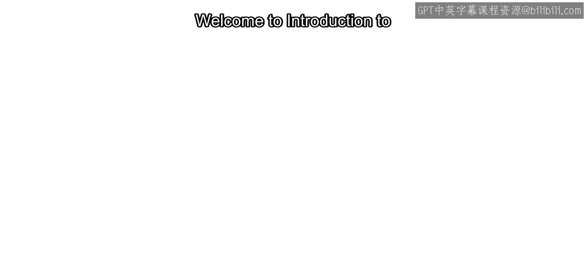

在本节课中，我们将要学习深度学习在计算机视觉领域的入门知识，了解课程的整体安排和学习目标。

深度学习是计算机视觉中一个非常流行的工具，因为处理图像任务通常非常复杂。

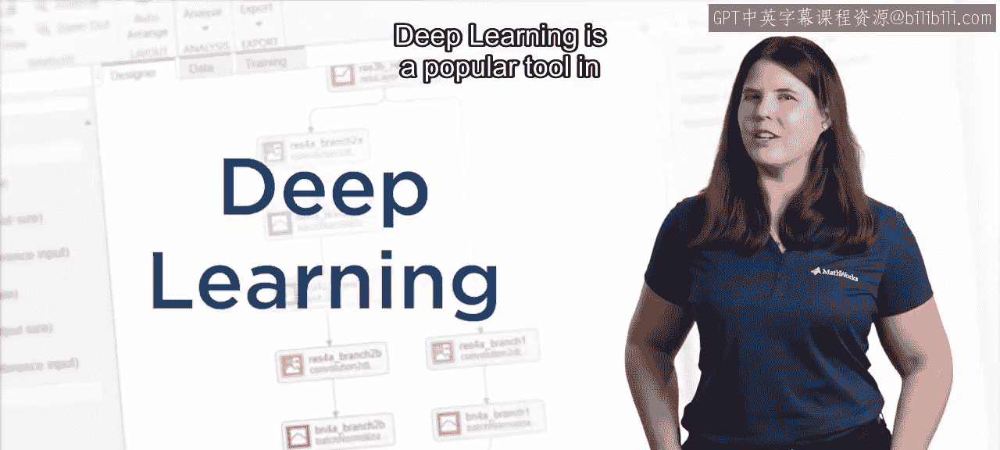

## 应用领域概览

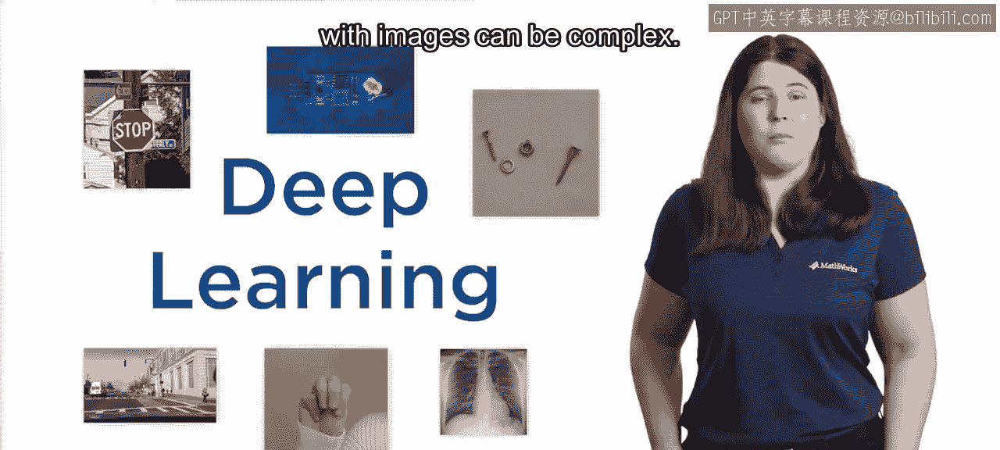

上一节我们提到了深度学习的流行性，本节中我们来看看它在计算机视觉中的具体应用领域。这些应用非常多样化。

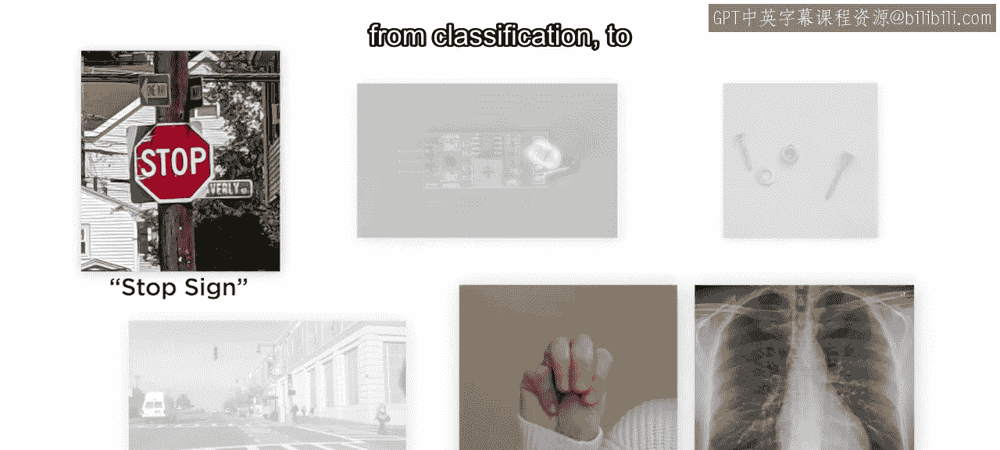

以下是几个主要的应用方向：
*   图像分类
*   目标检测
*   异常检测

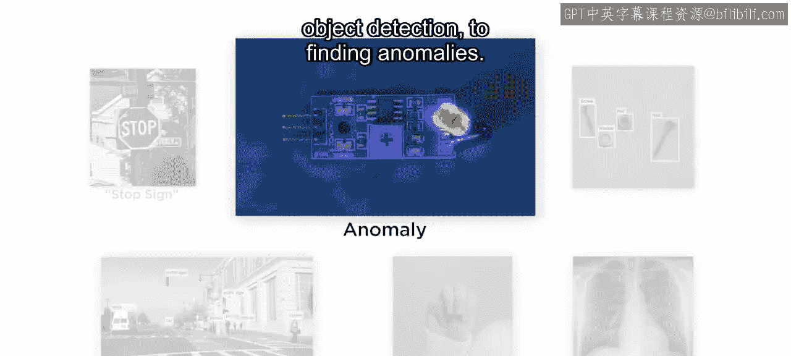

## 什么是深度学习？

了解了应用之后，我们来看看深度学习的定义。深度学习是机器学习的一个子集。

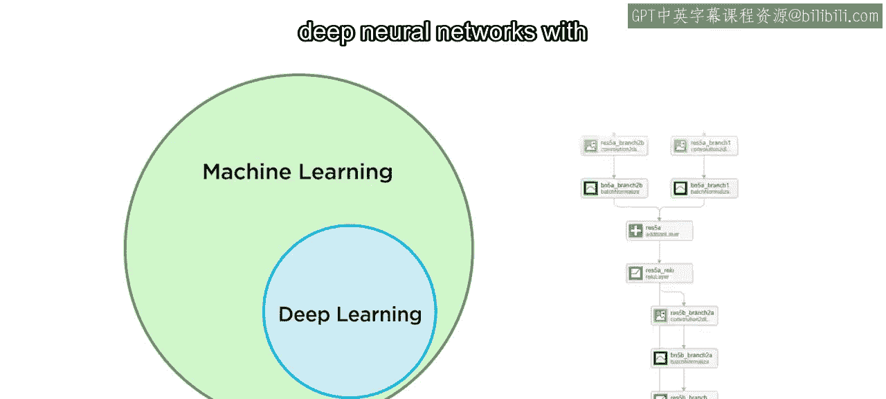

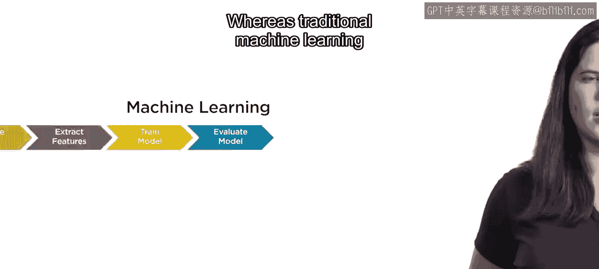

它使用具有多个计算层的深度神经网络来进行预测。其核心结构可以表示为：
`深度神经网络 = 输入层 + 多个隐藏层 + 输出层`

## 与传统机器学习的区别

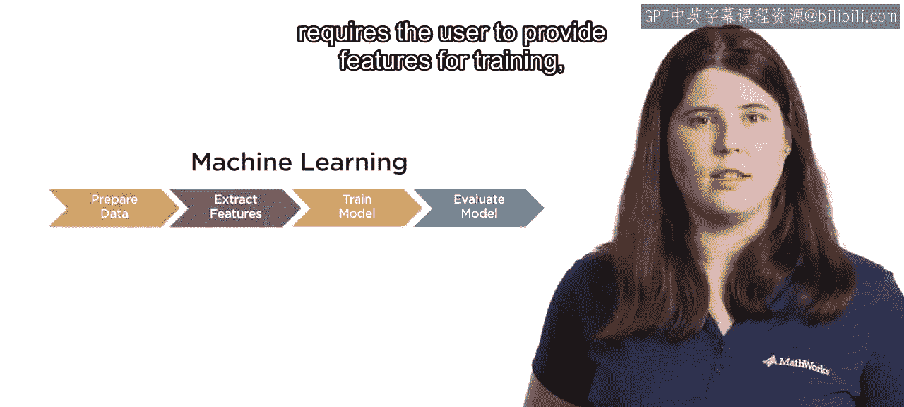

那么，深度学习与传统机器学习有何不同呢？关键在于特征的处理方式。

传统机器学习需要用户手动提供特征进行训练，而深度学习模型能够自动从数据中学习特征。

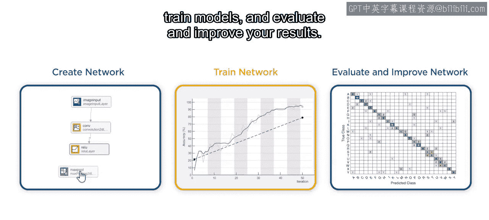

## 课程内容与目标

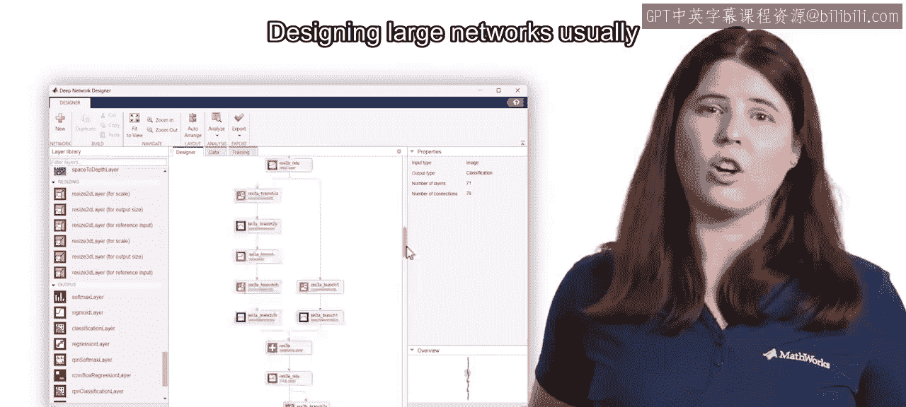

在明确了基本概念后，我们来看看本课程的具体安排。在本课程中，你将构建一个简单的卷积神经网络（CNN）。

以下是课程的核心实践环节：
*   训练模型
*   评估模型结果
*   改进模型性能

设计大型网络通常需要多年的经验。因此，本课程不会要求你从头设计网络。

相反，你将学习如何定制由专家创建的成熟模型，并通过一种称为**迁移学习**的技术将它们应用到自己的任务中。

## 课程项目与支持

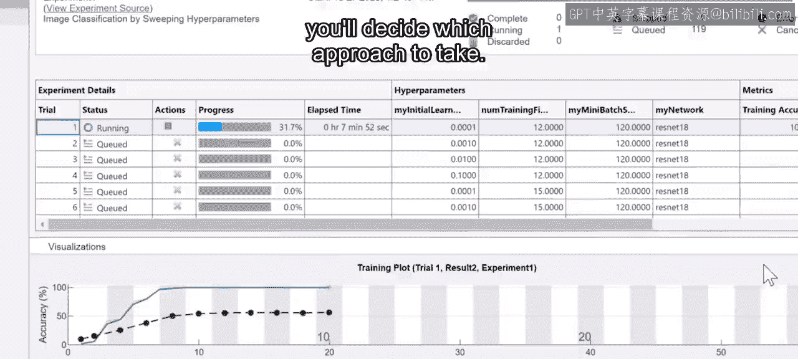

在课程结束时，你将有机会通过一个最终项目来应用和实践所学的新技能。构建一个成功的模型有很多方法，你需要自己决定采取哪种方法。

完成课程后，你将拥有可以分享给同事和雇主的工作代码，并掌握解决新图像分类问题的技能。此外，本课程也为本系列后续的专项课程打下了基础。

如果你在学习中遇到困难或发现了有趣的结果想要分享，请到课程论坛发帖讨论。

祝你学习顺利！

---

本节课中我们一起学习了深度学习在计算机视觉中的基本介绍、核心概念以及本课程的学习路径。我们了解了深度学习的定义、其与传统机器学习的区别，并明确了通过迁移学习应用现有模型是课程实践的核心。