# 深度学习在计算机视觉中的应用：4：为分类准备数据 🖼️

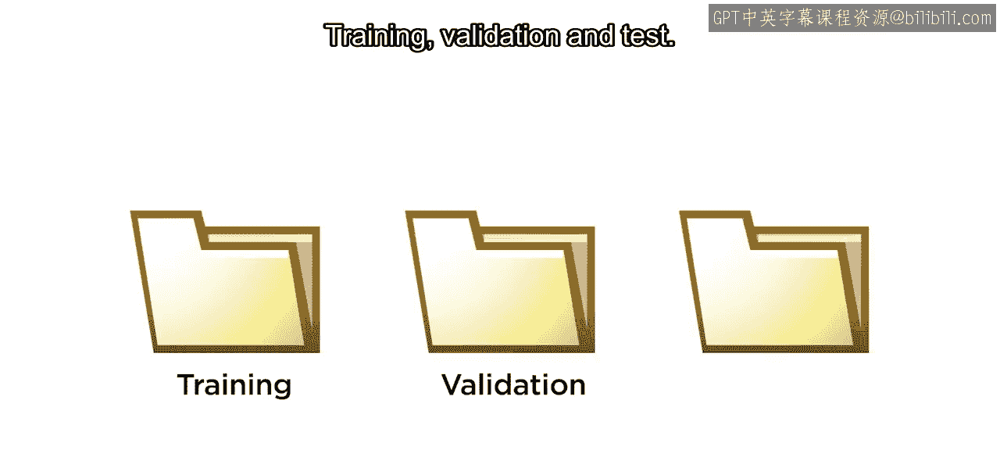

在本节课中，我们将学习如何为图像分类任务准备数据。这是构建有效深度学习模型的关键第一步。

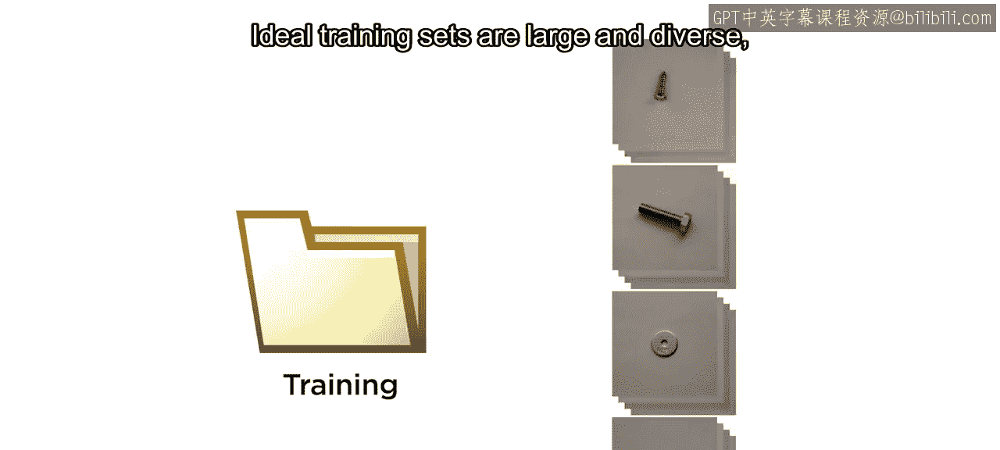

## 概述

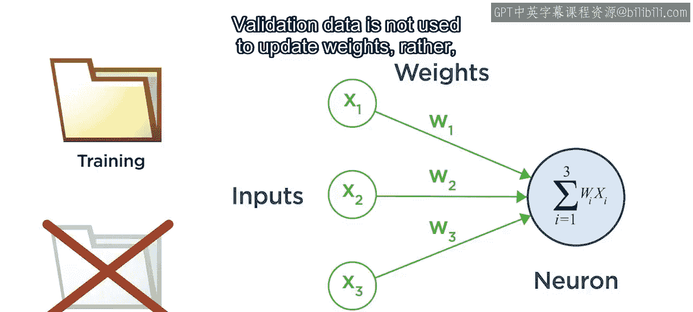

准备数据是创建有效深度学习模型的关键第一步。为了训练一个图像分类模型，你需要三组带标签的图像：训练集、验证集和测试集。

## 数据集的作用与划分

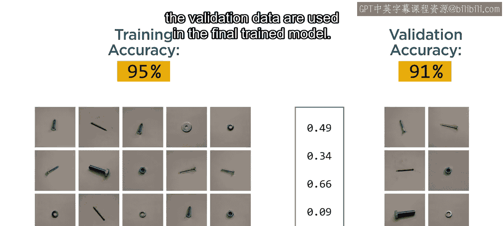

上一节我们介绍了数据准备的重要性，本节中我们来看看具体需要哪些数据集以及它们各自的作用。

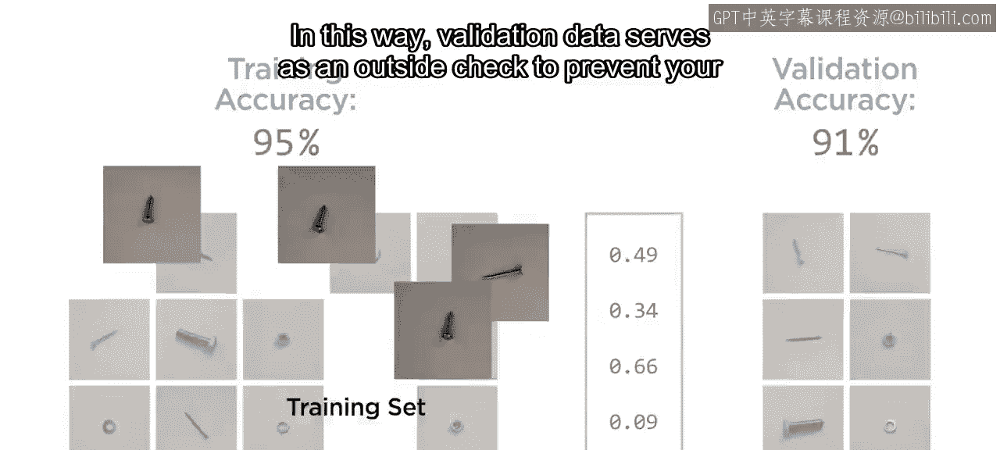

一个理想的训练集应该是**大而多样**的，能够代表最终训练好的模型将要分类的图像类型。

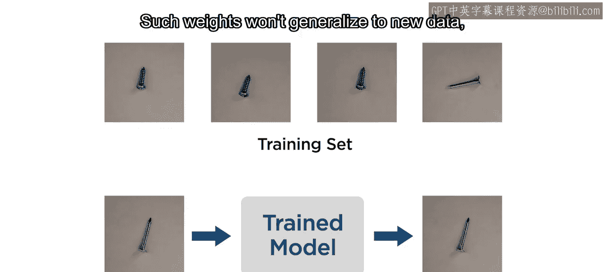

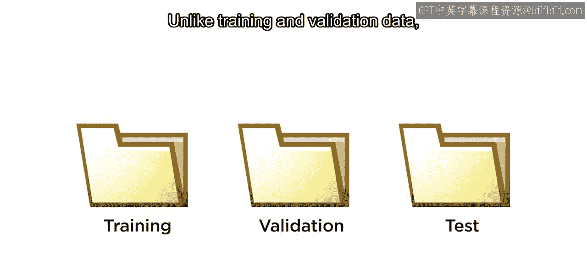

以下是三种核心数据集的定义与用途：

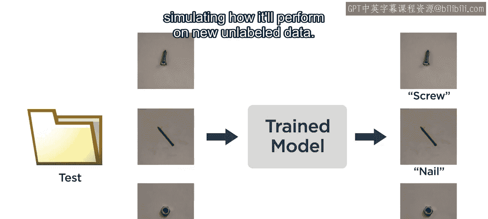

*   **训练集**：用于训练模型，通过调整权重来学习特征。其作用是建立模型参数。
*   **验证集**：不用于更新权重。其作用是在训练过程中定期评估模型的准确性。通常，在验证集上表现最好的模型权重会被用于最终的训练模型。通过这种方式，验证集作为一个外部检查，防止模型产生对训练数据**过度拟合**的权重，这种权重无法泛化到新数据上。
*   **测试集**：仅用于评估最终训练好的模型，模拟其在新的、未标记数据上的表现。测试图像应保存在单独的文件夹中，在训练完成前不应使用。

## 数据检查与预处理

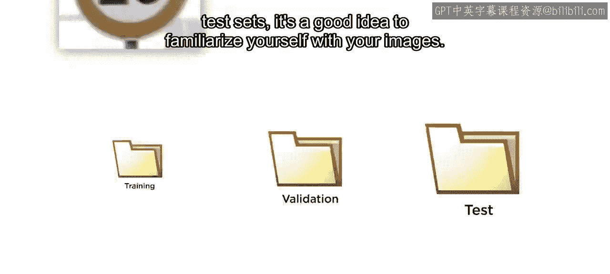

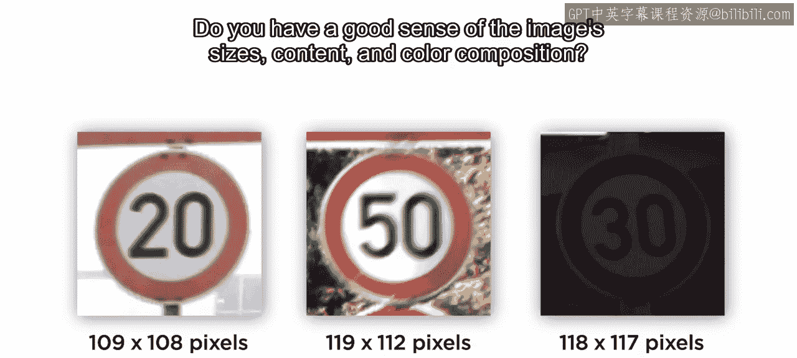

在将数据划分为训练集、验证集和测试集之前，最好先熟悉你的图像数据。

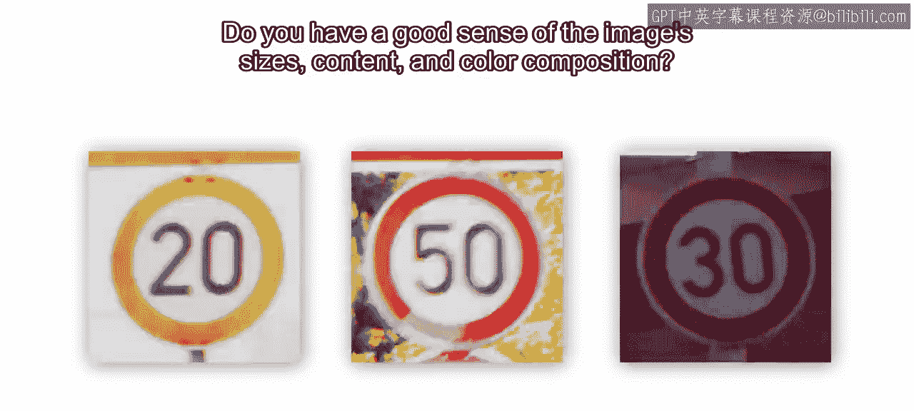

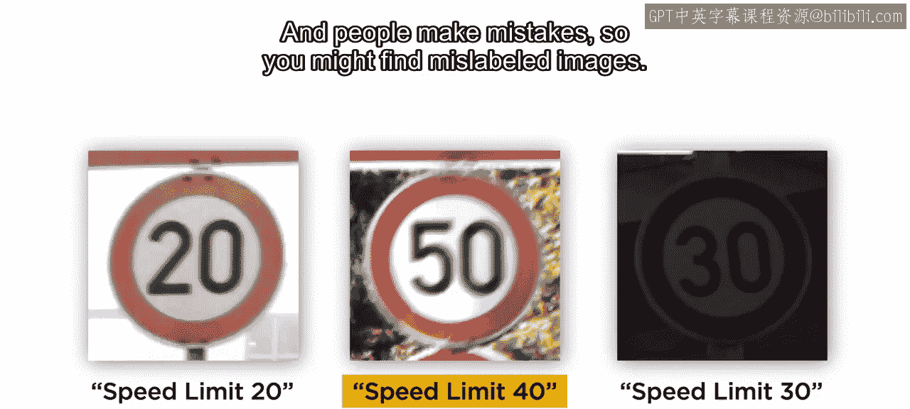

你需要对图像的尺寸、内容和色彩构成有清晰的了解。同时，人工标注可能存在错误，你可能会发现错误标记的图像。

例如，假设你打算根据无障碍性对停车位进行分类。但如果所有无障碍停车位的图像都是在阴天拍摄的，而非无障碍停车位的图像都是在晴朗的阳光下拍摄的，你可能会无意中训练出一个根据天气而非标志牌进行分类的模型。

最后，需要考虑数据的可靠性和适用性。课程文件中包含了几百张低分辨率的交通标志图像用于教学目的。但如果你要训练一个用于自动驾驶汽车的模型，则需要一个更大、更健壮的数据集。

## 数据组织与代码实现

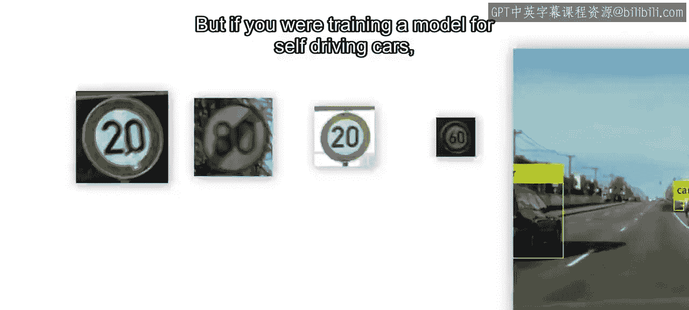

一旦你对图像数据感到满意，请确保它们按照类别组织到不同的文件夹中。这些文件夹的名称将成为类别标签。

然后，进一步划分你的图像以创建训练集、验证集和测试集。在课程文件中，每个类别中随机选取的一组图像已经被预留出来，放在一个测试文件夹中。


以下是在MATLAB中创建训练集和验证集的步骤：

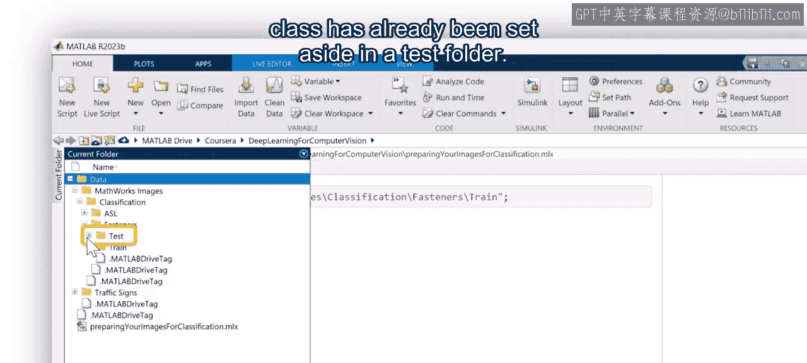

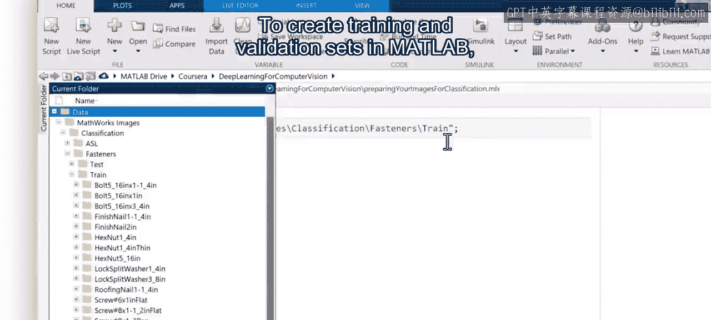

1.  从训练图像创建一个数据存储，包含所有子文件夹，并将文件夹名称指定为标签。
2.  使用 `splitEachLabel` 函数将数据存储分割为训练集和验证集。常见的分割比例是80%用于训练，20%用于验证。务必使用随机化选项，以避免验证数据产生偏差。

大多数深度学习网络都有要求的图像输入尺寸。你可以使用 `augmentedImageDatastore` 函数将数据调整到所需的输入尺寸。这个函数不会创建和存储新数据，而是生成每个图像的临时版本，并将其调整为适合网络要求的尺寸。这些生成的图像在训练过程中被立即使用，然后被丢弃。

以下是将训练集和验证集调整为224x224像素的示例代码：

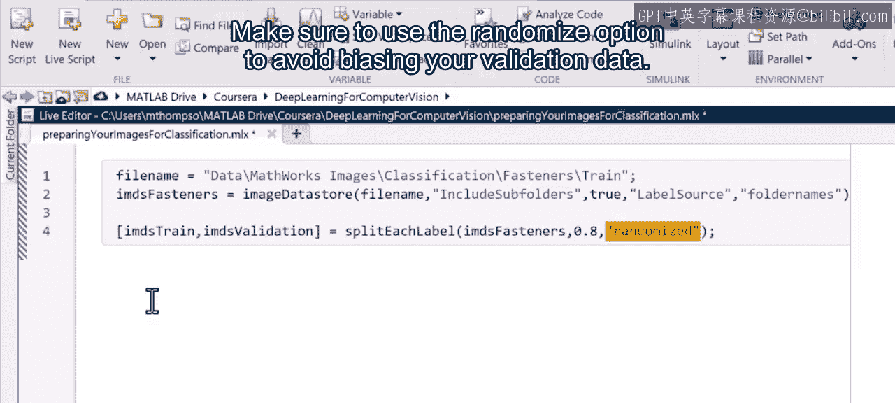

```matlab
% 创建图像数据存储
imds = imageDatastore('training_images', 'IncludeSubfolders', true, 'LabelSource', 'foldernames');

% 按标签分割数据存储（80%训练，20%验证）
[imdsTrain, imdsValidation] = splitEachLabel(imds, 0.8, 'randomized');

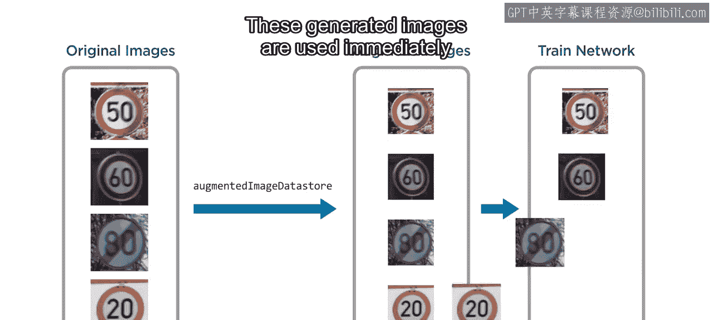

% 创建增强的图像数据存储，调整图像大小
inputSize = [224 224];
augimdsTrain = augmentedImageDatastore(inputSize, imdsTrain);
augimdsValidation = augmentedImageDatastore(inputSize, imdsValidation);
```

## 总结

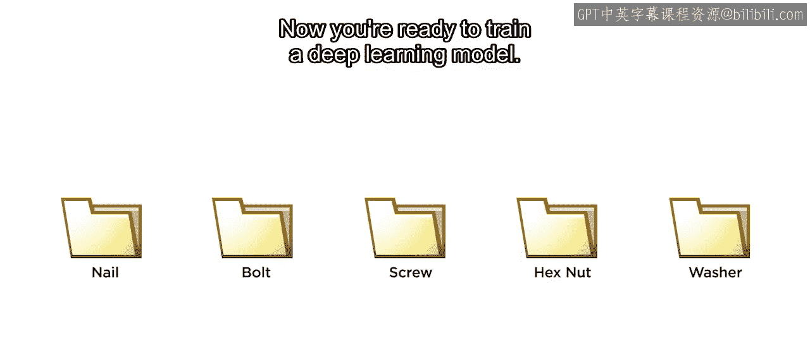

本节课中，我们一起学习了为图像分类准备数据的完整流程。我们明确了**训练集**、**验证集**和**测试集**的核心作用与区别，探讨了在划分数据前进行检查和预处理的重要性，并介绍了在MATLAB中组织数据、划分数据集以及调整图像尺寸以适配网络输入的具体方法。现在，你的数据已经准备就绪，可以开始训练深度学习模型了。