# 深度学习在计算机视觉中的应用：5：创建和训练用于分类的卷积神经网络 🧠

在本节课中，我们将学习如何从零开始设计、构建并训练一个用于图像分类的卷积神经网络。我们将使用一个包含19类紧固件（如螺母、螺栓、垫圈等）的数据集，通过一个结构简单但功能完整的CNN模型来演示整个过程。

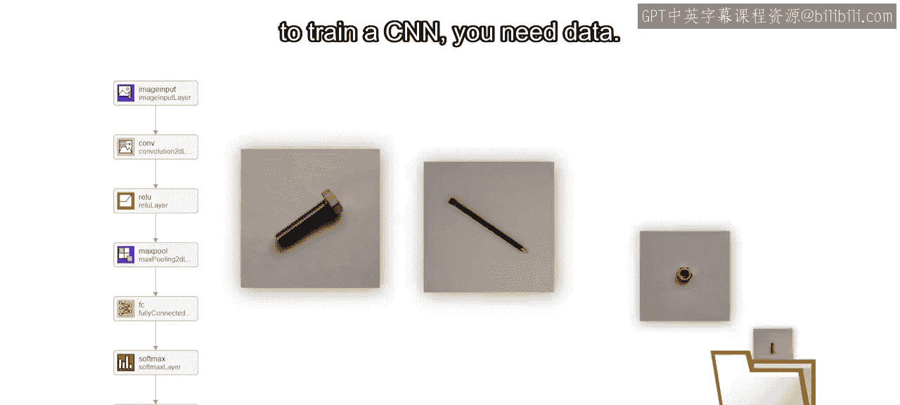

卷积神经网络是构建深度学习模型的灵活工具，尤其适用于图像数据。虽然现成的模型越来越多，但有时您可能需要训练自己的模型以满足特定需求。

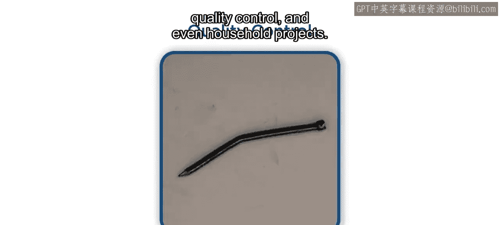

## 数据准备 📂

要训练CNN，首先需要数据。本课程将使用一个包含19类不同形状和尺寸的螺母、螺栓、垫圈、钉子和螺丝的图像数据集。训练一个能够识别每类物品的深度学习分类模型，在机器人技术、质量控制和家庭项目中都有应用。

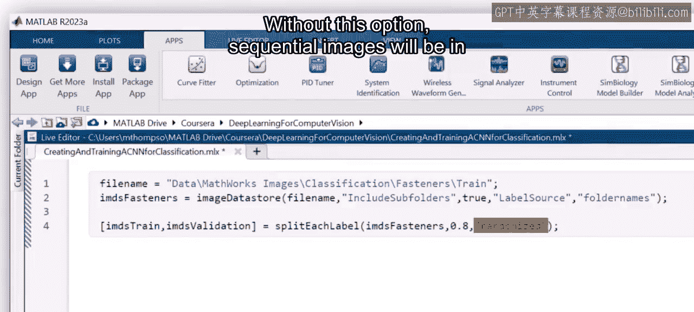

以下是准备训练数据的步骤：

1.  **创建图像数据存储**：在MATLAB中，根据图像文件夹结构创建图像数据存储。文件夹名称将自动作为每类图像的标签。
2.  **划分训练集与验证集**：测试图像已预先留出，用于最终评估模型。但需要将训练图像数据存储进一步划分为训练集和验证集。使用 `splitEachLabel` 函数，可以按指定比例（例如80%用于训练，20%用于验证）随机抽取每个标签的子集，以避免数据划分偏差。

```matlab
% 示例：划分训练集和验证集
[imdsTrain, imdsValidation] = splitEachLabel(imds, 0.8, ‘randomized’);
```

## 构建网络架构 🏗️

现在，可以开始构建卷积神经网络的层结构。我们将使用MATLAB的Deep Network Designer应用程序来可视化地创建网络，该网络包含本课程前面讨论过的几个关键层。

以下是构建网络层的顺序和说明：

1.  **图像输入层 (Image Input Layer)**：指定网络期望的输入图像尺寸（例如227x227）。需要记住这个尺寸，后续会用到。
2.  **卷积层 (Convolutional Layer)**：使用滤波器（或内核）来识别和提取能够区分不同类别的特征。例如，可以设置该层训练32个3x3的滤波器。初始时，权重参数为空。
3.  **激活层 (Activation Layer)**：添加一个ReLU层。它将所有负值设置为0，引入非线性，是快速有效的选择。
4.  **池化层 (Pooling Layer)**：添加一个二维最大池化层。该层在保留关键特征的同时，降低数据的复杂性和计算成本。
5.  **全连接层 (Fully Connected Layer)**：特征被提取和简化后，在此层用于训练模型。该层为输入图像属于每个类别分配一个似然分数。由于数据集中有19个类别，因此将该层的输出大小设置为19。
6.  **Softmax层**：将全连接层的输出分数归一化到0到1之间，分数越高表示属于该类别的可能性越大。
7.  **分类输出层 (Classification Layer)**：将Softmax层输出的分数解释为最终的类别预测（例如“饰面钉”或“锁紧垫圈”）。

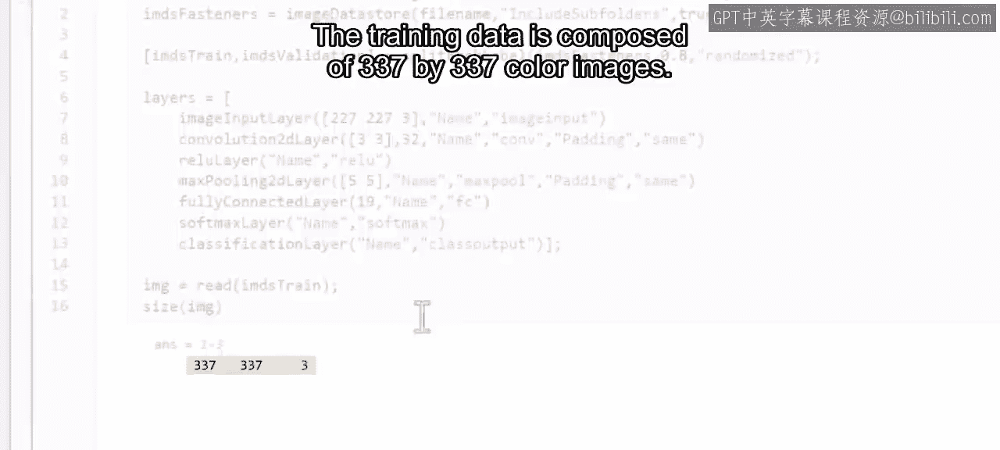

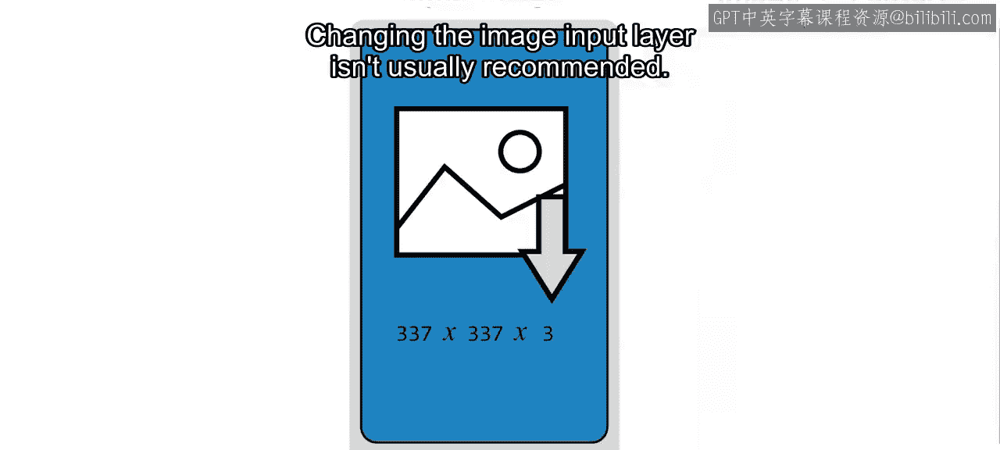

构建完成后，可以将网络架构导出为代码，以便在脚本中重现和修改。

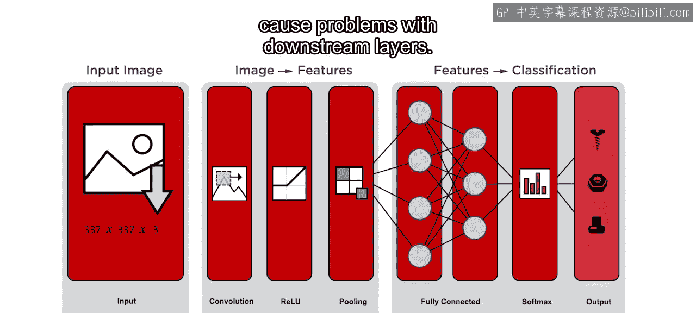

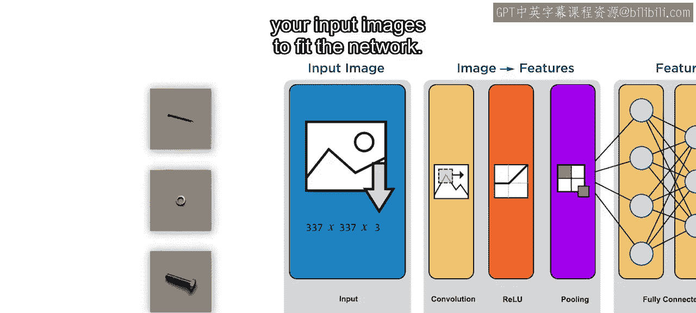

## 调整数据以匹配网络 📏

导出的网络期望输入图像尺寸为227x227，但我们的训练数据是337x337的彩色图像。通常不建议直接修改网络输入层的大小，因为这可能导致下游层出现问题。更好的做法是将输入图像调整为网络期望的尺寸。

使用增强图像数据存储 (`augmentedImageDatastore`) 函数，可以在图像传入网络前实时调整其大小，而不会更改原始图像文件。

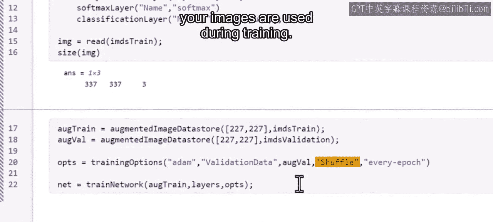

```matlab
% 示例：调整训练和验证图像的大小
inputSize = [227 227 3];
augimdsTrain = augmentedImageDatastore(inputSize, imdsTrain);
augimdsValidation = augmentedImageDatastore(inputSize, imdsValidation);
```

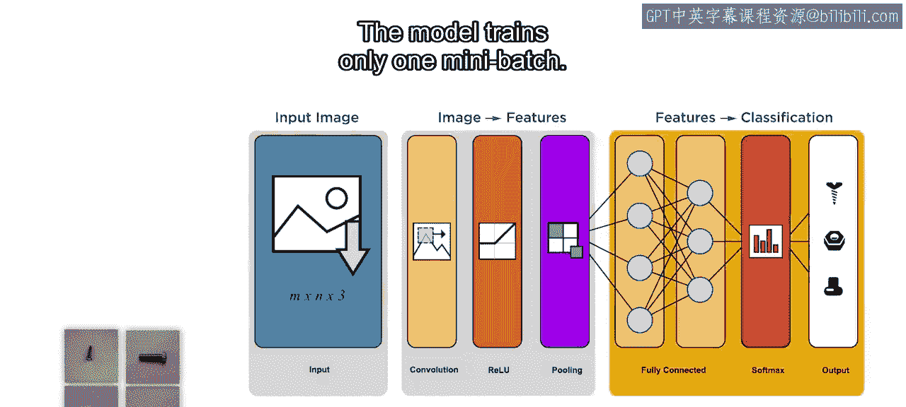

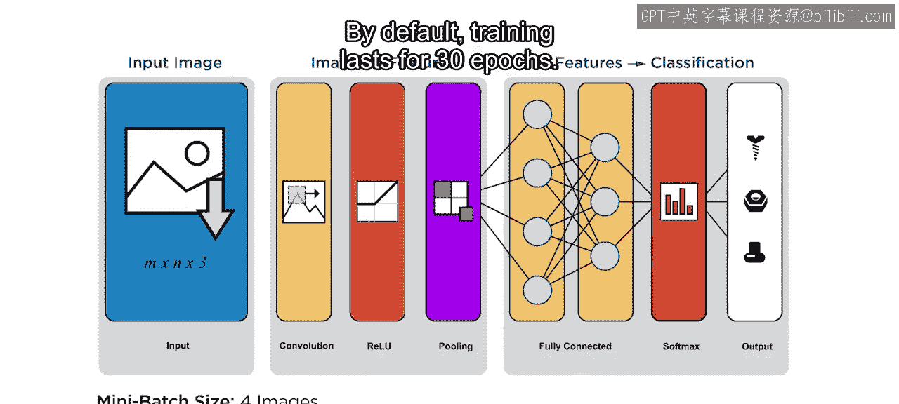

## 训练模型 🚂

现在，我们有了网络架构和调整好的数据，可以开始训练了。使用 `trainNetwork` 函数进行训练，它需要三个主要输入：网络层、数据和训练选项。

为了简化，我们设置以下四个关键训练选项：

1.  **求解器 (Solver)**：指定优化算法。本课程使用自适应矩估计 (Adam)。
2.  **验证数据 (Validation Data)**：包含之前创建的验证集，用于在训练过程中监控模型性能。
3.  **每轮次洗牌 (Shuffle)**：设置为 `‘every-epoch’`。这确保了在每个训练轮次开始时，数据都会被重新随机打乱并分成小批量，有助于模型更均衡地学习，减少对初始批次的偏见。
4.  **绘制训练进度 (Plots)**：设置为 `‘training-progress’`，以便实时观察训练进度，并在必要时进行干预。

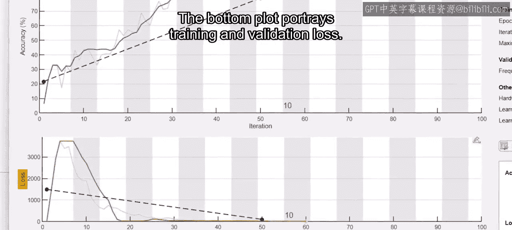

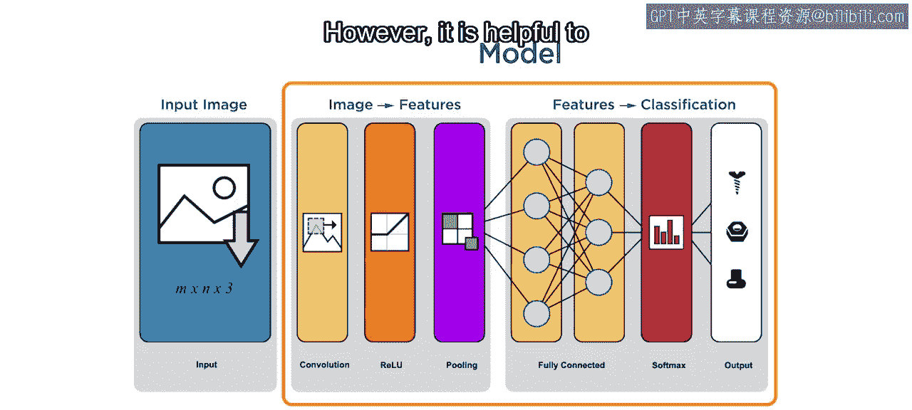

深度学习网络训练可能耗时较长，使用GPU可以显著加速。在训练过程中，可以观察两个主要图表：顶部的准确率图（显示训练和验证准确率）和底部的损失图（显示训练和验证损失）。损失值反映了模型预测与真实标签之间的差异，是模型更新的依据。

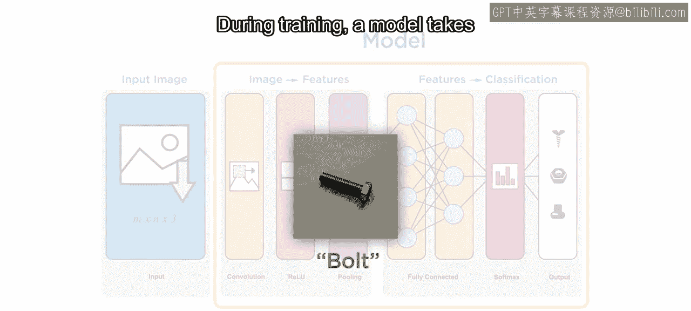

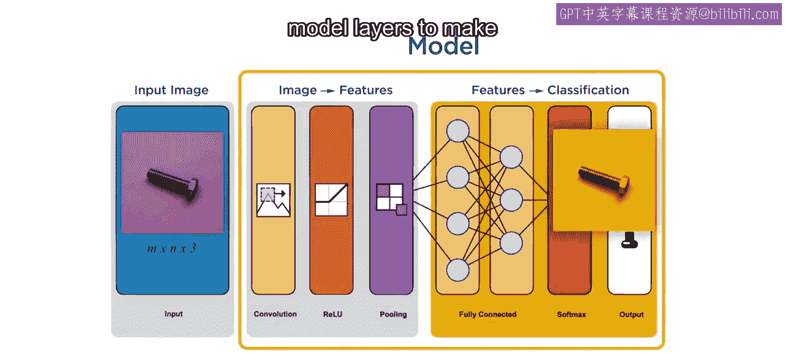

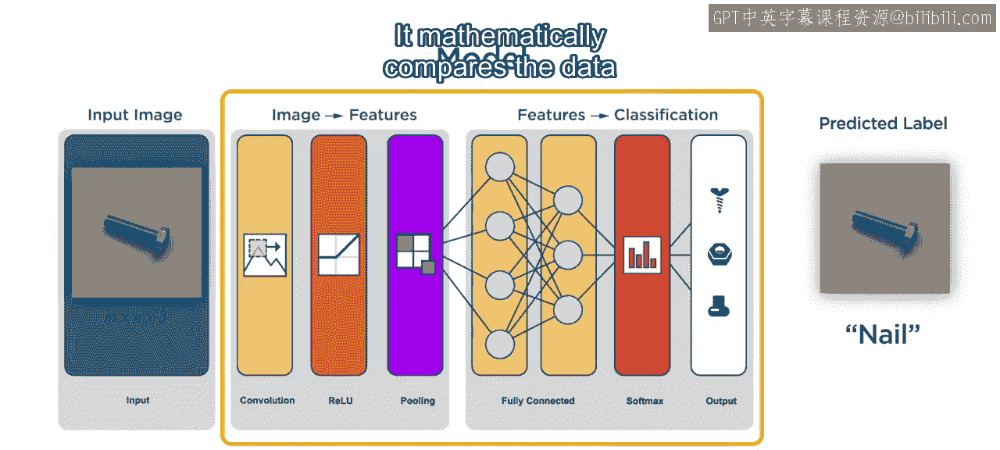

## 理解网络与评估模型 🔍

训练完成后，模型的卷积层权重不再为空，它们已经学习到了能够分类数据集中紧固件的特征。

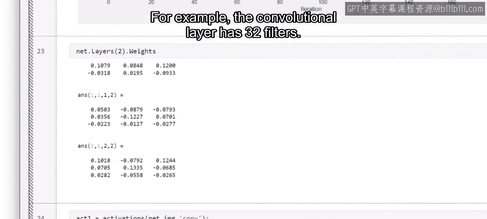

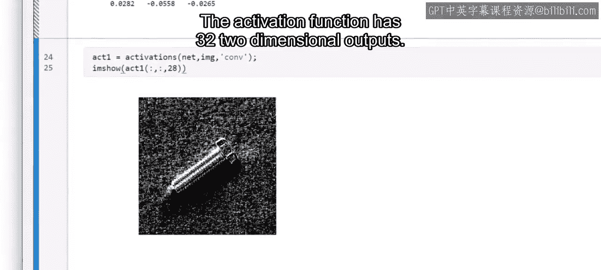

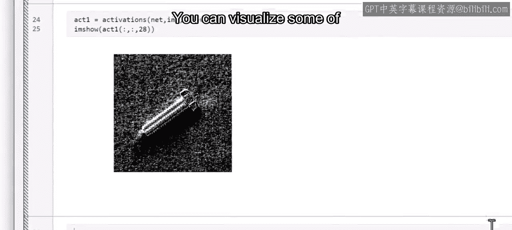

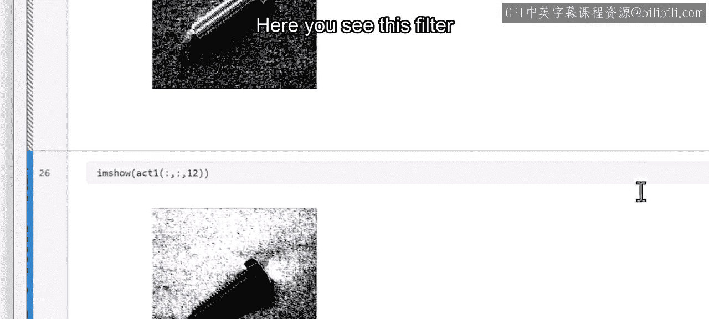

为了理解网络内部的工作，可以使用 `activations` 函数来可视化特定层（如卷积层）对给定图像的输出。例如，一个有32个滤波器的卷积层会产生32个二维输出，可视化其中一些输出可以帮助我们了解滤波器关注的是图像的哪些部分（如边缘、背景等）。不过，网络提取的特征对人类视觉而言不一定都有直观意义，但这并不妨碍我们有效地使用模型。

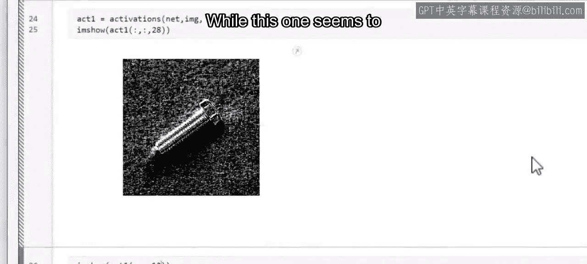

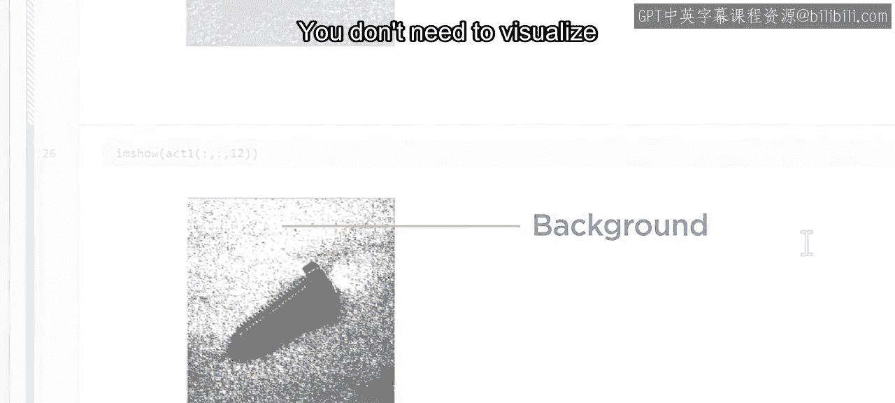

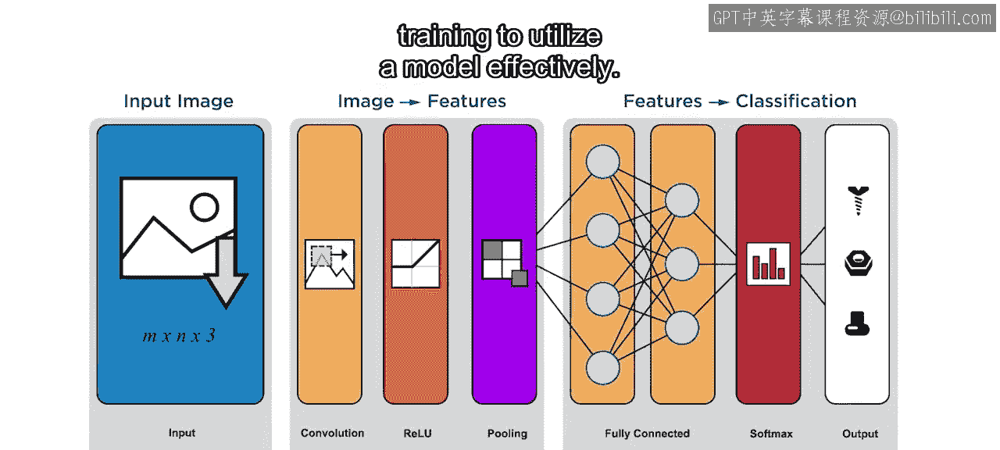

最后，是时候使用预留的测试集来评估模型的泛化能力了。创建一个测试图像数据存储，并同样调整图像尺寸以匹配网络输入。然后，让训练好的模型对测试集进行预测，并与真实标签进行比较，计算出测试准确率。即使是一个简单的单卷积层网络，也能取得不错的结果，这充分展示了CNN的强大能力。

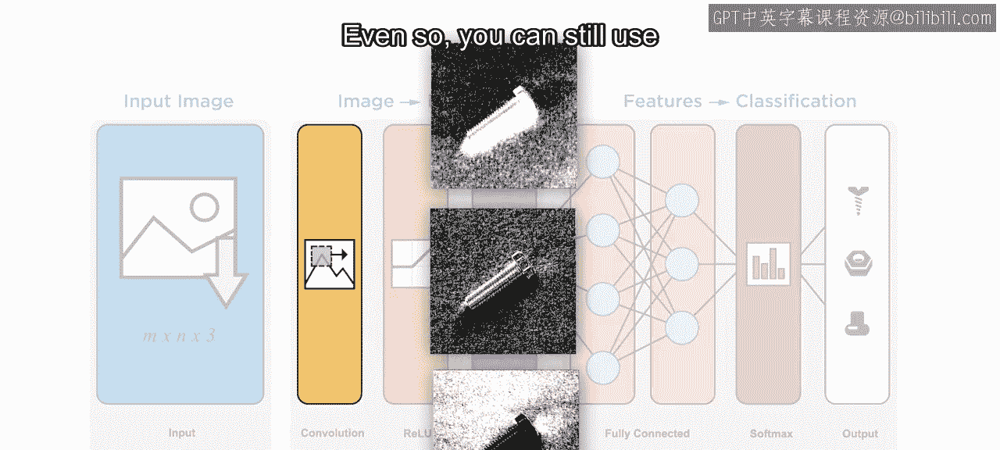

## 总结 📝

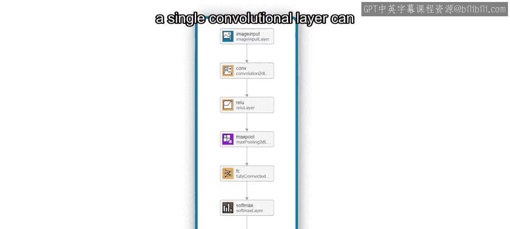

本节课中，我们一起学习了创建和训练一个用于图像分类的卷积神经网络的完整流程。我们从准备和划分数据集开始，然后使用Deep Network Designer应用程序逐步构建了包含输入层、卷积层、ReLU激活层、池化层、全连接层、Softmax层和分类输出层的网络架构。接着，我们调整了图像尺寸以匹配网络输入，并设置了关键训练选项来启动模型训练。最后，我们通过可视化部分网络激活和计算测试集准确率来理解和评估训练好的模型。这个过程展示了即使是基础CNN，也能在图像分类任务中发挥重要作用。在后续课程中，我们将探索更复杂、更强大的网络模型。