# 深度学习在计算机视觉中的应用：6：迁移学习简介 🧠

在本节课中，我们将要学习一种名为“迁移学习”的强大技术。它允许我们利用已有的、经过大量数据训练的模型，来快速、高效地解决新的计算机视觉问题，而无需从零开始构建和训练模型。

从零开始创建和训练新模型成本高昂且耗时。这通常也需要拥有多年经验的专家研究员来完成。因此，许多工业应用采用了一种称为迁移学习的技术。

迁移学习使用现有网络的架构和权重，更新它们，并将其应用于新数据。预训练模型的权重通常已经过数十万张图像的精细调整，因此当您用自己的数据重新训练模型时，它们提供了一个极佳的起点。

---

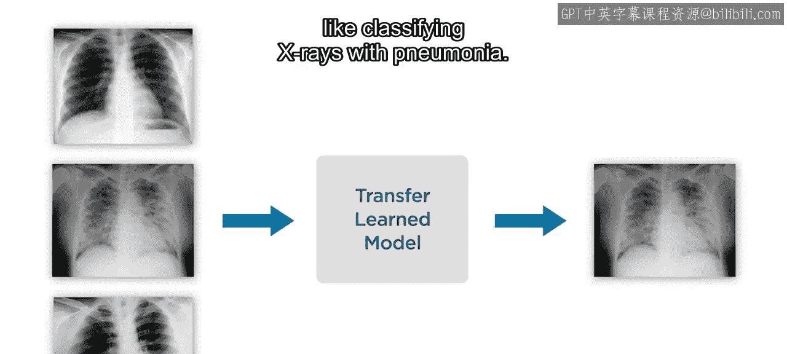

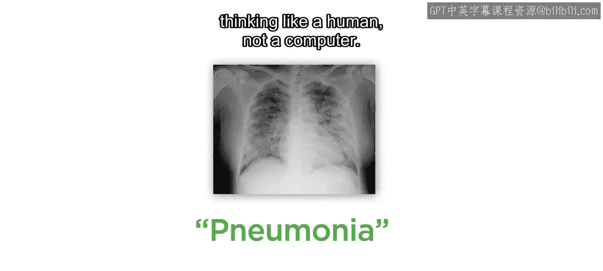

## 迁移学习为何有效？🤔

您可能会觉得，一个在通用类别上训练的模型，对于完全不同的应用（例如用X光片分类肺炎）会有用，这似乎很奇怪。

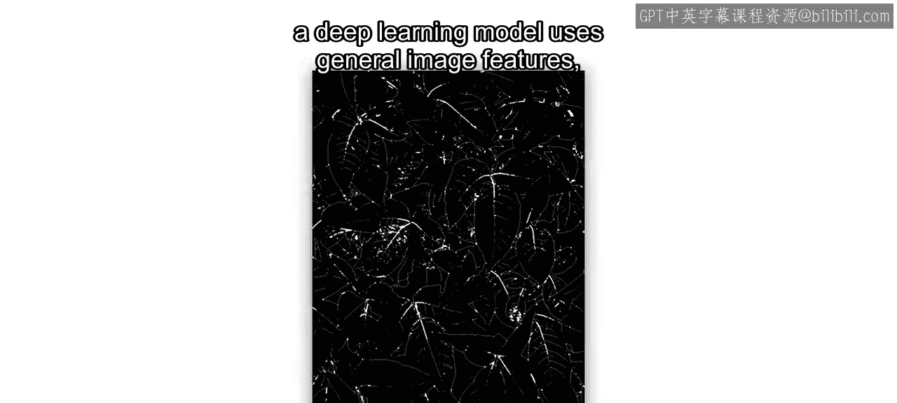

但这是因为您是以人类的思维方式思考，而不是计算机。

例如，您可能通过观察叶子的排列方式来识别毒藤。

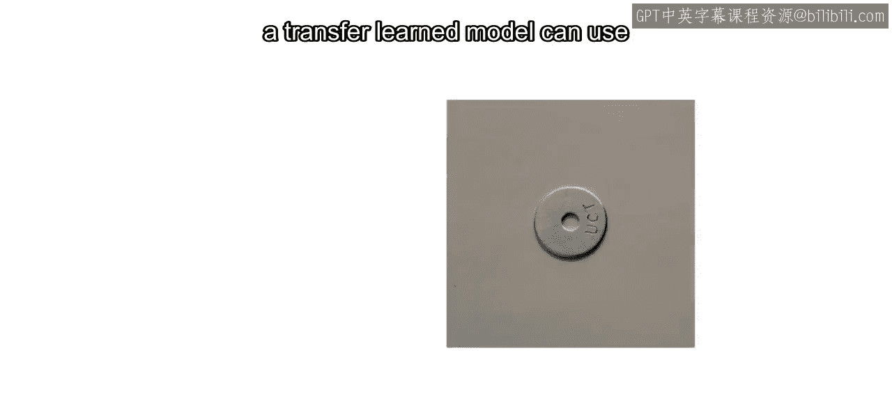

而深度学习模型使用的是通用的图像特征，例如**边缘**、**纹理**和**斑点**。

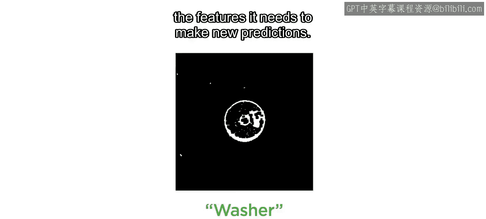

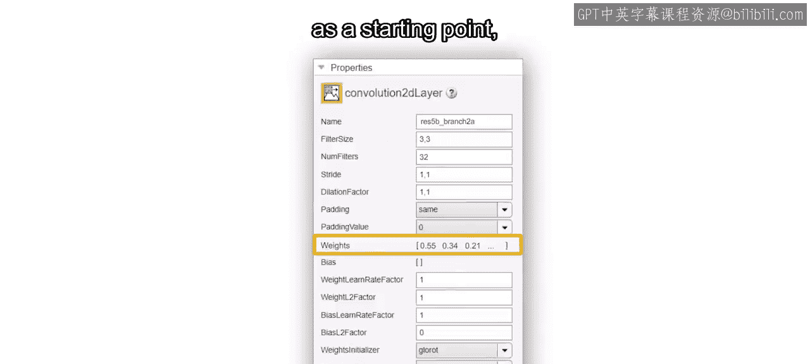

这些相同类型的特征也可以用来区分健康的肺部和患有肺炎的肺部。

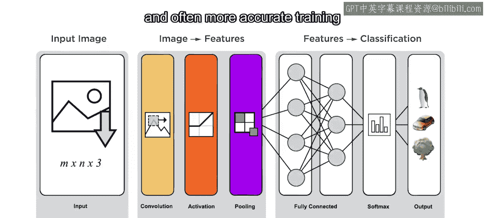

因为预训练模型提取的是大多数图像中固有的通用特征，所以一个经过迁移学习的模型可以使用类似的策略来找到它进行新预测所需的特征。

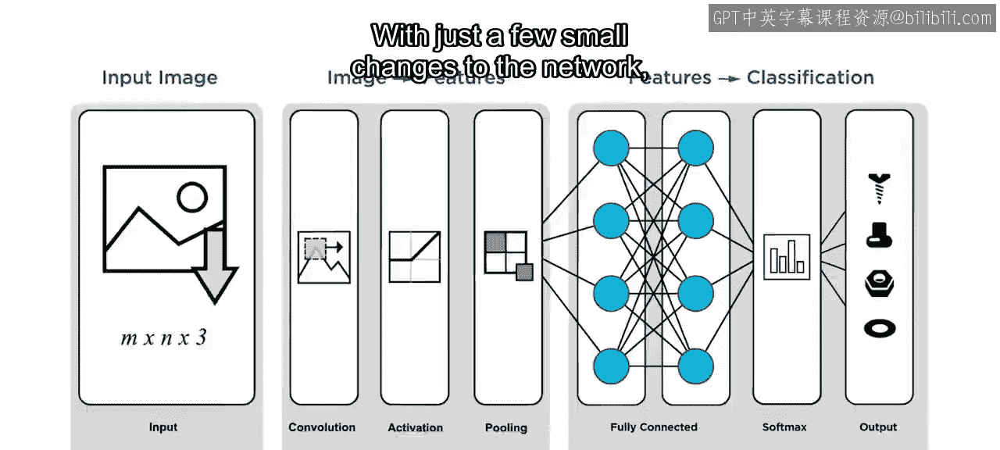

通过利用预训练的权重作为起点，迁移学习能够实现比从零开始训练更快、且通常更准确的训练。

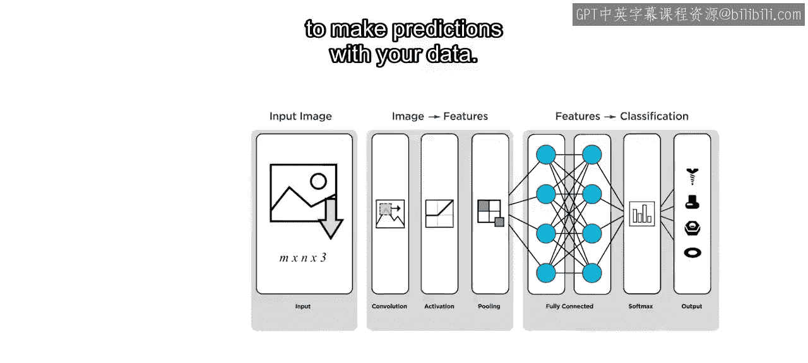

---

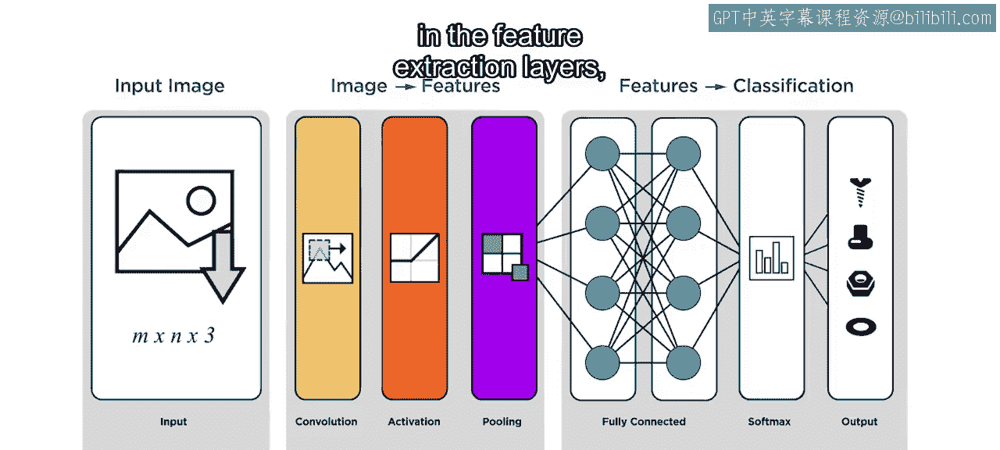

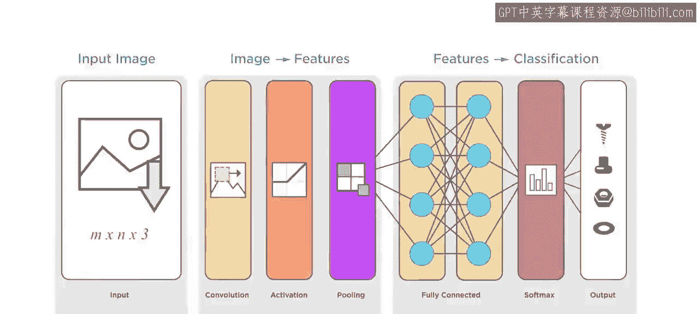

## 如何进行迁移学习？🔧

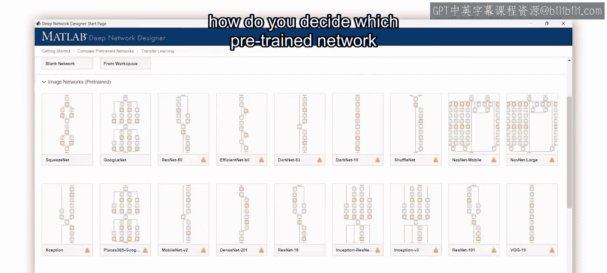

只需对网络进行一些小的改动，您就可以重新训练模型，使其能够对您的数据进行预测。

这个过程主要优化了特征提取层中的原始权重，并为分类层计算了新的权重。

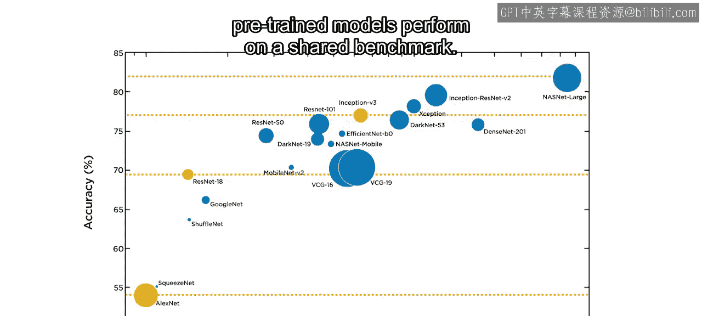

---

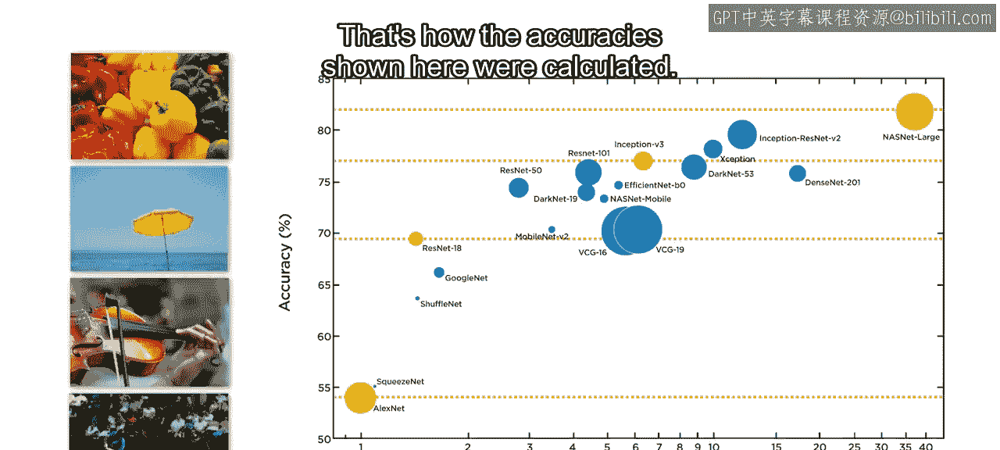

## 如何选择预训练模型？📊

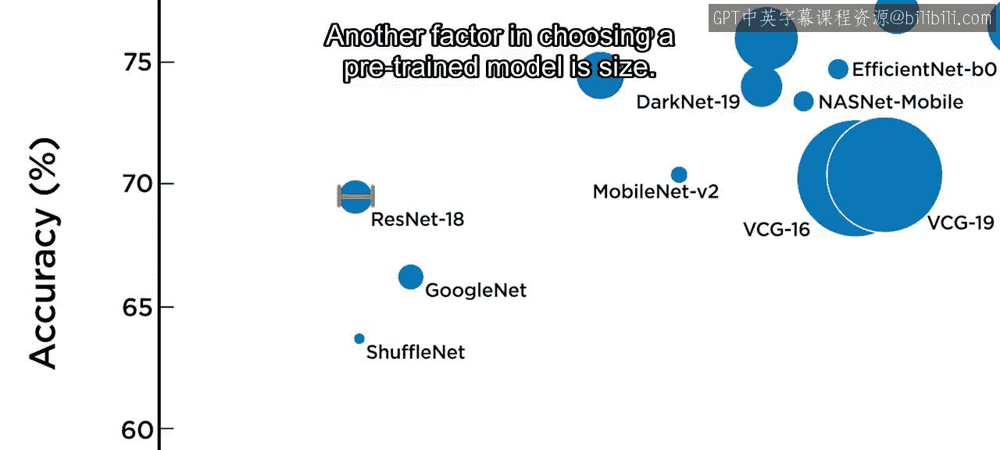

随着可供选择的预训练网络列表不断增长，您如何决定使用哪个预训练网络作为起点呢？

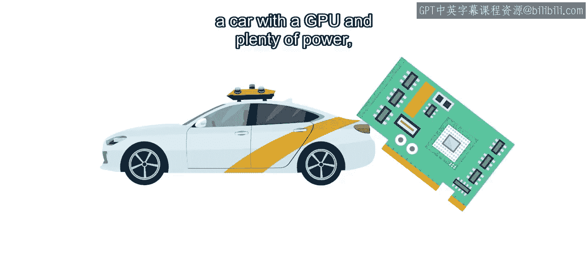

重要的是要考虑预测准确性、模型大小和预测速度之间的权衡，这取决于您应用的需求。

虽然在进行迁移学习之前，您无法知道模型的准确度，但可以比较预训练模型在共享基准测试上的表现。这里显示的准确度就是这样计算出来的。

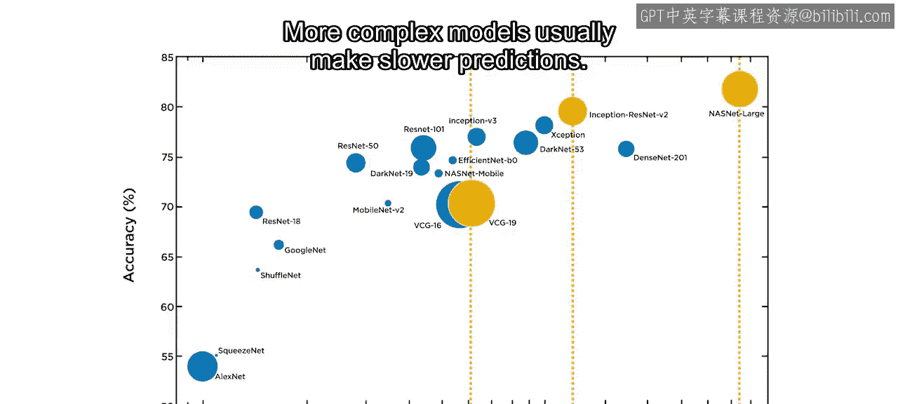

选择预训练模型的另一个因素是**大小**。如果您要将模型部署到拥有GPU和充足算力的汽车上，大型模型可能没问题。但如果您要创建智能手机应用或使用微控制器，则可能需要一个较小的模型。

最后，请考虑所选模型的**预测速度**。更复杂的模型通常预测速度更慢。如果您使用门铃摄像头查看门廊上是否有包裹，多花几秒钟无关紧要。但如果您要检测行人和骑自行车的人，模型快速工作则至关重要。

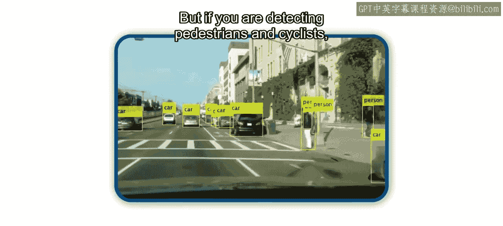

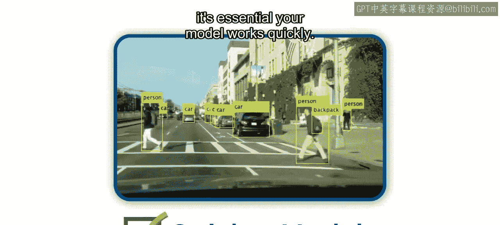

---

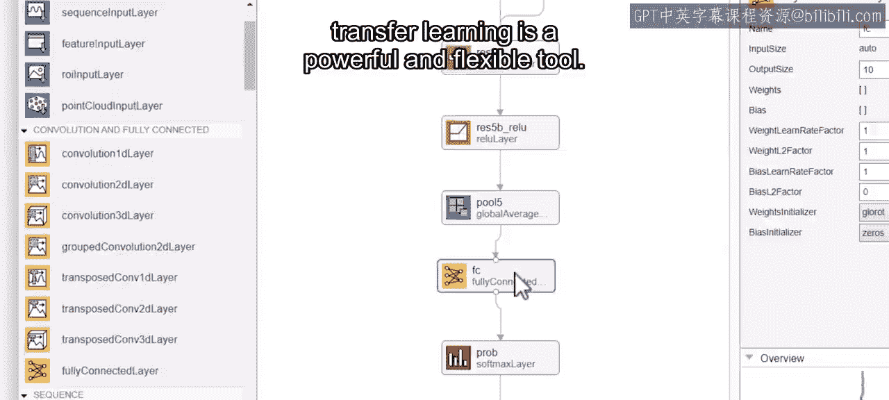

## 总结 📝

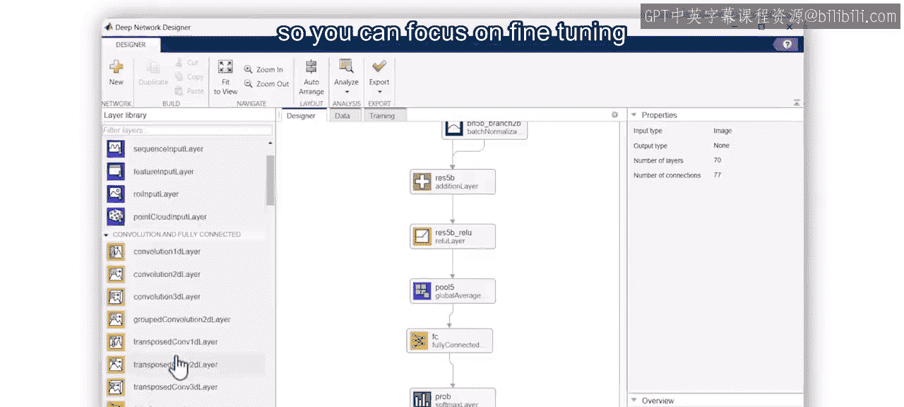

本节课中，我们一起学习了迁移学习。这种适应不同应用的能力，是迁移学习成为一个强大而灵活工具的原因之一。它允许您从已有的成熟工作中受益，从而可以专注于为您的应用微调模型。