# 深度学习在计算机视觉中的应用：8：使用实验管理器训练和比较模型 🧪

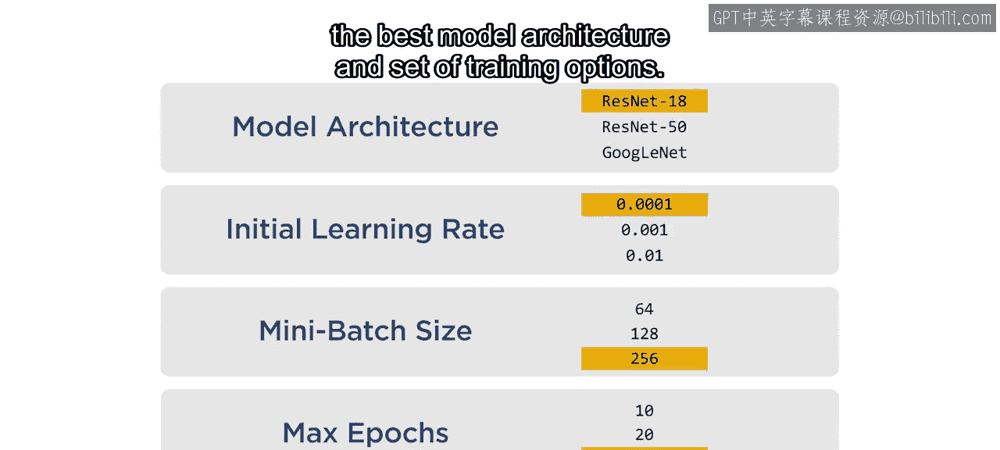

在本节课中，我们将学习如何使用 MATLAB 的**实验管理器**应用来高效地训练和比较不同超参数组合下的模型。通过实验管理器，我们可以系统地测试多种模型架构和训练选项，避免手动创建大量脚本的繁琐和易错过程。

训练模型时需要考虑许多选项。通常，找到最佳的模型架构和训练选项组合需要进行一些试错。

创建多个脚本来训练所有可能的模型和超参数组合既耗时又容易出错。

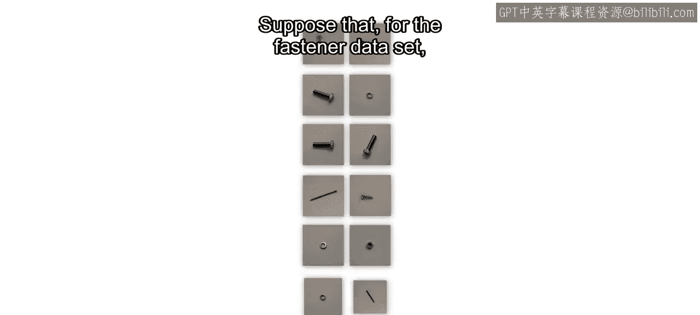

那么，如何在跟踪所有工作的同时，找到最佳的超参数组合呢？

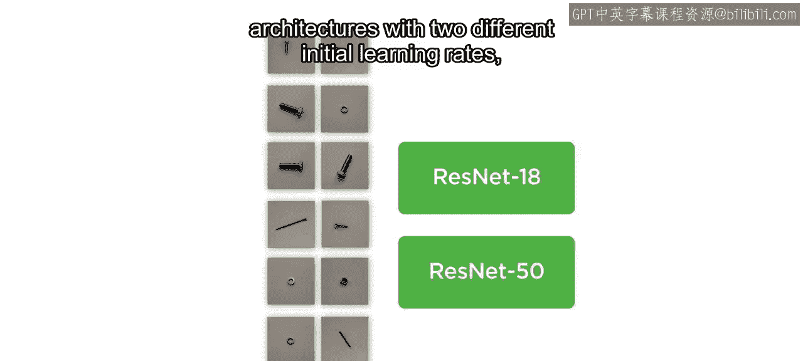

在本视频中，你将使用实验管理器应用来训练具有不同选项集的模型，选择合适的模型，并记录你的工作。假设对于 Fastener 数据集，你想测试两种网络架构和两种不同的初始学习率。

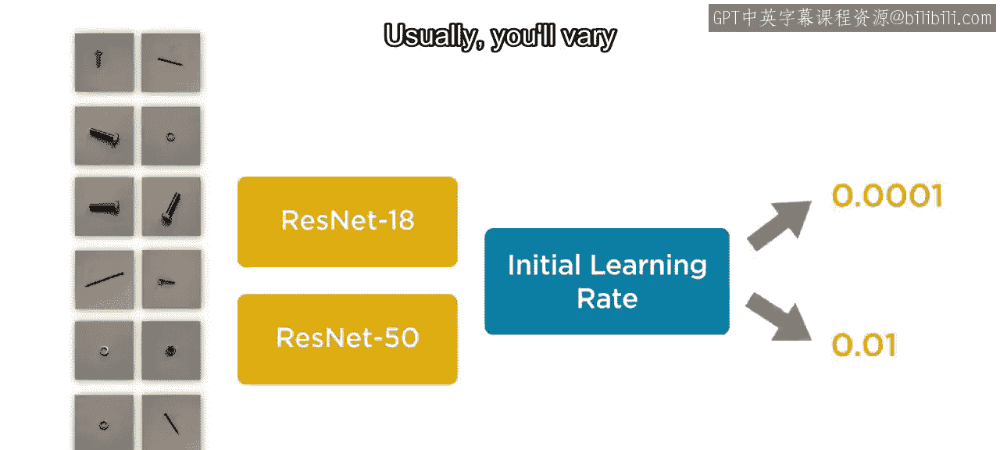

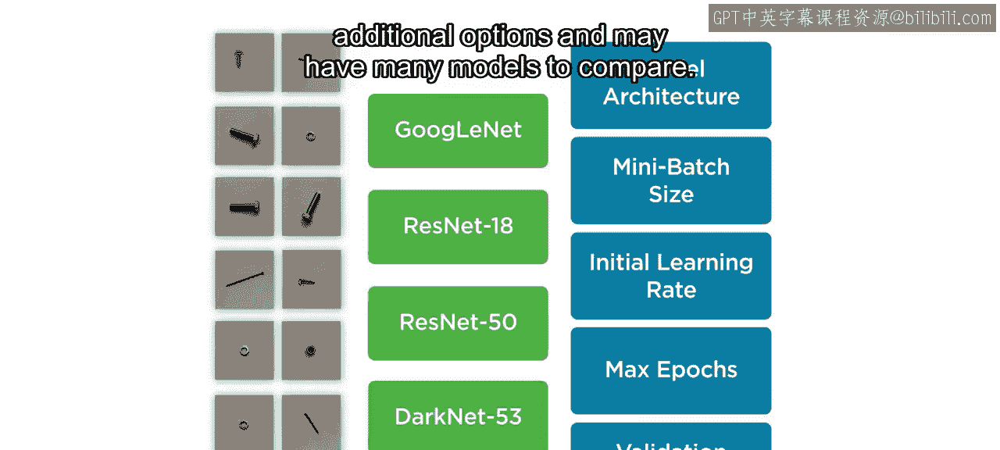

目标是训练并比较这四种选项组合。通常，你还会改变更多选项，并可能需要比较许多模型。

让我们打开 MATLAB 开始操作。在“应用程序”选项卡中，选择“实验管理器”。

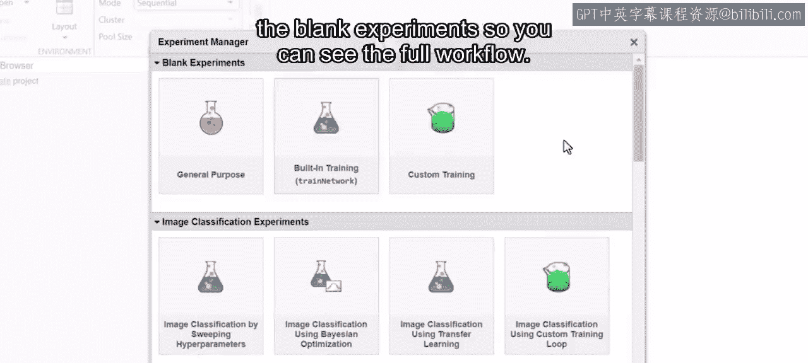

然后选择“空白项目”。你可以选择创建一个空白实验，或从一些现有示例开始。

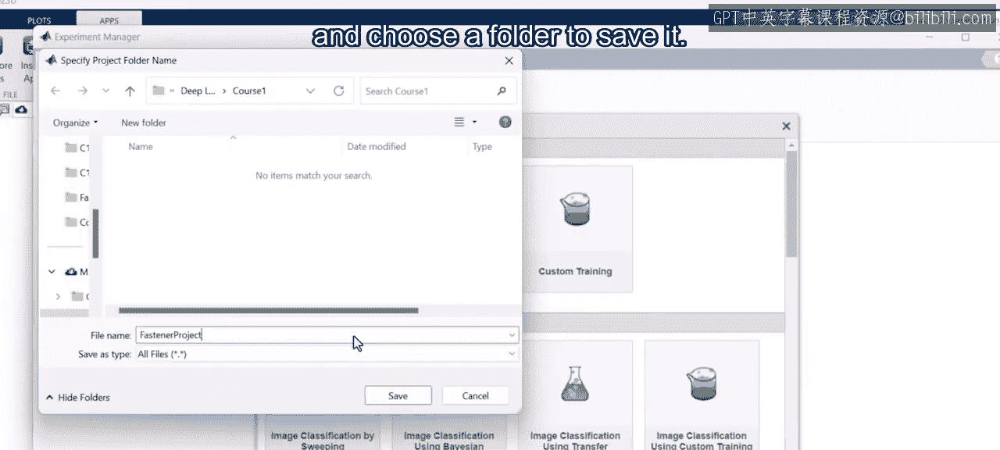

这里我们将从空白实验中进行内置训练，以便你能看到完整的工作流程。

让我们为项目指定一个文件名，并选择一个文件夹来保存它。

实验管理器提供了一个界面，用于输入关于实验的信息。首先，提供你计划训练的模型的描述。你需要包含将要变化的选项。

然后，指定你想要测试的超参数的名称和值。这里我们将使用 `networkName` 来指定要测试的架构，使用 `initialLearnRate` 来指定要尝试的学习率值。

请注意，名称必须是有效的 MATLAB 变量名，而值则是用于定义该变量的语法。稍后你将看到如何使用它们。

在开始训练模型之前，你需要提供一个设置函数。让我们编辑提供的模板。该模板包含一个空函数，其中描述了所需的输入和输出。

输入变量 `params` 是一个结构体，存储了你之前输入的参数名称和值。你需要添加代码来创建训练数据、网络架构和训练选项。

为此，我们将代码分为三部分编写：定义网络架构、准备训练数据、指定训练选项。别担心，在训练单个模型时你已经完成了所有这些步骤。这里我们只是将它们整合到一个函数中，以便可以一次性训练多个模型。

请记住，目标是测试多种网络架构。参数变化存储在 `params` 结构体变量中。你可以使用点号和你之前给出的名称（如 `networkName`）来访问结构体的字段。`params` 变量将针对每个模型组合进行更新。

为了选择一个网络，我们使用一个 `if` 语句，如下所示。之前，你在深度网络设计器中修改了一个网络以进行迁移学习。现在，你需要添加代码来执行这些步骤。这里的代码创建了网络架构，然后替换全连接层和分类层，以使网络适应数据集中的类别数量。

接下来，准备用于训练的图像。不同的网络需要不同的输入尺寸，因此从网络的第一层获取预期的尺寸。然后创建一个增强的图像数据存储来调整图像大小。确保使用与函数输出中相同的变量名，这里是 `trainingData`。

最后一部分指定训练选项。我们想要测试不同的初始学习率值。像之前一样使用 `params` 变量来指定 `initialLearnRate`。你可以使用相同的过程来改变任意数量的训练选项。

现在，你已经拥有了设置函数所需的所有输出。让我们保存它，并返回到实验管理器。

为了测试所有参数组合，请确保将默认策略保持为“穷举扫描”。

保存实验。现在，让我们开始训练。

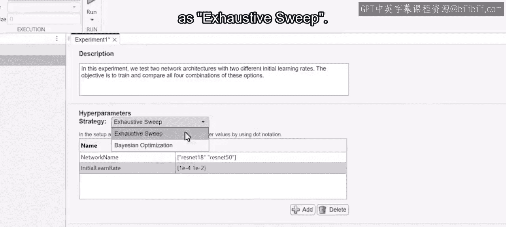

该应用提供了一个监控仪表板，以便你可以跟踪训练进度。它显示每个试验的常用指标以及训练图。训练可能需要相当长的时间，具体取决于你的数据和可用资源。所以让我们直接跳到结尾。

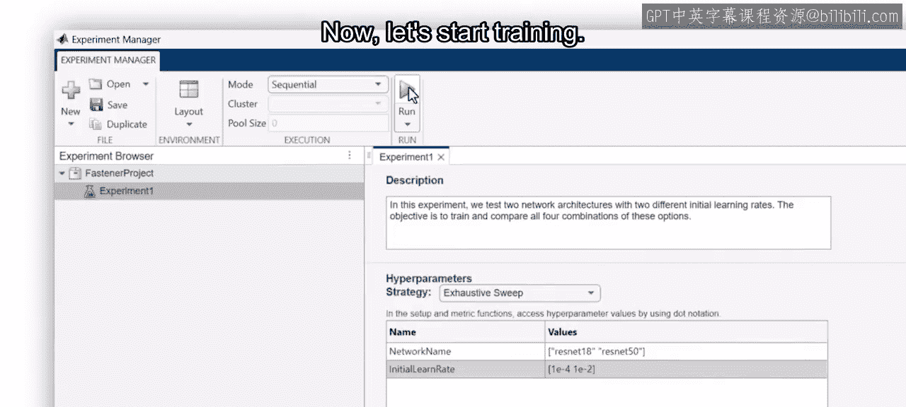

所有结果和指标都排列在一个可排序的表格中，便于比较模型。

查看所选模型的混淆矩阵，以获取关于模型性能的更详细信息。在这个例子中，所有模型都具有很高的准确率。

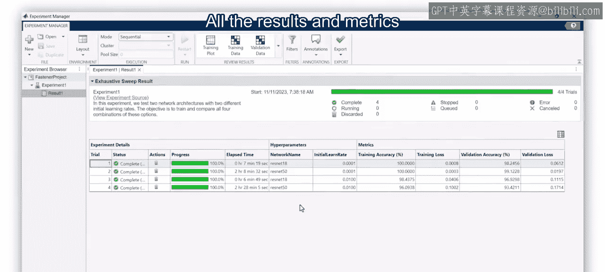

因此，你可能会使用模型大小和预测速度作为额外的标准。在决定使用哪个模型时，请运用你的领域知识和应用需求。

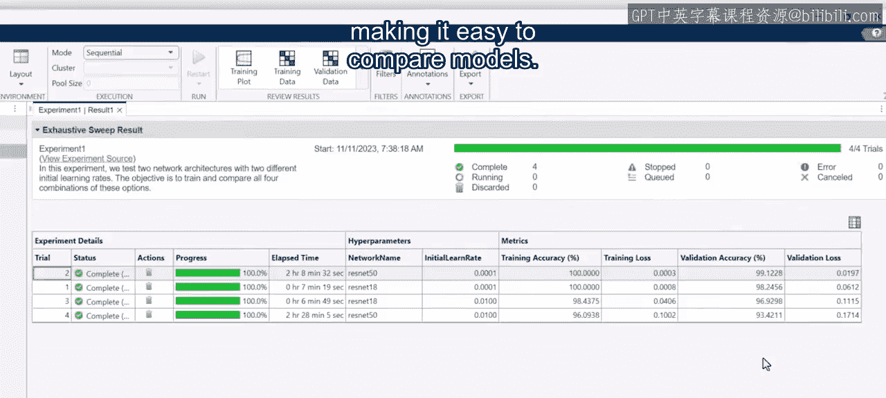

一旦你决定了模型，可以将其导出到工作区，以便将来使用。这样你就完成了。

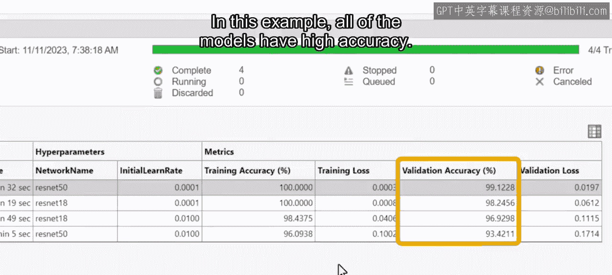

当你需要改变多个参数时，实验管理器应用是一个很好的工具。它保存了所有选项和参数值，因此你可以更容易地比较结果并记录你的工作。你还可以导出训练好的模型和结果，以供进一步使用和分析。

本视频中使用的设置函数随课程文件提供。可以将其作为训练和比较模型的起点。

---

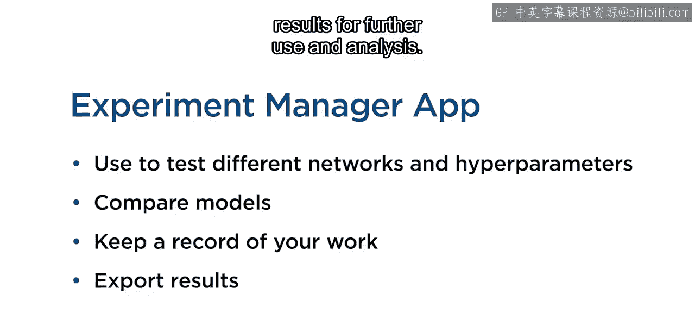

**本节课总结**

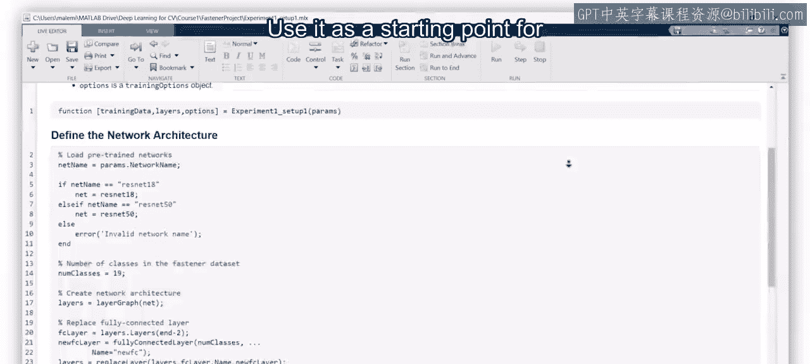

在本节课中，我们一起学习了如何使用 MATLAB 实验管理器来系统化地训练和比较深度学习模型。我们了解了如何定义超参数、编写设置函数来构建网络、准备数据并指定训练选项，以及如何利用实验管理器的界面来监控进度、分析结果并导出最佳模型。这种方法极大地简化了超参数调优和模型比较的过程，提高了工作效率和可重复性。