# 深度学习在计算机视觉中的应用：11：最终项目-美国手语字母分类 🎯

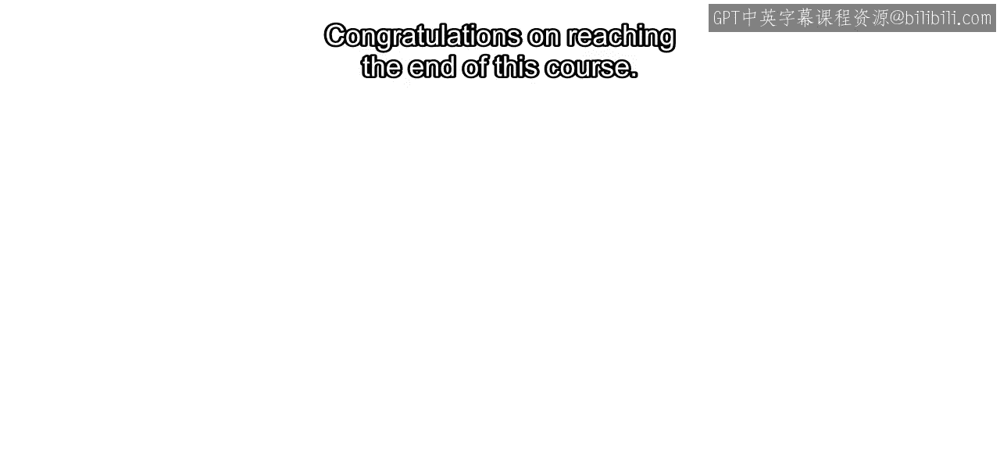

在本节课中，我们将学习如何完成一个完整的深度学习项目：对美国手语字母图像进行分类。我们将回顾从数据准备到模型评估的整个流程，并将其应用于一个具体的实践任务。

## 概述

恭喜你完成本课程的学习。从紧固件到交通标志，你已经了解了卷积神经网络是如何为图像分类任务而设计、训练和评估的。

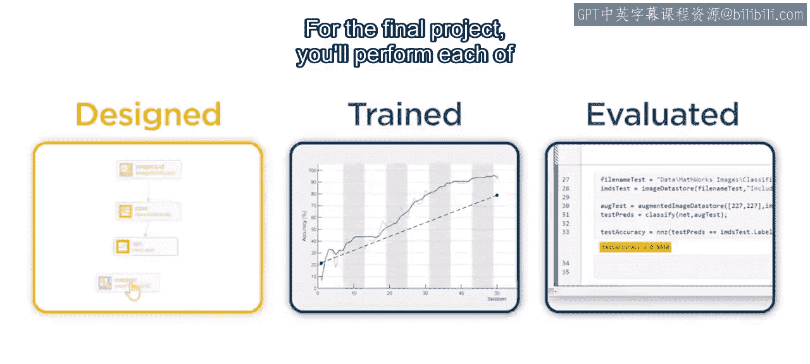

在最终项目中，你将亲自执行这些步骤，对**美国手语字母**的图像进行分类。

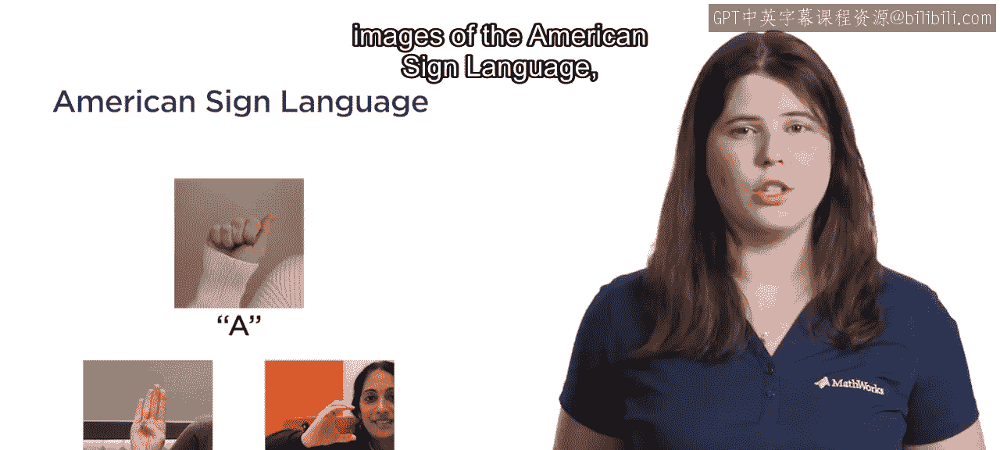

## 项目简介

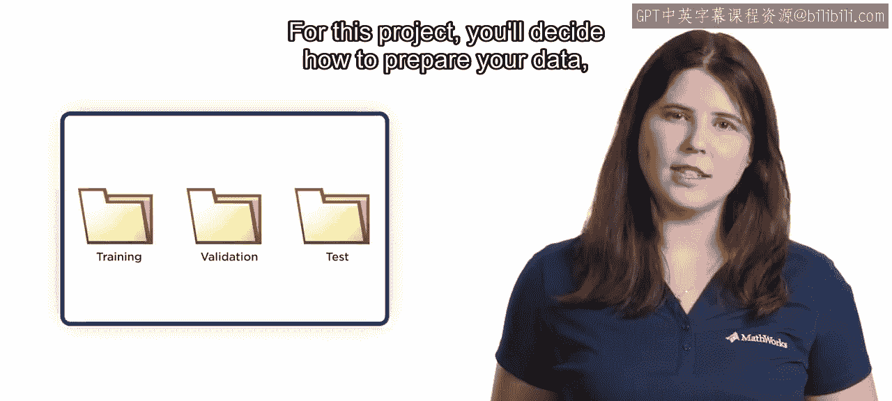

对于这个项目，你需要决定如何准备数据、选择最佳的模型选项、执行训练并评估你的最终模型。

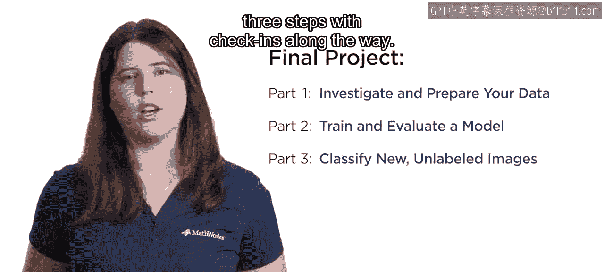

为了帮助你按部就班地完成，我们将项目分成了三个步骤，并在过程中设置了检查点。

## 项目步骤详解

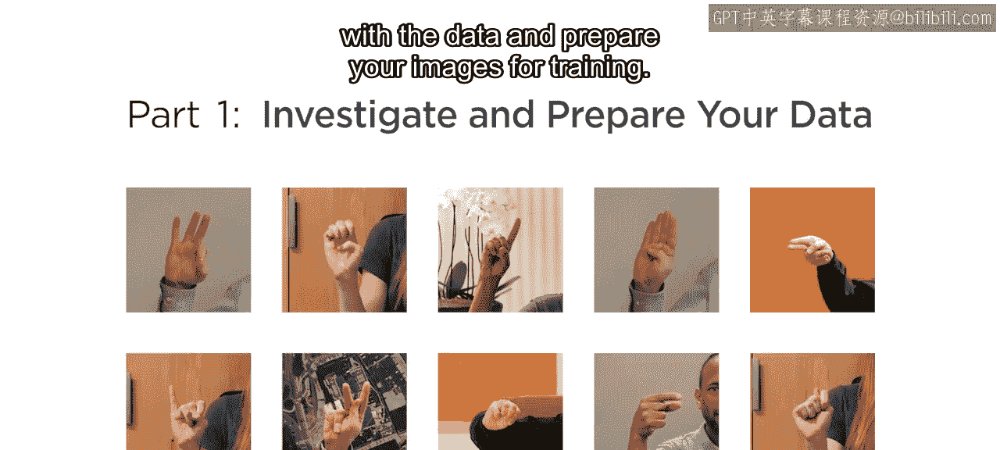

### 第一步：数据熟悉与准备 📊

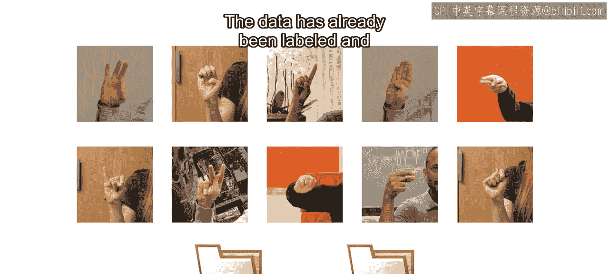

在第一步中，你需要熟悉数据并为训练准备图像。

数据已经预先标注好，并分割为训练集和测试集。

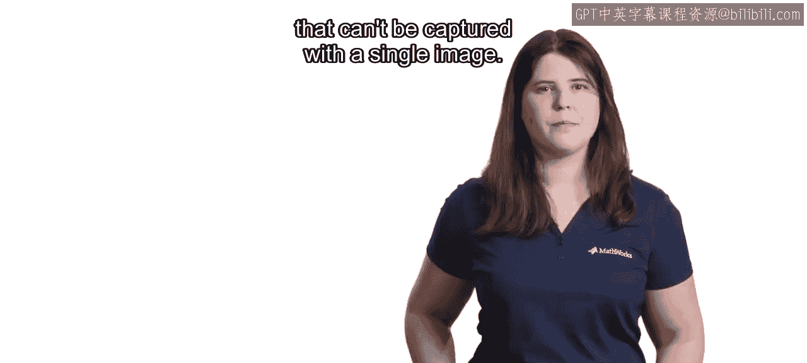

以下是关于数据集的重要信息：
*   英语字母表有26个字母，但数据集中只有24个类别。
*   我们排除了字母 **J** 和 **Z**。
*   排除的原因是，这两个字母需要手部运动，无法用单张静态图像来捕捉。

### 第二步：模型训练与评估 🤖

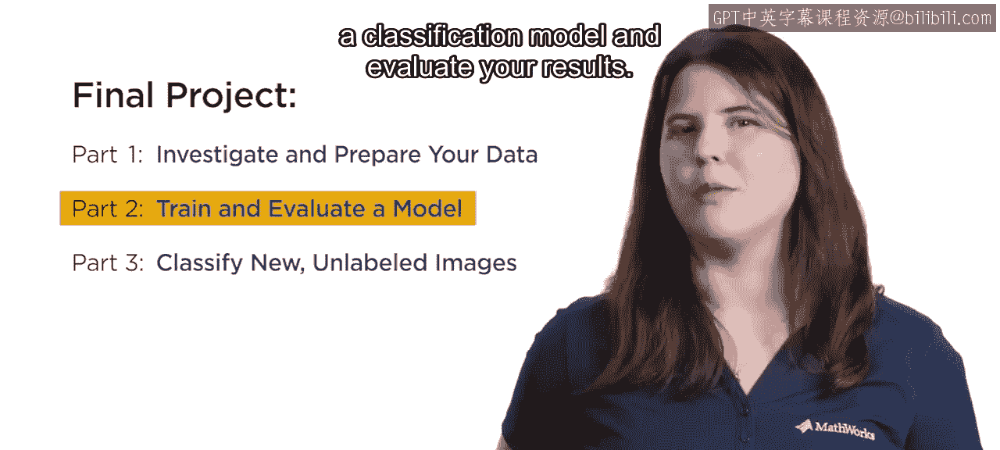

在第二步中，你将训练一个分类模型并评估结果。

请记住，开发深度学习模型是一个迭代过程。这个项目有许多可能的解决方案，鼓励你尝试多种方法。

你可能需要识别并解决常见的训练问题。务必使用预留的测试数据来评估你的最终模型。

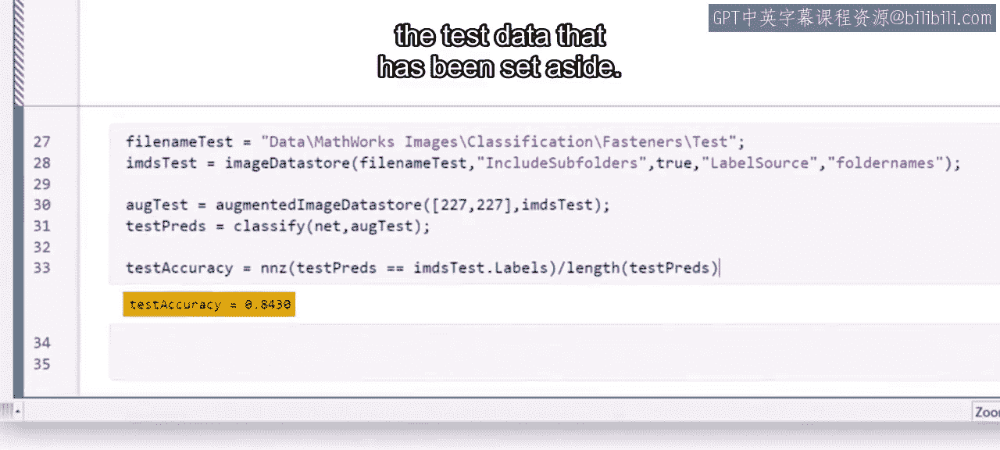

分析结果可以深入了解模型的性能。例如：
*   你的模型是否混淆了相似的字母？
*   当使用者使用左手时，模型能否正确分类字母？

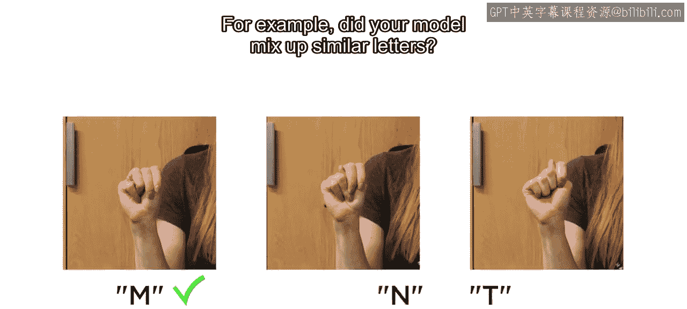

### 第三步：模型应用与翻译 ✍️

在第三步中，你将应用训练好的模型来翻译一系列新的、未标注的图像，从而形成一个短句。

请务必按顺序完成每个步骤的评估。我们鼓励你进行多次尝试，直到通过为止。

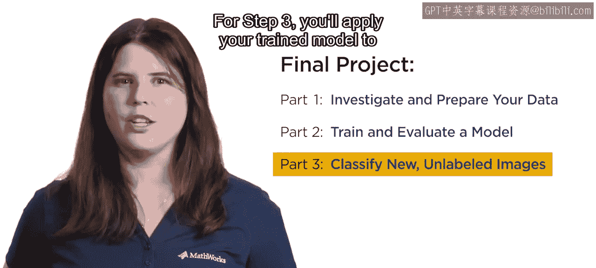

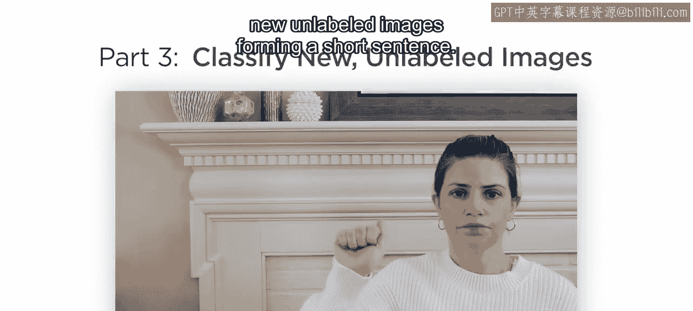

这能确保你在进入下一步之前走在正确的轨道上。

## 项目思考与讨论

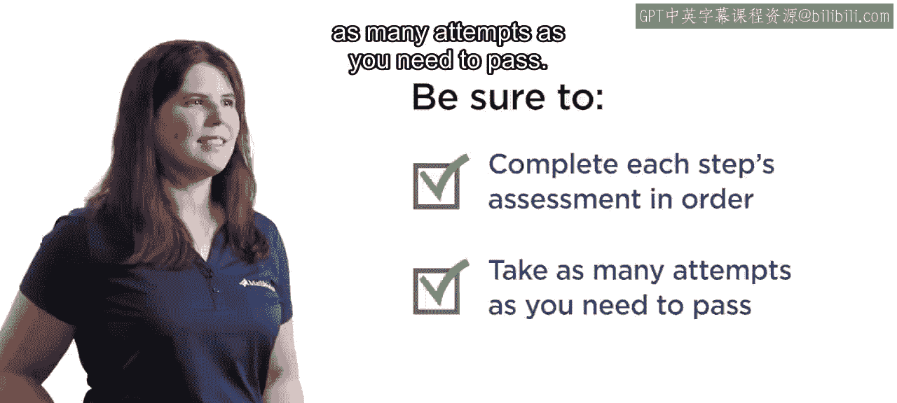

在训练模型时，请考虑它们最有用的应用场景。

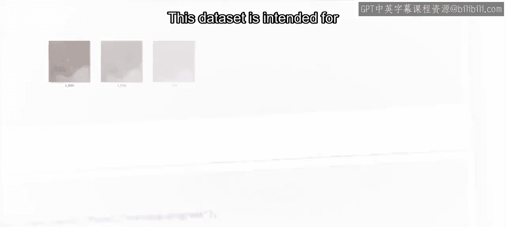

这个数据集主要用于教学目的，因此有其局限性。请思考它的适用性。要训练一个更具泛化能力的模型，你可能还需要什么？

如果你有任何问题或发现了有趣的结果，记得在论坛上分享。祝你好运！

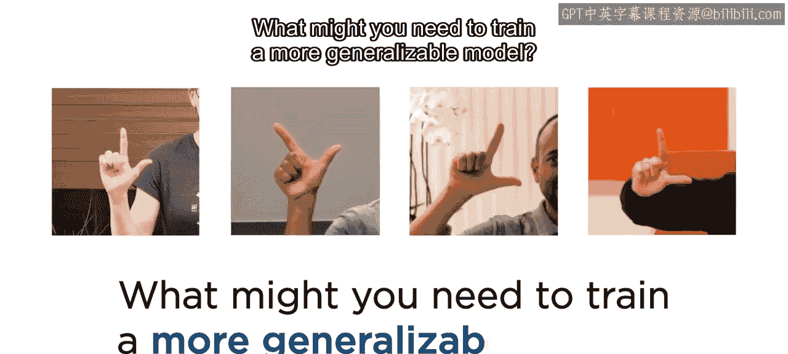

## 总结

本节课中，我们一起学习了如何规划并执行一个完整的深度学习项目，即美国手语字母分类。我们回顾了项目的三个核心步骤：数据准备、模型训练与评估，以及最终的模型应用。通过这个实践项目，你将巩固对卷积神经网络在图像分类中应用的理解。