# 深度学习在计算机视觉中的应用：13：课程总结 🎯

在本节课中，我们将对第一门课程的核心内容进行总结，并回顾在训练图像分类网络时需牢记的关键要点。同时，我们也将展望下一门课程——目标检测——将带来的新挑战与技能。

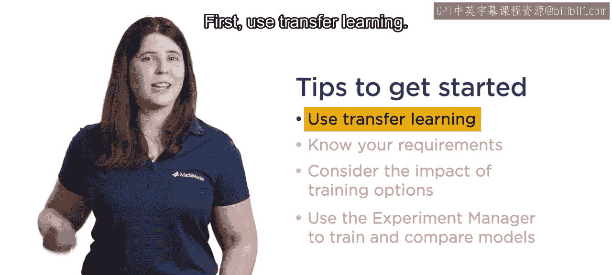

## 概述

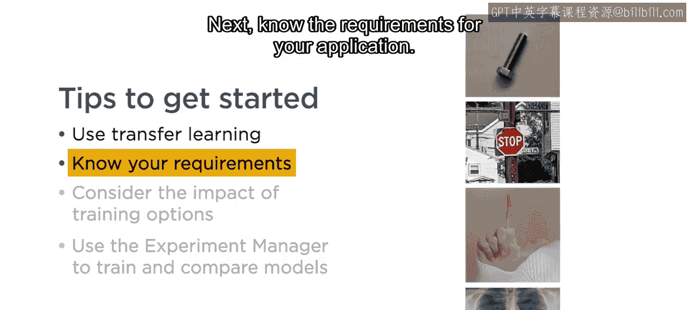

恭喜你成功完成了本课程的学习。现在，你已经掌握了为你的具体应用训练图像分类网络的技能。

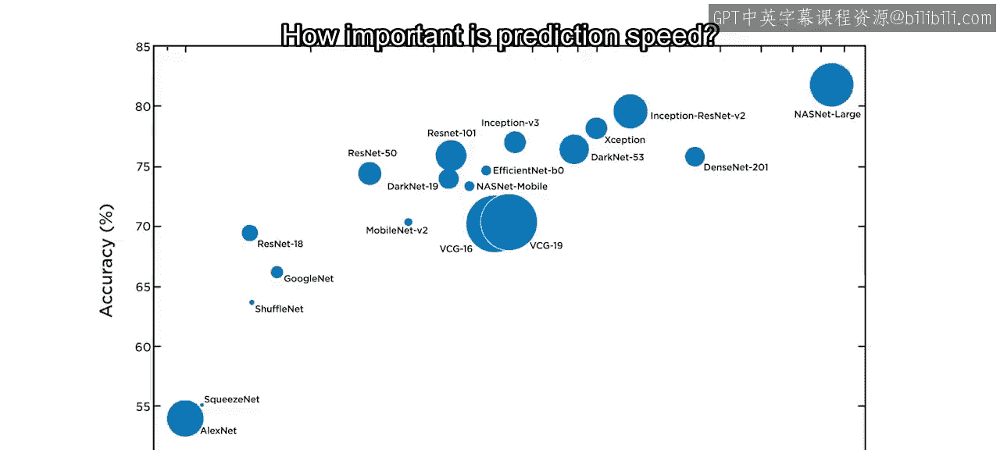

## 项目启动要点

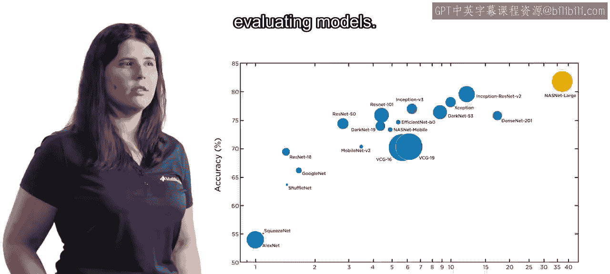

在开始你自己的项目时，请记住以下几个关键建议。

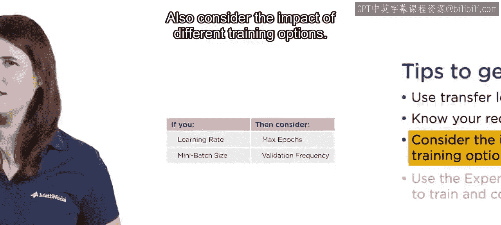

以下是几个核心建议：

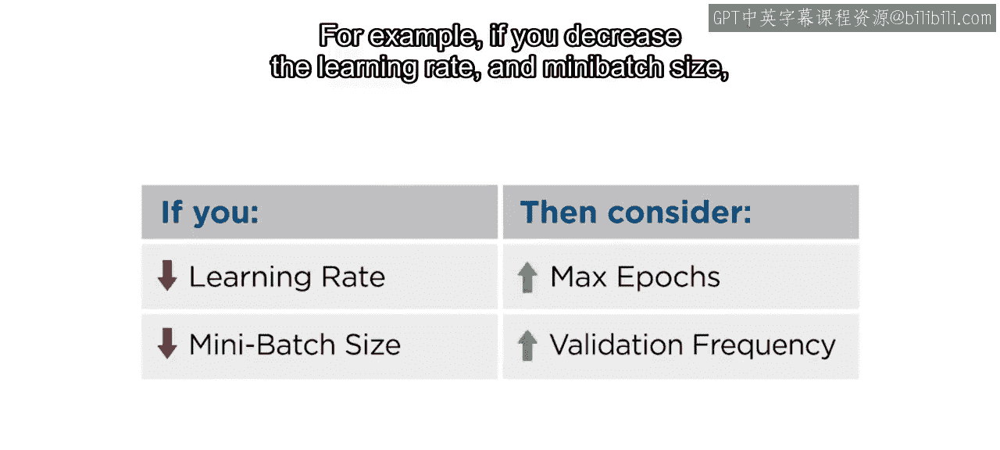

*   **使用迁移学习。** 利用预训练模型可以为你节省宝贵的时间和计算资源。
*   **明确应用需求。** 你需要多高的准确率？预测速度有多重要？是否存在内存限制？明确这些需求将帮助你在训练和评估模型时做出明智的决策。
*   **考虑不同训练选项的影响。** 例如，如果你降低了学习率并增大了批量大小，你可能需要相应地增加最大训练轮数和验证频率。即使对于专家而言，找到最佳参数也需要反复试验。
*   **利用实验管理器。** 实验管理器应用程序可以帮助你记录所有训练过的模型、比较结果，并将它们导出以供进一步使用。

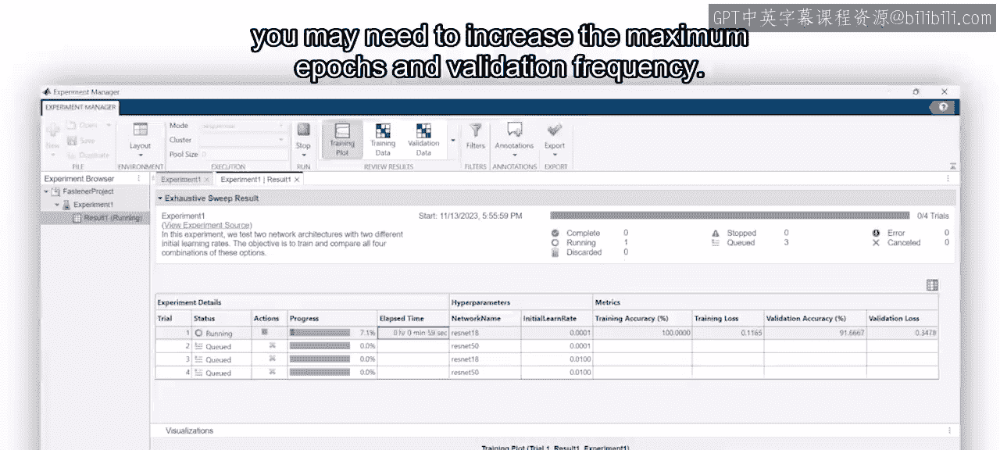

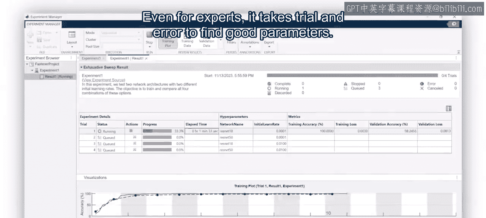

## 迈向下一阶段：目标检测

上一节我们总结了图像分类的关键技巧，本节中我们来看看计算机视觉的另一个核心任务。

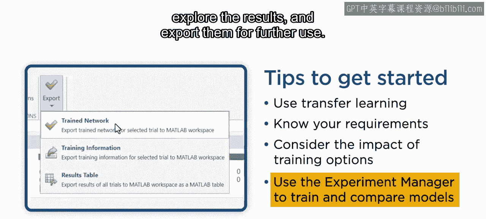

你已经成功训练了图像分类模型，但如果你需要在图像中定位物体呢？

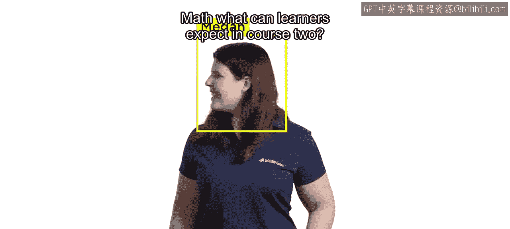

目标检测是计算机视觉中最常见的应用之一。检测模型不仅要对图像中的物体进行分类，还要定位它们的位置。

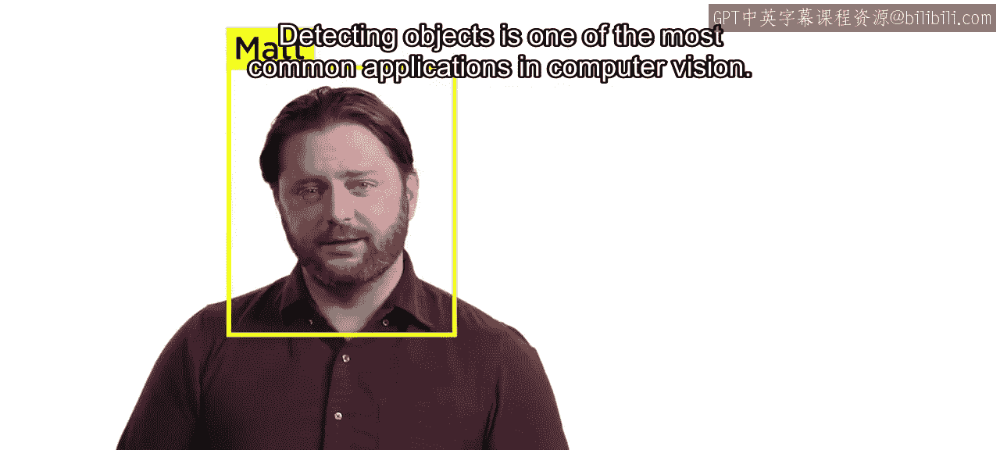

因此，你的数据集现在必须包含图像、物体对应的边界框以及标签。正因为如此，为目标检测准备数据以及评估结果需要额外的工作。

好消息是，你仍然可以使用迁移学习，并且MATLAB包含了相应的函数来为你完成大部分繁重的工作。

## 总结

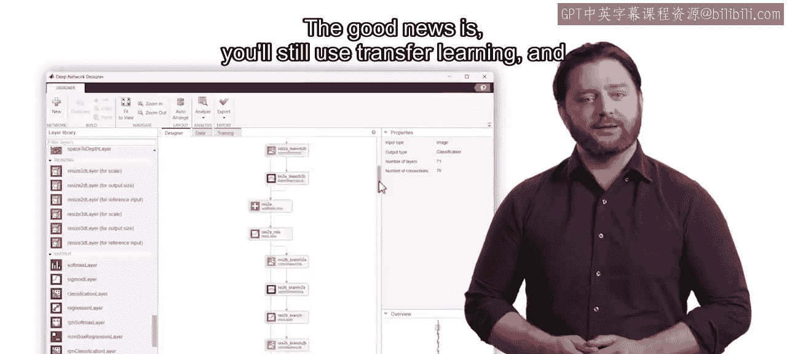

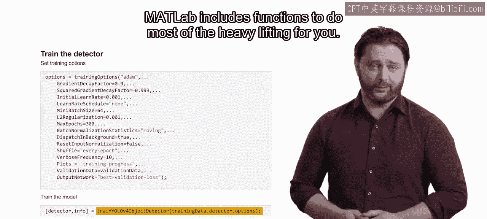

本节课中，我们一起回顾了训练图像分类网络的核心技巧，包括使用迁移学习、明确需求、调整超参数以及利用实验管理工具。同时，我们也了解到，在下一门课程中，我们将学习如何为目标检测任务准备数据并构建模型，从而为你的计算机视觉技能库增添强大的新工具。

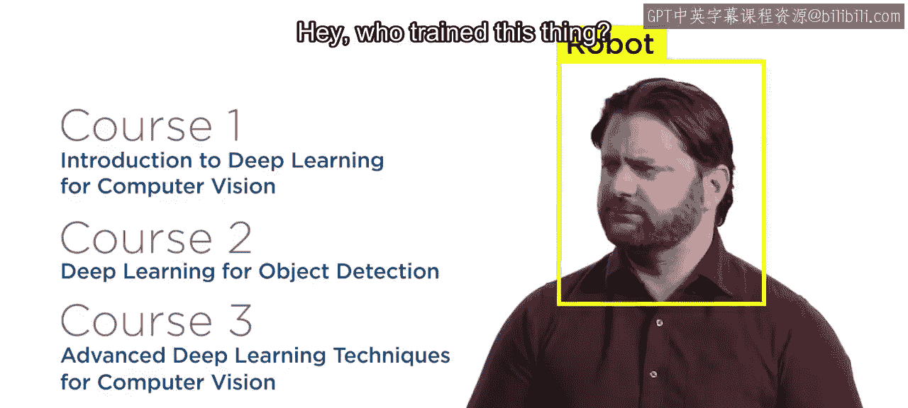

那么，请加入我们的第二门课程，学习如何将目标检测添加到你的计算机视觉技能集中。