# 深度学习在计算机视觉中的应用：14：课程概述


在本节课中，我们将要学习MathWorks在Coursera平台上推出的《深度学习在计算机视觉中的应用》系列课程的核心内容。该系列课程共分为三部分，旨在帮助工程师和科学家掌握如何利用深度学习技术处理图像和视频数据，以解决实际问题。

## 🚗 计算机视觉的广泛应用

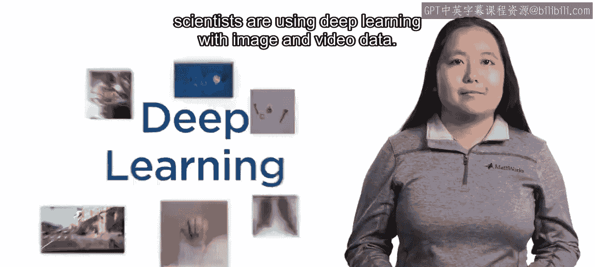

定位汽车和行人、发现缺陷产品以及诊断疾病，仅仅是工程师和科学家利用深度学习处理图像和视频数据的几个例子。

## 📚 课程一：深度学习基础与图像分类

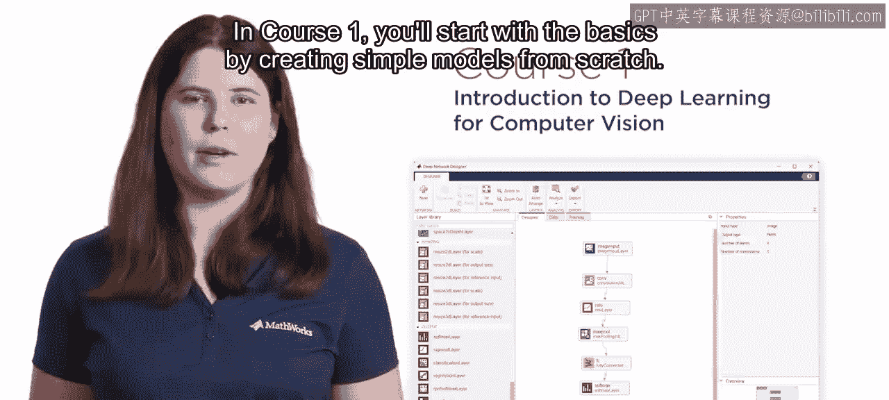

上一节我们看到了深度学习的应用场景，本节中我们来看看课程一的具体内容。

在课程一中，你将从基础开始，学习如何从零开始创建简单的模型。

随后，你将采用专家创建的模型，并应用一种名为**迁移学习**的技术，为新的应用场景重新训练这些模型。其核心思想可以概括为：
```
新模型 = 预训练模型 + 新数据微调
```

你还需要评估模型的性能，并调整关键参数以改进模型。

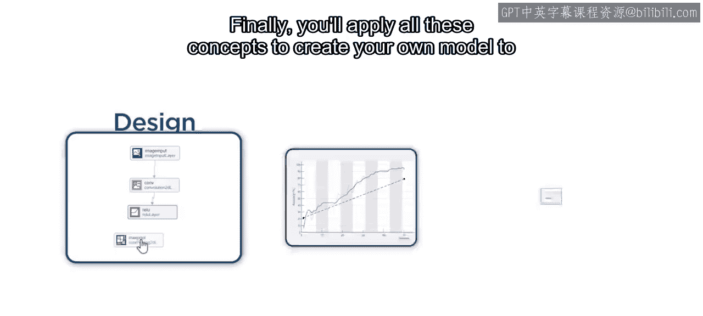

最后，你将应用所有这些概念，创建你自己的模型，用于对美国手语字母表的图像进行分类。

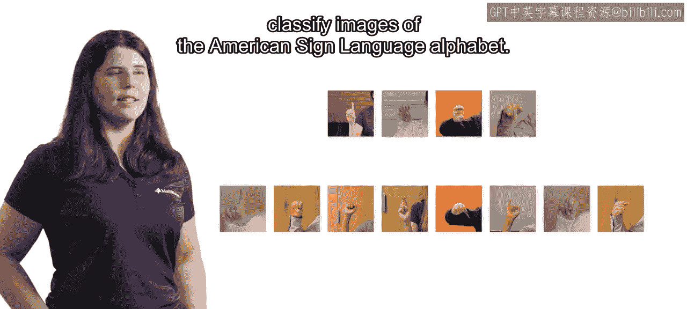

## 🎯 课程二：目标检测

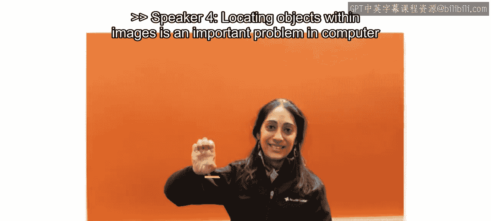

在掌握了图像分类之后，本节我们将进入更复杂的任务：目标检测。

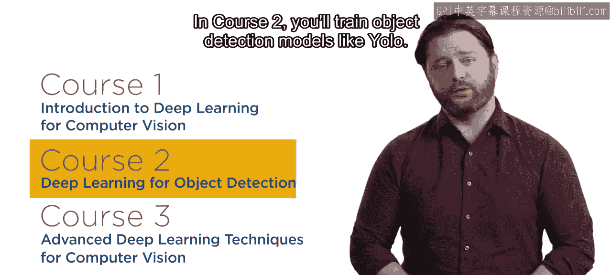

在图像中定位对象是计算机视觉中的一个重要问题。

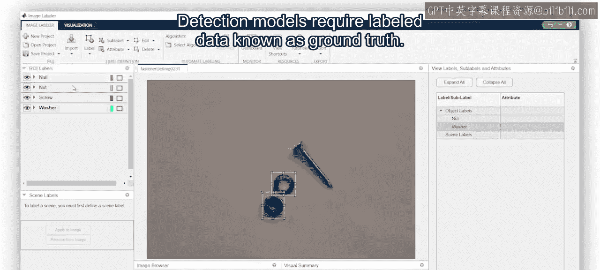

在课程二中，你将训练如**YOLO**这样的目标检测模型。

检测模型需要一种称为**真实标签**的标注数据。

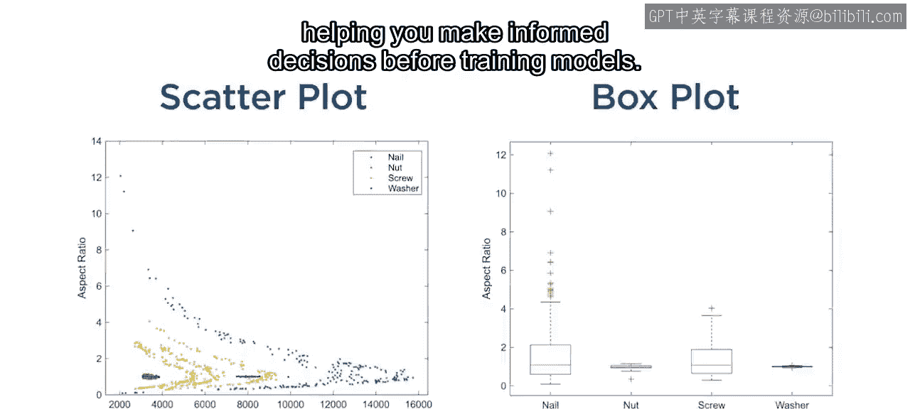

以下是真实标签数据通常包含的内容：
*   **边界框**：标出图像中对象的位置。
*   **标签**：定义边界框内对象的类别。

你将学习标注图像并分析真实标签数据，这有助于你在训练模型前做出明智的决策。

评估检测模型较为复杂，因为模型必须为每个对象正确分配标签和位置。你将练习评估多个模型，从而为你的应用选择最佳方案。

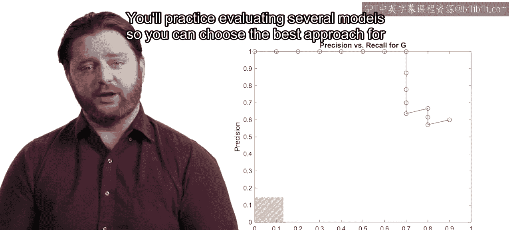

## ⚙️ 课程三：高级技术与挑战应对

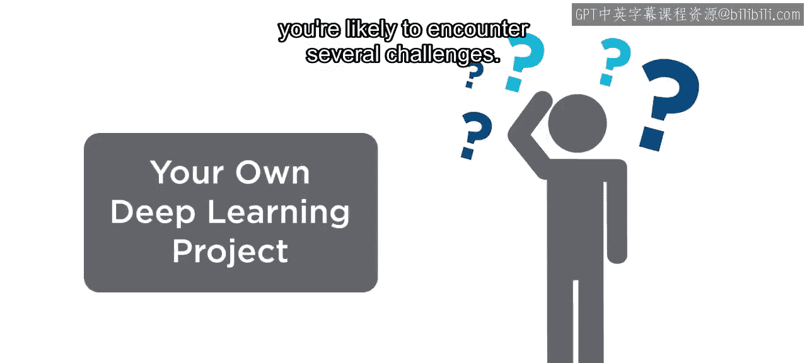

当你开始自己的深度学习项目时，很可能会遇到一些挑战。本节我们将探讨课程三如何帮助你解决这些问题。

在课程三中，你将学习解决常见问题并训练专用模型的技术。

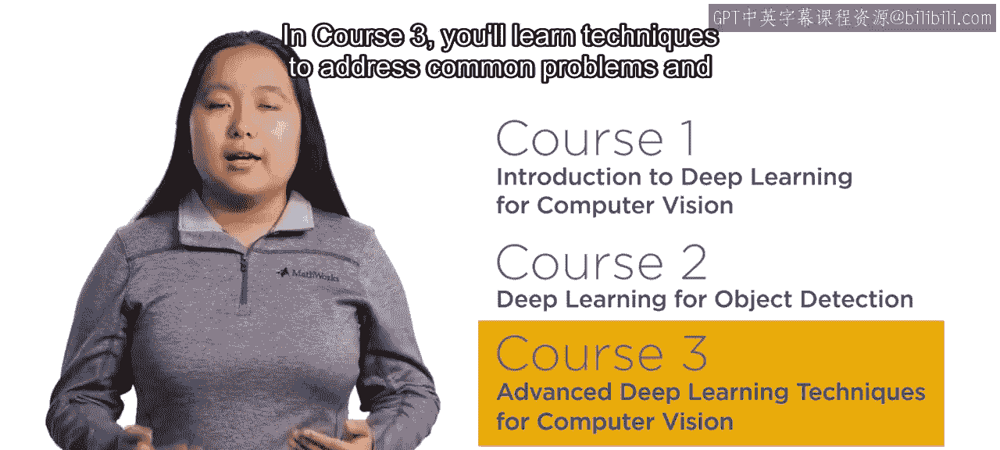

例如，收集图像可能既昂贵又耗时。

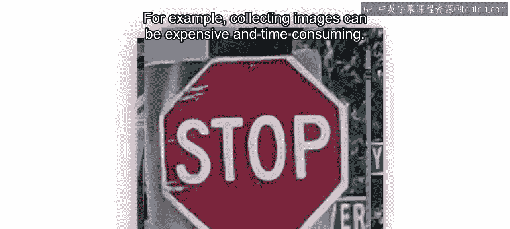

**数据增强**是当你数据有限时，用于改善结果的强大工具。其基本方法包括对图像进行随机变换，如：
*   旋转
*   翻转
*   缩放
*   改变亮度/对比度

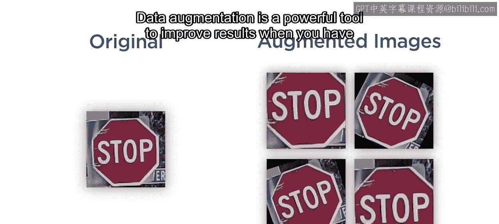

或者，也许你有成千上万的图像需要标注。你将使用**AI辅助标注**来帮助标注图像，从而节省大量手动劳动时间。

你还将创建**异常检测模型**，这类模型常用于制造业和医疗应用。

## 🚀 总结与展望

随着摄像头被集成到更多设备中，对计算机视觉和深度学习技能的需求将持续增长。

本节课中我们一起学习了《深度学习在计算机视觉中的应用》三门系列课程的核心内容：从基础的图像分类，到复杂的目标检测，再到应对实际挑战的高级技术。通过加入这个系列课程，为你自己在这个快速发展的领域做好准备。

祝你好运。😊