# 深度学习在计算机视觉中的应用：15：课程概述与目标检测简介

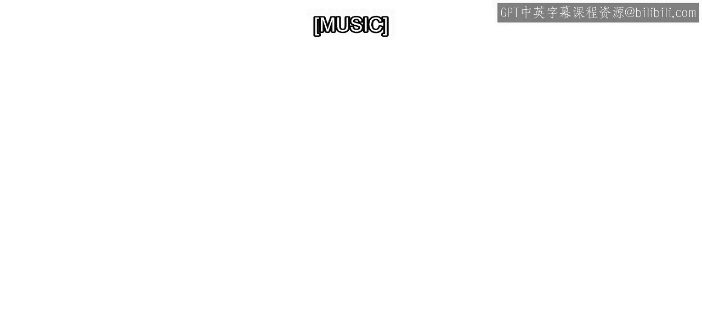

在本节课中，我们将要学习深度学习在目标检测领域的应用。目标检测是计算机视觉中的一项核心技术，它不仅能识别图像中的物体是什么，还能精确地定位它们的位置。我们将从基本概念入手，逐步了解其工作流程、数据准备、模型训练与评估方法。

## 什么是目标检测？

上一节我们介绍了课程的整体安排，本节中我们来看看目标检测的基本定义。

目标检测是一种在图像或视频帧中识别并定位物体的技术。

与图像分类不同，图像分类的重点是将整张图像归入一个类别。

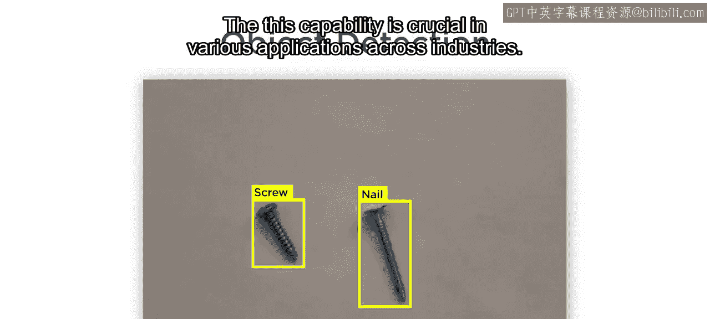

对于目标检测而言，其目标是在给定图像中精确地定位并识别出每一个独立的物体。

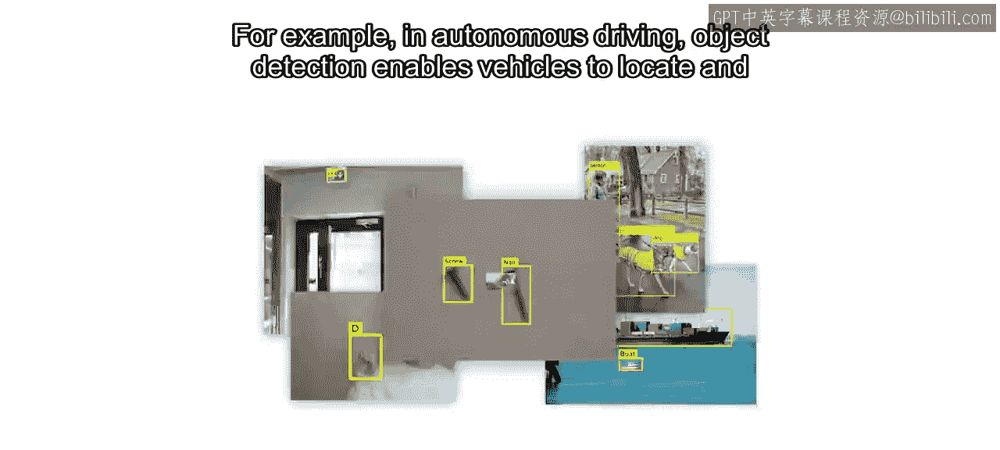

这项能力在各行各业的应用中至关重要。

## 目标检测的应用

以下是目标检测技术的一些关键应用场景。

例如，在自动驾驶领域，目标检测使车辆能够定位并识别出行人、其他车辆以及交通标志。

## 课程学习路径

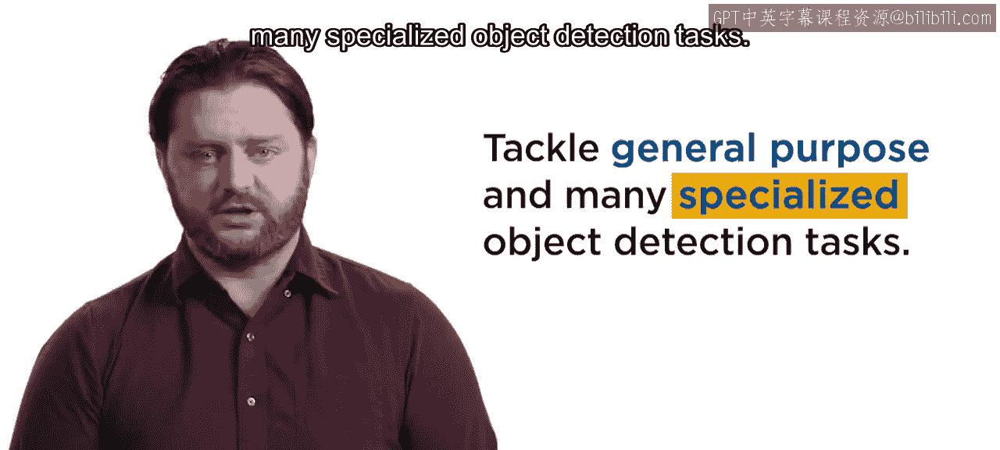

在本课程中，你将首先学习如何应用由专家构建并在海量数据集上预训练好的深度学习模型。

这将使你能够处理通用以及许多专业化的目标检测任务。

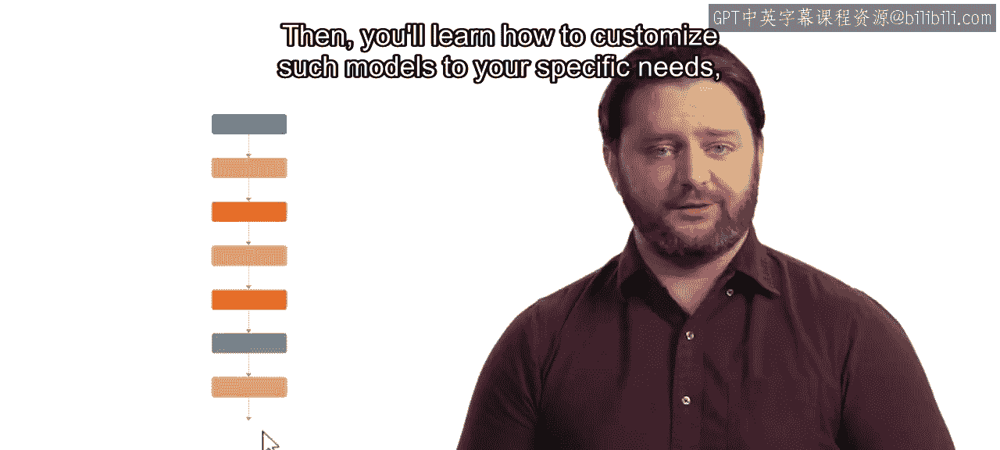

接着，你将学习如何通过**迁移学习**来定制这些模型，以满足你的特定需求。

你将了解大多数现代目标检测器的结构及其高层工作原理。

这将为理解使用深度学习训练目标检测器的整体工作流程打下基础。该流程包括：
*   数据标注
*   数据分析与预处理
*   网络选择与训练
*   性能评估

## 数据准备与分析

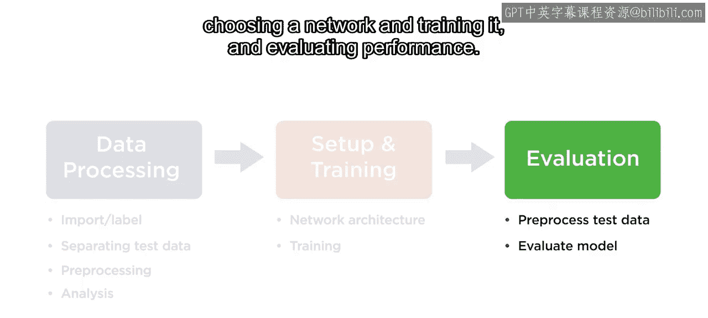

你将创建自己的目标检测数据，也称为**真实标注**，方法是使用一个应用程序高效地为图像添加带标签的边界框。

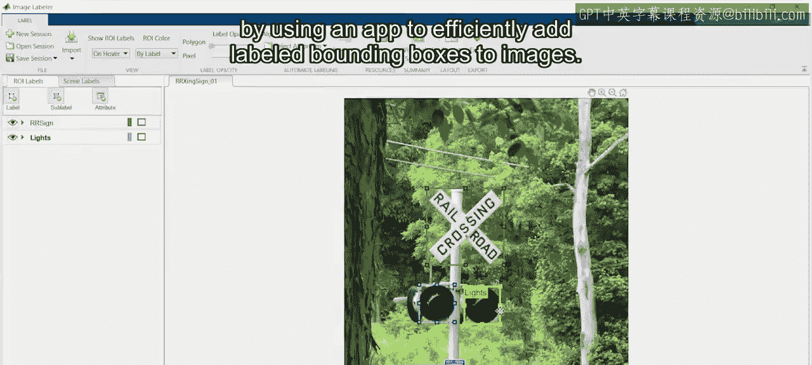

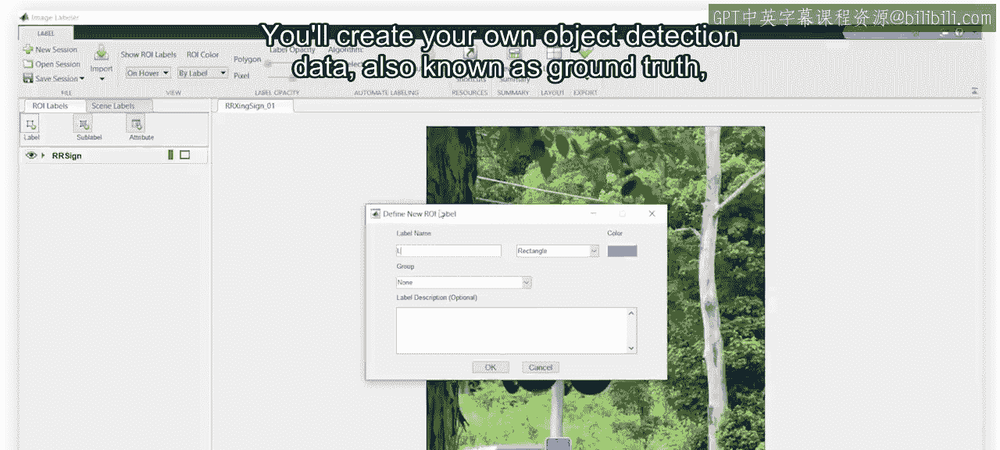

你还将分析真实标注数据，以确定物体类别、面积和宽高比的分布情况。

这些信息将有助于你选择模型类型、参数和训练选项。

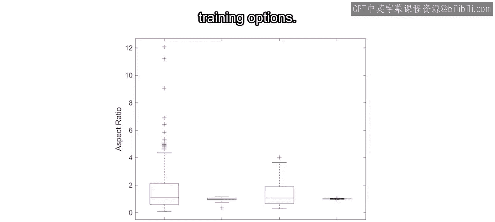

## 模型定制与评估

然后，你将练习模型设置和迁移学习。

这将使你能够将 MATLAB 中的任何检测模型架构定制到你的应用程序中。

当然，检查结果是否足够好是必要的。

这比分类任务更复杂，因为你需要同时检查物体的标签和定位是否准确。

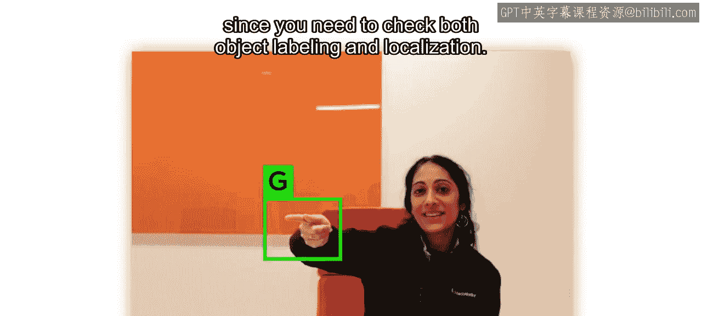

你将学习评估检测器所需的技术。

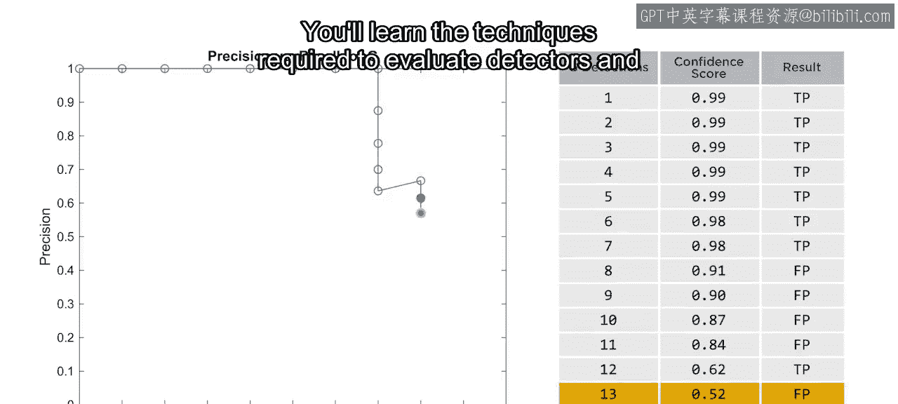

并练习使用这些技术来量化模型性能。当确实需要改进模型时，你将了解常见问题及其解决方法。

## 课程总结与项目实践

最后，你将运用所有这些技能来完成一个目标检测项目。

让我们开始吧。

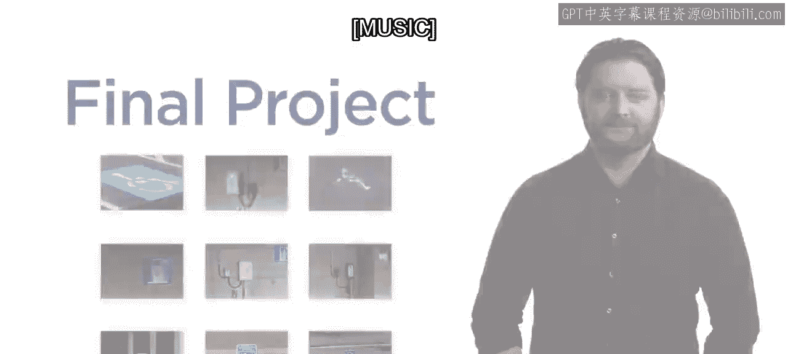

本节课中我们一起学习了目标检测的基本概念、重要应用以及本课程的核心学习路径。我们了解到，目标检测不仅关乎识别，更关乎精确定位，其工作流程涵盖数据准备、模型训练与性能评估等多个关键环节。在接下来的课程中，我们将深入每个环节进行实践。