# 深度学习在计算机视觉中的应用：16：卷积神经网络的目标检测入门

在本节课中，我们将要学习目标检测的基本概念，特别是基于卷积神经网络的目标检测模型是如何工作的。我们将了解其核心架构、关键组件以及选择模型时需要考虑的技术因素。

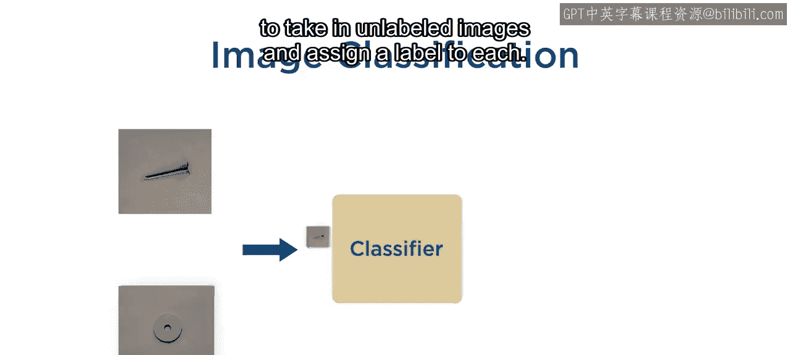

## 图像分类与目标检测的目标

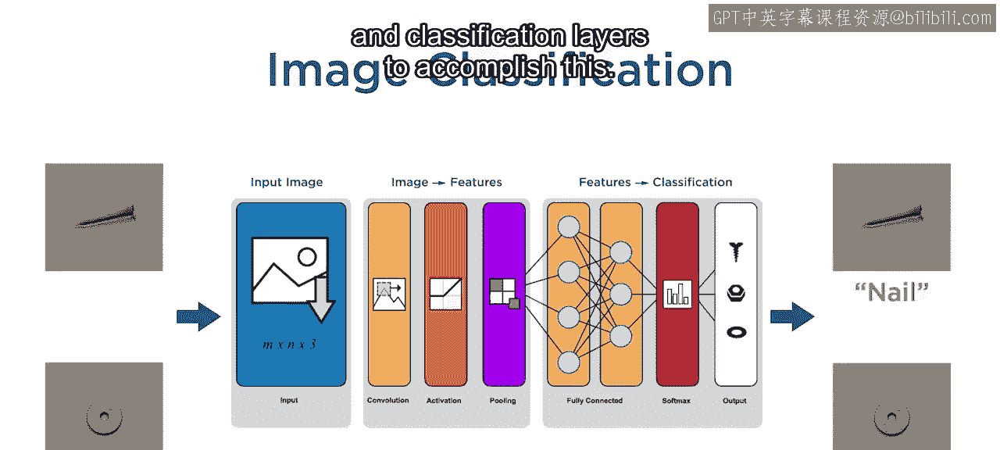

上一节我们介绍了图像分类模型。回忆一下，图像分类模型的目标是接收未标记的图像，并为每张图像分配一个类别标签。

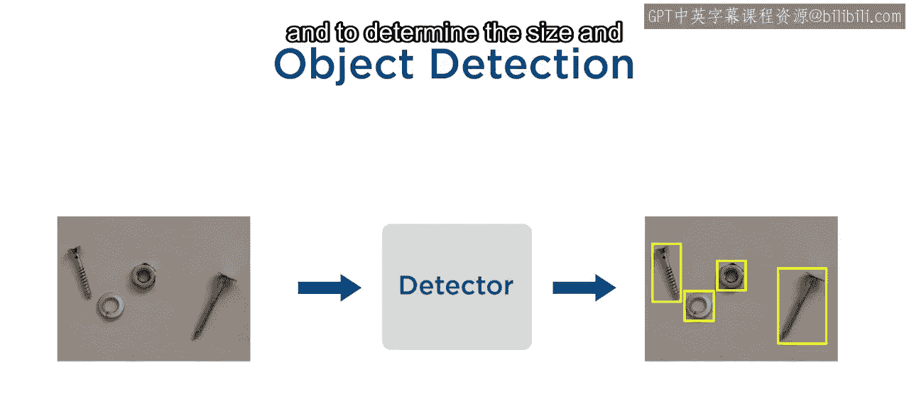

基于卷积神经网络的分类器，使用一个由输入层、特征提取网络和分类层组成的序列来完成这个任务。

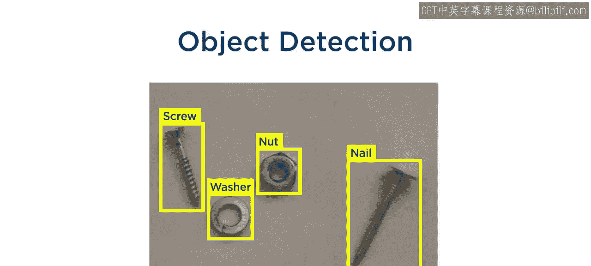

对于目标检测，其目标是接收可能包含多个感兴趣物体的未标记图像，并确定每个物体的**大小**和**位置**。

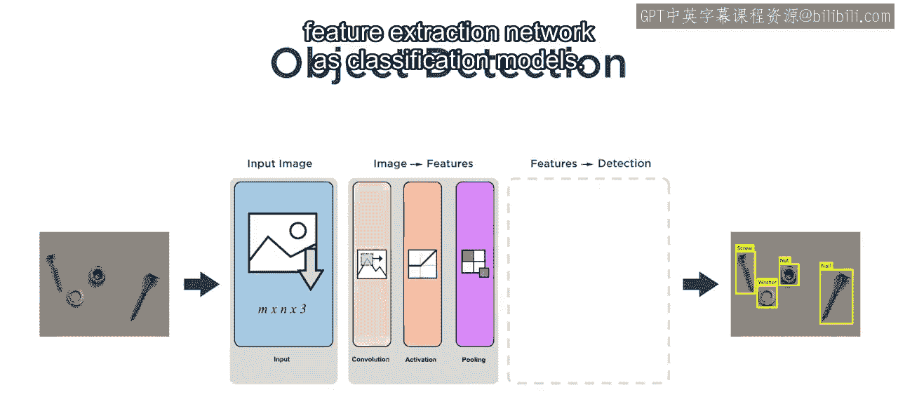

以及每个物体的**类别标签**。

## 目标检测模型的核心架构

为了实现这一目标，基于CNN的目标检测模型使用了与分类模型相同的输入层和特征提取网络序列。

这个从输入到特征的序列，在目标检测模型中被称为**骨干网络**。

除了骨干网络，目标检测模型通常还使用一对被称为**颈部**和**头部**的网络，来将特征转换为检测结果。颈部通常涉及聚合从骨干网络中多个尺度提取的特征的操作，这有助于检测更大尺寸范围内的物体。

头部负责产生目标检测结果，即每个物体的**边界框**和**类别标签**。这些网络的具体细节可能非常复杂，并且在不同类型的检测模型之间差异很大。

不过不用担心，在使用现有模型类型（或称检测框架）时，你不需要了解颈部和头部的所有细节。相反，你只需要关注几个关键点。

## 选择检测框架的关键考量

以下是选择和使用目标检测框架时需要关注的几个关键方面：

1.  **使用的骨干网络**：不同的骨干网络可以在同一框架内使用。
2.  **颈部与骨干网络的连接点数量和位置**：颈部和头部在骨干网络上的连接点。
3.  **是否使用锚框**：许多检测框架使用锚框来提高速度和效率。

正是颈部和头部的架构定义了一个检测框架。

### 骨干网络与多尺度特征

一个典型的骨干网络在特征提取部分包含许多层，其中包含几个下采样层。例如，池化层会将特征图的子区域进行聚合。

颈部通常从骨干网络的多个尺度提取特征。这些在骨干网络中的位置通常被称为**颈部或头部连接点**。

由于下采样，骨干网络中更深的层基于输入图像中更大的区域来提取特征。通常，这意味着更大的物体更适合用骨干网络更深处的头部连接点来检测；类似地，更小的物体则更适合用骨干网络较浅处的头部连接点来检测。

在不同深度设置多个连接点，有助于改善网络能有效检测的物体尺寸范围。然而，除了需要一个更深的骨干网络外，这可能会增加颈部和头部的复杂性，从而带来更大的计算负担。因此，如果你预期的物体尺寸范围较窄，一个更简单的检测框架可能是更好的选择。

### 锚框的作用

除了骨干网络的选择以及头部连接点的数量和位置，另一个需要关注的关键点是**锚框**的使用。

锚框是预定义的、具有各种尺寸和宽高比的框，它们作为图像中潜在物体的参考。它们是基于可用的真实标注数据生成的。我们将在本课程后面介绍如何从真实标注数据中估算一组锚框。

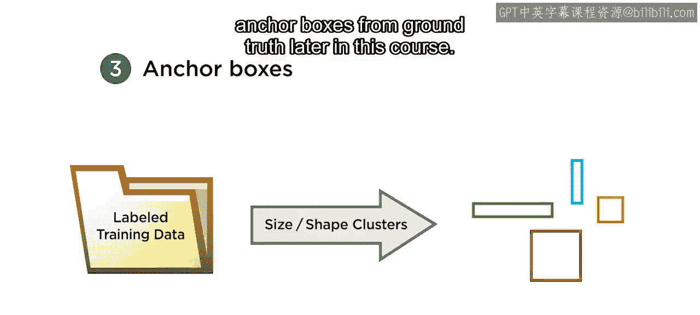

使用锚框的检测器并不直接寻找物体并预测边界框。

相反，它们预测的是锚框网格最可能的类别标签和坐标调整。

在目标检测过程中，模型将锚框以不同的位置和尺度放置在图像上。

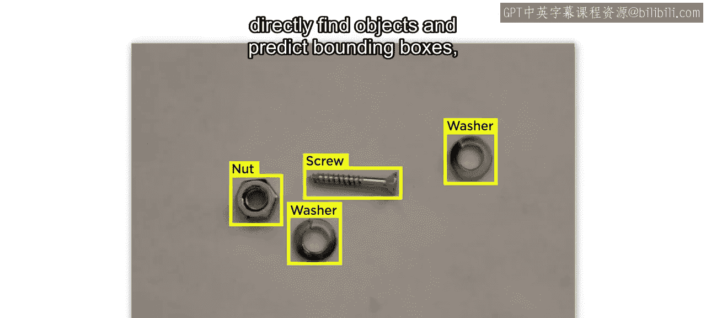

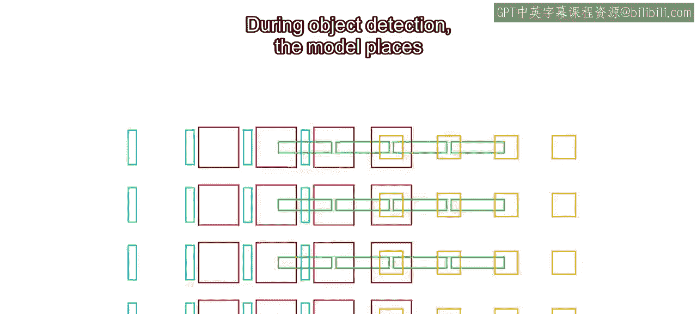
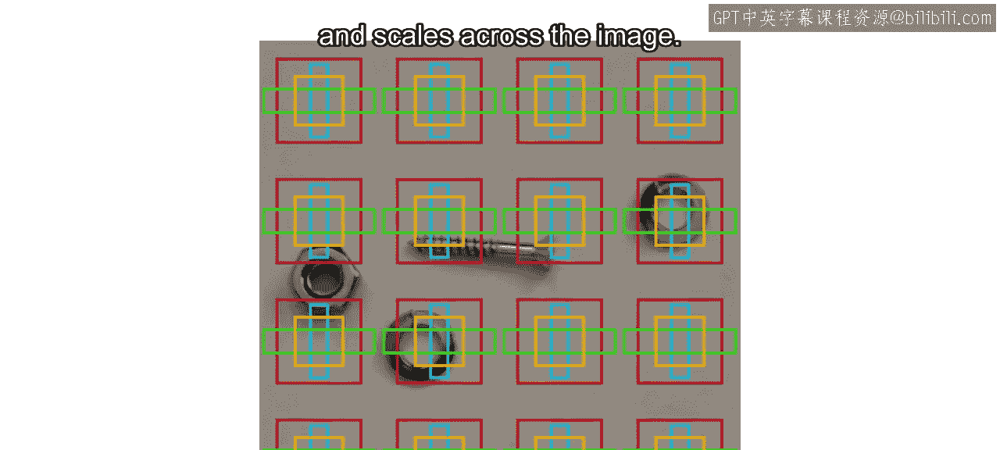

对于每个锚框，模型预测其包含每个类别物体的概率，并选择最可能的类别标签。模型还对每个锚框执行**边界框回归**，调整框的坐标以更好地定位物体。

然后，应用后处理步骤来移除低于检测阈值的、冗余的或重叠的检测结果。

## 其他实用考量

现在你已经了解了选择和使用目标检测框架时的关键技术考量，可能还需要考虑以下几点：

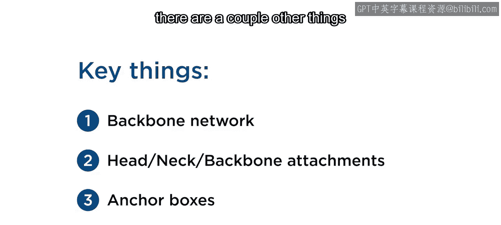

你可能还需要考虑你所在行业中，同事和客户正在使用或可以获得哪些框架。其他人对该框架的熟悉程度如何？

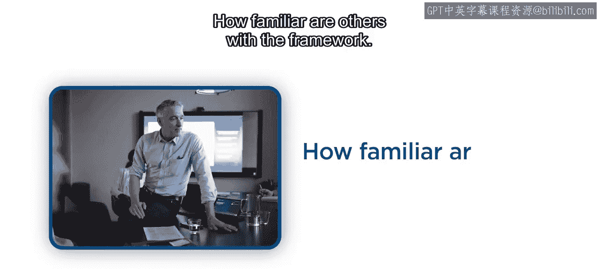

此外，该框架在你的应用领域已经被证明有多可靠和值得信赖？

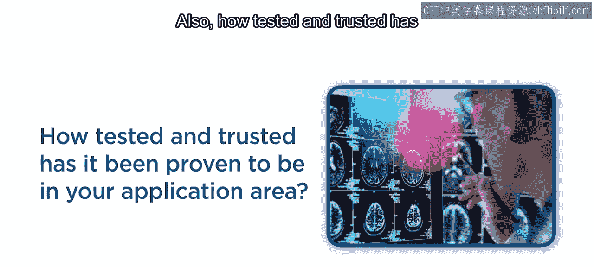
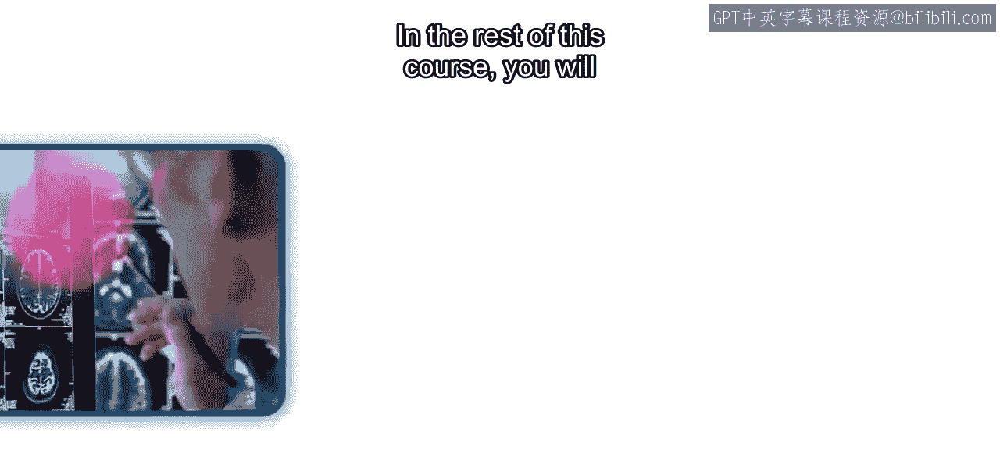

## 课程后续内容

在本课程的其余部分，你将重新审视并扩展本视频中看到的所有概念、组件和权衡。你还将在MATLAB中练习使用、评估和比较不同示例上的检测框架。

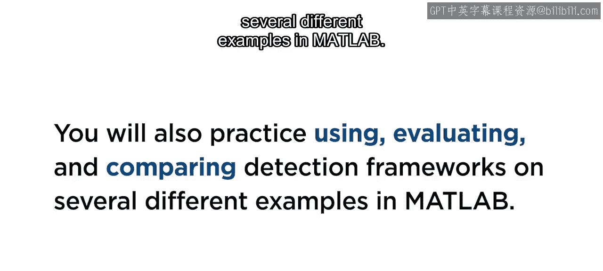

## 总结

本节课中我们一起学习了目标检测的基本原理。我们了解到，目标检测模型在图像分类的骨干网络基础上，增加了颈部和头部网络来定位和识别多个物体。关键的选择因素包括骨干网络类型、多尺度连接点的设计以及是否使用锚框。理解这些核心组件和权衡，是有效选择和应用目标检测框架的基础。