# 深度学习在计算机视觉中的应用：17：使用预训练的目标检测器 🎯

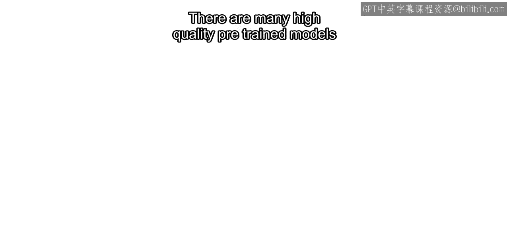

在本节课中，我们将学习如何利用现有的高质量预训练目标检测模型，来快速实现常见物体的检测任务，例如检测行人和车辆。我们将了解这些模型的来源、如何获取它们，并通过一个具体的代码示例来演示其使用方法。

---

有许多高质量的预训练模型可用于检测不同类别的常见物体。

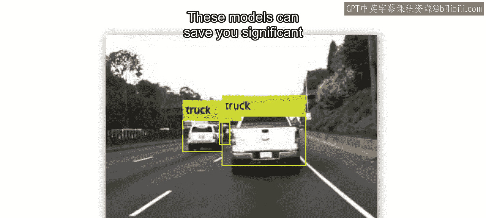

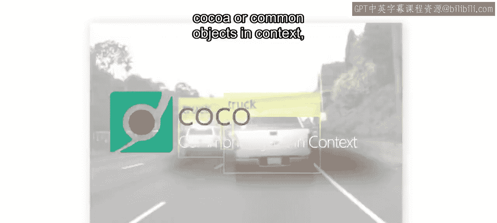

此外，还有为特定任务（如行人检测和车辆检测）定制的小型模型。

这些模型可以节省大量工作，因为它们是在非常庞大的基准数据集（如COCO）上训练的。

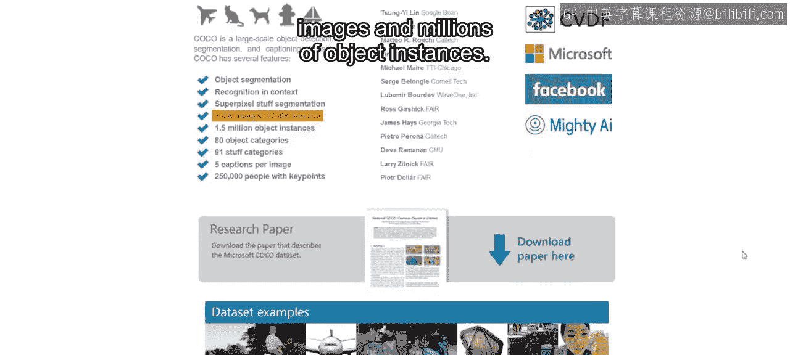

或者“上下文中的常见物体”数据集。该数据集包含超过20万张图像和数百万个物体实例。

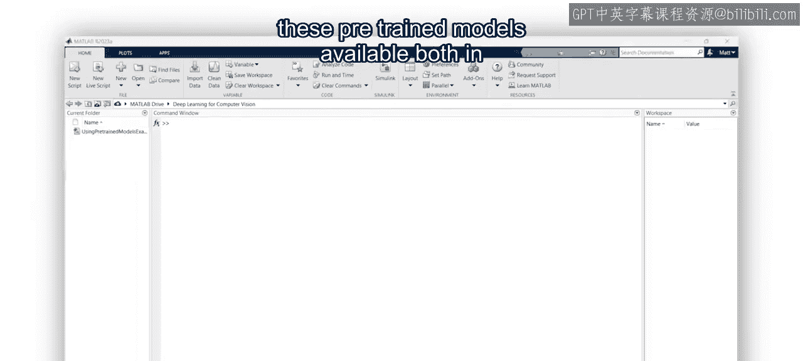

MathWorks提供了许多此类预训练模型。

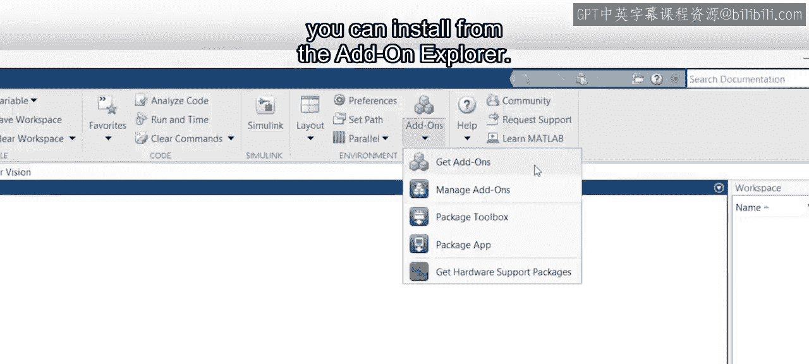

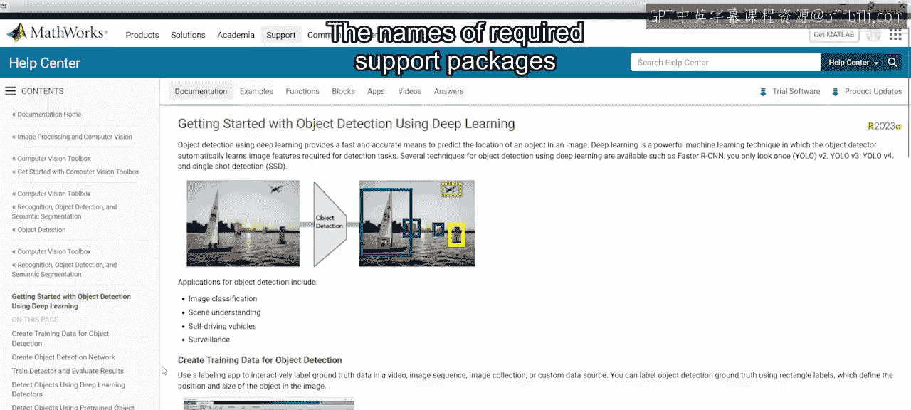

这些模型既存在于MATLAB中，也存在于附加功能中。

您可以从附加功能资源管理器中安装它们。

所需支持包的名称可在在线文档中找到。

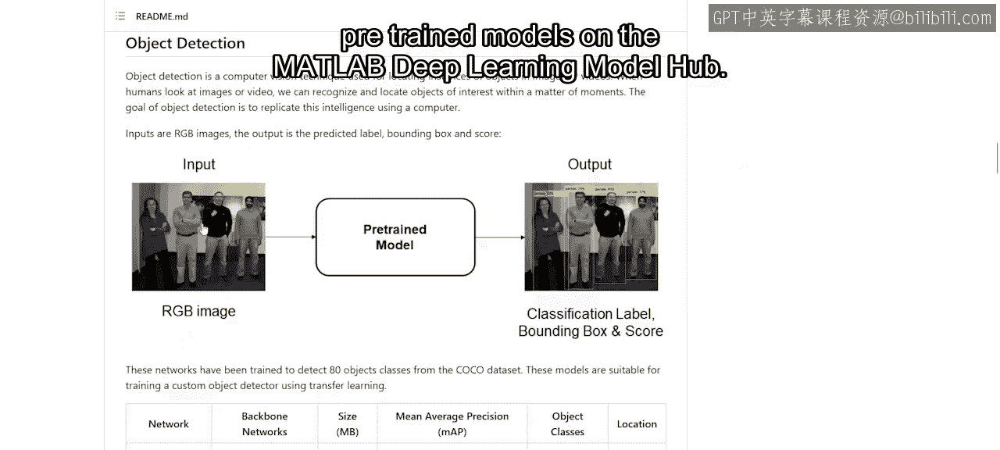

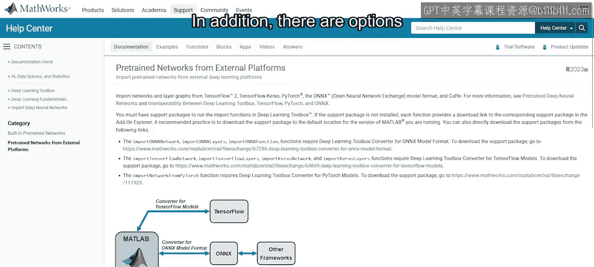

MATLAB深度学习模型中心还提供了一些专用和前沿的预训练模型。

此外，还有选项可以从第三方平台（如TensorFlow和PyTorch）导入模型，或将模型导出到这些平台。

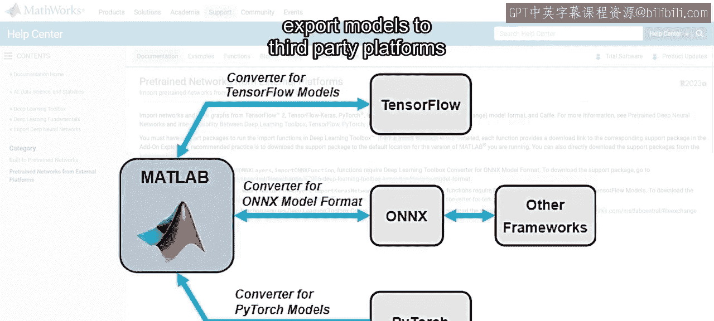

您将在后续的阅读材料中找到指向这些资源的链接。

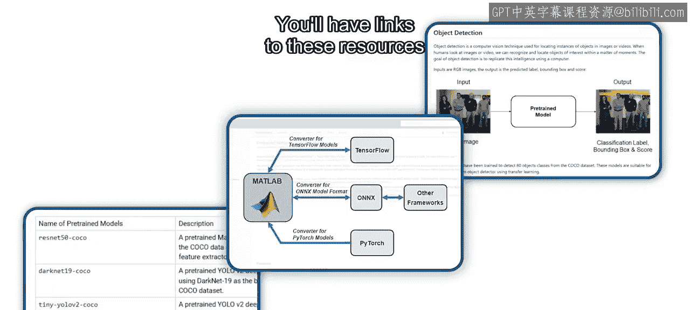

---

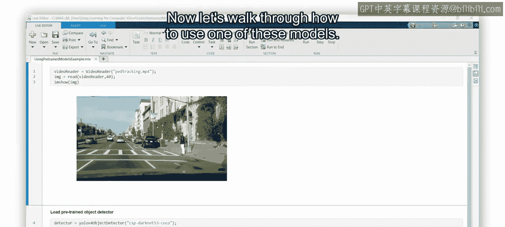

上一节我们介绍了预训练模型的来源和获取方式，本节中我们来看看如何具体使用其中一个模型。

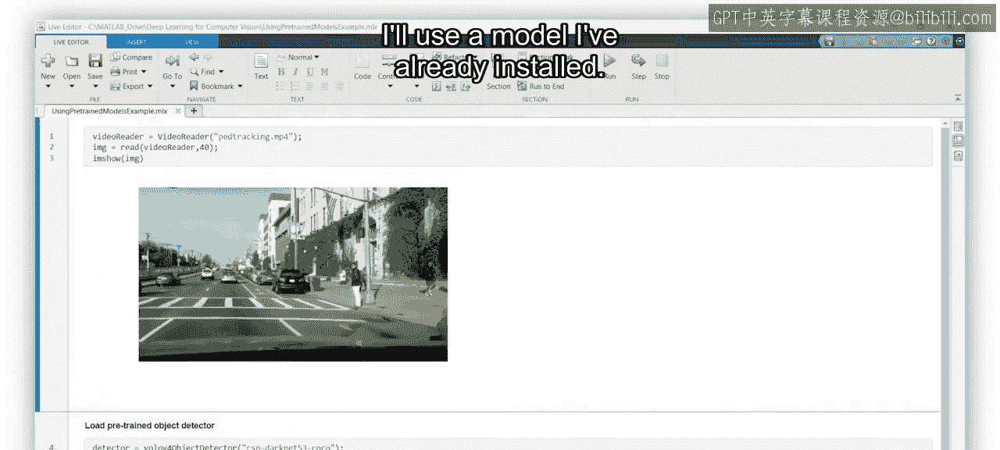

现在，让我们逐步了解如何使用其中一个模型。

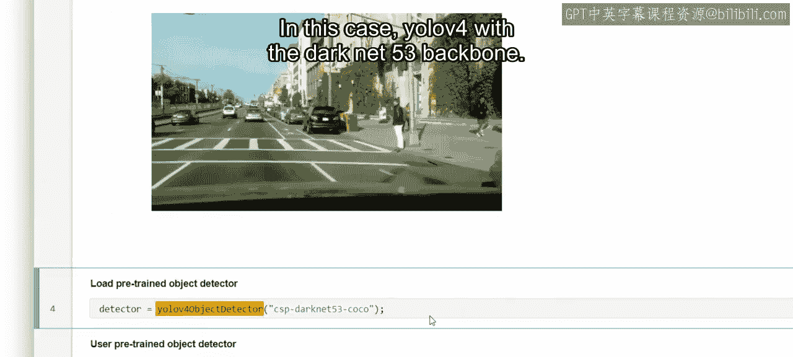

在本例中，我们将在单个视频帧中检测汽车和行人。

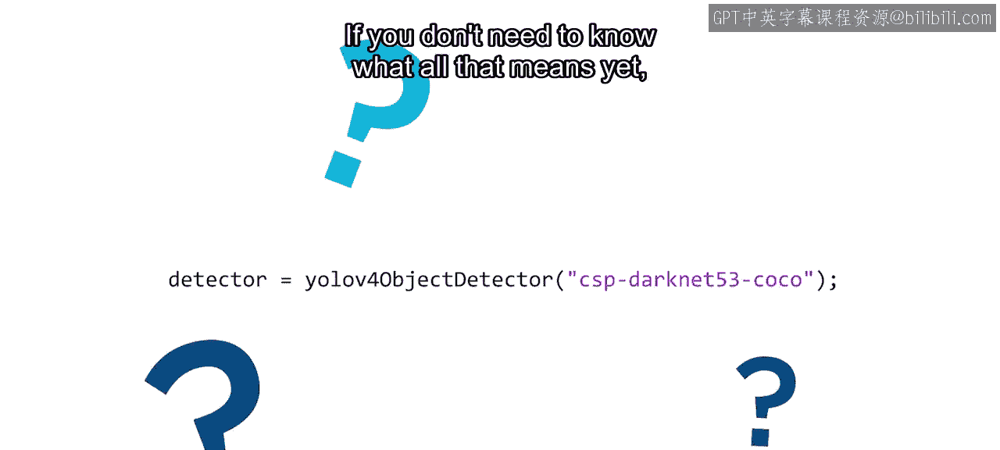

我将使用一个已经安装好的模型。

在本例中，是使用Darknet-53骨干网络的YOLO v4模型。

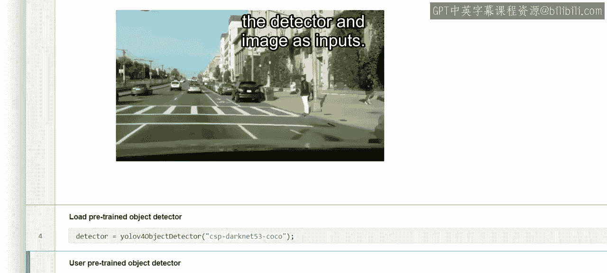

您目前无需完全理解这些术语的含义。

您将在本课程中学习所有相关内容。要应用该模型，请使用 `detect` 函数。

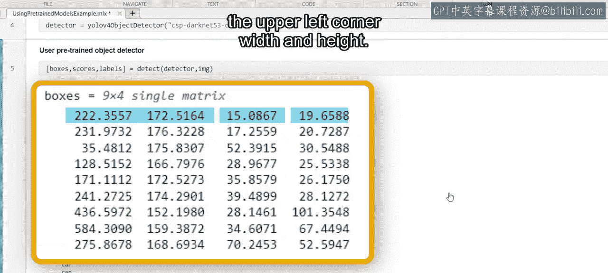

将检测器和图像作为输入。

该函数的三个输出分别是：每个检测到物体的**边界框**、**置信度分数**和**类别标签**。边界框以左上角的像素坐标及其宽度和高度给出。

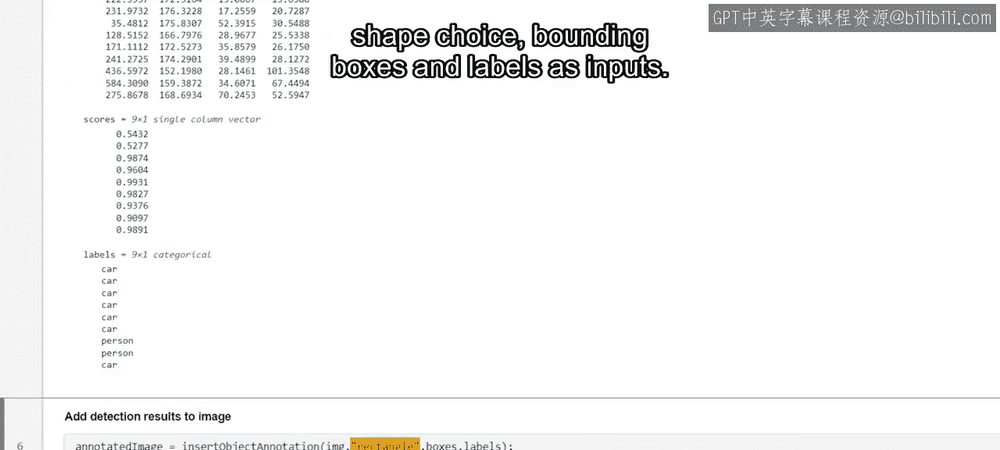

为了查看检测器的性能，使用 `insertObjectAnnotation` 函数，并以图像、矩形形状选择、边界框和标签作为输入。

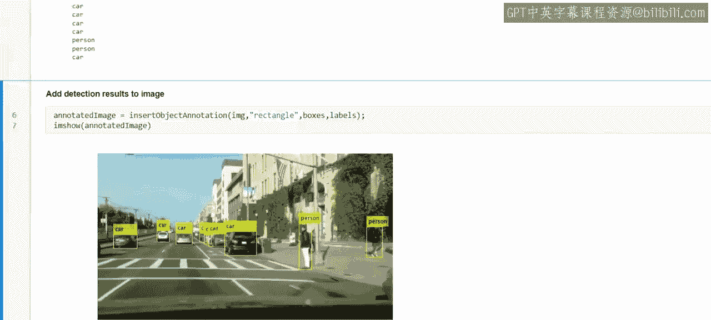

在接下来的阅读材料中，您将找到此处提到的资源链接。您可以练习在图像集合以及视频上加载和使用预训练模型，并使用多种方法来可视化结果。

---

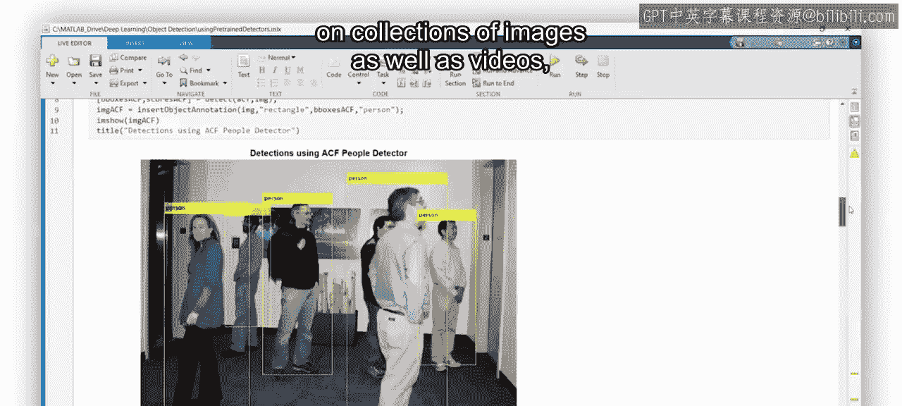

本节课中我们一起学习了预训练目标检测模型的优势与来源，并通过一个具体的代码示例演示了如何使用 `detect` 函数进行物体检测以及使用 `insertObjectAnnotation` 函数可视化检测结果。掌握这些步骤是快速应用深度学习解决实际视觉问题的基础。