# 深度学习在计算机视觉中的应用：19：标记你的图像 🖼️


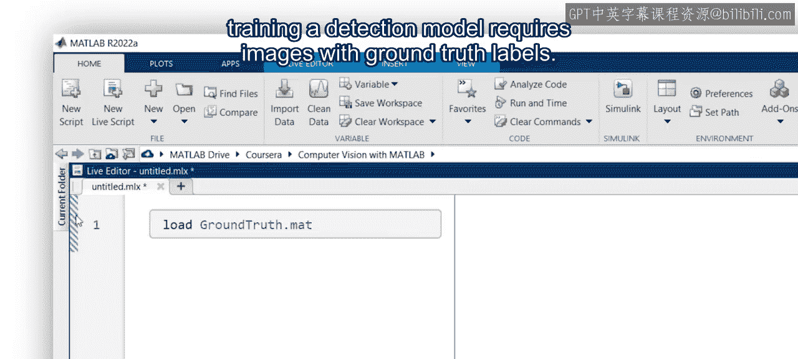

在本节课中，我们将学习如何为训练目标检测模型准备数据，核心步骤是使用工具为图像添加“真实标签”。真实标签包含了图像中我们感兴趣物体的位置信息，例如边界框的坐标。

## 概述


训练一个检测模型需要带有真实标签的图像。这些标签包含了目标物体周围边界框的坐标信息。本节视频将介绍如何使用图像标注器应用程序来生成数据集的真实标签。

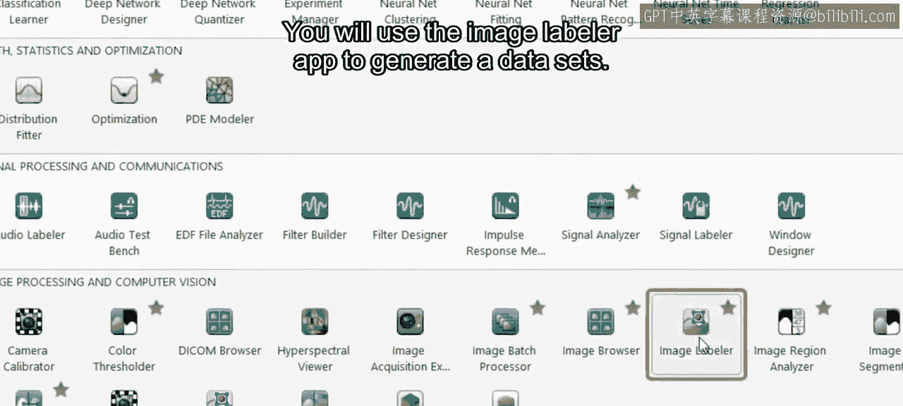

## 导入图像

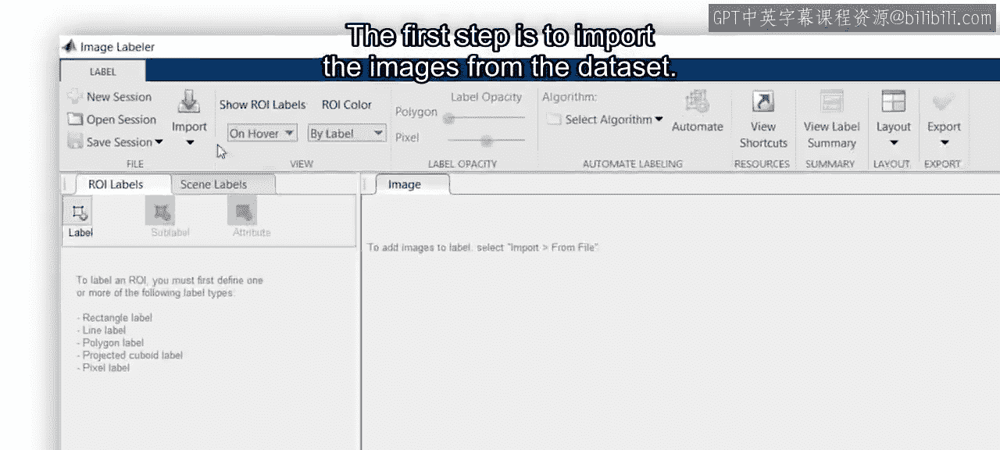

第一步是从数据集中导入图像。

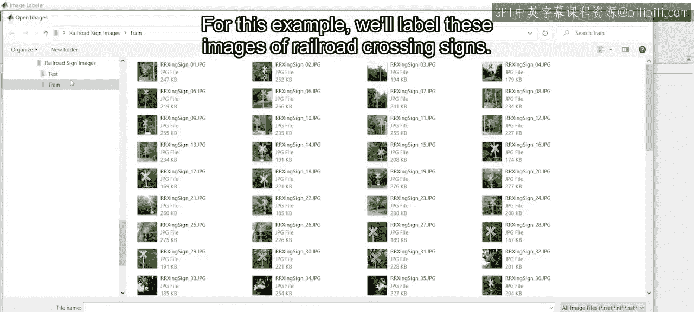

以下是操作步骤：
1.  打开图像标注器应用程序。
2.  使用导入功能加载你的图像数据集。

在本示例中，我们将标注一组铁路道口标志的图像。

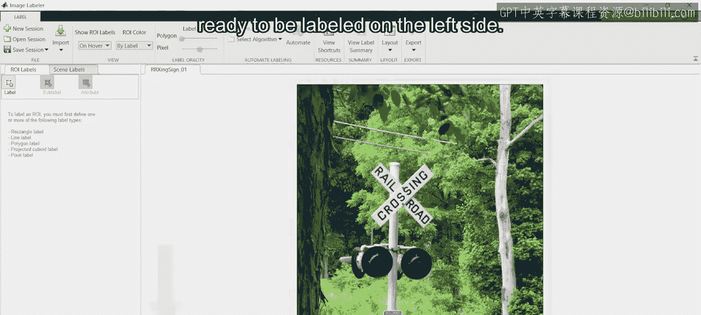

## 标注图像


图像导入后，会显示在应用程序底部的缩略图栏中，可用于快速导航。从缩略图中选中的图像会显示在中央区域，准备进行标注。

在左侧面板，你可以创建感兴趣区域标签，例如边界框。

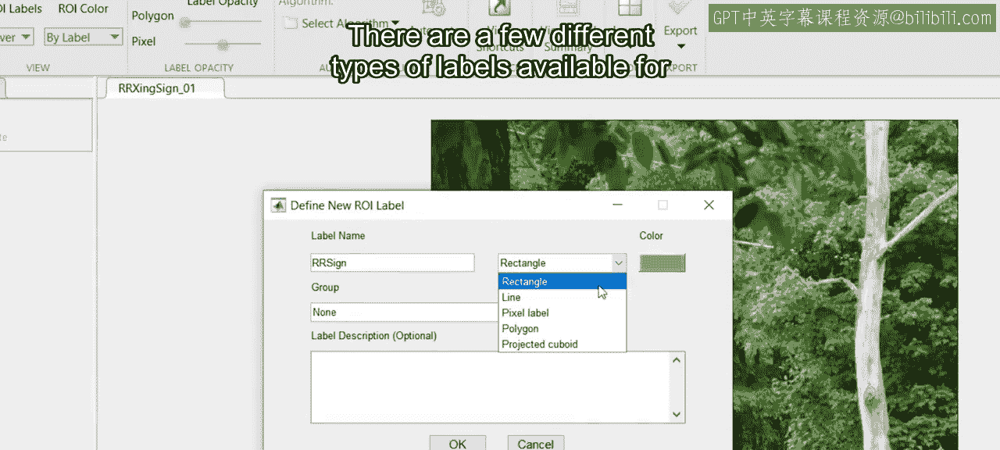

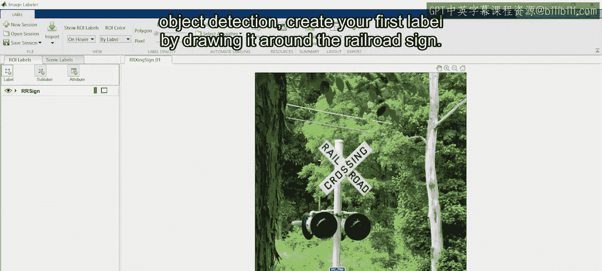

以下是创建标签的步骤：
1.  为铁路标志创建一个新标签。应用程序提供了几种不同的标签类型。
2.  在本例中，我们使用矩形框，因为这是目标检测中最常用的形式。
3.  通过围绕铁路标志绘制矩形来创建你的第一个标签。

如果操作失误，可以使用 `Ctrl+Z` 撤销操作，或者根据需要微调边界框的大小和位置。

## 处理多个标签

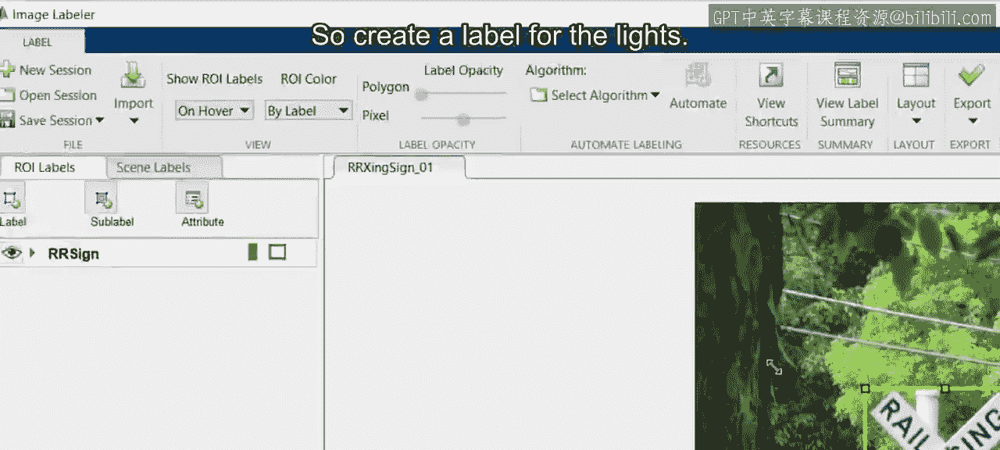

有时一张图像需要多个标签。例如，在自动驾驶场景中，车辆可能还需要定位红色信号灯以检查它们是否在闪烁。

因此，我们也需要为信号灯创建标签。在本例中，有两个信号灯需要标注，我们可以复制并粘贴第二个边界框。

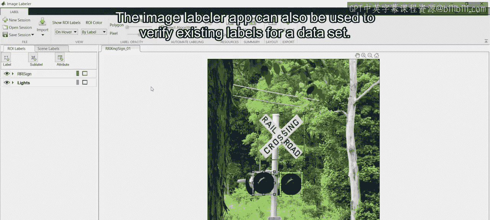

## 验证与场景标注

图像标注器应用程序也可用于验证数据集的现有标签。你可以使用导入按钮导入已有的真实标签数据。


为图像分类任务进行标注也是可行的，这被称为场景标注，可以通过“场景标签”选项卡来执行。

## 导出与使用标签

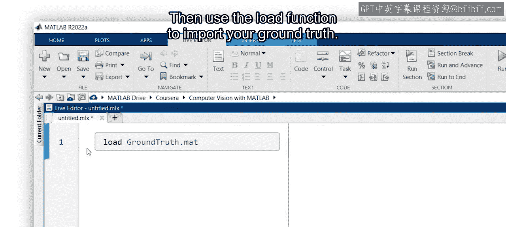

完成标注后，将真实标签导出为 `.mat` 文件。

然后，使用 `load` 函数导入你的真实标签数据。

```matlab
load(‘your_groundtruth.mat’);
```

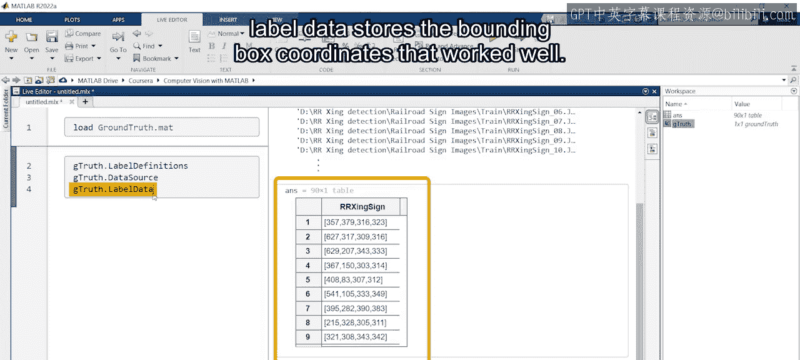

这个变量包含几个属性：
*   `LabelDefinitions` 存储了在应用程序中定义的标签信息。
*   `DataSource` 包含了图像文件的位置。
*   `LabelData` 存储了边界框的坐标数据。

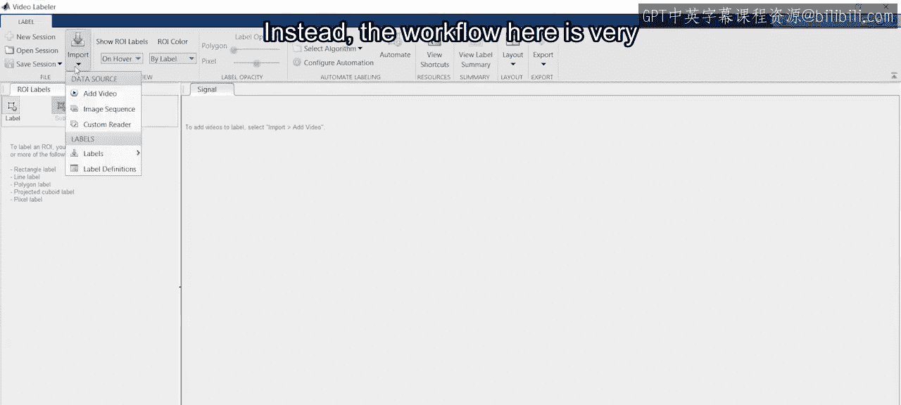

## 视频帧标注

上一节我们介绍了静态图像的标注，但如果需要标注视频帧而非单张图像呢？

在这种情况下，应使用视频标注器应用程序。其工作流程与图像标注器应用程序非常相似。

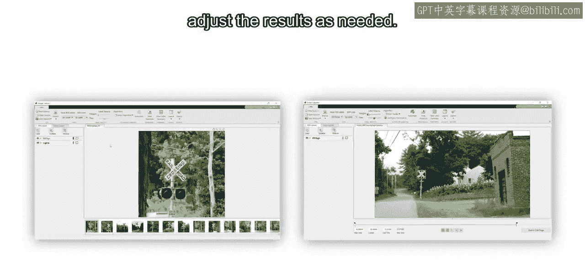

然而，它的一个优势是可以在多帧之间跟踪物体。操作方法是：使用自动化标注算法来跟踪已标注的物体。当你放置好第一个标签后，启动自动化功能来标注后续帧，并根据需要接受或调整结果。

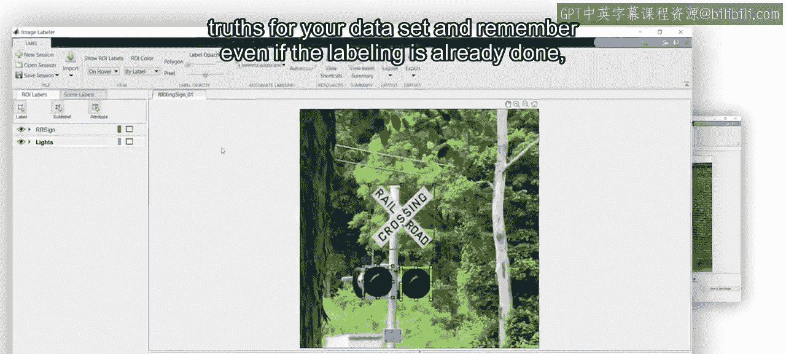

## 总结

本节课中，我们一起学习了如何使用图像和视频标注器应用程序。这两个工具都能帮助你快速为数据集生成真实标签。请记住，即使在标注工作已经完成的情况下，在训练模型之前使用这些应用程序来确认标签也通常是值得的。