# 深度学习在计算机视觉中的应用：21：使用目标检测模型进行迁移学习 🎯

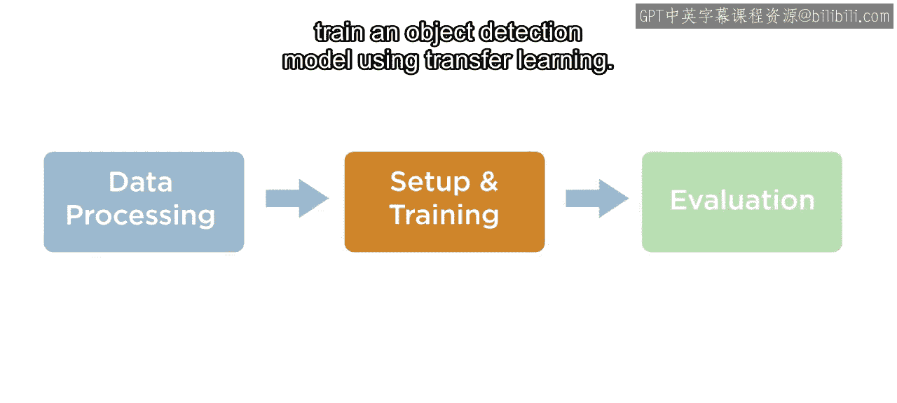

在本节课中，我们将学习如何通过迁移学习来设置和训练一个目标检测模型。具体步骤包括：调整检测数据尺寸、估计锚框、划分验证集、构建模型，最后进行训练。

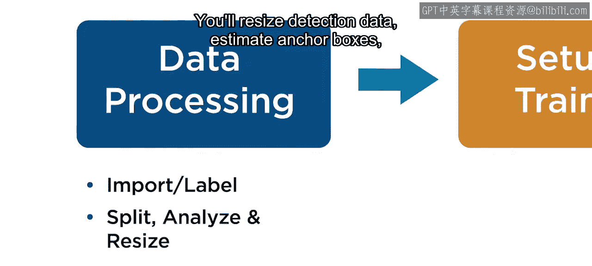

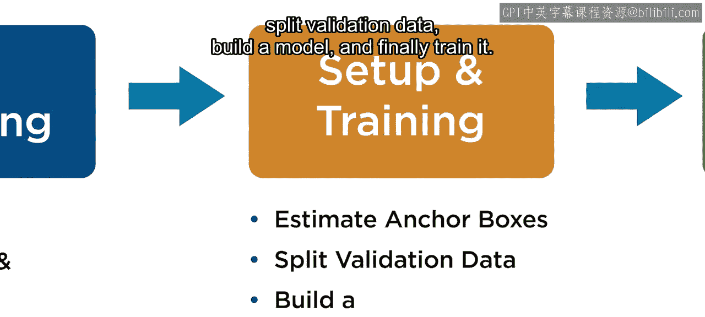

---

## 概述

我们将通过一个完整的流程，演示如何使用预训练模型进行迁移学习，以训练一个自定义的目标检测器。即使你不需要执行所有步骤（例如调整尺寸或使用锚框），了解这些常见预处理任务也是有益的。

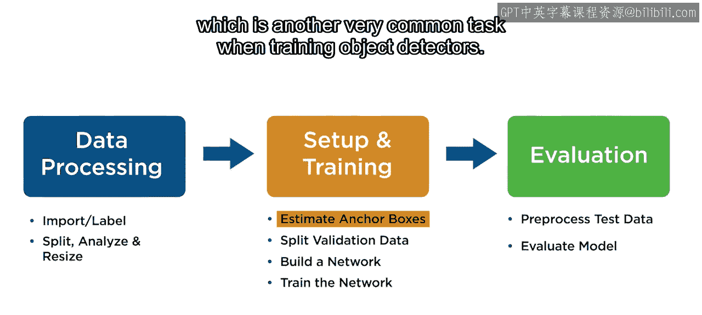

---

## 数据预处理：调整尺寸

上一节我们介绍了如何加载标注数据。本节中，我们来看看如何对数据进行预处理，特别是调整图像和边界框的尺寸。

首先，需要将图像数据存储和边界框标签数据存储合并为一个统一的数据存储。然后，将一个自定义的尺寸变换函数传入 `transform` 方法以调整数据尺寸。课程文件中提供了一个自定义的尺寸变换函数。

以下是该函数的核心逻辑：
*   **输入**：合并后数据存储使用 `read` 函数的结果（一个1x3的元胞数组，包含图像、该图像中所有对象的边界框及其对应的类别标签）以及目标图像尺寸。
*   **处理**：使用 `imresize` 函数调整图像尺寸，并使用 `bboxresize` 函数相应调整边界框坐标。

```matlab
% 示例：调整数据尺寸
transformedData = transform(combinedDataStore, @(data) customResize(data, targetSize));
```

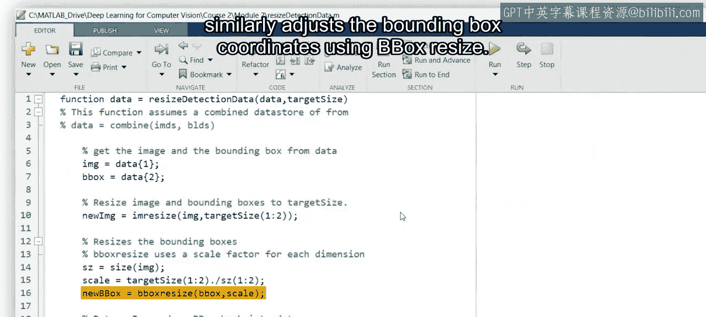

---

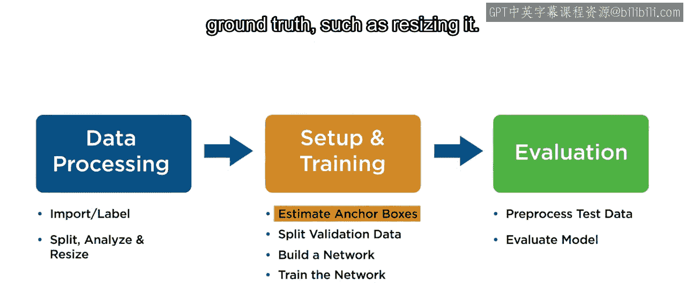

## 模型配置：估计锚框

在完成对真实标注数据的任何修改（例如调整尺寸）后，需要进行锚框估计。

好的锚框是通过在真实边界框数据中寻找聚类来估计的，通常使用如K均值之类的聚类算法。算法会将边界框数据聚类成指定数量的簇（例如5个）。

为了确定最佳锚框数量，需要在一个范围内尝试不同的聚类数量（K值），并评估每个K值下锚框与真实框的平均交并比。通常，更高的IoU意味着更好的匹配，但这会带来计算成本的增加。通过可视化结果，你可以选择合适的锚框数量。我们稍后在构建模型时会再次用到这个结果。

---

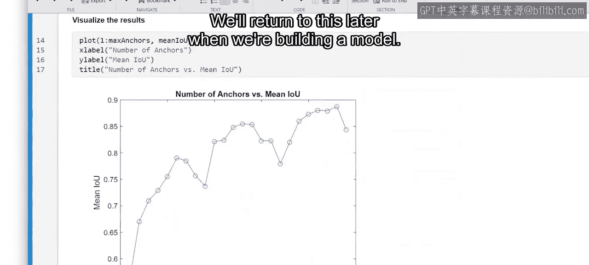

## 数据准备：划分验证集

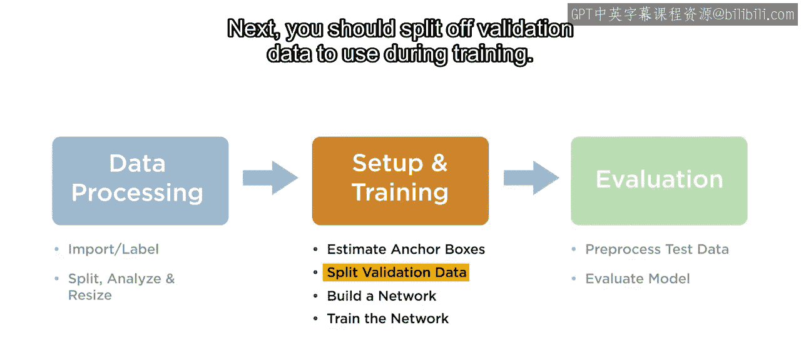

接下来，需要划分出一部分数据作为验证集，用于在训练过程中评估模型性能。

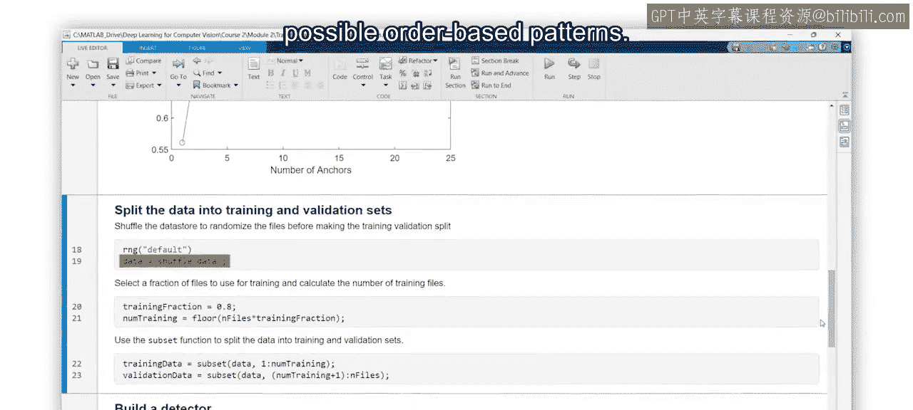

以下是划分验证集的步骤：
1.  首先，打乱数据顺序，以帮助消除任何可能基于数据顺序的模式。
2.  然后，确定保留多少比例的数据用于训练，并据此计算训练文件的数量。
3.  最后，使用 `subset` 函数从打乱后的数据中提取相应数量的元素作为训练数据，剩余的元素则作为验证数据。

```matlab
% 示例：打乱并划分数据
shuffledData = shuffle(combinedDataStore);
numTrainingFiles = round(0.7 * numel(shuffledData.Files)); % 假设70%用于训练
trainingData = subset(shuffledData, 1:numTrainingFiles);
validationData = subset(shuffledData, numTrainingFiles+1:end);
```

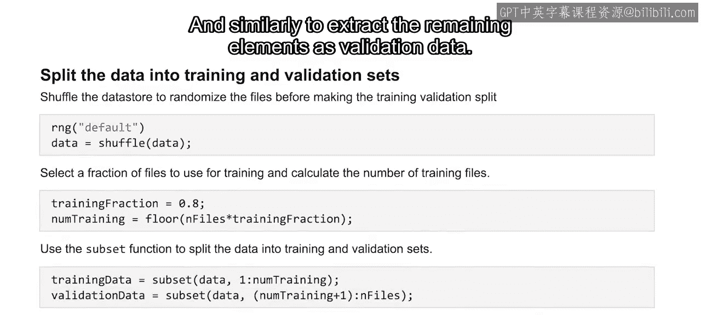

---

## 模型构建：创建检测器

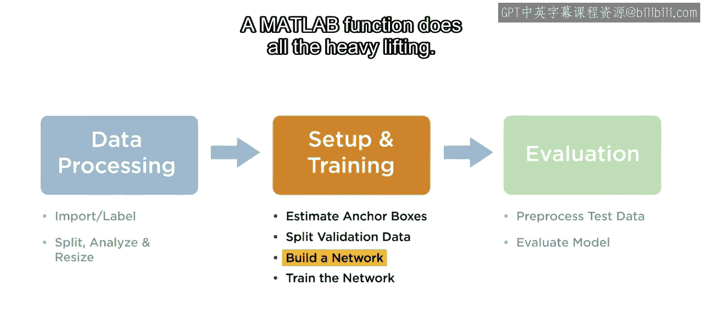

现在进入构建网络的关键步骤。请放心，我们正在进行迁移学习，因此无需从头开始构建网络，甚至不需要手动添加头部或颈部组件。MATLAB函数会完成所有繁重的工作。

首先，需要选择你计划使用的网络架构。如果你需要使用锚框，现在就需要按面积对它们进行排序，以便分配给不同的检测头。

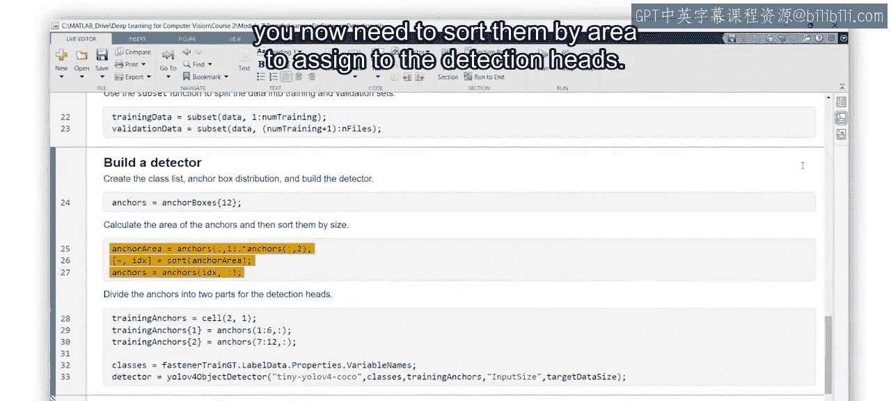

请记住，网络中更深的附件（检测头）更擅长检测更大的物体。因此，在将锚框分配给模型之前，需要先按面积对它们进行排序。在本例中，我们计划使用YOLOv4的微小版本，它有两个检测头。

我们选择了12个锚框作为首次尝试，因为它资源消耗较少、可被2整除（以便为每个头创建一组），并且具有不错的IoU值。

排序步骤如下：
1.  通过计算锚框尺寸的乘积来计算每个锚框的面积。
2.  使用 `sort` 函数获取按面积排序后的索引。
3.  使用排序后的索引重新排列锚框数组。

接着，创建一个元胞数组来保存两组锚框（本例中每组对应一个检测头），并将排序后的锚框分配到元胞数组的相应元素中。然后，从原始标注数据中提取类别名称，并使用所有这些信息来构建检测器。

在MATLAB中，你可以使用专用函数构建检测器。以YOLOv4目标检测器为例，当需要指定主干网络、锚框和头部连接时，完整的语法是：`detectorFunctionName(backboneName, classNames, anchorBoxes, 'LayerName', layersToAttach, ...)`。

然而，一些检测框架提供了更简化的选项。例如，对于YOLOv4，你可以指定网络类型的子类（如 `tiny-yolov4-coco`）、类别名称和锚框，并可选择提供网络输入尺寸以自动调整图像大小。具体使用时，请查阅你所使用检测器的文档。

```matlab
% 示例：构建YOLOv4检测器
anchorBoxes = {[smallAnchors]; [largeAnchors]}; % 按面积排序并分组后的锚框
detector = yolov4ObjectDetector('tiny-yolov4-coco', classNames, anchorBoxes, 'InputSize', inputSize);
```

---

## 模型训练：开始训练

一旦拥有了检测器，就可以开始训练了。每种检测器类型也有其专用的训练函数。与图像分类任务类似，你可以指定训练选项。

每个检测器训练函数都将训练数据、检测器和训练选项作为输入。现在，你已经准备好在MATLAB中使用迁移学习来训练目标检测模型了。

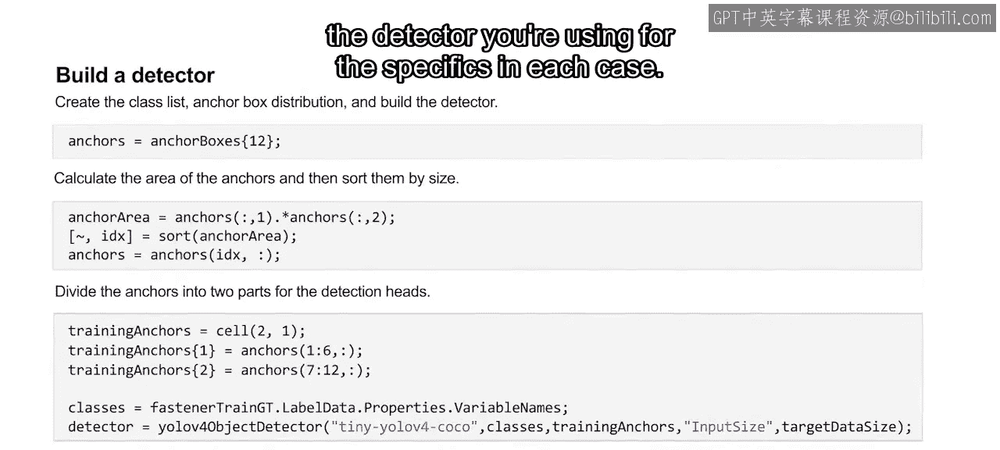

在本视频的示例中，你将有机会逐步完成整个流程。如果你拥有足够的硬件资源，还可以在接下来的阅读材料中亲自执行训练。

```matlab
% 示例：设置训练选项并训练
options = trainingOptions('sgdm', 'InitialLearnRate', 1e-3, 'MaxEpochs', 30, 'ValidationData', validationData);
[detector, info] = trainYOLOv4ObjectDetector(trainingData, detector, options);
```

---

## 总结

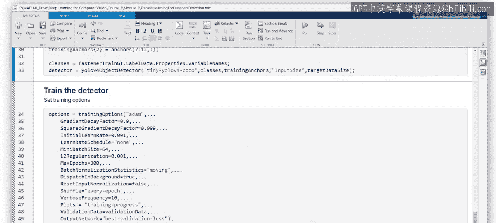

本节课中，我们一起学习了使用迁移学习训练目标检测模型的完整流程。我们从数据预处理（调整尺寸）开始，接着配置模型所需的锚框，然后准备了训练和验证数据集。之后，我们利用预训练架构和估计的锚框构建了目标检测器。最后，我们设置了训练选项并启动了训练过程。掌握这些步骤，你就能为自己的视觉任务定制高效的目标检测模型。