# 深度学习在计算机视觉中的应用：22：评估目标检测模型 🎯

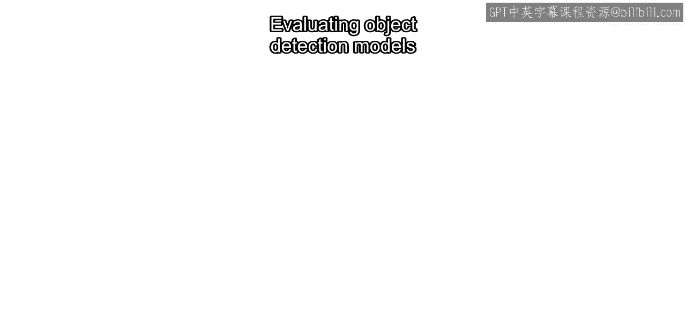

在本节课中，我们将学习如何评估目标检测模型的性能。与图像分类不同，目标检测不仅需要判断类别，还需要评估目标的位置和大小。我们将介绍几个核心的量化指标，帮助你分析和比较不同的模型。

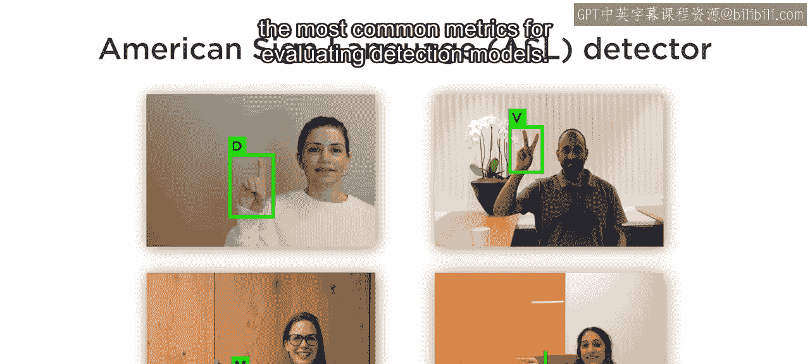

## 什么是正确的检测？✅

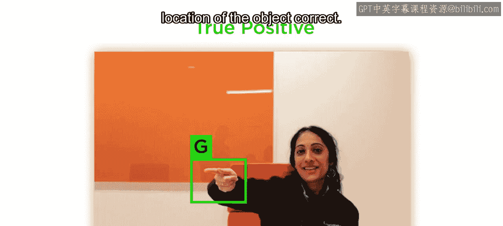

上一节我们介绍了目标检测的基本任务。本节中，我们来看看如何定义一个“好的”检测，即真阳性。

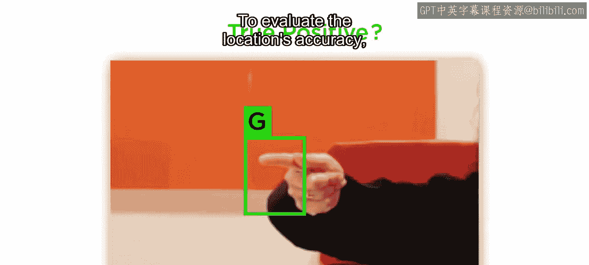

一个正确的检测（真阳性）需要满足两个条件：
1.  识别出正确的类别。
2.  预测的边界框位置足够准确。

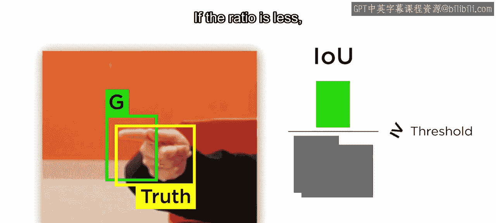

那么，如何判断边界框的位置是否“足够准确”呢？

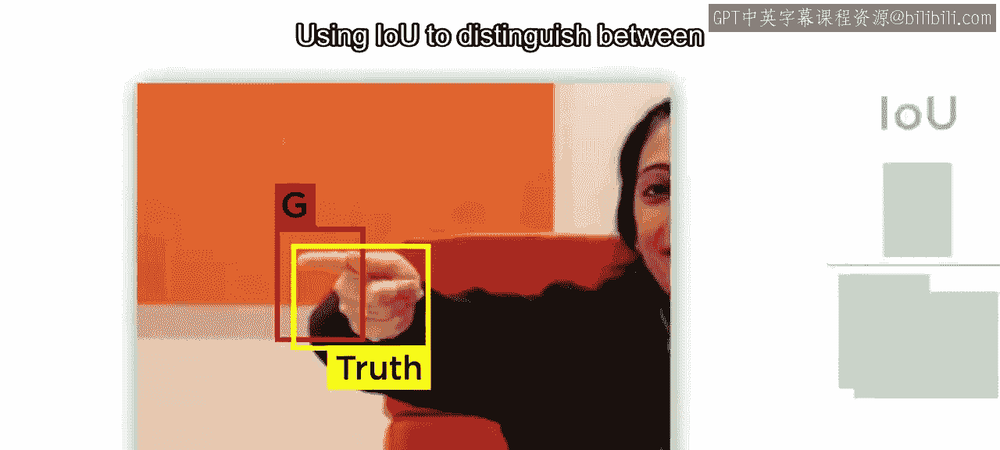

## 交并比：衡量位置准确性的标尺 📏

为了量化评估边界框位置的准确性，我们引入一个核心概念：**交并比**。

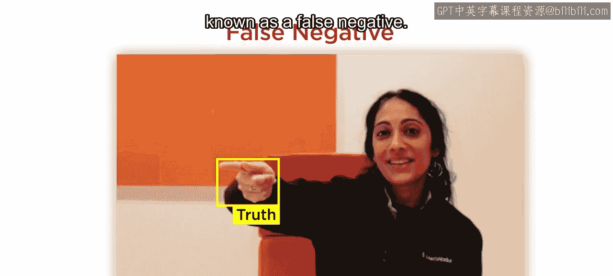

**交并比** 的计算公式为：
`IOU = (预测框与真实框的交集面积) / (预测框与真实框的并集面积)`

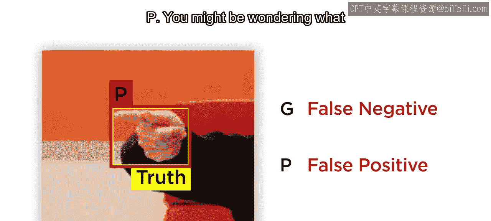

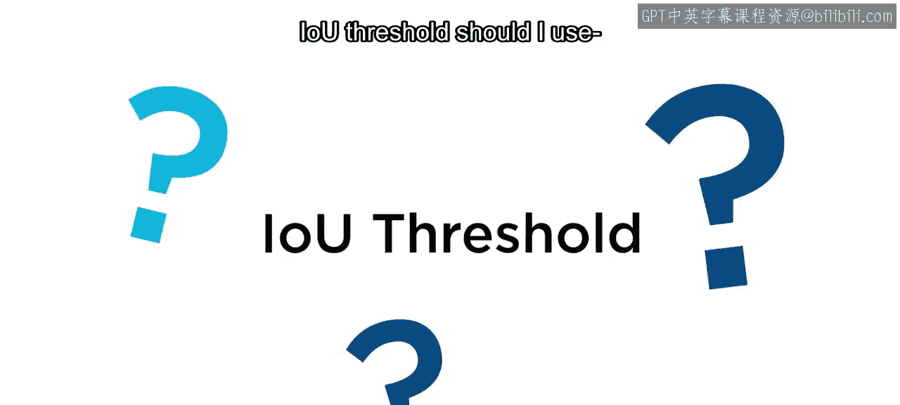

在假设类别预测正确的前提下，我们可以设定一个IOU阈值：
*   如果 `IOU >= 阈值`，则该检测为**真阳性**。
*   如果 `IOU < 阈值`，则该检测为**假阳性**。

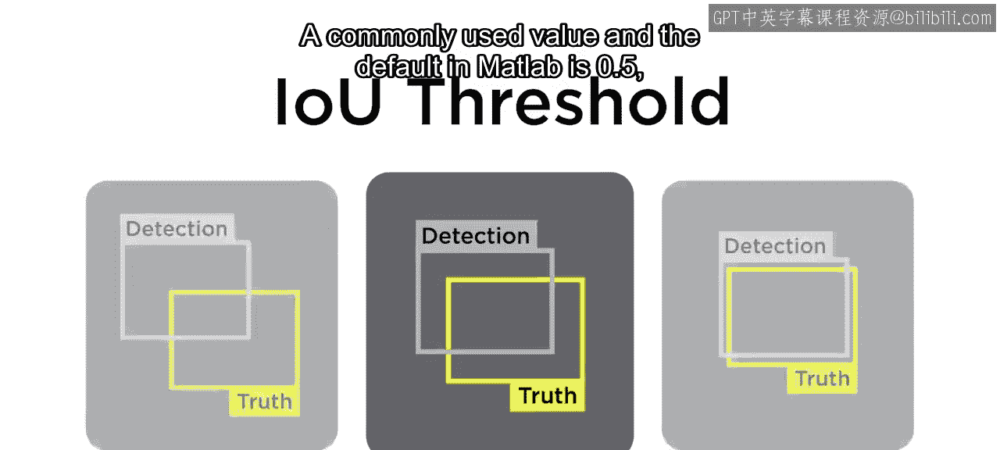

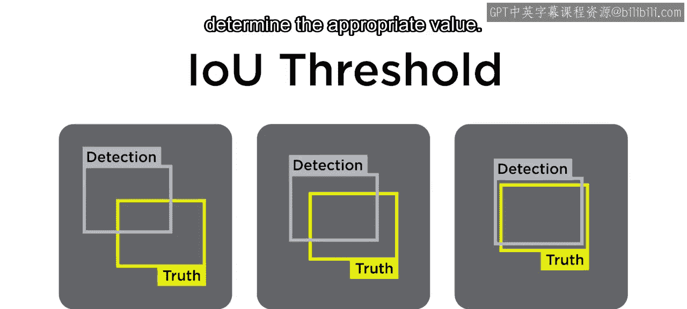

使用IOU来区分真阳性和假阳性，可以在检测的位置和大小之间取得平衡。例如，即使边界框大小正确，但位置偏移过大，或者中心点正确但面积过大，都可能导致IOU低于阈值，从而被判定为假阳性。

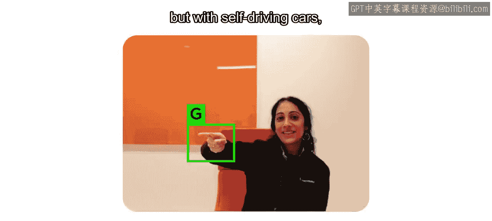

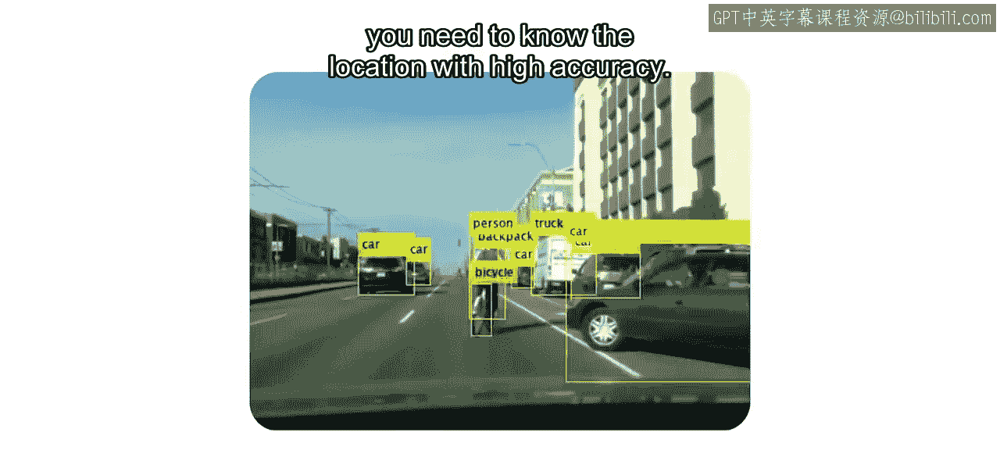

## 检测中的常见错误 ❌

除了假阳性，目标检测模型另一个常见错误是**漏检**，也称为**假阴性**。

以下是导致假阴性的两种情况：
*   图像中存在目标，但检测器完全未能找到。
*   检测器找到了目标，但分配了错误的类别。

例如，一张图片中包含字母“G”，但检测器将其预测为“P”。那么，对于字母“G”而言，这是一次假阴性；对于字母“P”而言，这是一次假阳性。

## 如何设定IOU阈值？⚙️

一个常用值（也是MATLAB中的默认值）是 **0.5**。但最佳阈值取决于你的具体应用。

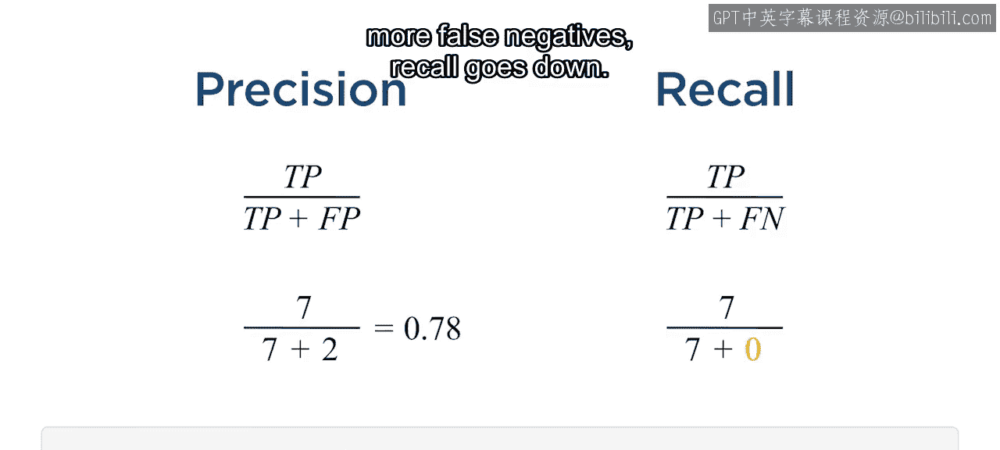

*   **对于手语识别模型**，手部的精确位置可能不那么关键，因此可以适当降低IOU阈值。
*   **对于自动驾驶汽车**，则需要非常精确地知道障碍物的位置，因此可能需要更高的IOU阈值。

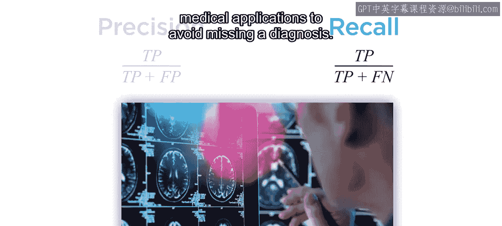

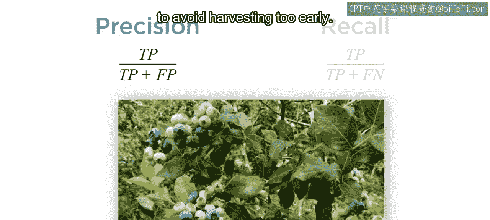

## 精确率与召回率：权衡的艺术 ⚖️

在减少假阳性或假阴性时，存在一种权衡关系。你可以通过提高检测器的置信度阈值来减少假阳性，但这通常会增加假阴性（漏检）。用于评估这种权衡的两个关键指标是**精确率**和**召回率**。

以下是这两个指标的定义：
*   **精确率**：在所有被模型预测为某类别的检测中，预测正确的比例。
    *   公式：`精确率 = 真阳性 / (真阳性 + 假阳性)`
*   **召回率**：在所有实际存在的某类别目标中，被模型正确找出的比例。
    *   公式：`召回率 = 真阳性 / (真阳性 + 假阴性)`

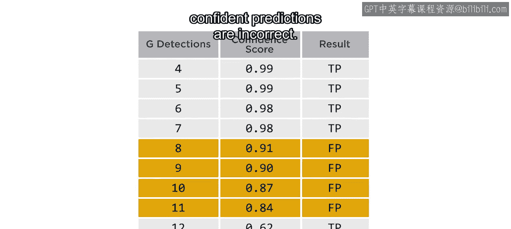

置信度阈值是你可以控制的重要参数：
*   **降低阈值**：意味着对预测正确性的要求更宽松。你会得到更多的真阳性，但也会引入更多的假阳性。结果是**召回率上升，精确率下降**。
*   **提高阈值**：意味着要求检测器更“挑剔”。假阳性的可能性降低，但真阳性也会减少。结果是**精确率上升，召回率下降**。

与IOU阈值一样，你需要根据应用场景决定哪个指标更重要。例如，在医疗诊断中，你可能优先考虑高召回率以避免漏诊；而在水果成熟度检测中，你可能需要高精确率以避免过早采摘。

## 精确率-召回率曲线与平均精确率 📈

那么，如何使用这些指标来评估模型并选择合适的阈值呢？一个常见的方法是为每个类别构建一条**精确率-召回率曲线**。

构建这些曲线的一个好方法是：在测试图像上以较低的置信度阈值（例如0.05）运行你的检测器。然后，对于每个类别，按置信度分数降序排列所有检测结果。

以下是构建曲线的步骤：
1.  曲线通常从点 (0, 1) 开始。
2.  处理分数最高的检测：如果是真阳性，则精确率为1，召回率为 `1/总目标数`。
3.  依次处理后续检测：每遇到一个真阳性，召回率增加；每遇到一个假阳性，精确率下降。
4.  以此类推，直到完成整条曲线。

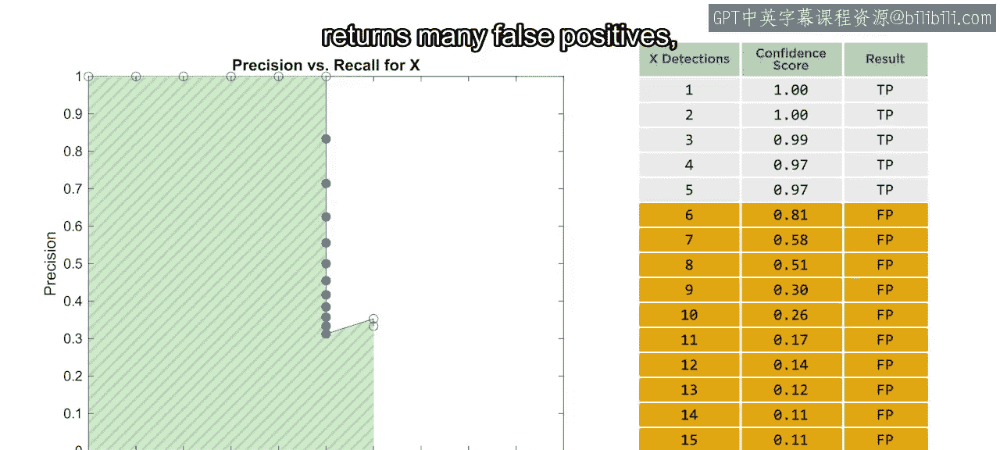

这条曲线帮助你可视化精确率与召回率之间的权衡关系。曲线下的面积即为**平均精确率**。AP是一个量化指标，用于评估模型对特定类别的预测能力。

## 整体评估：均值平均精确率与阈值选择 🎯

通常，检测器对不同类别的表现会有所不同。这就引出了两个问题：如何整体评估检测器？以及如何选择一个全局的置信度阈值用于检测？

要回答第一个问题，你需要计算所有类别的平均精确率的**均值**，这被称为**均值平均精确率**。一个mAP为0.85的检测器，平均而言优于mAP为0.8的检测器。

要确定合适的全局置信度阈值，可以在一系列阈值下运行检测器，并为每个类别创建新的PR曲线。曲线下面积会随着阈值升高而减小。通过计算每个阈值下所有类别的平均面积，你可以绘制一条“平均剩余面积 vs 检测阈值”曲线。

理想情况下，这条曲线下降缓慢，并存在一个相对平缓的区域。最终，当阈值过高导致大量假阴性时，曲线会急剧下降。选择接近这个“拐点”的阈值，可以在所有类别上取得精确率和召回率之间的良好平衡。

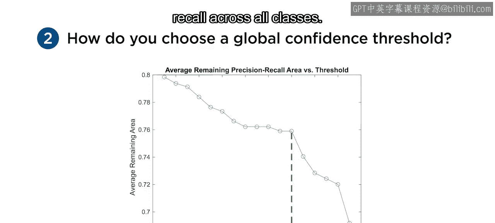

## 总结 📝

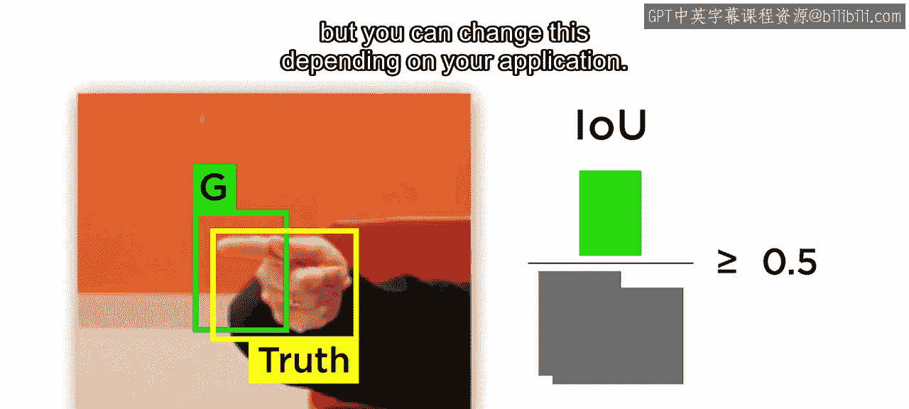

本节课中我们一起学习了评估目标检测模型的核心方法：
*   **交并比** 用于评估边界框的位置准确性，常用阈值为0.5，但可根据应用调整。
*   **精确率-召回率曲线** 和 **平均精确率** 提供了针对特定类别的性能评估指标，这在某些类别更重要时非常有用。
*   **均值平均精确率** 用于整体评估你的检测器，并比较不同模型的优劣。

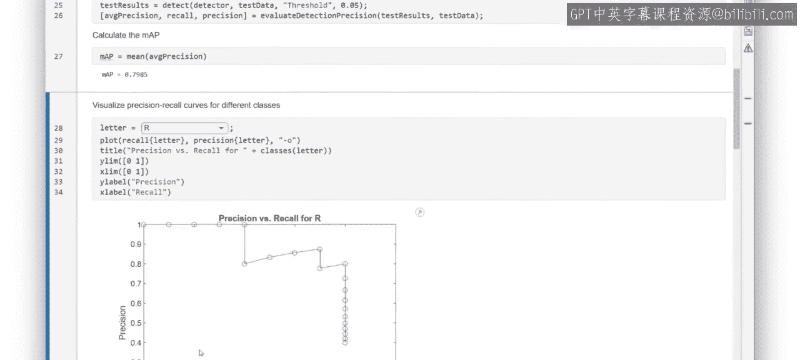

通过掌握这些指标和曲线，你将能够科学地分析、优化和选择适合你任务的目标检测模型。