# 深度学习在计算机视觉中的应用：23：解决检测中的常见问题 🎯

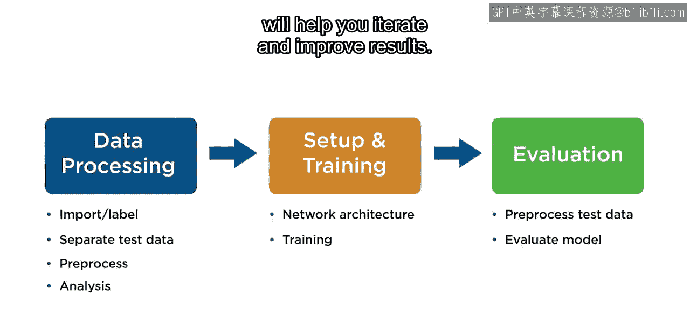

在本节课中，我们将学习如何诊断和解决训练目标检测模型时遇到的常见问题。我们将从训练过程本身入手，探讨如何调整训练选项，然后分析网络结构和参数的影响，最后讨论数据相关的问题。

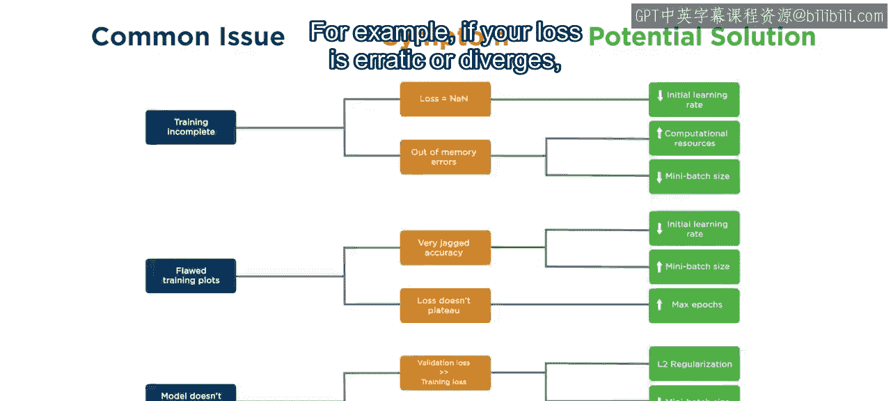

## 训练过程与选项调整

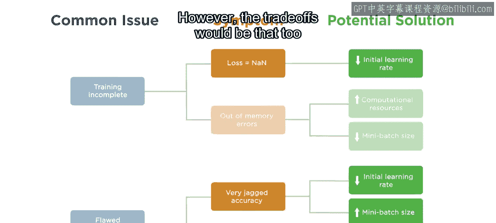

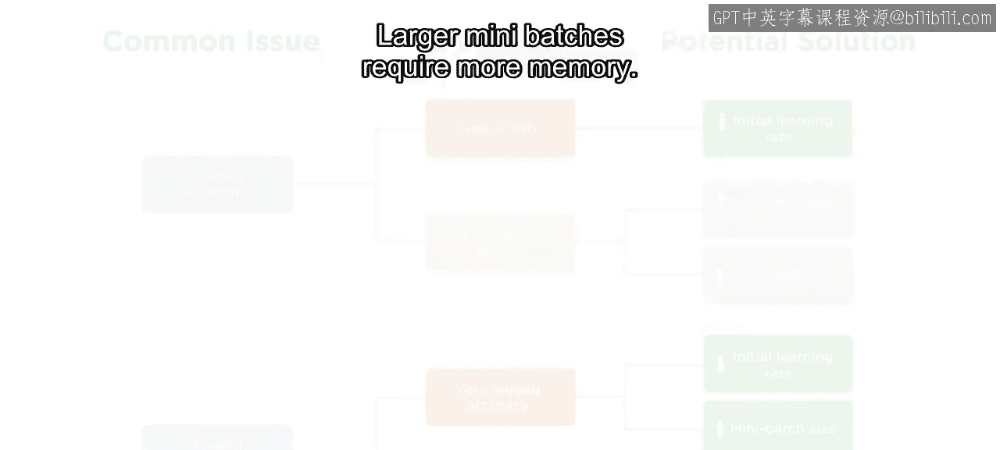

上一节我们介绍了目标检测的基本流程，本节中我们来看看如何优化训练过程。训练选项的设置方式与本系列第一门课程中图像分类的设置方式相同。

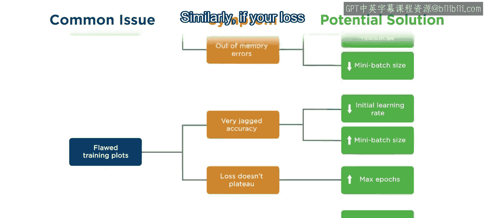

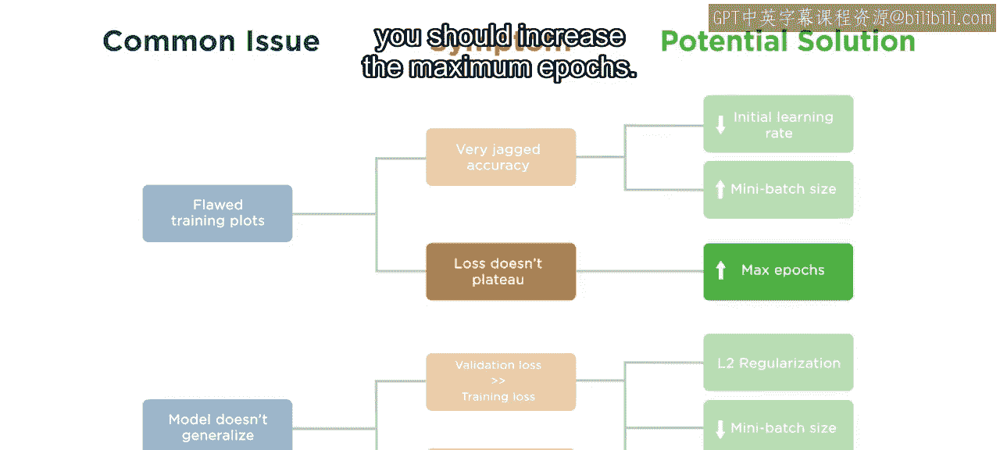

如果训练过程中损失函数值波动剧烈或发散，你需要降低学习率或增加小批量的大小。然而，这需要权衡利弊：学习率过低会使训练时间大大延长，而更大的小批量则需要更多的内存。

如果训练结束时损失函数仍有改进空间，你应该增加最大训练轮数。需要注意的是，虽然训练选项的总体效果相同，但由于目标检测的网络和待优化的损失函数比分类任务更复杂，因此你通常会遇到更高的资源需求和更慢的训练进度。

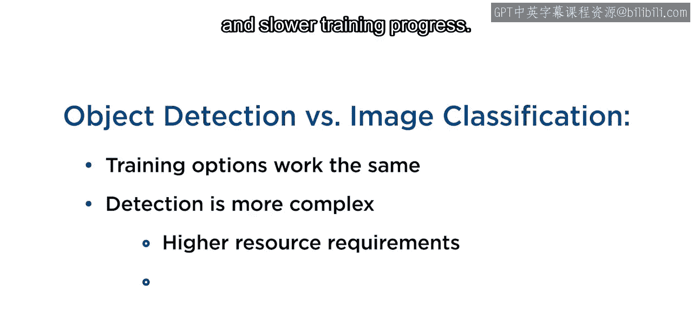

为了降低硬件需求和训练时间，你可能会倾向于使用过高的学习率、过小的小批量或过少的训练轮数。通常，需要谨慎调整这些参数，不要为了节省资源而调整得过于极端。

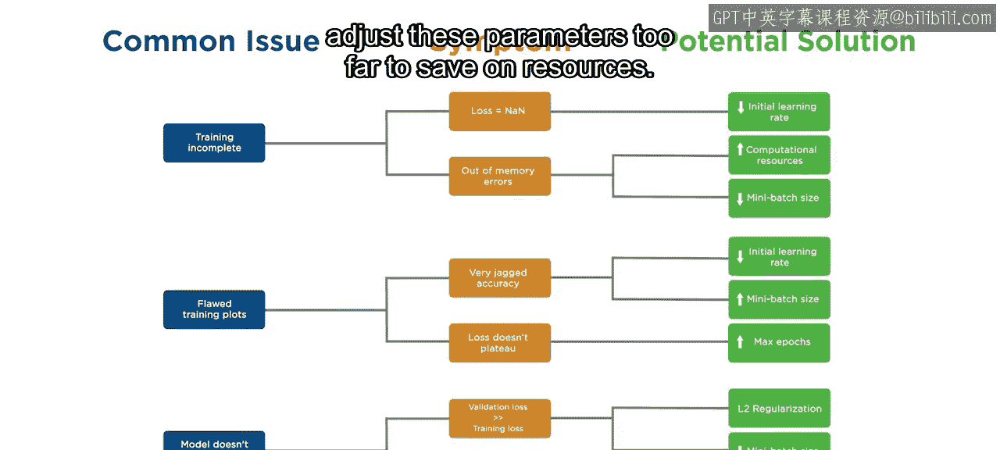

目标检测模型的训练通常比分类任务耗时更长，且需要更多内存，这是正常现象。

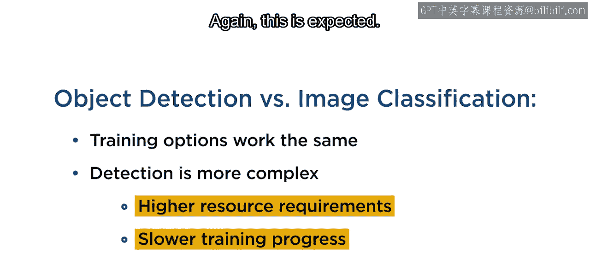

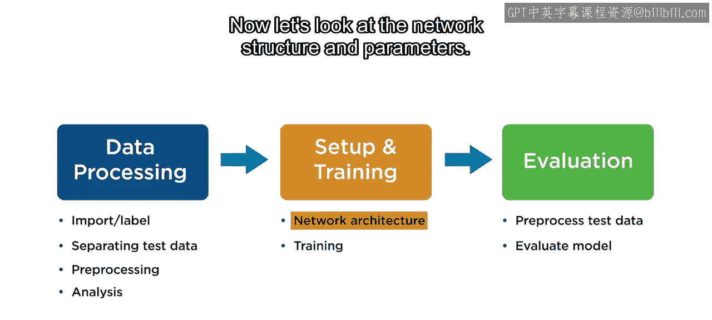

## 网络结构与参数优化

现在让我们看看网络结构和参数。如果你使用的检测器采用了锚框，增加锚框的数量是提升性能的一个好方法。锚框的数量和形状是基于真实标注数据的聚类结果来选择的，选择依据通常是平均交并比。即使增加锚框数量不会显著提高平均交并比，最终的模型仍可能受益。但请注意，这会增加训练和推理阶段的资源需求。

如果你使用的模型带有一个或多个检测头，请记住，连接到骨干网络的检测头的数量和深度会影响模型检测特定尺度物体的能力。

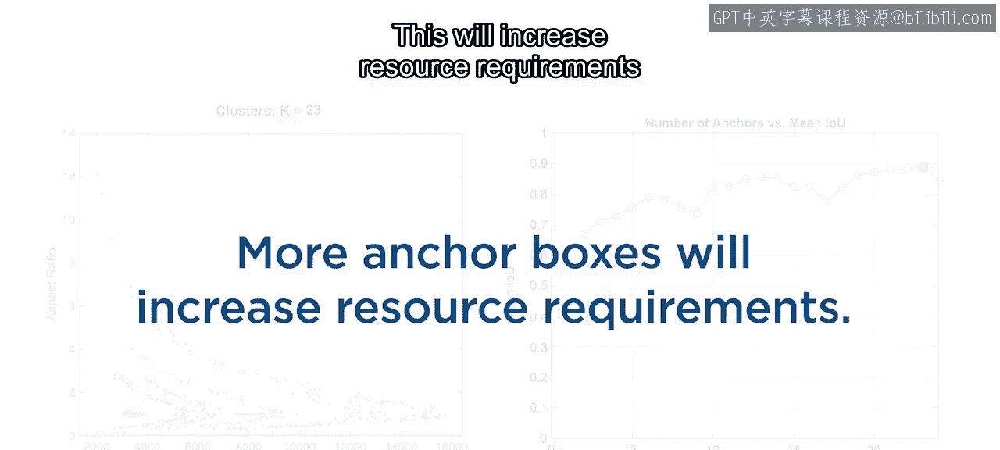

如果你发现模型在检测某些尺度的物体时遇到更多困难，尝试使用不同的模型或具有更多检测头的模型架构版本可能会有所帮助。例如，YOLOv4的Darknet版本有三个检测头，而其精简版本只有两个。

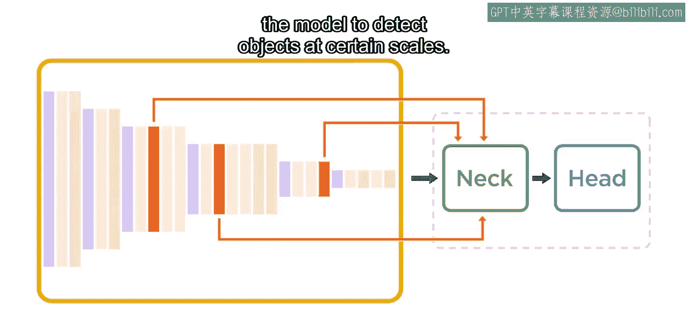

如果你可以切换到具有更大尺度检测范围的模型类型，最好的方法可能是将现有的检测头分配到骨干网络中更早或更晚的位置。

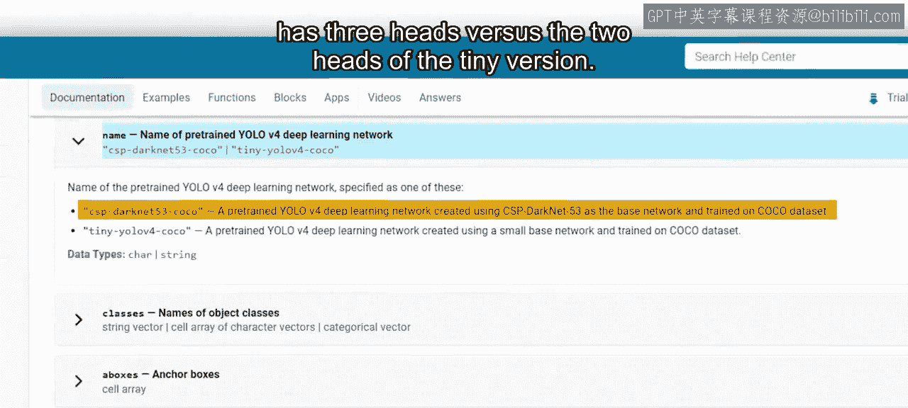

## 数据与模型策略

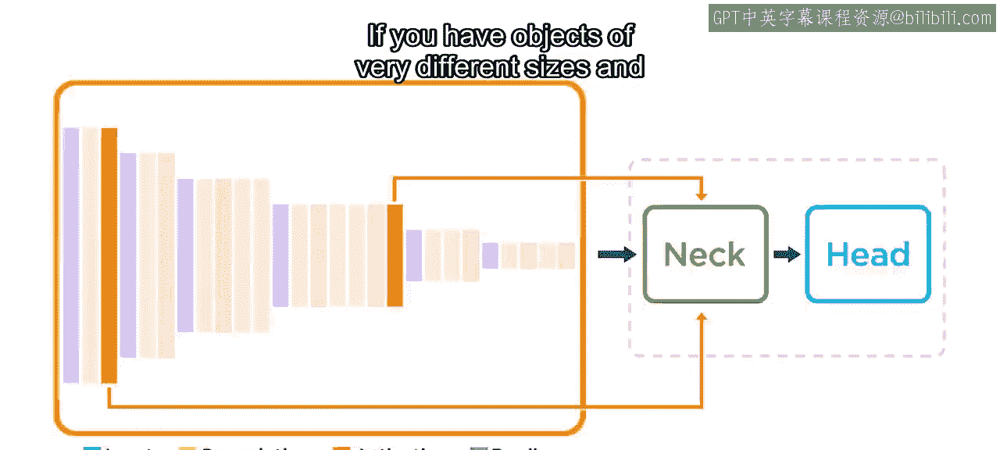

现在，如果你的数据中包含尺寸差异巨大且尺寸分布没有重叠的物体，你可能更适合训练两个或多个模型实例，每个实例专注于你数据中的一个聚类。

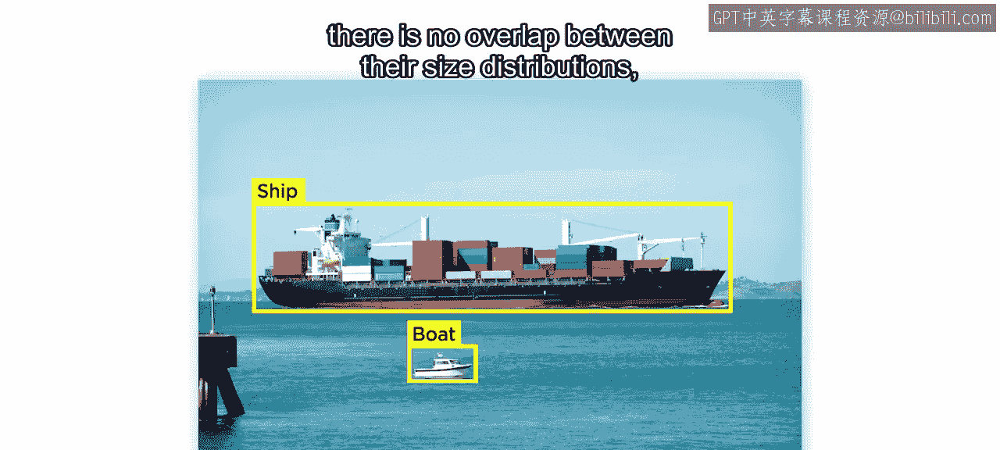

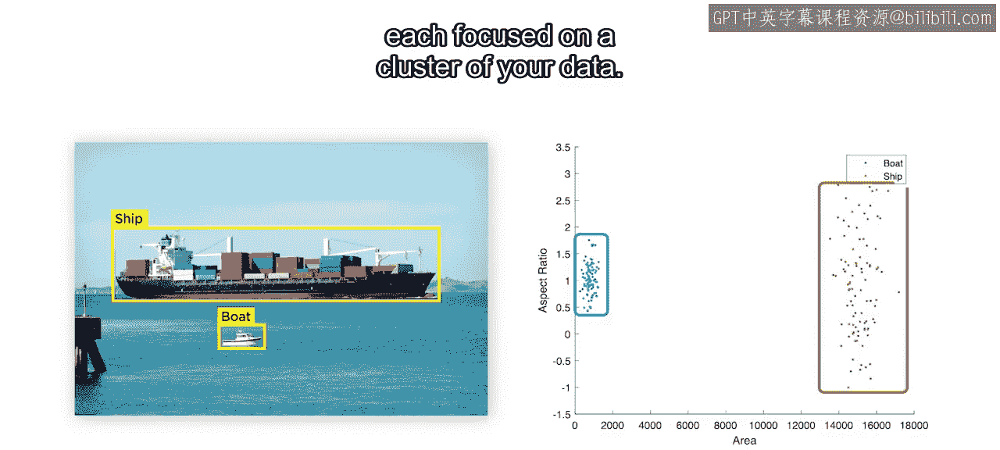

不要忘记，如果你的总体数据不足，或者某个类别的数据不足，那么无论你如何调整选项，模型都无法表现良好。通常，解决这个问题的最佳方法是收集更多数据。

如果收集数据成本高昂或无法实现，你将在下一门课程中学习如何通过人工方式增强你的数据。

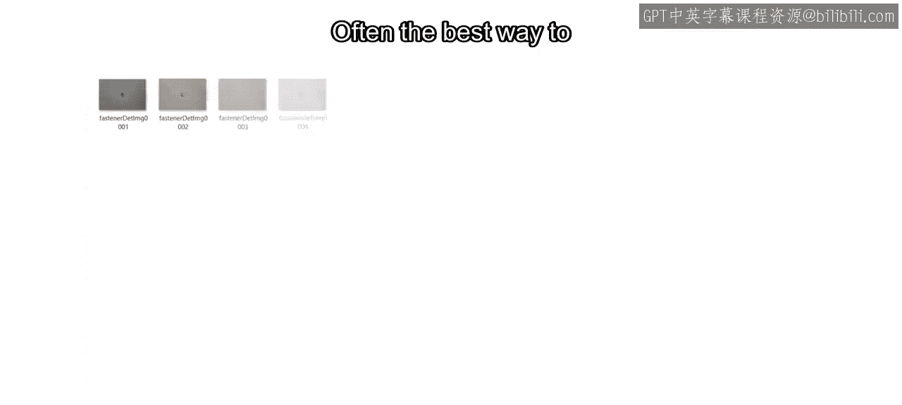

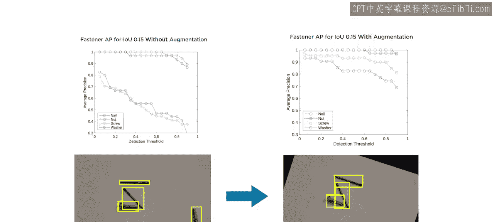

## 总结

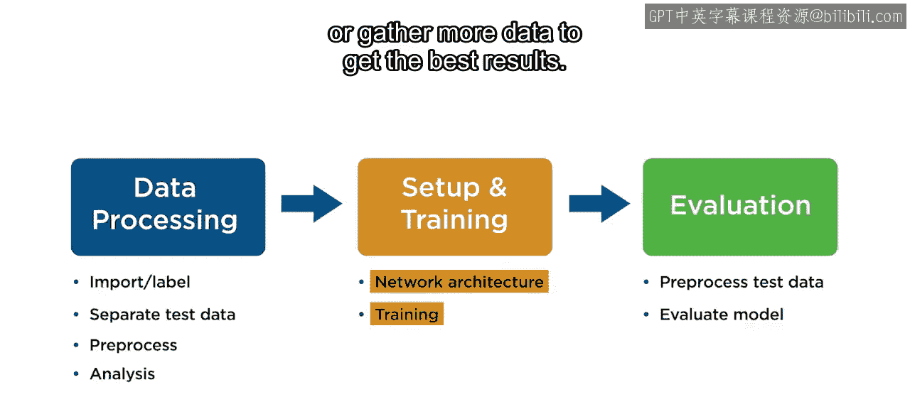

本节课中我们一起学习了解决目标检测模型训练中常见问题的策略。训练目标检测模型是一个迭代过程，你可能需要改变网络架构、尝试不同的训练选项或收集更多数据才能获得最佳结果。