# 深度学习在计算机视觉中的应用：24：最终项目介绍 🎯

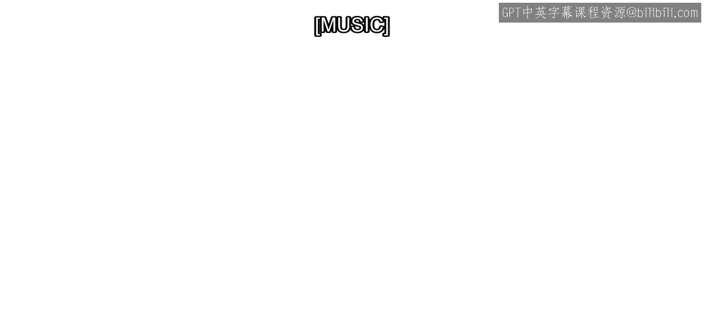

在本节课中，我们将把课程中学到的所有知识整合起来，完成一个最终项目。这个项目将模拟一个真实场景，帮助你巩固图像标注、模型训练和结果评估的完整工作流程。

你已经成功完成了本课程的大部分内容。你分析了真实标注数据，训练了检测模型，并评估了结果。

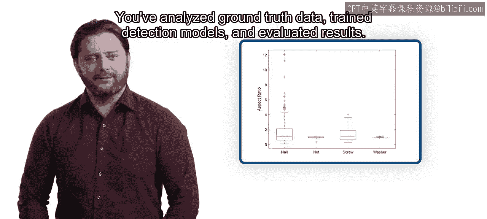

现在，是时候将所有主题整合到一个最终项目中了。

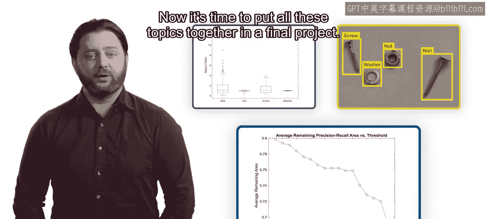

## 项目背景 🚗

想象一下，你在一家正在开发自动化停车系统的公司工作。公司为你提供了一小部分从汽车上采集的图像样本。

部分图像因汽车运动而模糊，部分标志牌磨损严重。公司希望在投入时间和金钱收集大型数据集之前，了解模型在这些图像上的表现。

你的任务是训练一个原型模型并评估其结果。

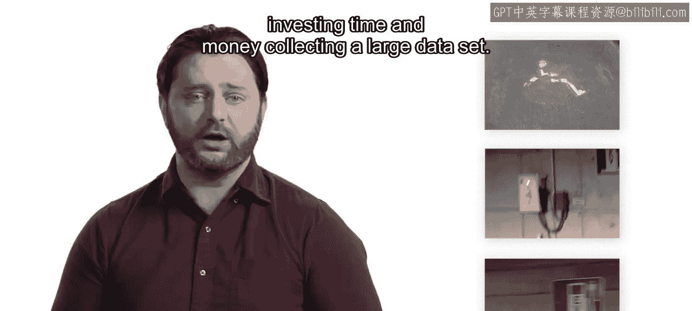

## 项目数据与目标 🏷️

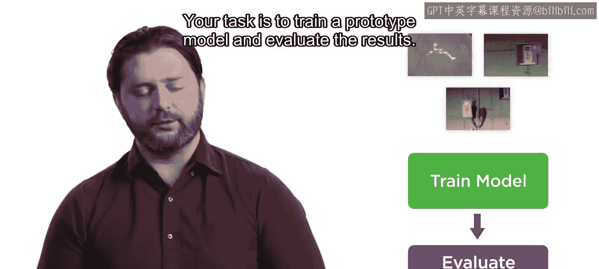

样本数据包含三个类别：
*   **`E V`**： 代表电动汽车停车标志。
*   **`Charger`**： 代表电动汽车充电桩标志。
*   **`accessible`**： 代表残疾人停车标志。

通过训练模型并评估结果，你将帮助公司在创建数据集时做出明智的决策。

## 项目结构 📋

为了帮助你按部就班地完成，我们将项目分成了三个部分。

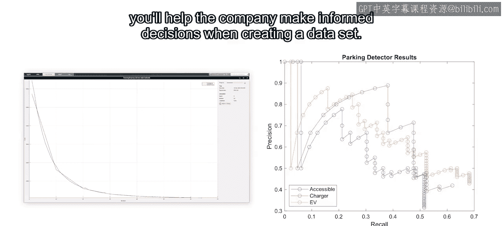

### 第一部分：标注图像与分析

在项目的第一部分，你将标注图像并分析真实标注数据。

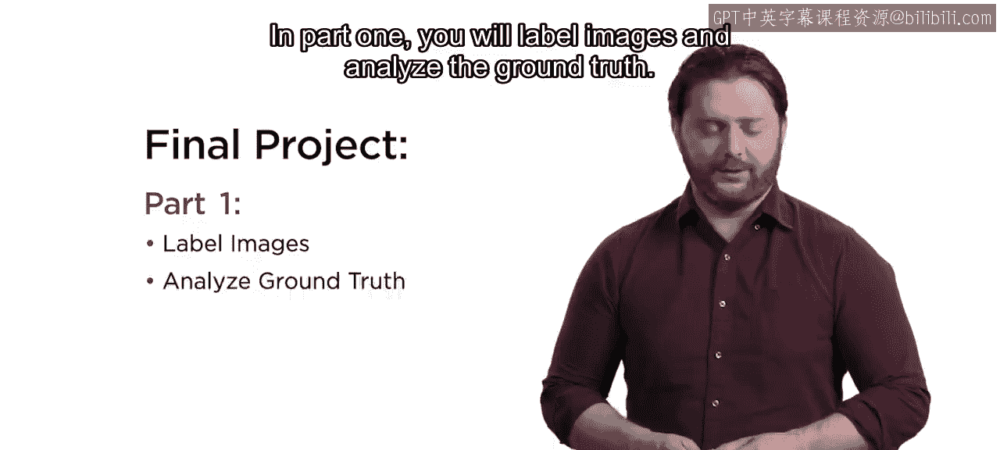

无需担心，大部分图像已经标注完成，你只需要完成少量标注工作。

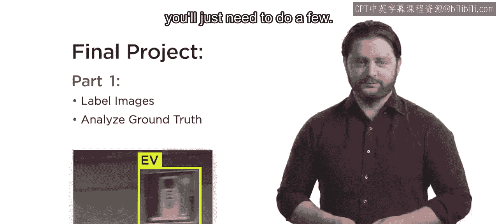

第一部分末尾有一个测验。这样，在进入第二部分训练模型之前，你可以确认自己的标注和分析是否正确。

### 第二部分：训练模型

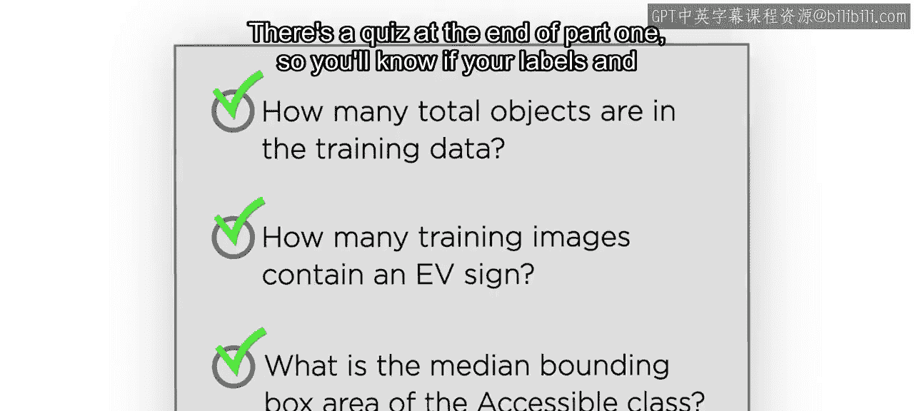

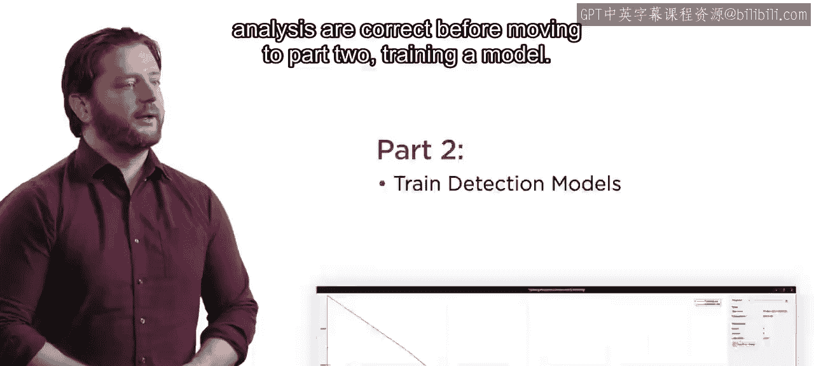

第二部分的核心是训练模型。

使用我的CPU进行训练，这个过程大约需要30分钟。我们鼓励你尝试训练自己的模型，以便完整地应用整个工作流程。

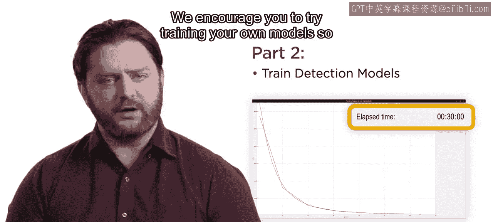

然而，如果你在训练过程中遇到内存不足的错误，我们也提供了一个预训练模型。在完成第二部分的测验后，你将解锁该模型。

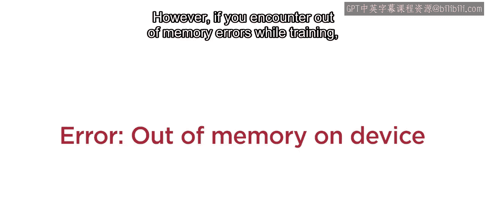

### 第三部分：评估模型

第三部分是评估你的模型。你将计算每个类别的平均精度，并确定用于检测的置信度阈值。

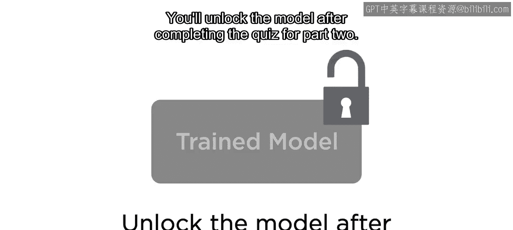

希望你的结果能比这些示例结果更好一些。

## 项目成果 💼

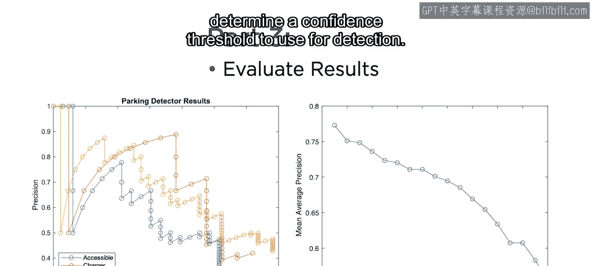

当你完成项目后，你将拥有可以展示你目标检测模型训练技能的代码和成果。

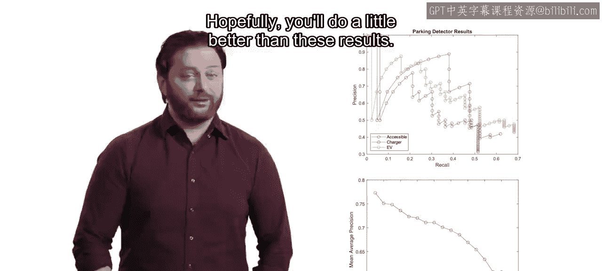

祝你好运。🎼

---

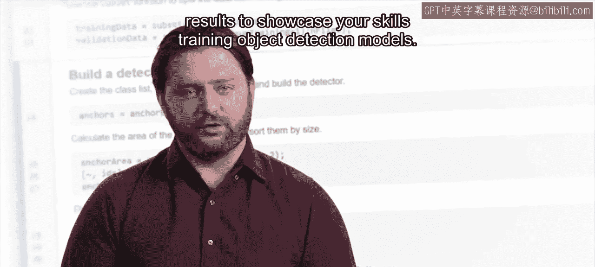

**本节课总结**：本节课我们一起介绍了最终的实践项目。该项目模拟了为自动化停车系统开发原型检测模型的全过程，涵盖了从数据标注、模型训练到结果评估的三个核心阶段。通过完成这个项目，你将能够综合运用课程所学，并产出可展示的实践成果。