# 深度学习在计算机视觉中的应用：25：深度学习用于目标检测总结 🎯

在本节课中，我们将对深度学习用于目标检测的核心内容进行总结。我们将回顾已学习的模型应用、迁移学习工作流、数据分析以及模型评估方法，并展望后续课程中将接触到的先进技术。

## 课程内容回顾

恭喜你完成了深度学习用于目标检测的学习。目标检测并非一个简单的主题，它是计算机视觉中至关重要且应用广泛的技术之一。

在本课程中，你应用了由专家在大量数据集上构建和预训练的、功能强大的目标检测模型。

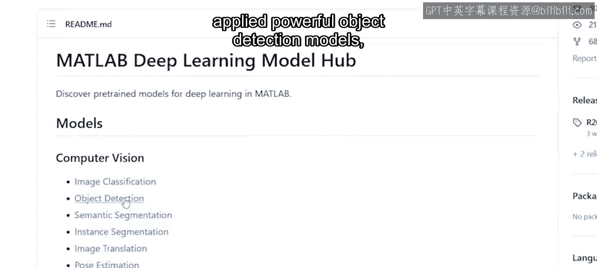

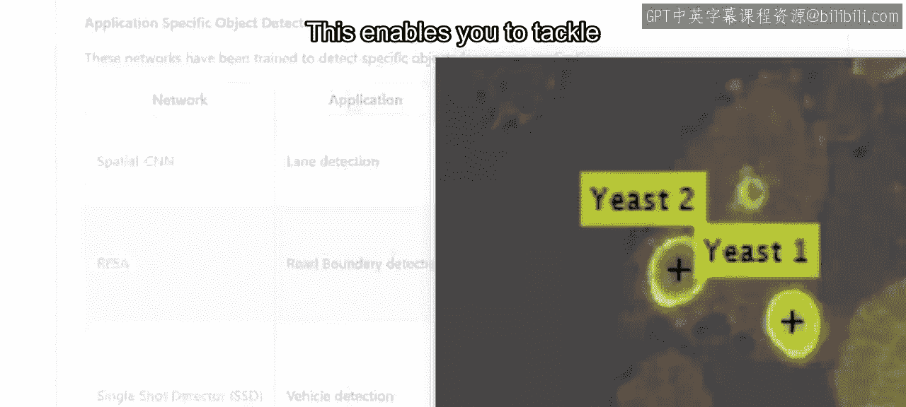

这使你能够快速应对日益增长的各种目标检测场景。当然，你通常需要执行更定制化的任务。因此，你也实践了为目标检测器进行迁移学习的完整工作流程。

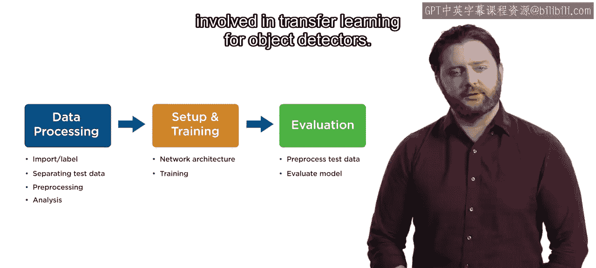

## 数据准备与分析

上一节我们介绍了迁移学习的工作流，本节中我们来看看其中的关键步骤——数据准备与分析。

以下是创建和准备训练数据的具体步骤：

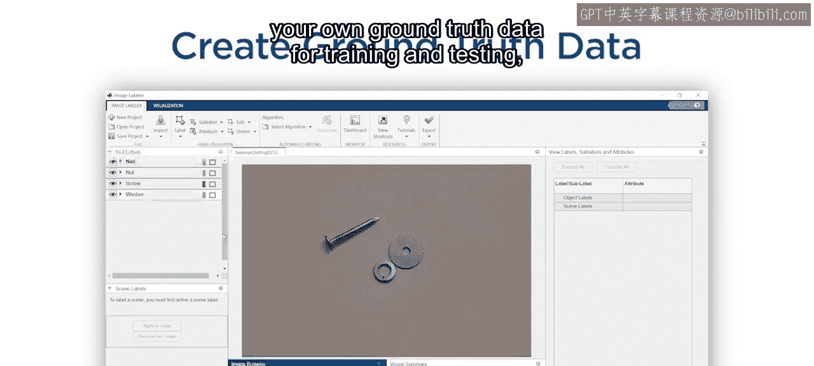

*   为图像添加带标签的边界框，以创建用于训练和测试的专属真实标注数据。

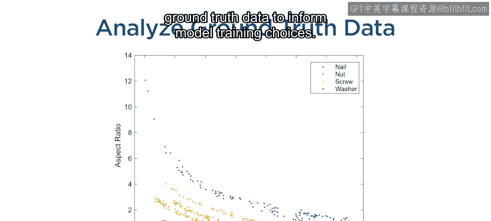

*   分析真实标注数据中类别、区域和宽高比的分布，为模型训练决策提供信息。

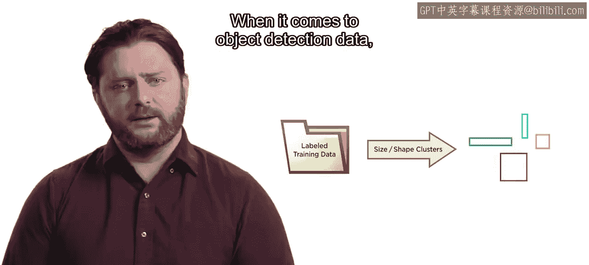

对于目标检测数据，提前对这些量进行分析可以避免后续的许多挫折和无效努力。

## 模型评估

最后，也是至关重要的一点，你实践了评估结果，以判断它们是否适用于你的应用。

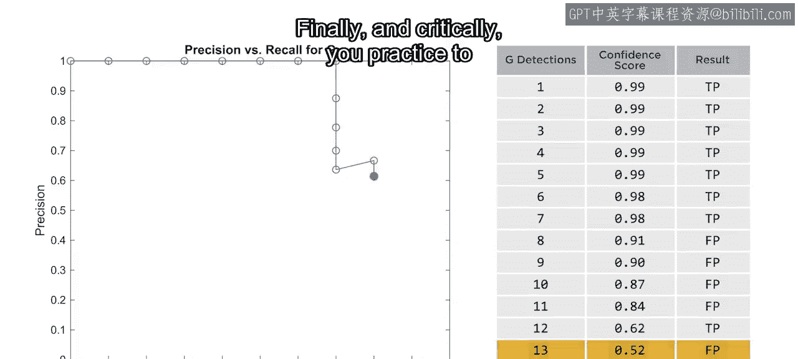

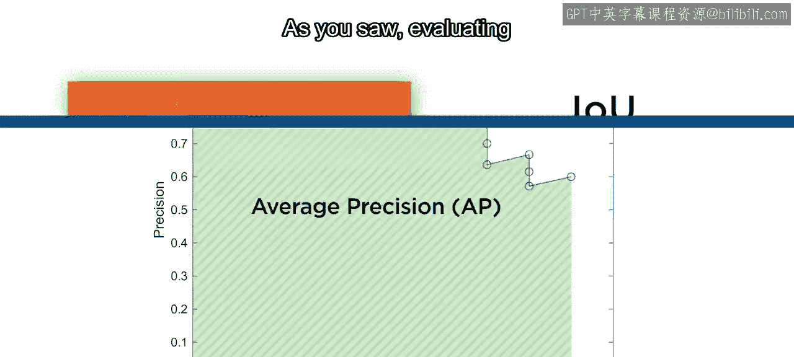

正如你所见，评估检测器涉及许多不同的指标。

请记住，要考虑哪些具体指标对你的需求最为关键。平均精度（mAP）为你提供了模型性能的总体概览。

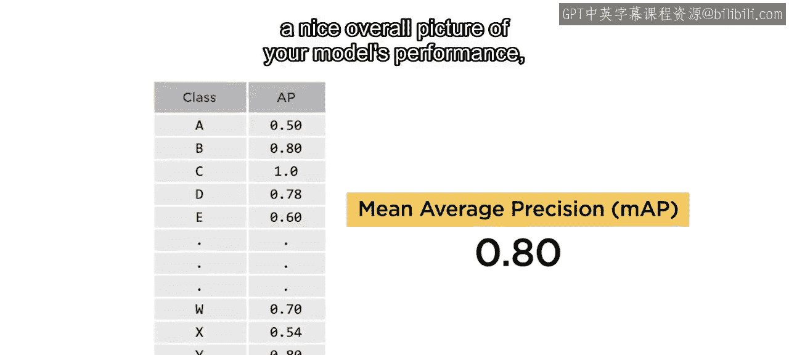

有时，对特定类别进行更深入的审视非常重要。在完成所有这些步骤后，你可能会得出结论：你只是需要更多的数据。

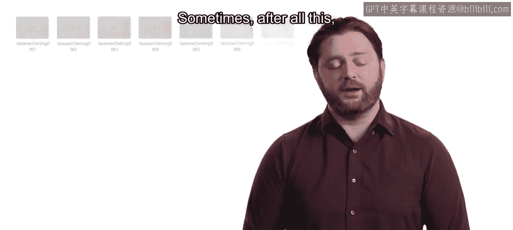

## 后续学习展望

获取越来越多的真实标注数据可能很困难。那么，有什么方法可以提供帮助吗？这是一个很好的问题。

在下一门课程中，你将使用一种称为**基于模型或AI辅助标注**的技术，利用数千张图像自动创建真实标注数据。当收集额外数据的成本很高时，你将学习如何对数据进行**人工增强**，这将使你能够训练出更有效的模型。

我们下节课再见。

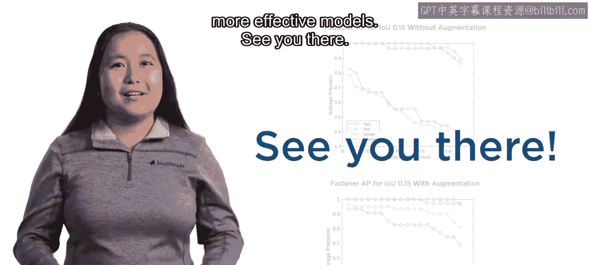

## 总结

本节课中我们一起学习了深度学习目标检测的核心流程：从应用预训练模型，到通过迁移学习进行定制化开发，再到数据准备、分析和模型评估。我们认识到，充分的数据分析和选择合适的评估指标对于项目成功至关重要。最后，我们了解到在数据不足时，可以采用AI辅助标注和数据增强等先进技术来提升模型性能。