# 深度学习在计算机视觉中的应用：26：课程概述

在本节课中，我们将要学习MathWorks推出的《深度学习在计算机视觉中的应用》系列课程的整体框架。该系列课程旨在帮助工程师和科学家掌握如何利用深度学习技术处理图像和视频数据，以解决实际问题。

## 课程背景与应用

定位汽车和行人、发现缺陷产品以及诊断疾病，是工程师和科学家利用深度学习处理图像和视频数据的几个典型例子。

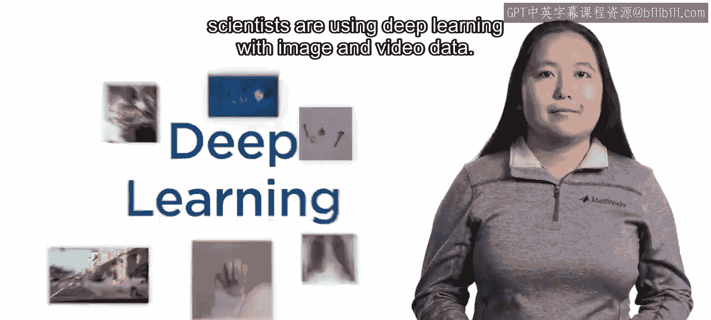

正因如此，MathWorks创建了《深度学习在计算机视觉中的应用》这门课程。这是一个在Coursera平台上提供的三部分系列课程。

## 课程一：深度学习基础与图像分类 🏁

在课程一中，我们将从基础开始，学习如何从零开始创建简单的模型。

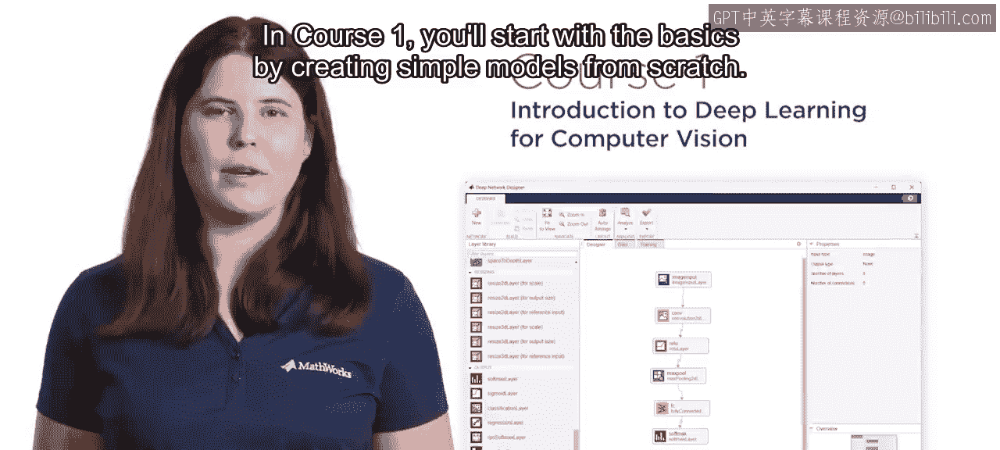

接着，我们将采用专家创建的模型，并应用一种名为**迁移学习**的技术，为新的应用场景重新训练这些模型。我们还将评估模型的性能，并调整关键参数以改进模型。

最后，我们将综合运用这些概念，创建自己的模型，用于对美国手语字母表的图像进行分类。

## 课程二：目标检测 🎯

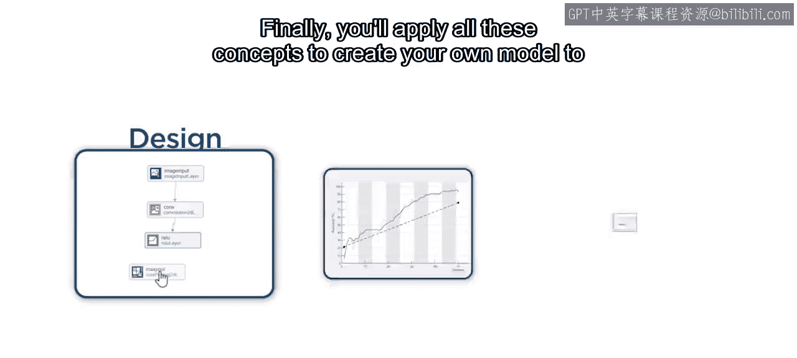

在计算机视觉中，定位图像内的物体是一个重要问题。

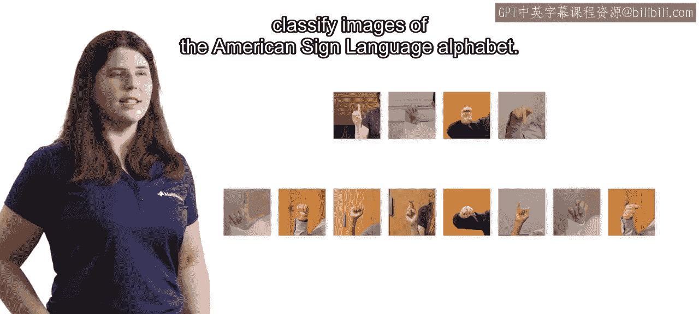

在课程二中，我们将训练如**YOLO**这样的目标检测模型。

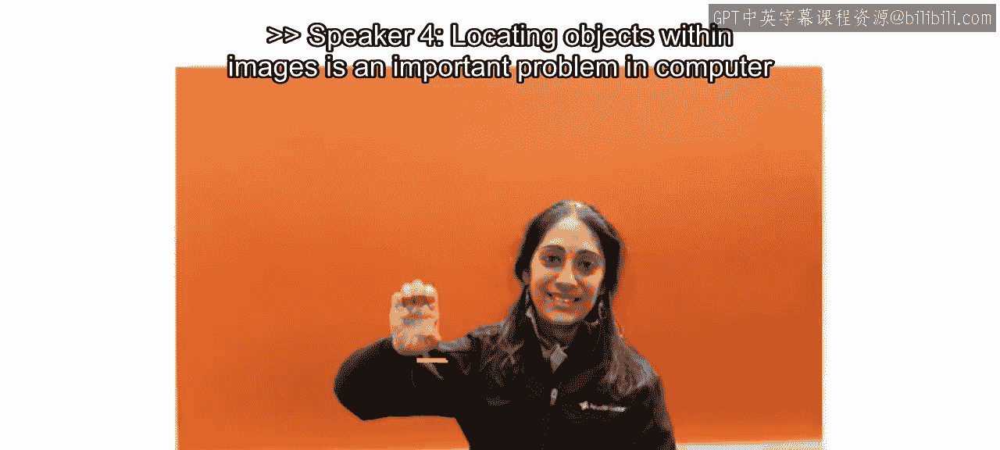

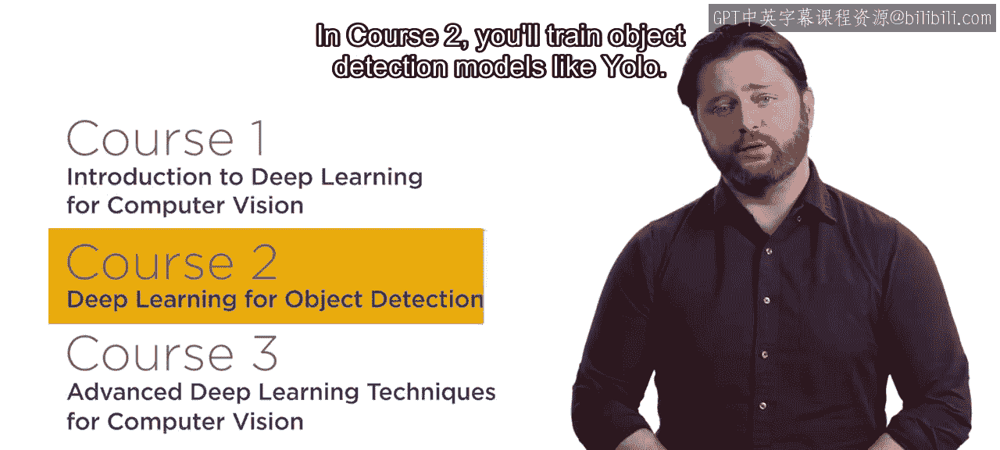

检测模型需要一种称为**真实标注**的标签数据。

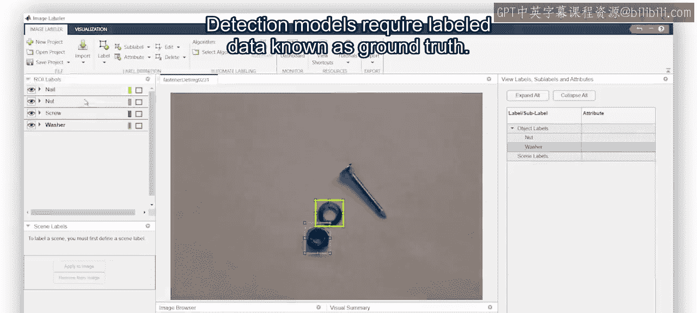

这包括**边界框**和定义物体的**标签**。我们将学习标注图像并分析真实标注数据，这有助于在训练模型前做出明智的决策。

评估检测模型较为复杂，因为模型必须为每个物体正确分配标签和位置。我们将练习评估多个模型，以便为您的应用选择最佳方法。

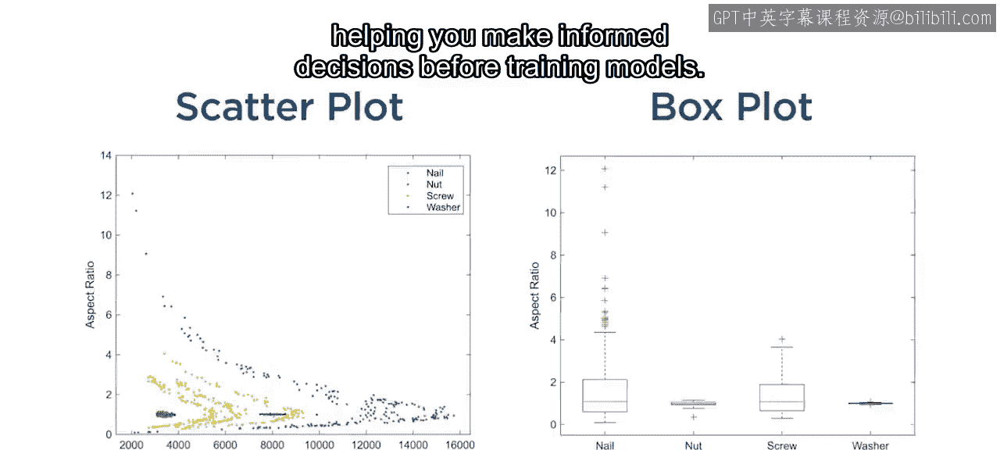

## 课程三：高级技术与挑战应对 🚀

在开始自己的深度学习项目时，您很可能会遇到一些挑战。

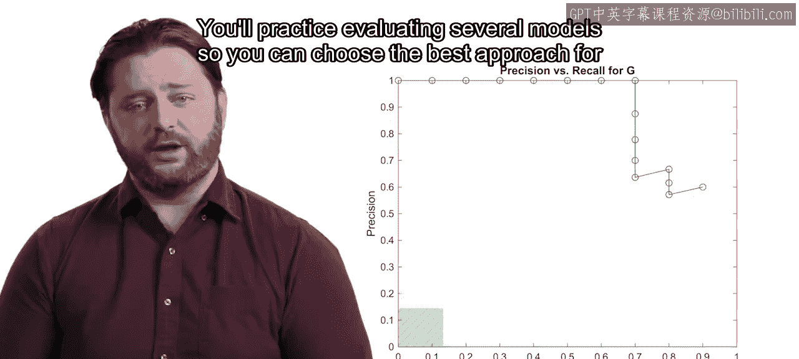

在课程三中，我们将学习解决常见问题并训练专用模型的技术。

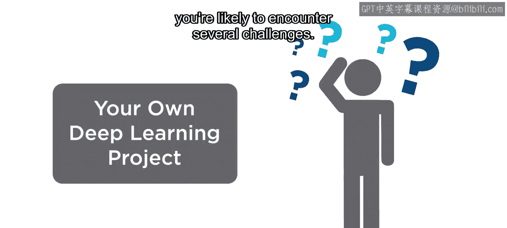

例如，收集图像可能既昂贵又耗时。

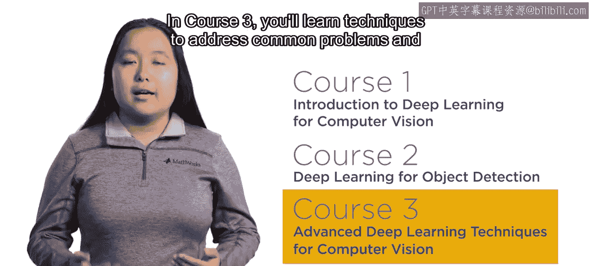

**数据增强**是在数据有限时改善结果的强大工具。

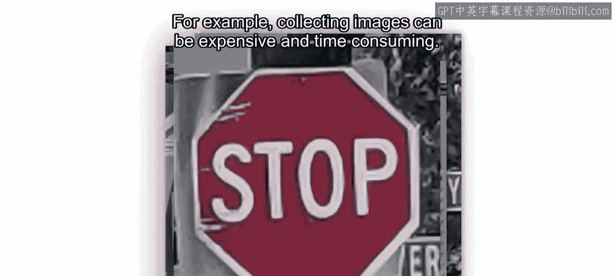

或者，您可能有数万张图像需要标注。我们将使用**AI辅助标注**来帮助标注图像，从而节省大量人工劳动。

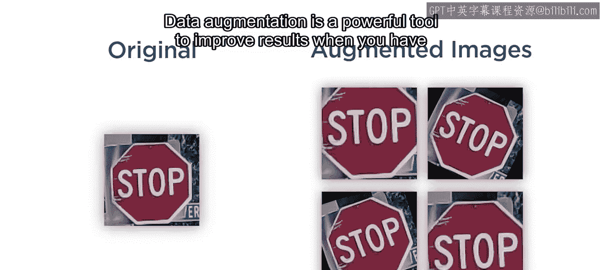

我们还将创建常用于制造业和医疗应用中的**异常检测模型**。

## 总结与展望

随着摄像头被集成到更多设备中，对计算机视觉和深度学习技能的需求将持续增长。

通过加入我们这个三部分系列课程，为您自己在这个快速发展的领域做好准备。

祝您好运。😊

---

本节课中我们一起学习了《深度学习在计算机视觉中的应用》系列课程的整体结构，涵盖了从基础图像分类、目标检测到高级应用与挑战应对的全流程。该课程旨在提供实践技能，以应对现实世界中的视觉识别任务。