# 深度学习在计算机视觉中的应用：27：计算机视觉中的高级深度学习技术 🎼

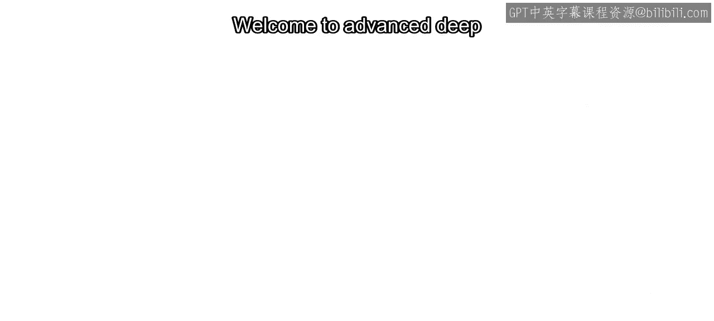

在本课程中，我们将探讨分类和目标检测工作流之外的常见挑战。

具体来说，你将学习如何构建一个异常检测器。

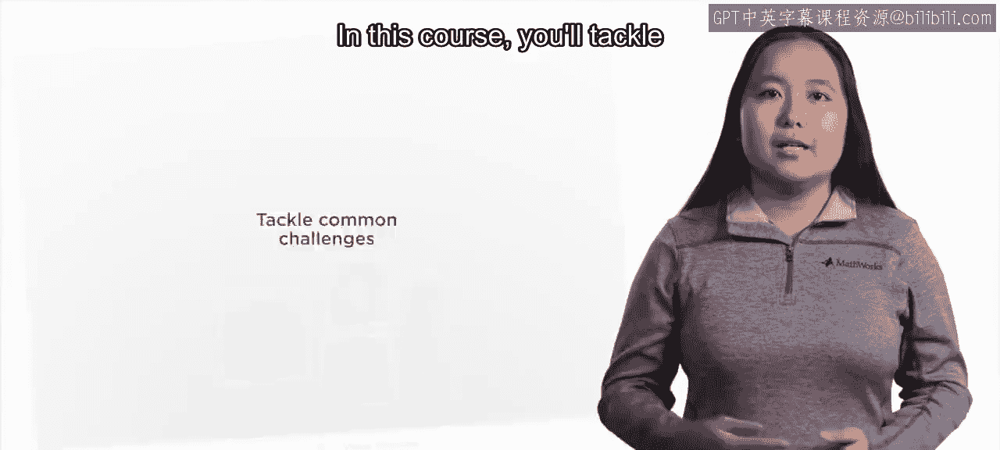

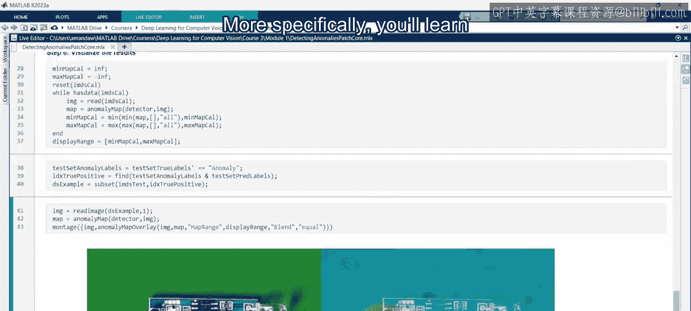

你将学习如何使用数据增强技术创建合成数据，并利用人工智能进行自动标注。

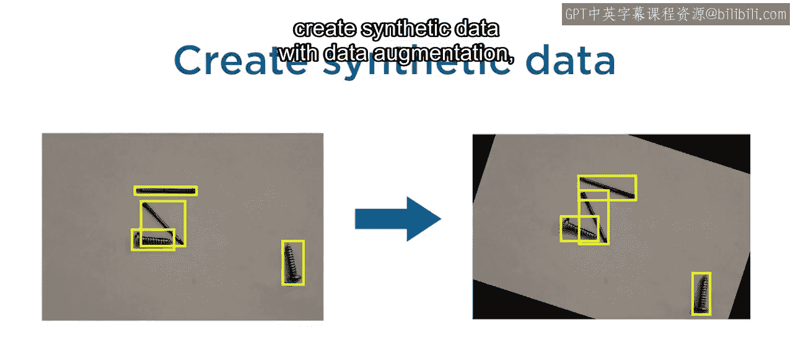

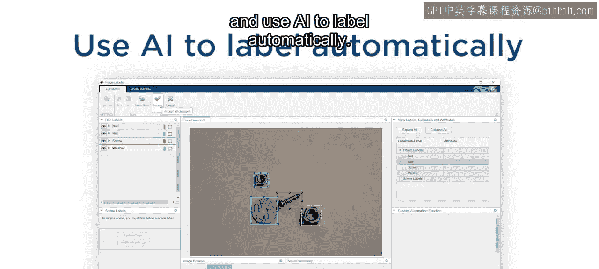

在训练和优化你的分类器或目标检测器之后，你可能会得出结论：需要更多样化的数据来构建一个更鲁棒的模型。

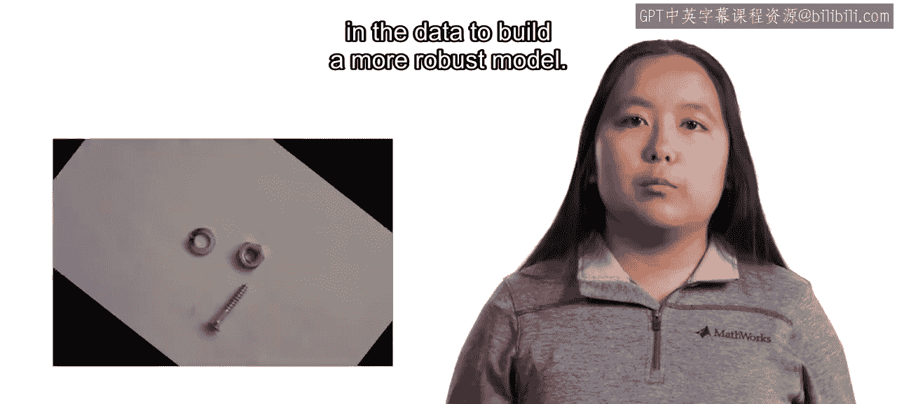

为了解决这个问题，你将使用一种名为**数据增强**的技术来创建合成图像，以补充你已有的数据。

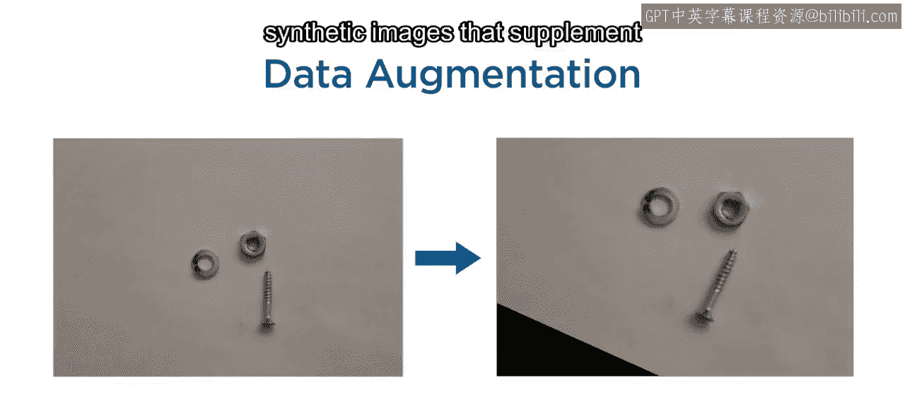

数据增强基于你指定的变换来生成新图像。

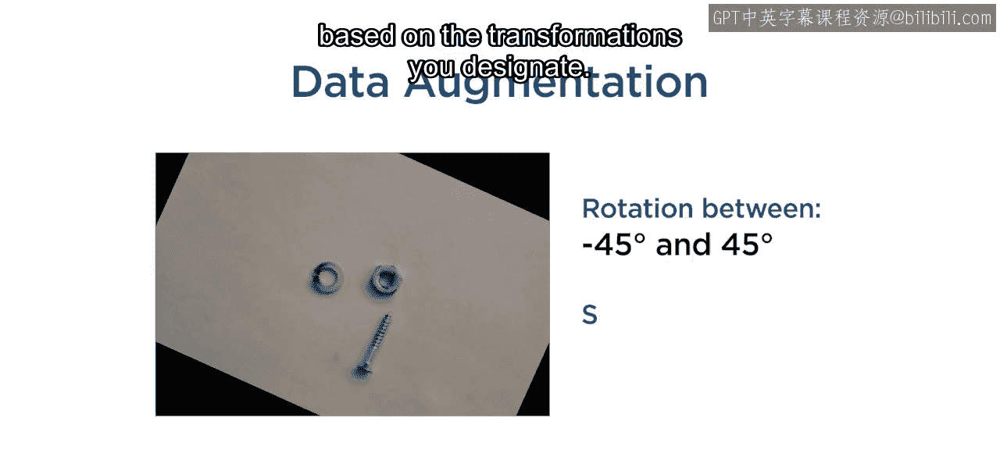

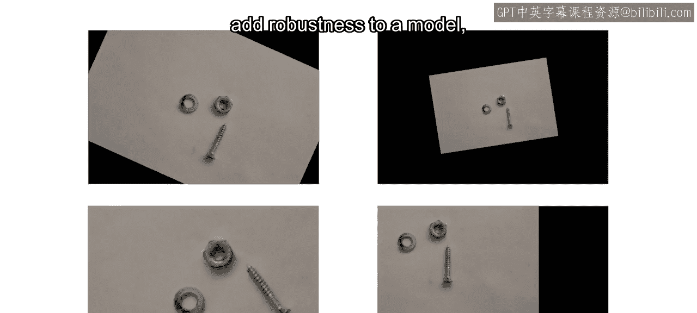

这种方法通常有助于增强模型的鲁棒性。

但有时，你仅仅需要收集更多数据来改善结果。如果你正在构建一个检测器，这意味着需要标注大量图像，这通常是繁琐的。

**模型辅助标注**，也称为**AI辅助标注**，可以帮助节省大量时间和精力。该技术使用现有的检测器来自动标注你收集的新图像和视频。

这些标注通常并不完美，因此你需要进行调整。

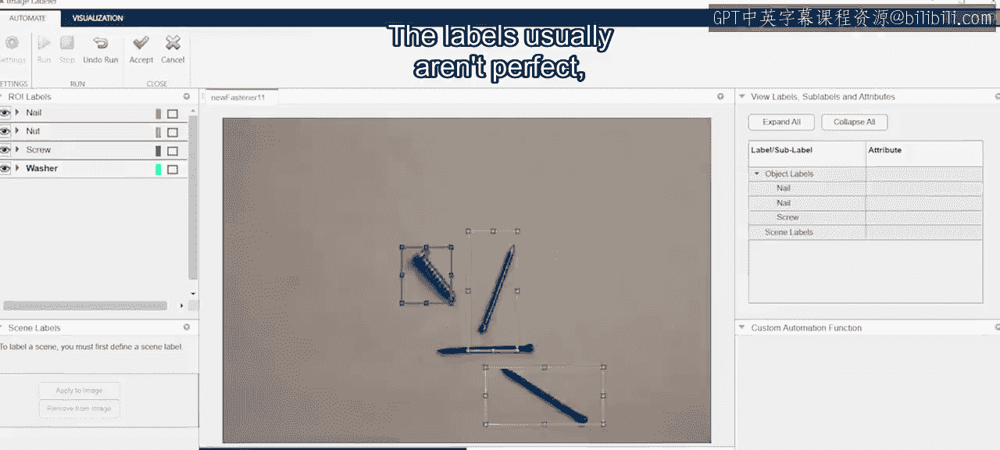

但调整标注比从头开始创建要快得多。

最后，如果你的应用需要检测异常情况怎么办？你并不确切知道要寻找什么，所以这既不是分类问题，也不是目标检测问题。这就需要一种新型的模型。

你将学习构建**异常检测模型**，用于识别这些印刷电路板上的任何缺陷，以及内窥镜图像中的任何医学异常。

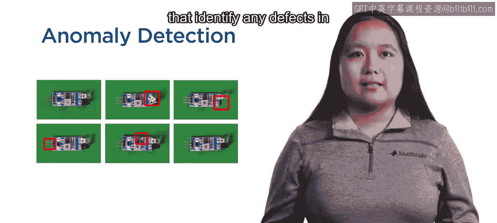

让我们开始吧。

---

本节课中，我们一起学习了计算机视觉中高级深度学习技术的三个核心方向：**数据增强**、**AI辅助标注**以及**异常检测**。这些技术旨在解决模型开发中数据不足、标注耗时以及未知缺陷检测等常见挑战，帮助你构建更强大、更高效的视觉应用系统。