# 深度学习在计算机视觉中的应用：28：检测异常 🎯

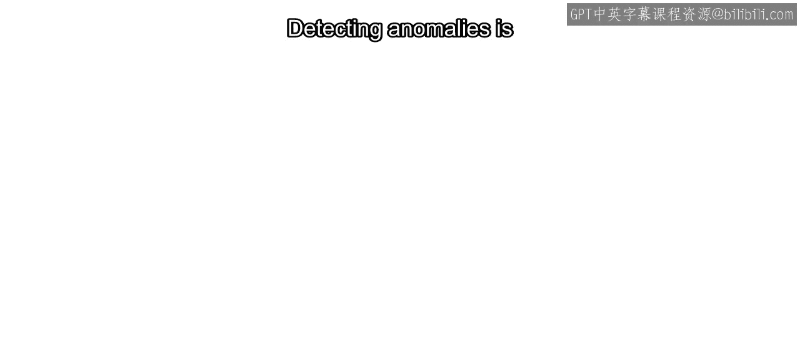

在本节课中，我们将要学习计算机视觉中一个重要且具有挑战性的任务——异常检测。我们将探讨其核心概念、工作原理，并了解它与分类和物体检测任务的区别。

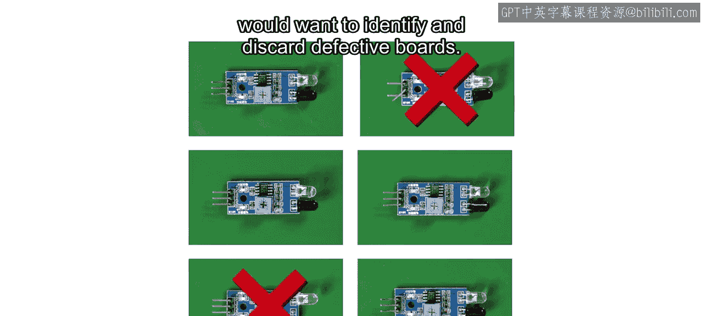

## 异常检测的重要性与挑战

检测异常是计算机视觉中一项重要但具有挑战性的任务。

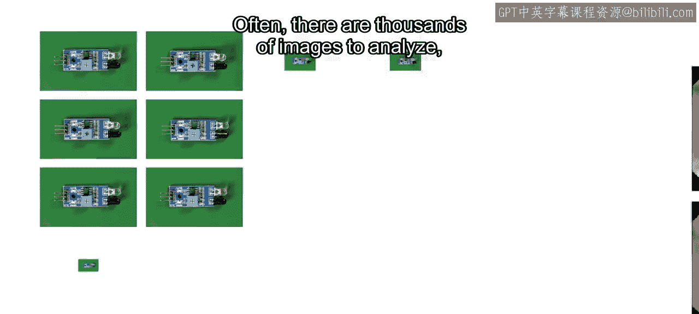

例如，一家生产印刷电路板的工厂需要识别并丢弃有缺陷的电路板。

医生也需要特别关注存在异常的医学影像。通常，需要分析的图像数量成千上万。

并且，异常可能相当难以发现。因此，人工逐一检查缺陷通常非常耗时。

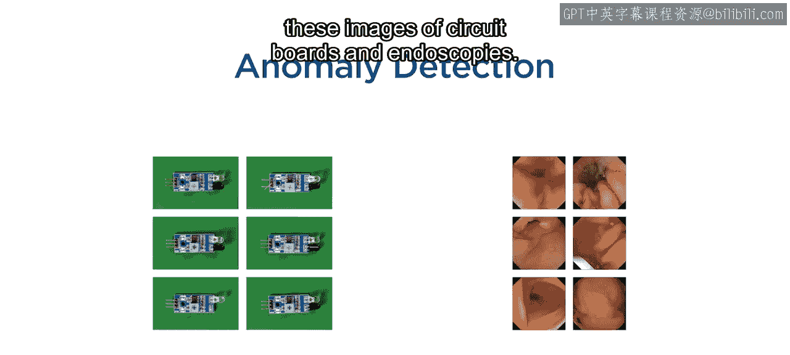

我们可以开发并使用人工智能模型来协助识别异常。在本视频中，你将通过研究这些电路板和内窥镜图像，学习异常检测背后的原理。

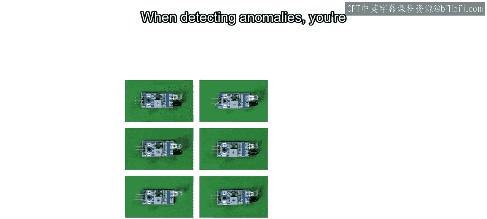

## 异常检测的目标

在进行异常检测时，我们通常是在图像主体中寻找异常。

例如，一个印刷电路板异常检测器应该能够识别出缺少或弯曲部件的电路板。

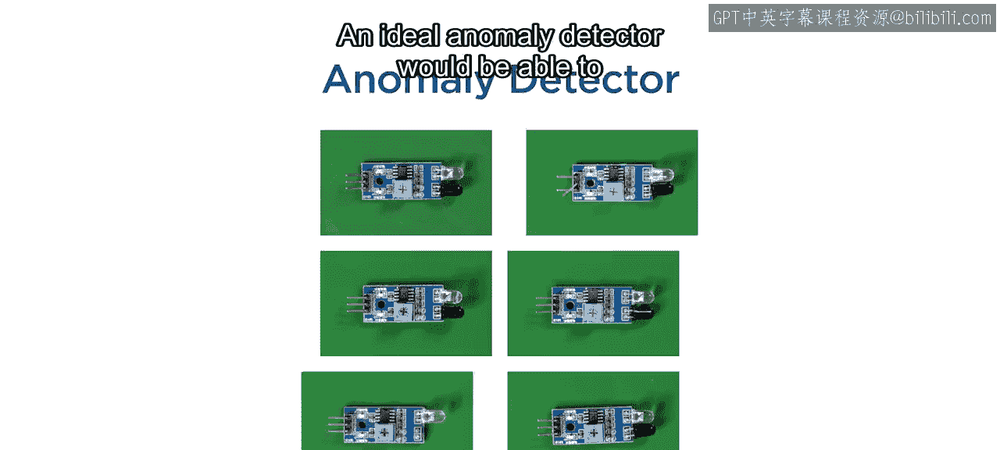

然而，它也可能识别出图像中更意想不到的异常，比如背景中的这个灰尘斑点或划痕。

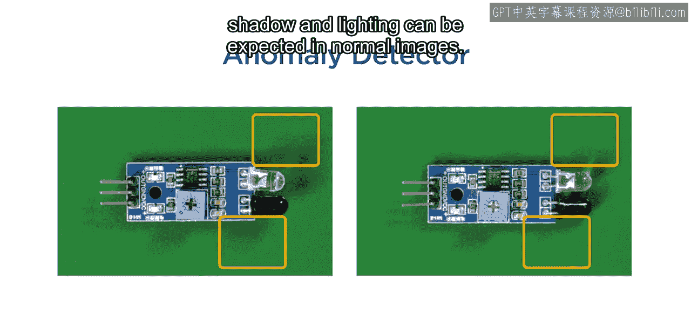

一个理想的异常检测器能够通过训练正常图像来避免这个问题。

## 训练数据与模型学习

通常，只需要几百张正常图像。模型会学习到，在正常图像中，灰尘斑点、阴影和光照差异是可以预期的。

此时，你可能想知道异常检测是属于分类还是物体检测的范畴。

虽然与两者相似，但它并不属于其中任何一类。

## 与分类任务的区别

异常检测类似于分类。因为我们有两类不同的图像：正常图像和异常图像。但它是一种**单类别分类**。因为你主要想确定一张图像是否属于正常类别。

你并不确切知道在异常图像中寻找什么。以内窥镜图像为例。如果你知道所有患者要么是健康的，要么有出血，要么有溃疡，那么你可以用这三个类别进行分类。

但如果模型看到不同的异常，比如息肉或卡住的药丸，这个模型就无法工作。

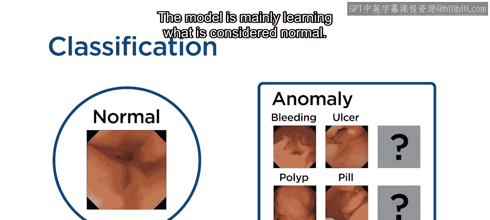

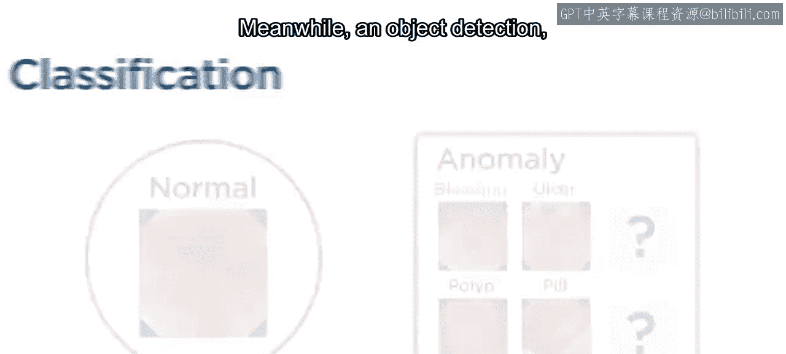

你希望异常检测器能将任何不寻常的东西识别为异常，无论是出血、溃疡、息肉、异物还是其他东西。

模型主要学习什么被认为是正常的。

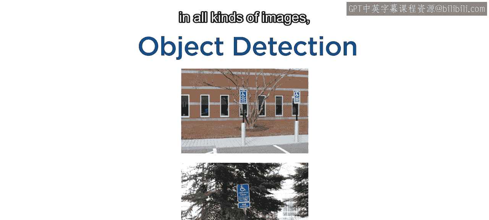

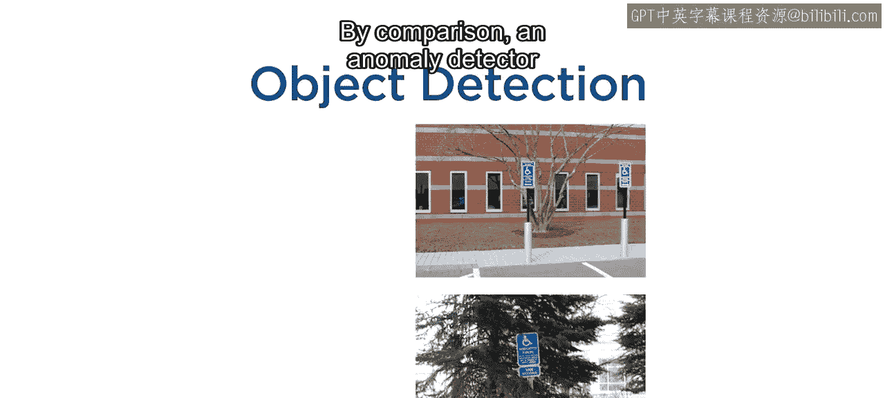

## 与物体检测任务的区别

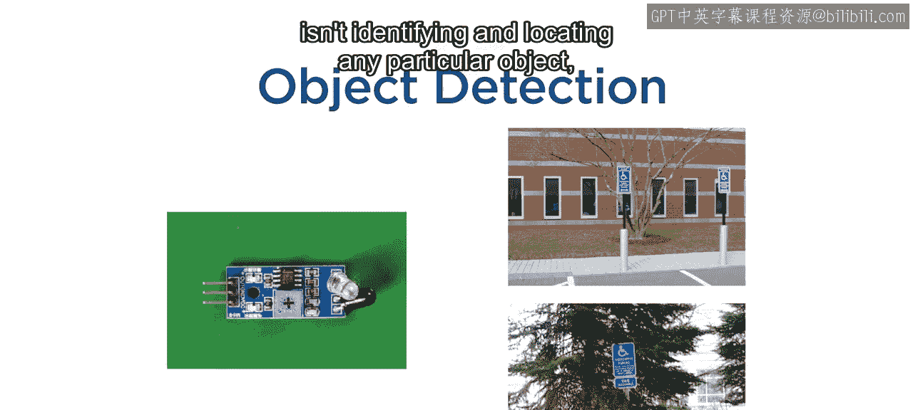

与此同时，物体检测任务通常是在各种图像中定位特定的主体，例如不同环境下的无障碍停车标志。

相比之下，异常检测器并不是在识别和定位任何特定的物体。

而是识别图像的哪一部分与常态不同。即使这个异常是它从未见过的东西。

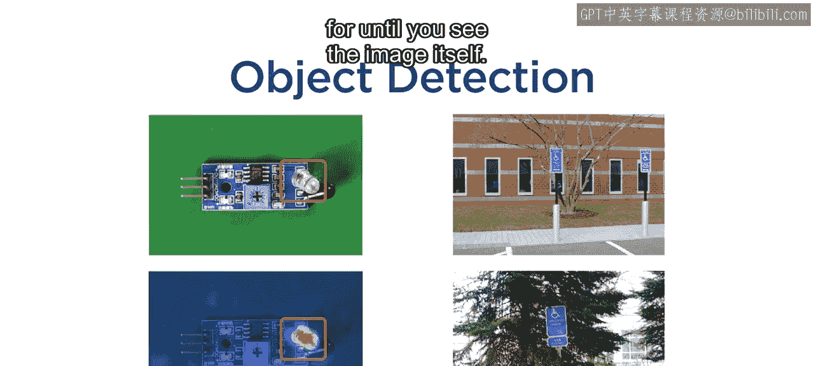

虽然你仍然在检测图像中的某些东西，但在看到图像本身之前，你并不确切知道你在寻找什么。

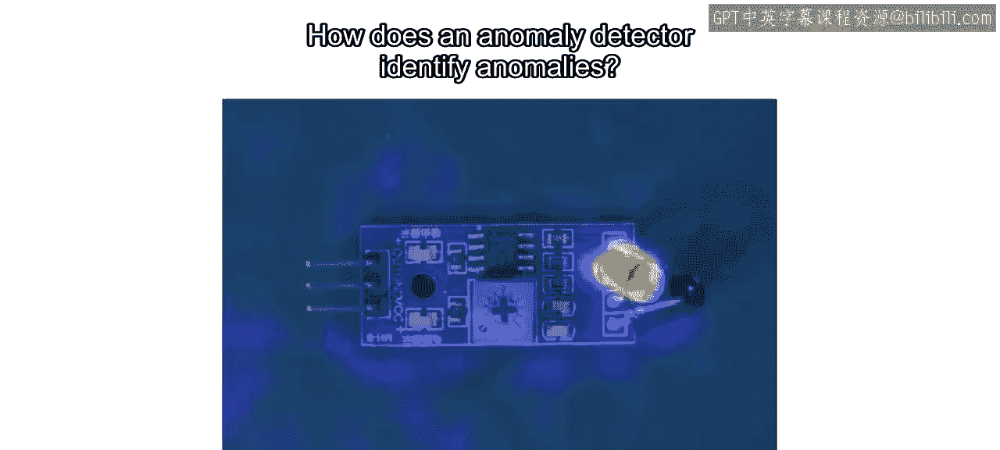

## 异常检测的工作原理

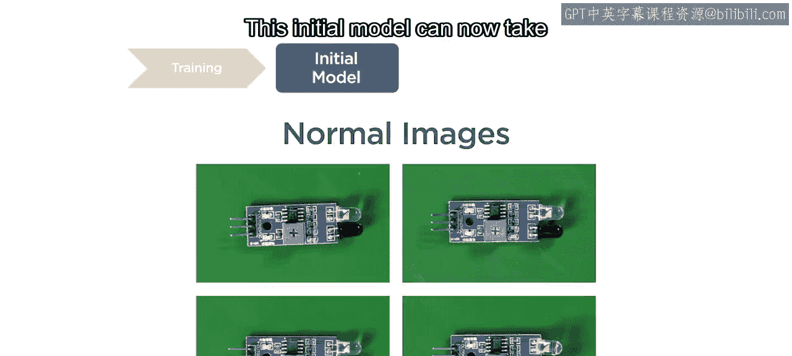

那么，异常检测器是如何识别异常的呢？

首先，模型通常在**仅包含正常图像的数据集**上进行训练。

这个初始模型现在可以处理一张新图像。

并为每个像素分配一个**异常分数**，表示它认为该像素正常或异常的程度。较低的值表示更正常的像素，较高的值则暗示存在异常。图像还有一个**整体异常分数**。

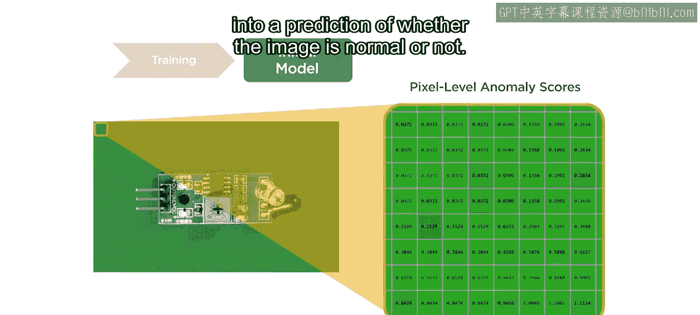

这个分数要么是所有像素级异常分数的平均值，要么是最大值，具体取决于模型。然而，你需要将这些数字转化为图像是否正常的预测。

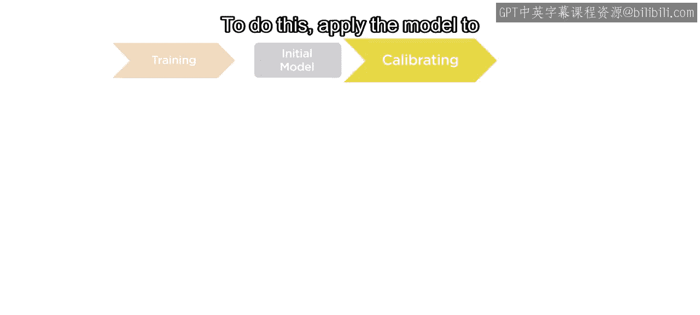

## 确定分类阈值

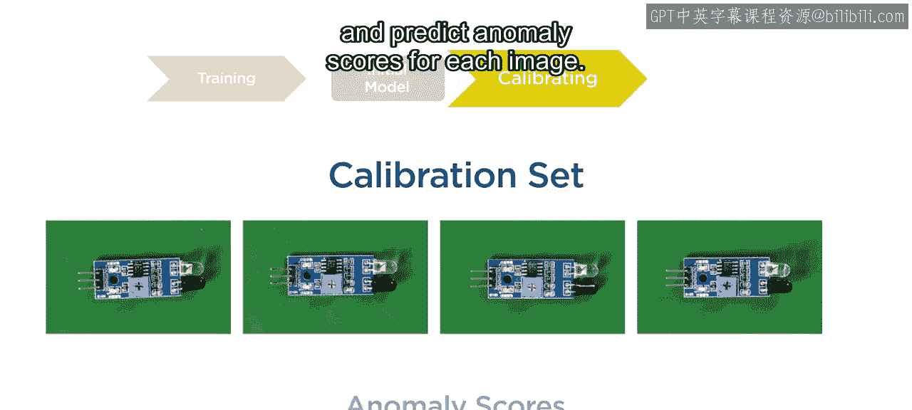

为此，将模型应用于一组称为**校准集**的图像。

并预测每张图像的异常分数。

绘制出校准集异常分数的分布图后，确定一个**阈值**。模型将使用这个阈值来对未来的新图像进行分类。

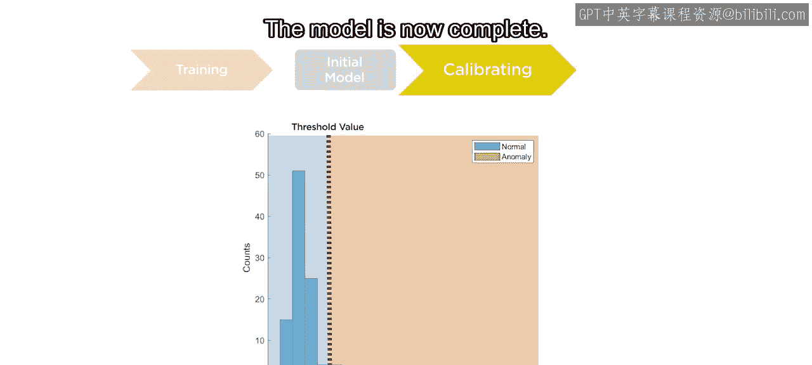

任何异常分数低于此值的新图像都被归类为正常，分数更高的图像则被归类为异常。理想情况下，正常图像和异常图像的分数之间会有很大的分离。

## 模型应用与结果解读

现在模型已经完成。你可以使用你的模型来**分类图像是否有异常**，并通过在原始图像上叠加显示像素级异常分数来**可视化图像中似乎包含异常的区域**。

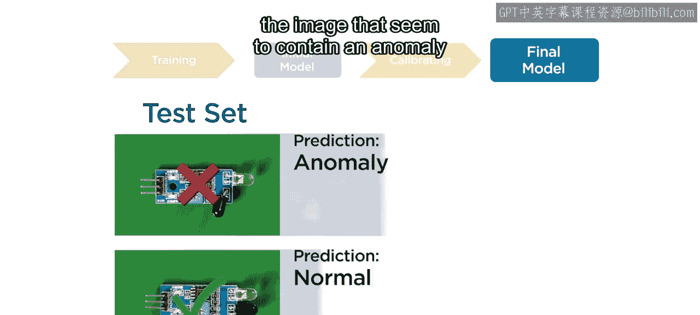

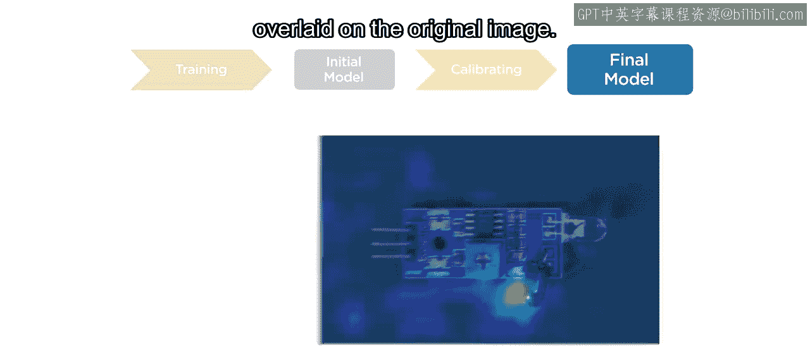

请记住，异常检测器不会告诉你异常是什么。它只是表明图像中的某些东西与模型学到的正常情况不同。

因此，异常检测器可用于快速识别需要进一步调查的图像。

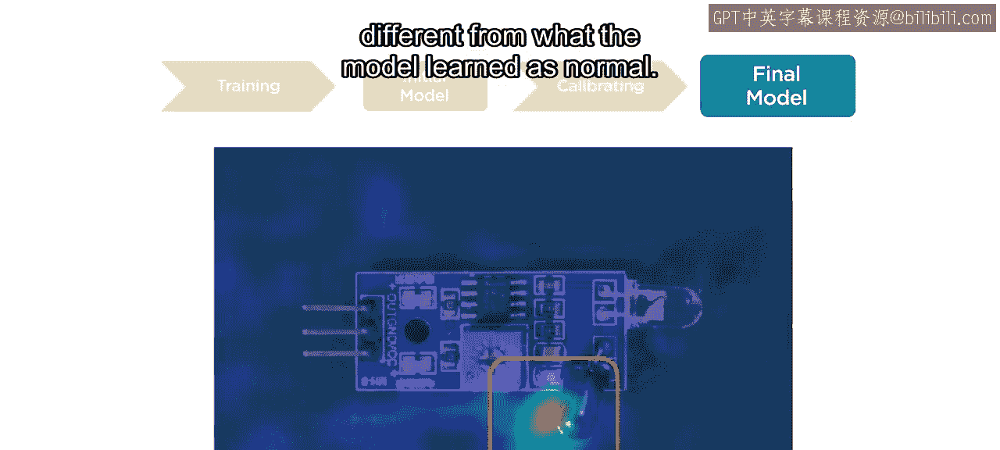

## 总结

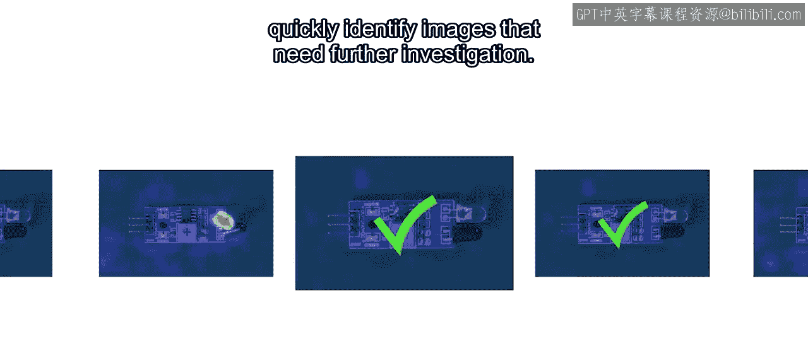

在本节课中，我们一起学习了异常检测的核心概念。我们了解到异常检测是一种特殊的单类别分类任务，它通过训练正常样本来学习“常态”，并据此识别任何偏离常态的“异常”。其工作流程包括：在正常数据上训练模型、计算新图像的像素级和整体异常分数、利用校准集确定分类阈值，最终实现对异常的检测与定位可视化。这为快速筛选海量图像、聚焦潜在问题区域提供了高效的工具。

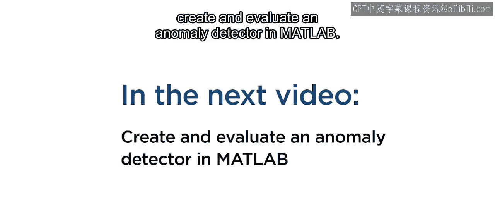

在下一个视频中，你将学习如何在 MATLAB 中创建和评估一个异常检测器。