# 深度学习在计算机视觉中的应用：29：在MATLAB中检测异常

在本节课中，我们将学习如何使用MATLAB来检测印刷电路板（PCB）中的异常。异常检测在从制造业到医疗保健的众多行业中都是一项重要任务。我们将遵循一个清晰的六步流程，从选择算法到可视化结果，逐步构建一个异常检测模型。

## 概述：异常检测的六个步骤

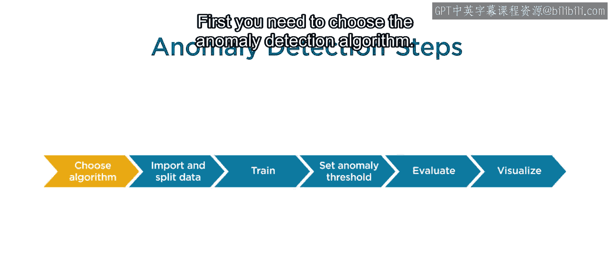

在MATLAB中开发一个异常检测器主要包含以下六个步骤：
1.  选择检测算法。
2.  导入并分割数据。
3.  训练算法。
4.  设置异常阈值。
5.  评估模型。
6.  可视化结果。

接下来，我们将逐一详细探讨每个步骤。

## 第一步：选择检测算法 🧠

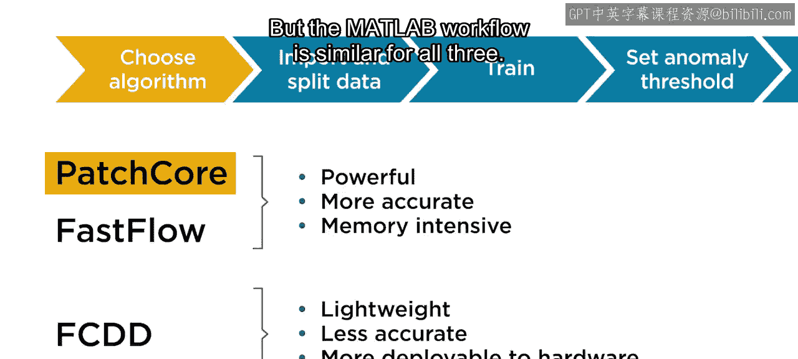

首先，你需要选择一个合适的异常检测算法。MATLAB中提供了几种常见的算法，例如：
*   **PatchCore**
*   **FastFlow**
*   **Fully Convolutional Data Description (FCDD)**

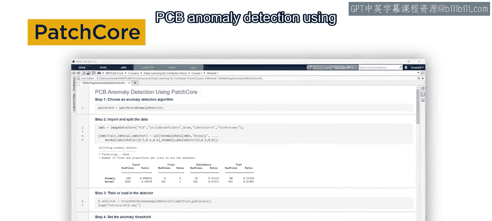

每种算法都有其优缺点。例如，与FCDD相比，FastFlow和PatchCore检测器能生成更强大和精确的模型，但它们的训练和使用过程对内存的要求也更高。

在本教程中，我们将使用**PatchCore**，因为它是最常用的算法之一。不过，MATLAB中这三种算法的工作流程是相似的。

## 第二步：导入并分割数据 📂

上一节我们介绍了算法选择，本节中我们来看看如何准备数据。在MATLAB中，打开课程文件中的“使用PatchCore进行PCB异常检测”脚本。

以下是数据准备的具体步骤：
1.  **初始化检测器**：首先，初始化PatchCore检测器。
2.  **导入数据**：将电路板图像数据导入到一个`imageDatastore`中。本示例的数据位于一个包含两个子文件夹（`normal`和`anomaly`）的文件夹中。导入时需包含这两个子文件夹，并使用文件夹名称作为图像标签。
3.  **分割数据**：将数据分割为训练集、校准集和测试集。需要传入数据存储、指定为异常的标签，以及每个数据集中应包含的正常和异常图像的比例。

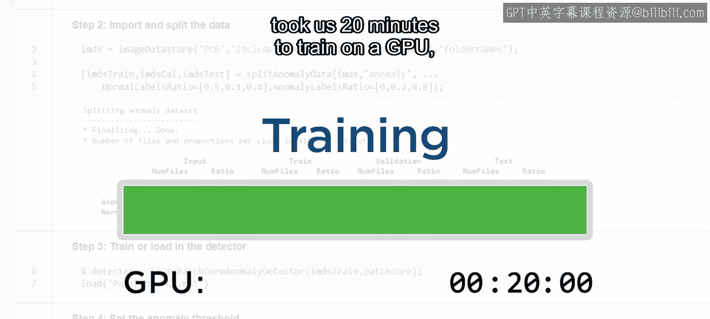

## 第三步：训练算法 🏋️

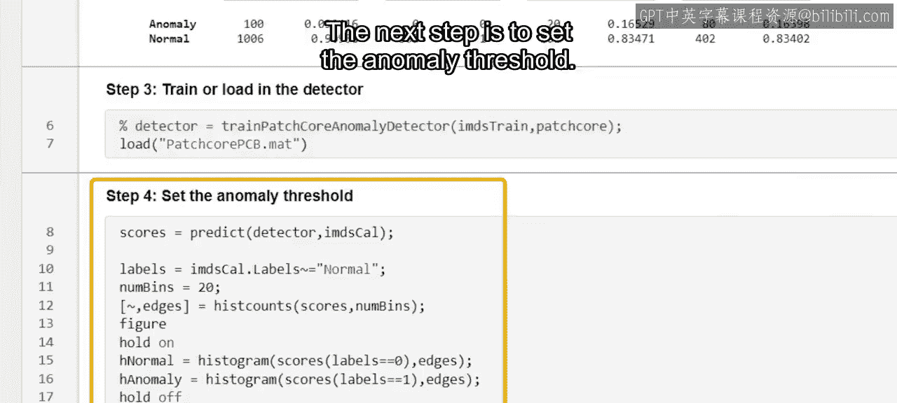

现在你已经有了模型和数据，可以开始训练了。使用训练数据和未训练的检测器作为输入，并保存生成的模型。

请注意，训练通常需要很长时间。因此，通常只有在拥有可用GPU的情况下才自行执行此步骤。例如，这个模型在GPU上训练花了20分钟，但在CPU上可能需要数小时。

如果你没有GPU也不必担心，我们提供了一个预训练模型，你可以直接加载它。

## 第四步：设置异常阈值 📊

上一节我们完成了模型训练，本节中我们来看看如何确定一个有效的异常阈值。请记住，训练好的模型会在像素级和图像级产生异常分数。

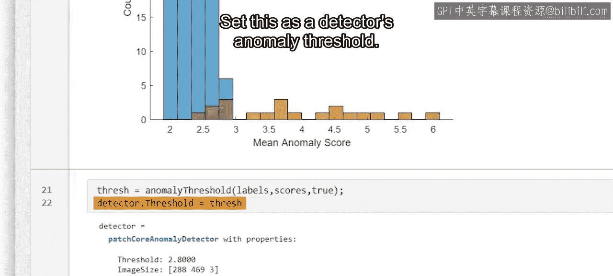

**图像级异常分数 > 异常阈值** 的图像被视为异常。

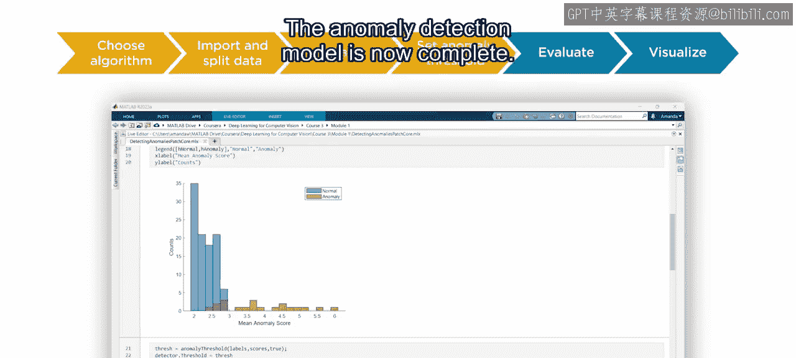

为了确定合适的异常阈值，我们可以预测校准集中所有图像的图像级异常分数，并通过直方图可视化正常图像和异常图像的异常分数分布。

通常从图中很难直接看出最佳阈值。幸运的是，MATLAB提供了一个函数，可以使用统计方法来计算阈值。该函数需要校准集标签、预测的图像级异常分数以及异常标签来生成阈值。将此值设置为检测器的异常阈值。

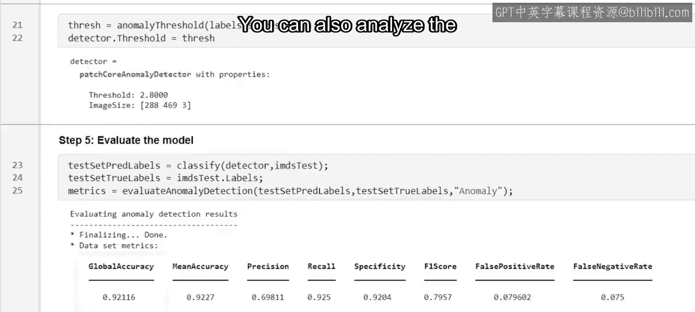

## 第五步：评估模型 📈

现在，异常检测模型已经构建完成。通过分类测试集中的每张图像，并使用内置的评估函数将其与真实标签进行比较，来评估模型。

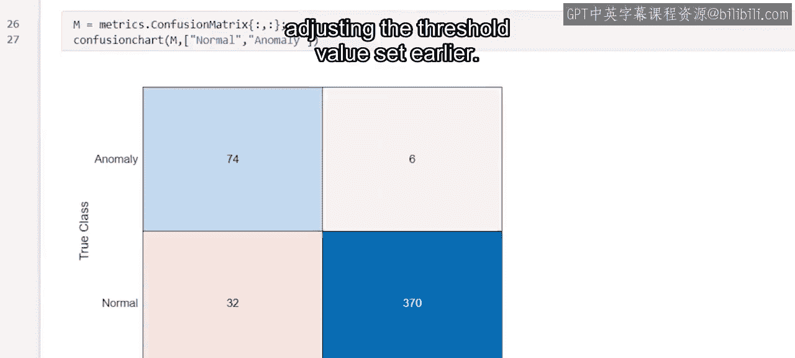

这会为你提供几个不同的评估指标，最值得注意的是整体或全局准确率。你还可以在混淆矩阵中分析评估结果，该矩阵显示了两个类别的预测准确率。

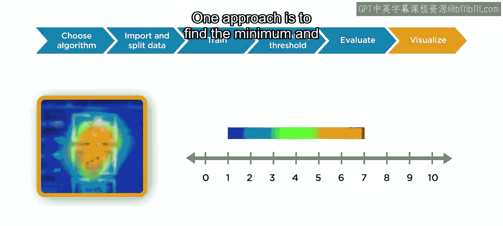

这些结果看起来相当不错。根据你的应用需求，你可以通过调整之前设置的阈值来改变结果。

## 第六步：可视化结果 👁️

最后，可视化异常图是一个好主意，这有助于你更好地理解模型并识别异常位置，因为它们可能并不总是显而易见。

以下是创建异常图的方法：
1.  **确定颜色映射范围**：一种方法是找出所有校准图像中的最小和最大异常像素分数，将最小像素分数设置为色谱的一端，最大分数设置为另一端。将这些值保存为显示范围。
2.  **选择要检查的图像**：让我们关注那些被正确识别为异常的测试图像，以查看模型是否确实在预期位置识别出了异常。
3.  **生成并叠加异常图**：读入第一张测试图像，获取每个像素的异常分数，然后使用之前保存的显示范围，将像素值叠加到原始图像上显示。

这看起来代码量很大，但请记住，你可以在课程文件中找到它，以便更仔细地研究。

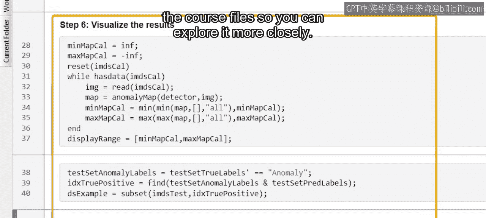

看起来模型在这里做得很好。左侧有几个零件弯曲了，模型识别出图像该区域的像素具有最高的异常分数。可视化更多图像的预测结果，以查看模型的整体表现。

通常很难理解各种深度学习模型是如何做出决策的。因此，像这样的可视化工具是深入了解模型并窥探其决策过程的绝佳方式。

## 总结

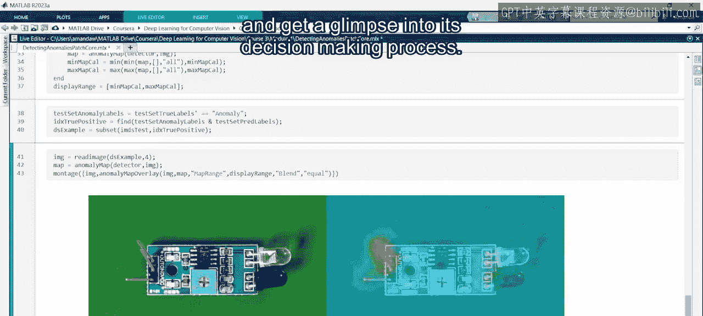

本节课中，我们一起学习了在MATLAB中使用PatchCore算法进行PCB异常检测的完整流程。我们从选择算法开始，逐步完成了数据准备、模型训练、阈值设定、模型评估，最后通过可视化异常图来直观理解模型的检测效果。这个六步流程为你构建自己的异常检测应用提供了一个清晰的框架。