# 深度学习在计算机视觉中的应用：30：数据增广简介 🎼

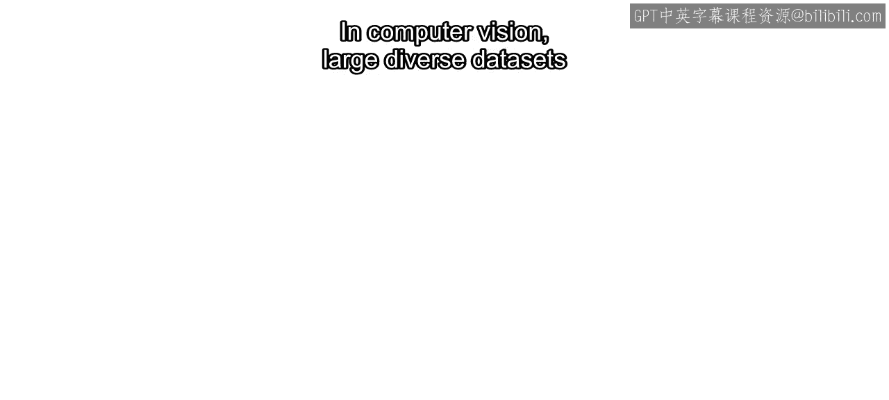

在本节课中，我们将要学习数据增广技术。这是一种在数据集有限或缺乏多样性时，通过应用一系列图像变换来生成合成数据，从而提升模型准确性和鲁棒性的重要方法。

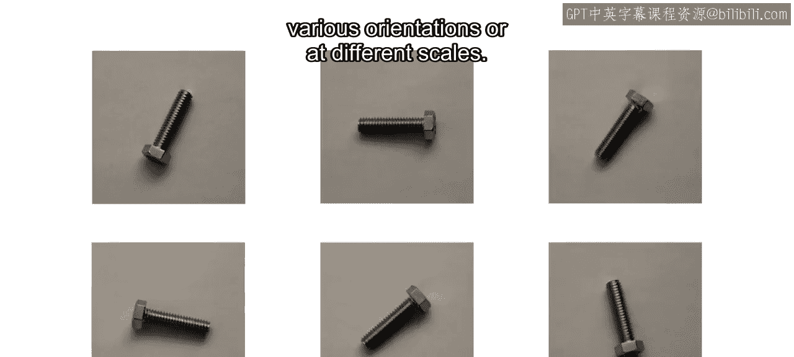

## 概述

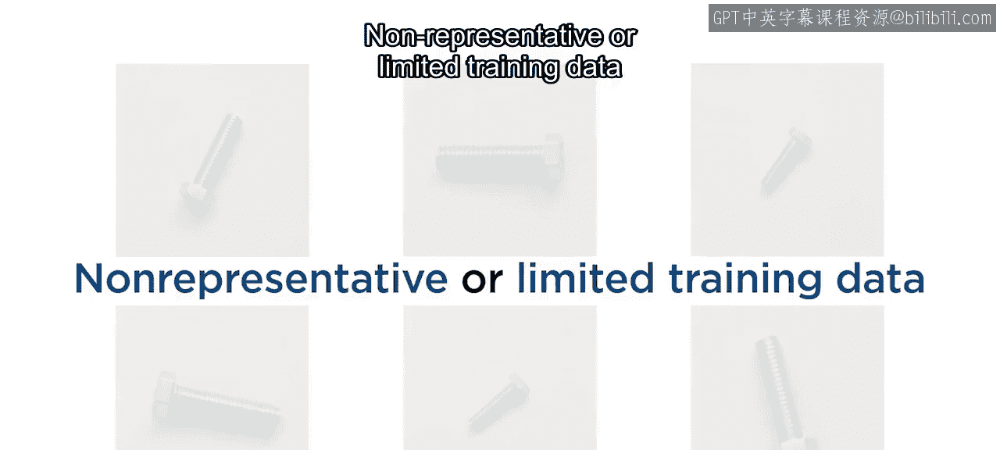

在计算机视觉领域，大型且多样化的数据集对于训练准确且鲁棒的模型至关重要。然而，获取这样的数据集可能具有挑战性且成本高昂，因为物体经常以各种方向出现，或者以不同的尺度呈现。不具代表性或有限的训练数据可能导致模型准确性下降。

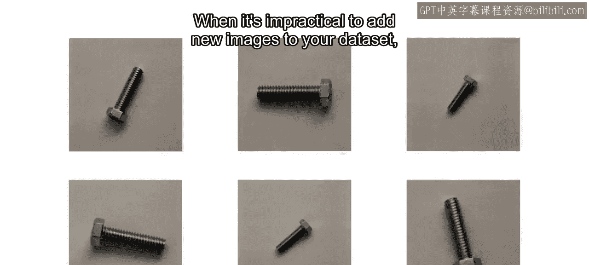

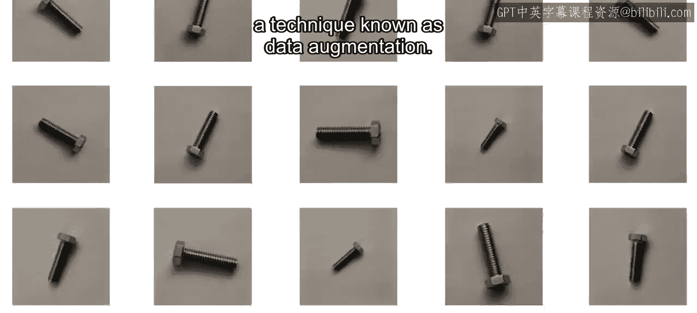

当向数据集中添加新图像不切实际时，你仍然可以通过一种称为**数据增广**的技术来使其多样化。

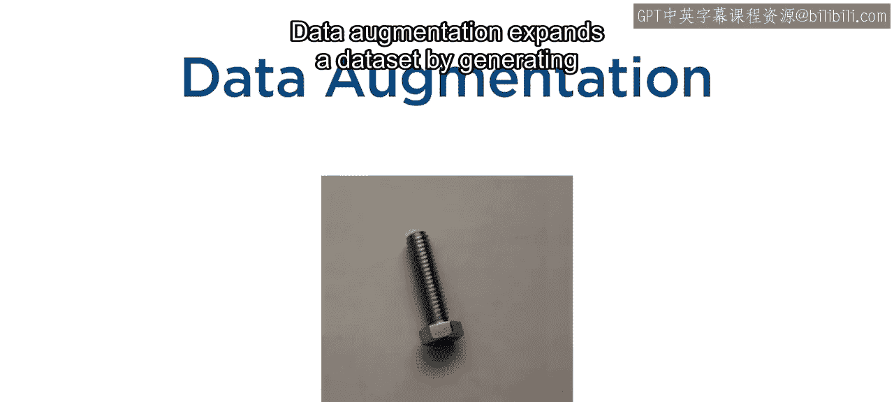

## 什么是数据增广？

数据增广通过使用变换来生成合成图像，从而扩展数据集。例如，旋转或缩放。通过利用数据增广，你可以模拟一个更大、更全面的训练集，并帮助模型实现更好的泛化能力。

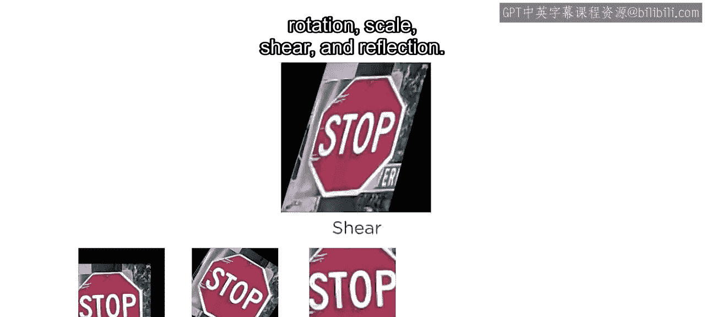

增广通常基于五种类型的变换：

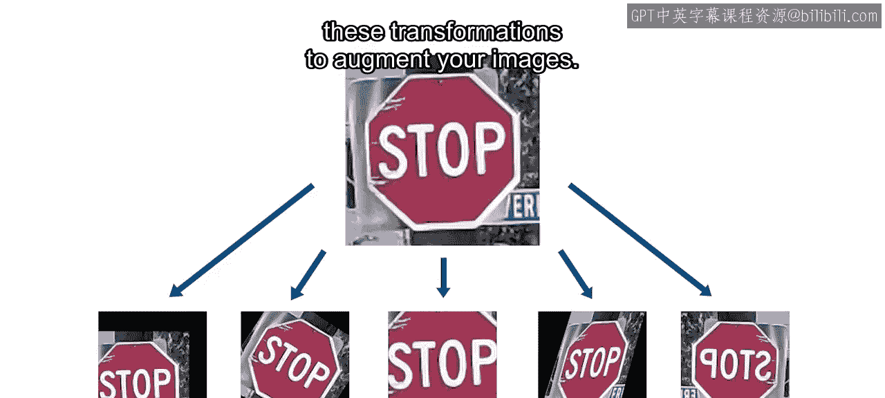

以下是五种核心的变换类型：

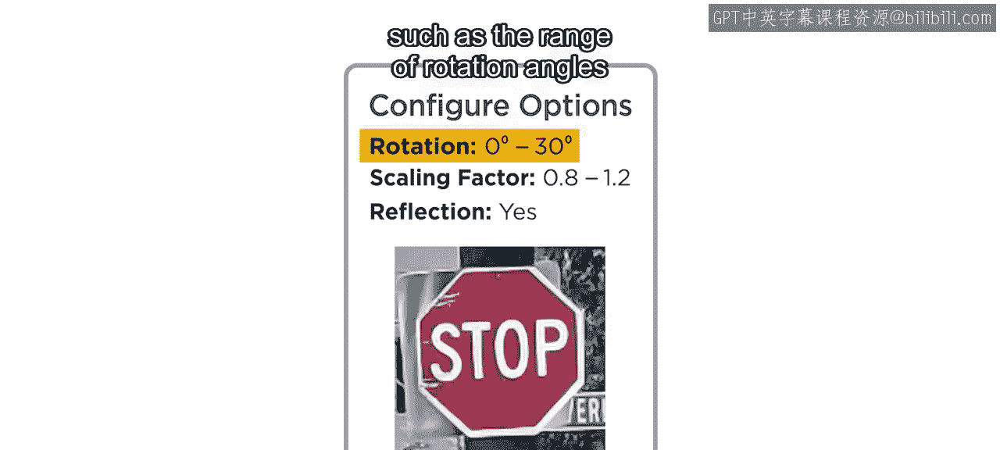

*   **平移**
*   **旋转**
*   **缩放**
*   **剪切**
*   **翻转**

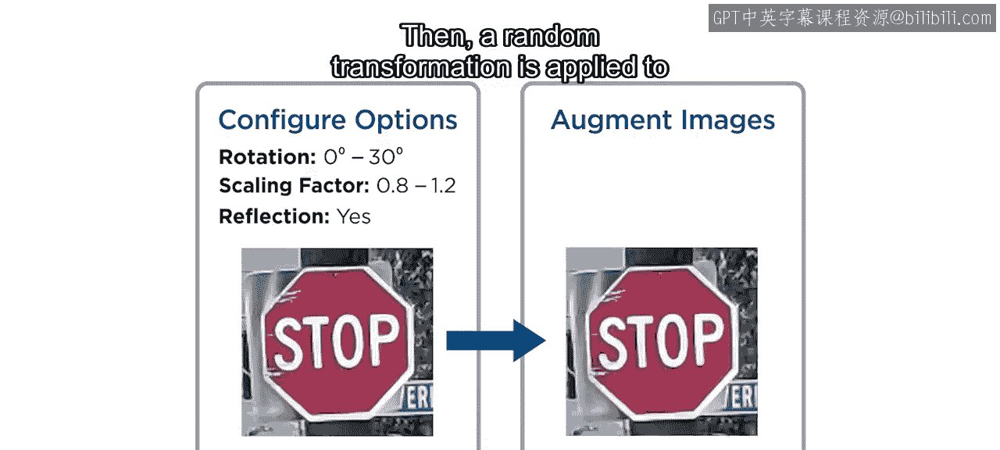

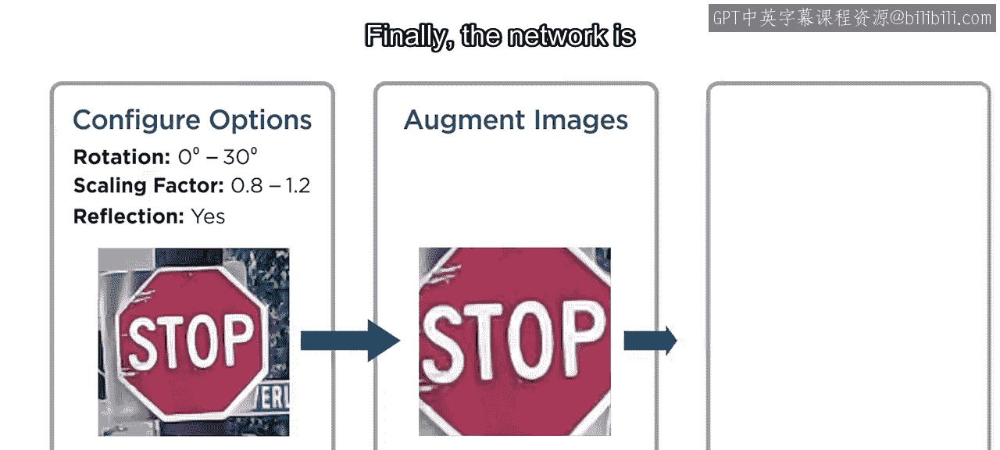

你可以使用这些变换的任意组合来增广你的图像。

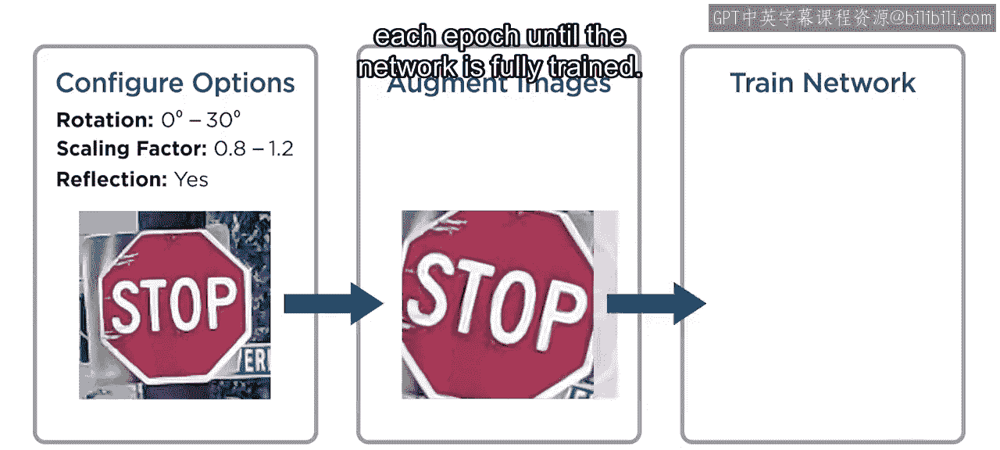

## 增广过程是如何工作的？

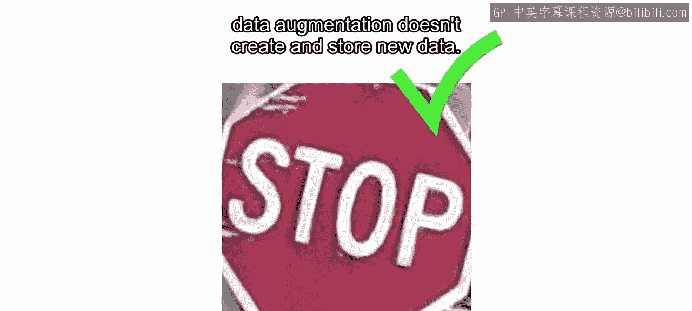

上一节我们介绍了数据增广的基本概念，本节中我们来看看它的具体实施过程。

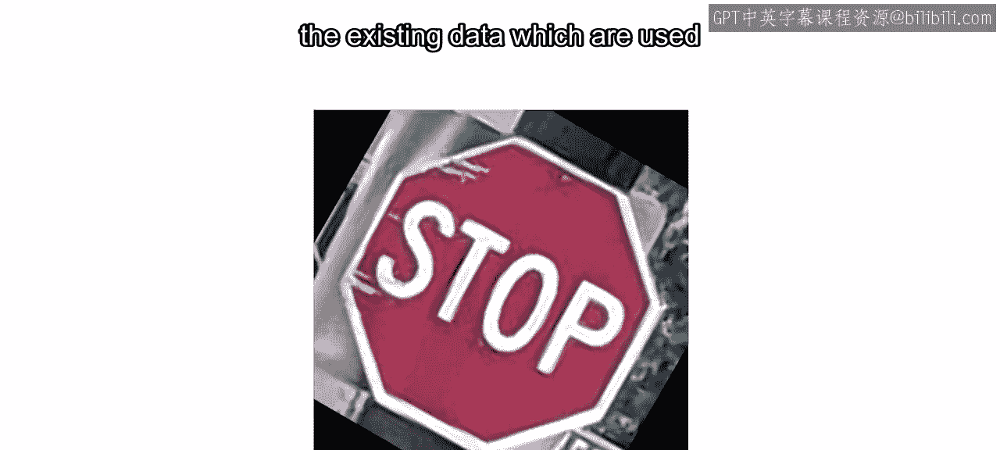

增广过程首先设置变换的参数，例如旋转角度的范围或缩放百分比。然后，根据此配置，对训练集中的每个图像应用随机变换。最后，使用增广后的图像训练网络。这个过程在每个训练周期（epoch）都会重复，直到网络完全训练完毕。

需要重点注意的是，数据增广**不会**创建和存储新的数据文件。相反，它生成现有数据的增广版本，这些版本在训练期间被立即使用，然后被丢弃。

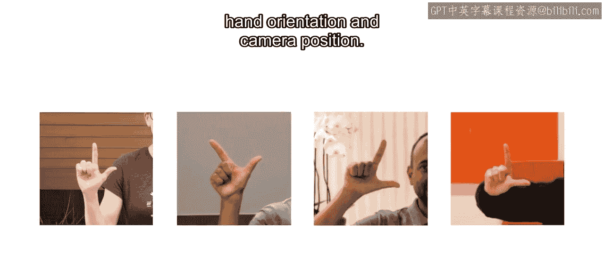

## 一个实际应用案例

让我们看看如何使用这个美国手语字母数据集来执行增广。该数据集包含不同人手语字母的图像。在这个数据集中，每张图像代表一个特定的字母。然而，人们的手势方式不同，我们的数据集在手部方向和相机位置方面缺乏变化。

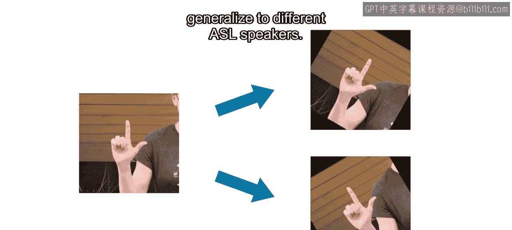

为了解决这个问题，你可以对每张图像应用一个小的旋转变换来进行增广。这将帮助模型更好地识别不同角度的符号，提高其适应不同手语者的泛化能力。

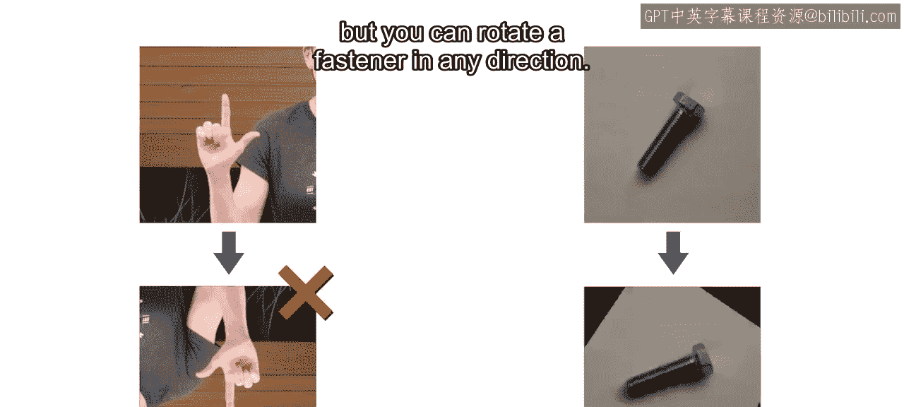

请注意，所包含的增广类型和数量取决于你的具体数据。例如，你通常不会想将一个手语字母倒置，但你可以将任何方向的紧固件进行旋转。为了做出明智的决定，必须考虑模型的数据集领域和应用场景。

## 数据增广的其他应用

除了分类任务，数据增广对于目标检测任务也同样有益。为目标检测添加新图像并为其标注边界框非常耗时。通过应用数据增广技术，你可以通过扭曲图像和调整边界框来快速生成额外的训练样本。

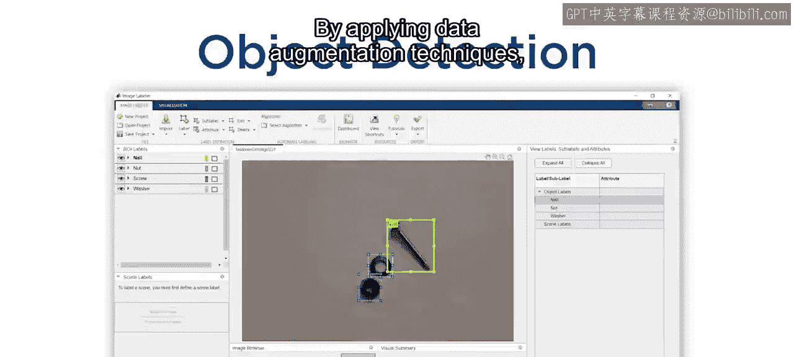

## 何时使用数据增广？

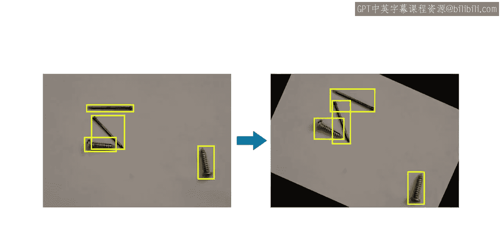

数据增广并非总是必要的。但当你的数据有限，或者模型的准确性无法满足应用需求时，它会非常有帮助。你可能需要根据你的数据尝试不同的增广方法，以找出最适合你的方案。

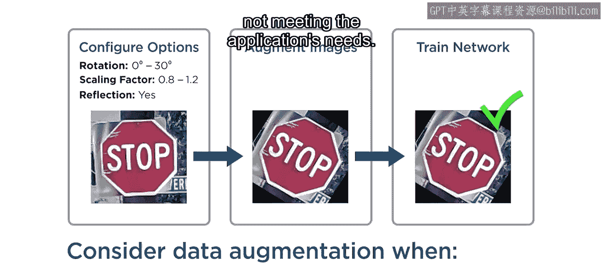

## 总结

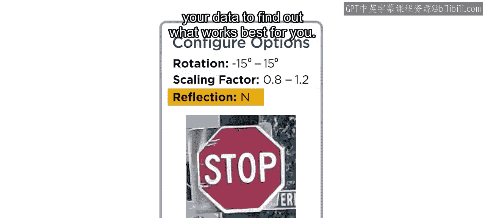

本节课中我们一起学习了数据增广技术。我们了解到，数据增广是一种通过应用平移、旋转、缩放、剪切和翻转等几何变换，从现有数据生成合成训练样本的有效方法。它能在不增加新数据的情况下，模拟更丰富的数据分布，从而提升深度学习模型的泛化能力和鲁棒性。其应用需结合具体的数据集特点和任务需求进行选择和调整。