# 深度学习在计算机视觉中的应用：31：目标检测的数据增广 🎼

在本节课中，我们将要学习目标检测任务中一个关键且复杂的环节：数据增广。我们将探讨它与图像分类任务中数据增广的区别，并通过一个具体的代码示例，展示如何在目标检测工作流中实现和应用数据增广。

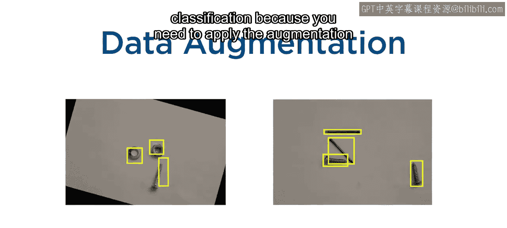

## 概述

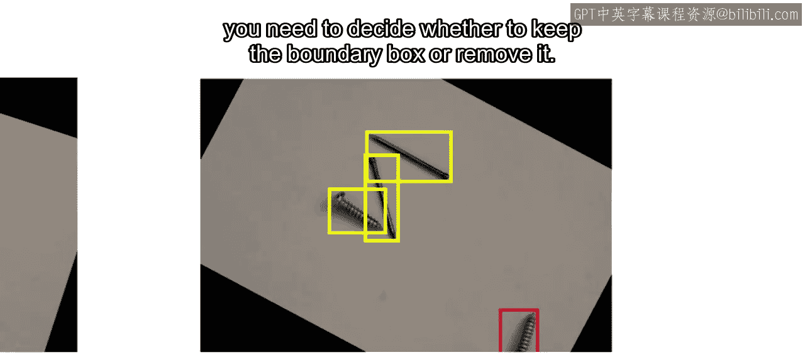

数据增广是一种强大的技术，能为训练图像增加多样性。然而，目标检测的数据增广比图像分类更为复杂。这是因为你不仅需要对图像应用增广变换，还需要同时对图像中的边界框进行相应的变换。此外，增广操作可能导致物体被部分或完全移除，这要求我们做出额外的判断。

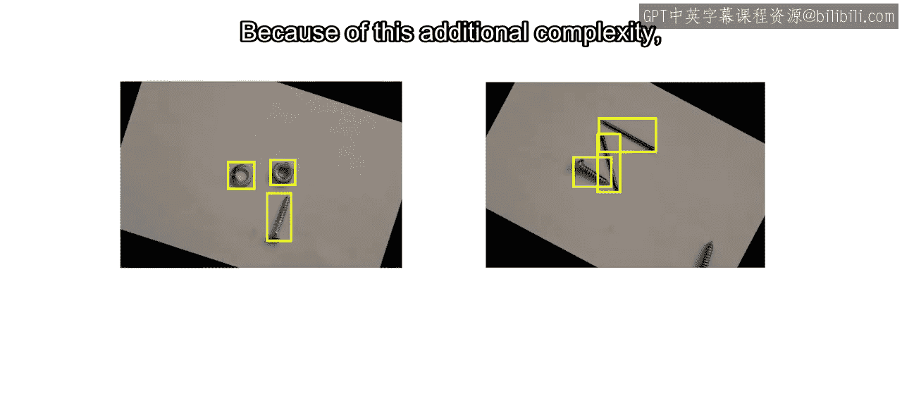

## 目标检测数据增广的复杂性

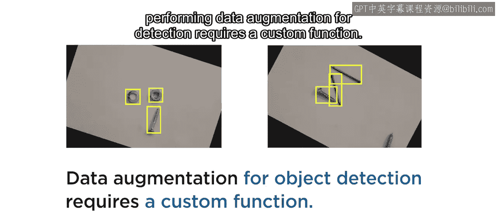

上一节我们介绍了数据增广的基本概念，本节中我们来看看它在目标检测中的特殊挑战。

由于需要同时处理图像和边界框，并且要决定如何处理部分可见的物体，为目标检测执行数据增广需要一个自定义函数。

## 在MATLAB中实现数据增广

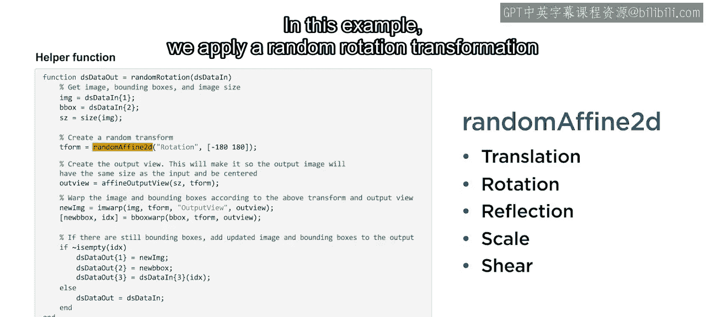

接下来，我们将进入MATLAB，以Fastener数据集为例，查看一个具体的实现。

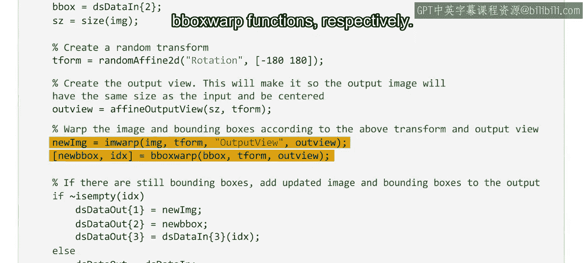

在这个自定义函数中，输入和输出都是组合数据源，其中同时包含了图像数据和边界框数据。函数首先提取数据，然后使用 `randomAffine2d` 函数生成所需的随机变换矩阵。这个函数可以执行多种类型的增广，例如：
*   **平移**
*   **旋转**
*   **翻转**
*   **缩放**
*   **剪切**

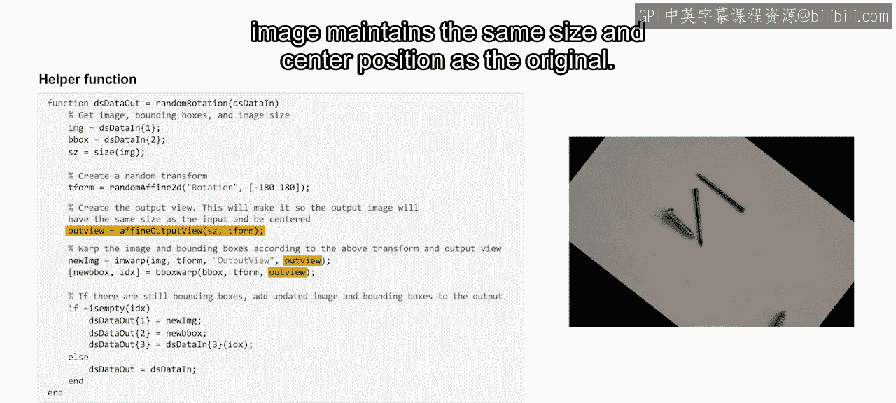

在本例中，我们应用了一个在负180度到180度之间的随机旋转变换，因为紧固件需要在任何角度下都能被检测到。

随后，图像和边界框根据这个变换矩阵分别进行扭曲，使用的函数是 `imwarp` 和 `bboxwarp`。请确保使用 `‘OutputView’` 选项，以保证结果图像与原始图像保持相同的大小和中心位置。

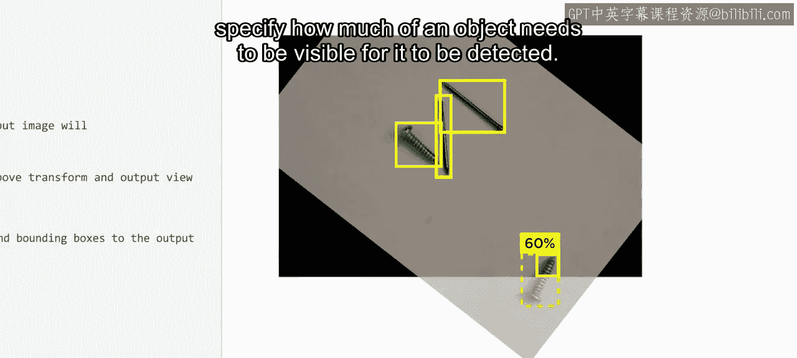

这里也是你决定是否保留部分可见物体的关键步骤。默认情况下，`bboxwarp` 函数只保留完全可见的检测框。但你可以使用 `‘OverlapThreshold’` 选项来指定一个物体需要有多少比例可见才能被保留。

最后，函数需要检查在变换后是否还有边界框剩余。如果没有边界框剩下，函数将返回原始的、未经变换的图像，因为原始图像中至少有一个检测目标。

## 将增广集成到工作流中

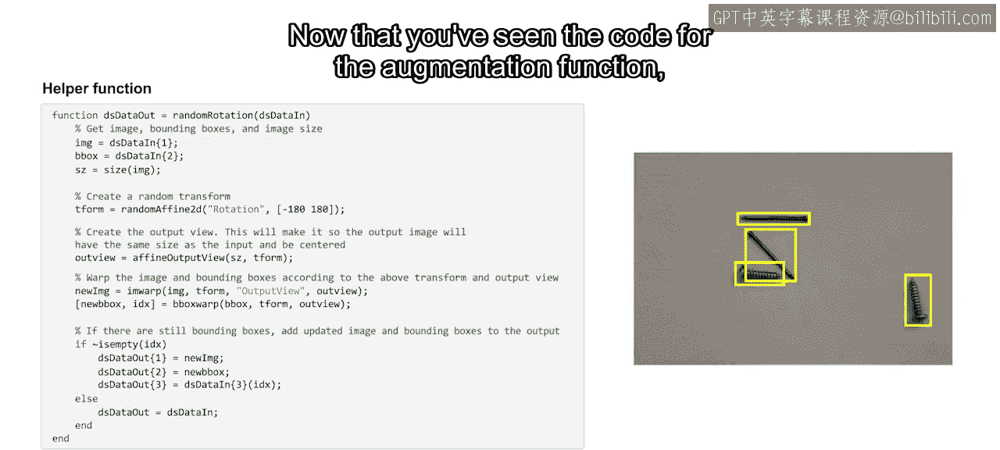

现在你已经看到了增广函数的代码，让我们看看它如何融入一个现有的目标检测工作流。

这是一段用于训练Fastener数据集目标检测模型的代码。为了将数据增广加入此工作流，首先需要插入之前定义的数据增广函数。

然后，将此函数应用于训练数据并保存结果。就这样，操作就完成了。

为了训练一个包含了数据增广的新检测模型，我们只需重新运行代码。下图展示了在不同检测阈值下平均精度的结果。请注意，钉子和螺丝的检测性能得到了显著提升，螺母和垫圈的精度也有所提高。

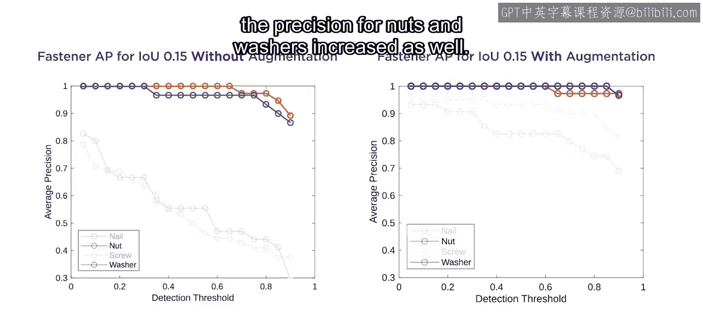

## 总结

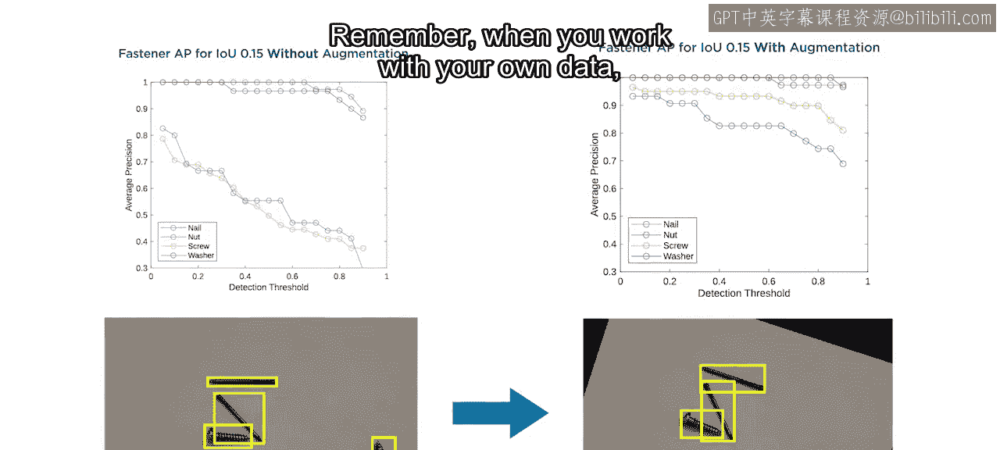

本节课中，我们一起学习了如何将数据增广整合到目标检测的工作流程中。我们了解到，由于需要同步处理图像和边界框，目标检测的数据增广更为复杂，通常需要自定义函数来实现。通过一个MATLAB的实例，我们看到了从定义增广变换、应用到图像和边界框、处理部分可见物体，到最终将增广函数集成到训练流程中的完整步骤。请记住，当处理你自己的数据时，数据增广是一种值得尝试的强大技术。