# 深度学习在计算机视觉中的应用：33：开始你自己的深度学习项目 🚀

在本节课中，我们将学习如何启动你自己的深度学习项目。我们将探讨从选择应用方法到处理数据、选择模型以及迭代优化的关键步骤，帮助你克服项目初期的挑战。

---

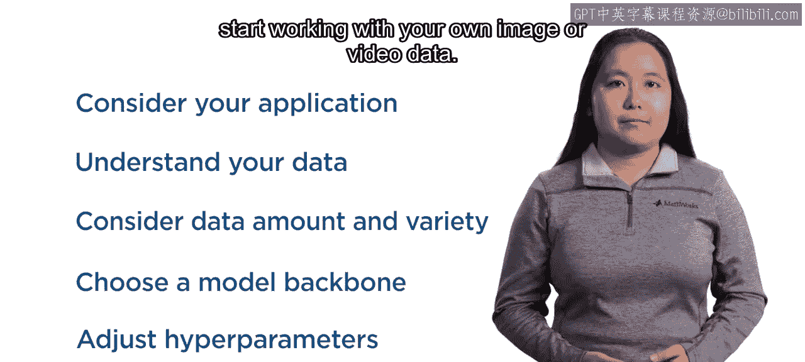

在整个专项课程中，你已经将深度学习技术应用于多种数据集。但开始自己的深度学习项目可能会让人感到有些不知所措。在本视频中，我们将介绍在处理你自己的图像或视频数据时需要牢记的一些关键事项。

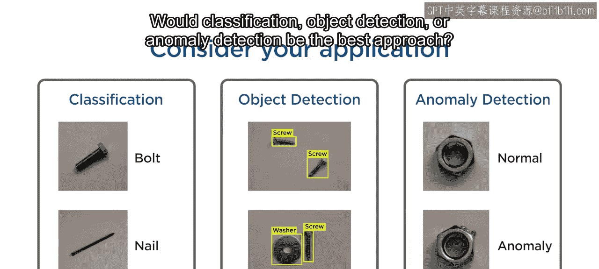

## 第一步：明确应用目标 🎯

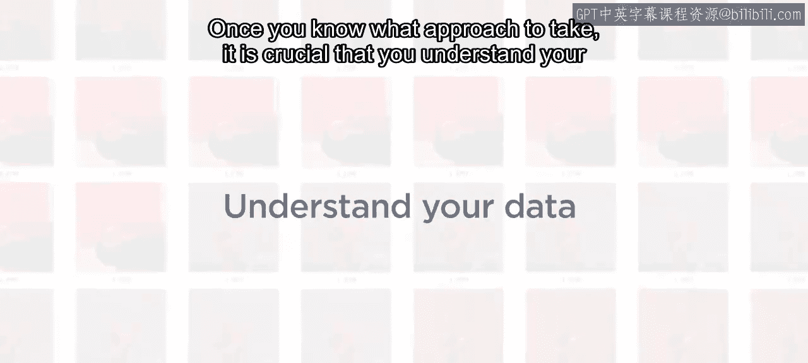

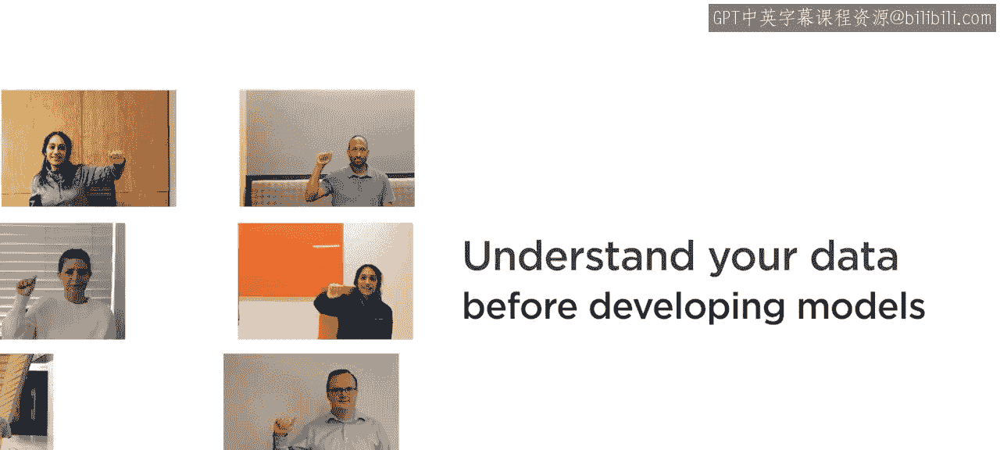

首先，考虑你的应用场景。分类、目标检测还是异常检测是最佳方法？

一旦确定了方法，在开发或训练任何模型之前，理解你的数据至关重要。

## 第二步：深入理解你的数据 🔍

考虑数据的原始来源。它是否可靠？数据是何时何地收集的？数据集中是否存在固有的偏见、模式或错误？要回答这些问题，你可能需要进行一些研究，并目视检查图像以确保它们符合你的预期。

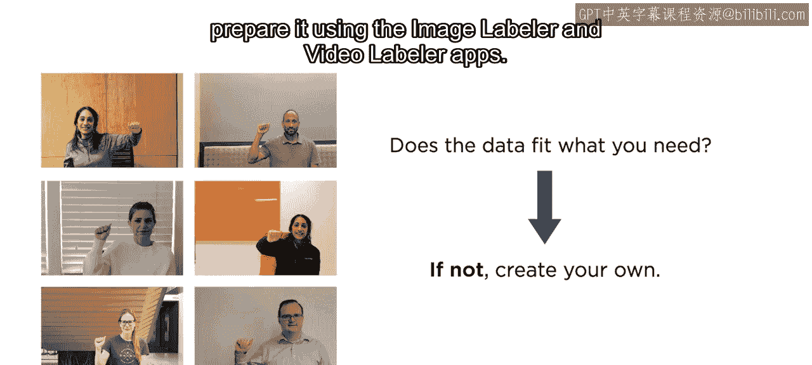

你还应考虑数据的原始用途。它是否符合你应用的需求？如果不符合，收集你自己的数据并使用图像标注器和视频标注器应用程序进行准备可能是一个好主意。

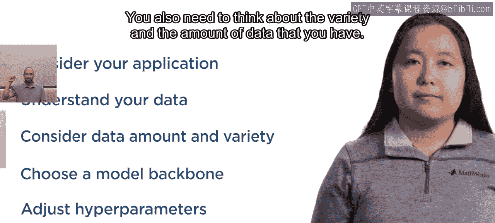

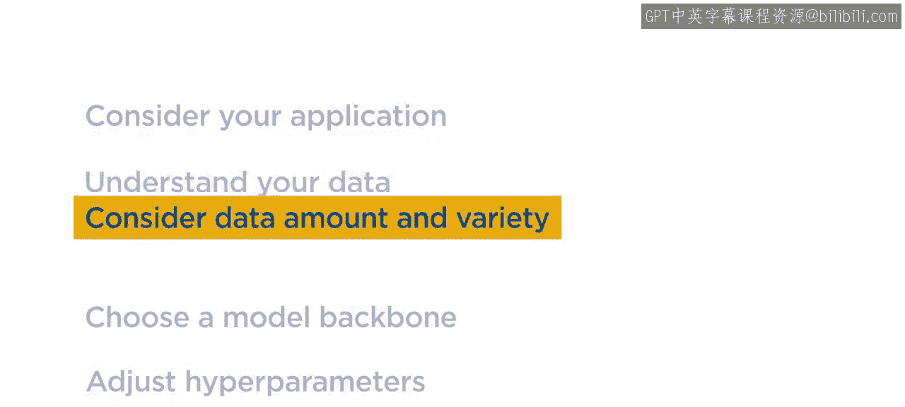

## 第三步：评估数据量与多样性 📊

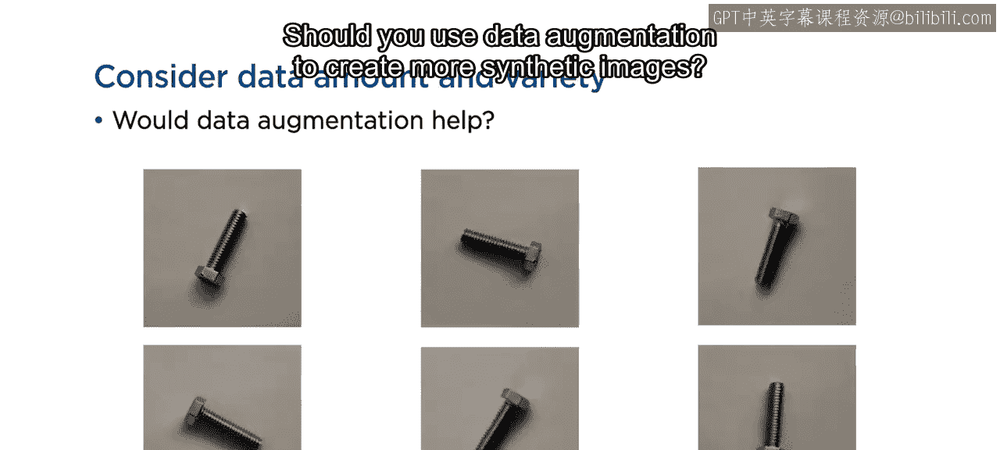

你还需要考虑所拥有数据的多样性和数量。

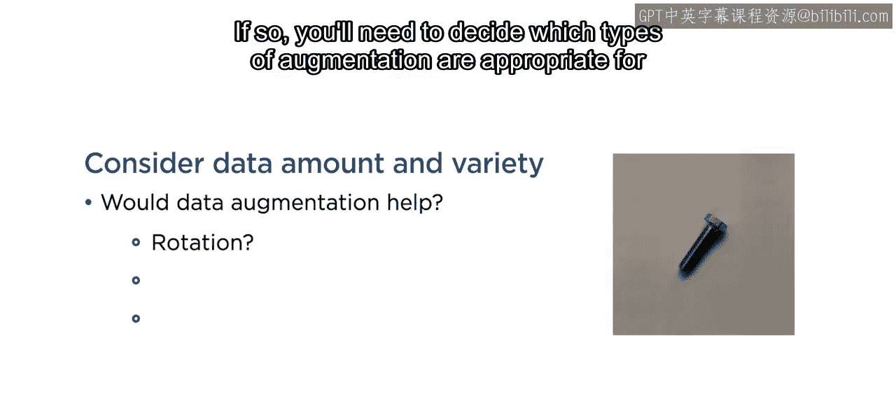

以下是关于数据增强的考虑：

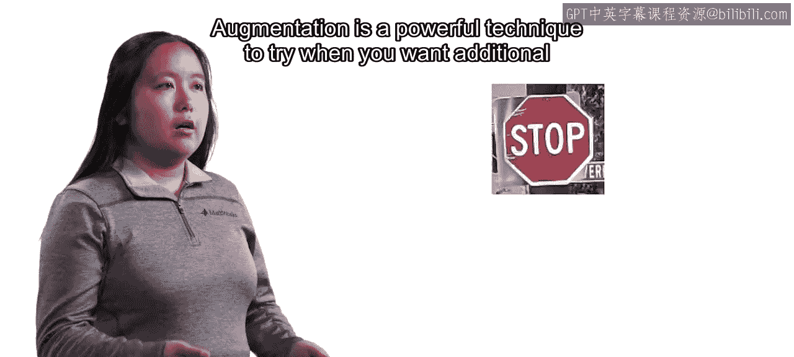

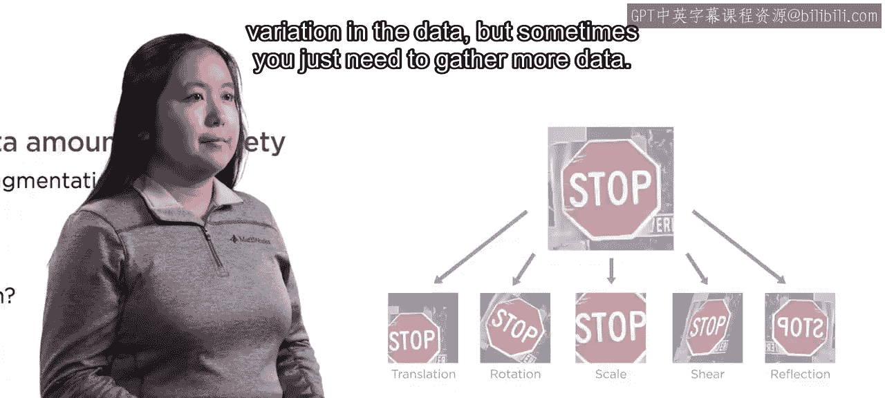

*   **是否应该使用数据增强来创建更多合成图像？**
*   如果是，你需要决定哪些类型的增强适合你的应用。
*   当你希望数据具有更多变化时，增强是一种强大的技术。

但有时你只需要收集更多数据。如果你正在构建一个检测器，这意味着需要标注更多图像。标注工作通常非常繁琐。

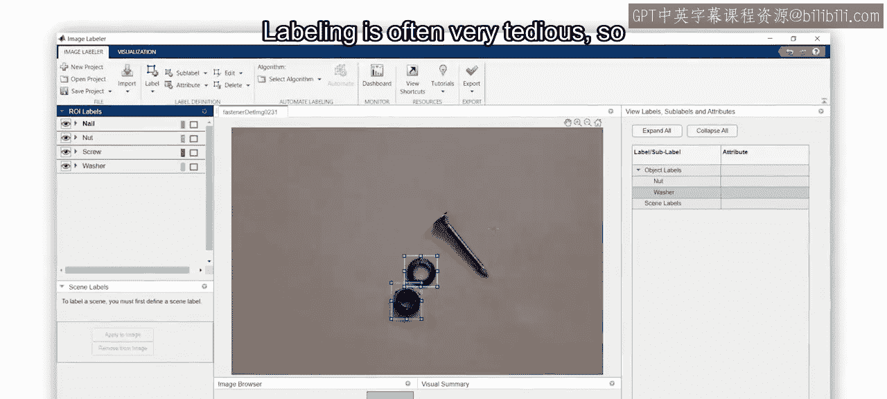

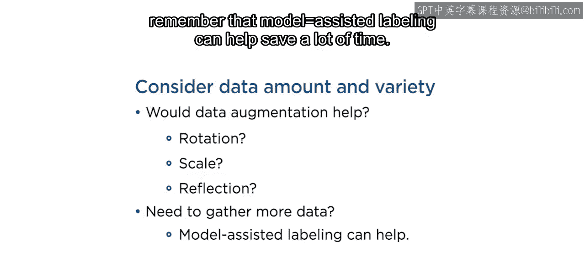

因此，请记住，模型辅助标注可以帮助节省大量时间。

## 第四步：选择模型与算法 🤖

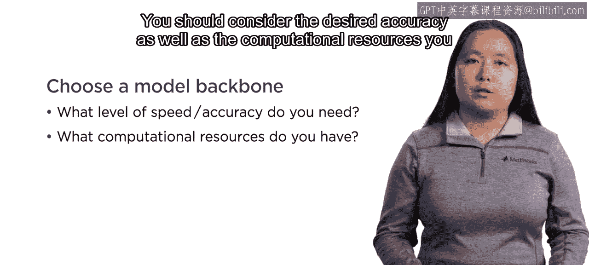

接下来，如果你计划进行迁移学习，你需要选择一个模型主干或算法。你应该考虑期望的准确度以及可用的计算资源。

这两者共同影响你选择尝试的模型主干。如果你想在CPU上开发一个轻量级模型，你可能会使用与需要极高精度且拥有强大GPU时不同的模型主干。

在尝试不同模型时，调整超参数以获得最佳结果也会使你受益。请注意，许多常见的模型选项是相互依赖的，因此要注意你如何更改它们。

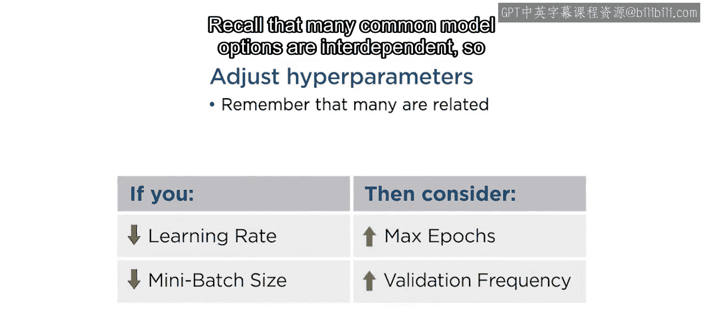

## 第五步：迭代与优化 🔄

同时，请记住整个过程是迭代的，所以不要害怕不按顺序执行其中一些步骤。最终，在达到期望结果之前，会经历一些试错。

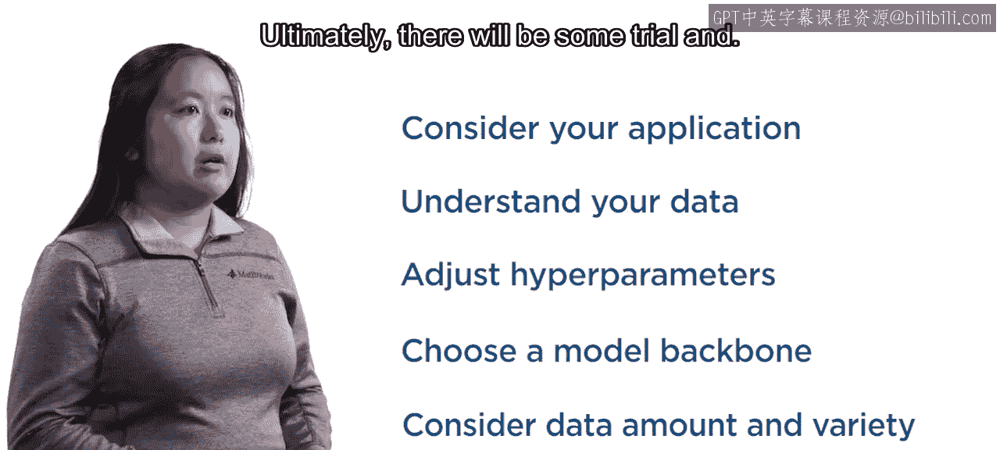

使用本专项课程中的编码示例来帮助你入门。我们还为你创建了一个简短的指南，供你在开启自己的深度学习之旅时参考。

---

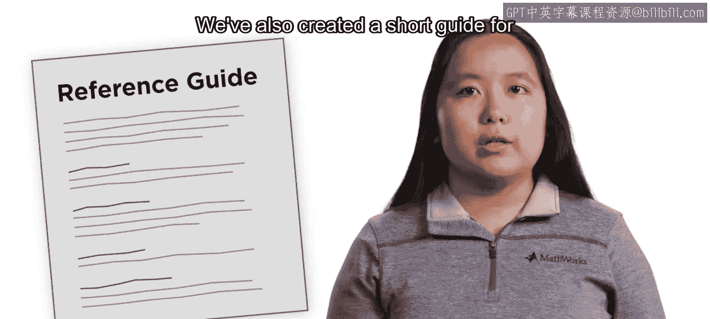

在本节课中，我们一起学习了启动深度学习项目的完整流程：从明确应用目标和深入理解数据，到评估数据需求、选择合适模型，再到进行迭代优化。祝你好运！