# 深度学习在计算机视觉中的应用：35：集成你的代码 🚀

在本节课中，我们将学习如何将开发完成的算法代码投入实际应用，这个过程被称为部署或集成。我们将了解三种主要的部署方式，并介绍MATLAB如何提供工具来支持这些工作流程。

---

## 概述

在算法开发完成后，你可能希望将代码部署到云端、特定设备（如智能手机）或其他环境中运行。将代码投入生产环境的过程称为部署或集成。本节将介绍三种部署代码的选项，并说明MATLAB如何帮助你实现这些目标。

---

## 共享MATLAB代码 📤

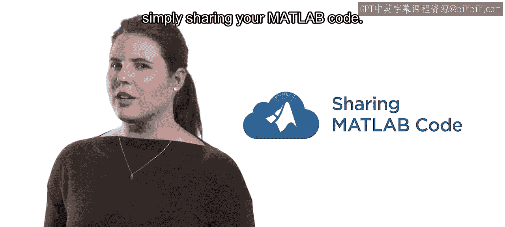

如果你是一名研究人员，希望与同事分享成果并展开协作，一个很好的选择是直接共享你的MATLAB代码。

以下是实现代码共享的步骤：

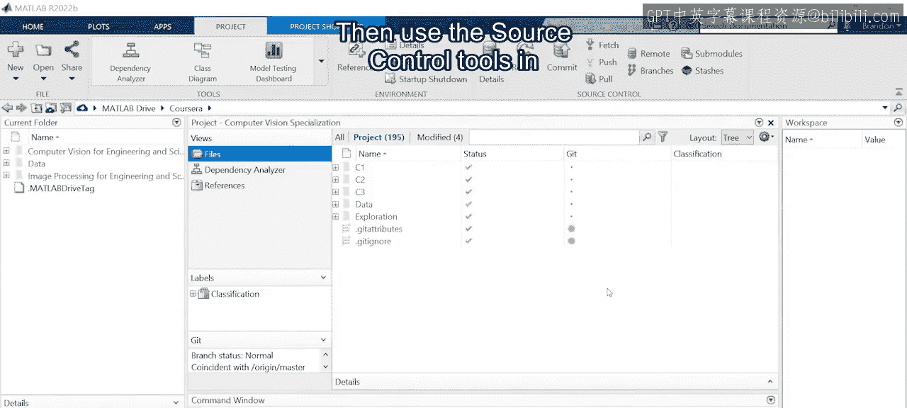

1.  **收集代码文件**：首先，将你的代码文件整理到一个MATLAB项目中。
2.  **使用版本控制工具**：利用MATLAB内置的源代码控制工具，将代码上传到基于云的代码仓库，例如GitHub。
3.  **协作与追踪**：这为他人提供了访问权限，并使你能够在与协作者合作时追踪代码的变更。

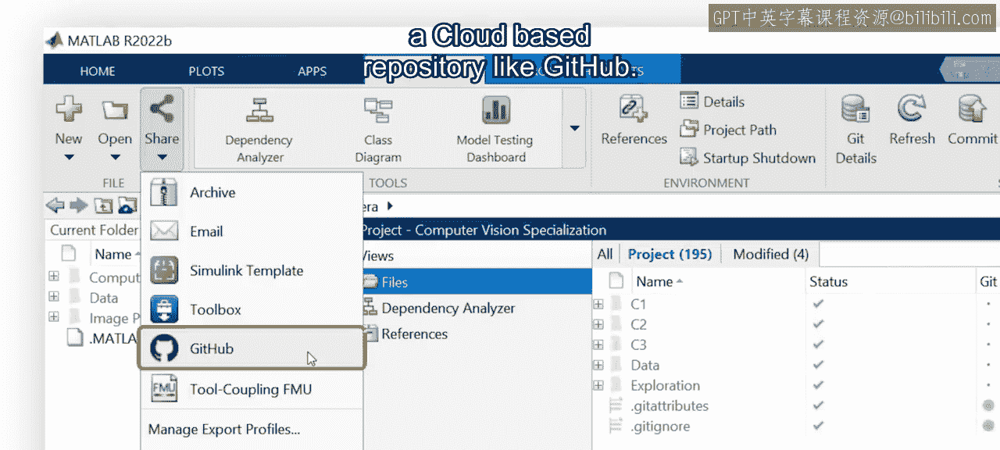

---

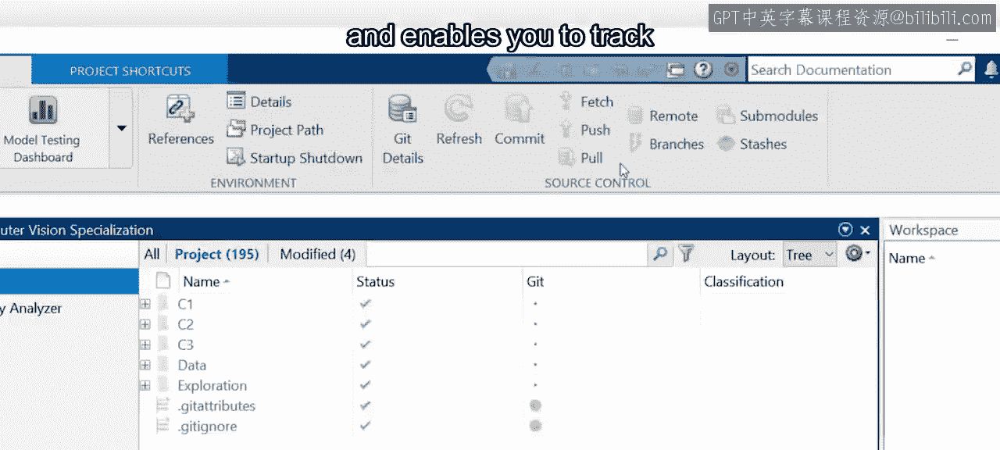

上一节我们介绍了如何共享代码文件。如果你的合作者使用其他编程语言（如Python），也无需担心。

MATLAB提供了与多种语言的灵活双向集成方案。例如，你可以在MATLAB内部直接调用Python代码。同时，你的同事也可以在他们自己的环境中，通过MATLAB Engine API来使用你编写的MATLAB代码。

---

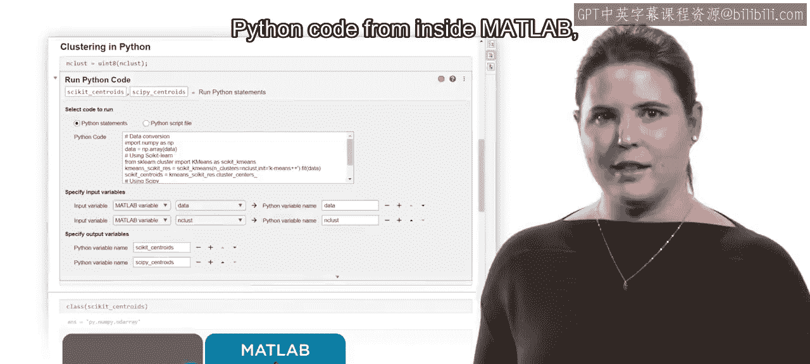

## 创建Web应用程序 🌐

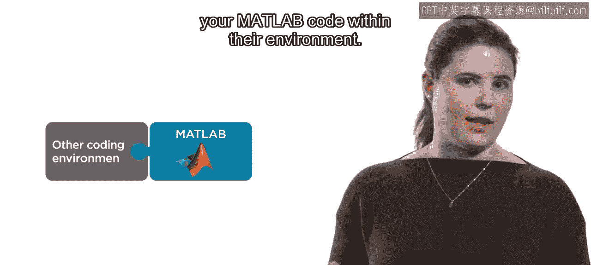

现在，假设你是一名工程师，需要为组织内的其他成员提供一个易于使用的界面来访问你的算法。一个很好的选择是创建一个Web应用程序。

以下是创建Web应用的流程：

1.  **设计与创建应用**：首先，在MATLAB中设计和创建一个应用程序。
2.  **添加交互组件**：你的应用可以包含交互式组件，让他人在你的代码于后台运行时，能够轻松调整参数。
3.  **部署到Web服务器**：然后将该应用程序托管在一个Web服务器上，这样其他人就可以通过浏览器来使用它。

---

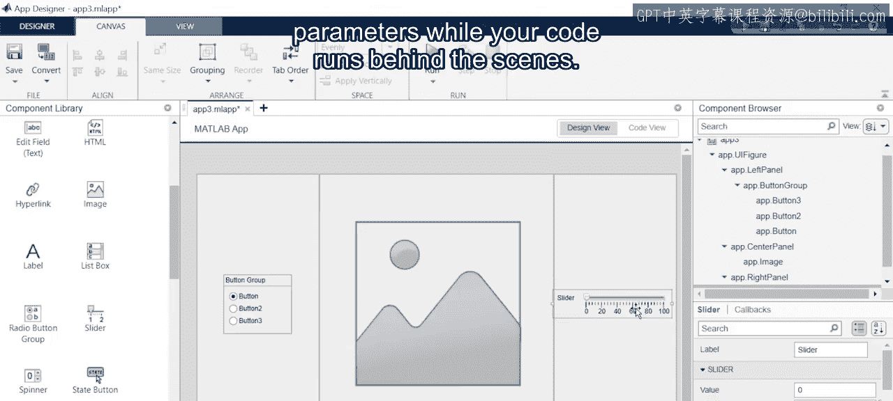

上一节我们介绍了如何创建Web应用。最后，让我们设想一个更复杂的场景：你正在开发自动驾驶汽车。

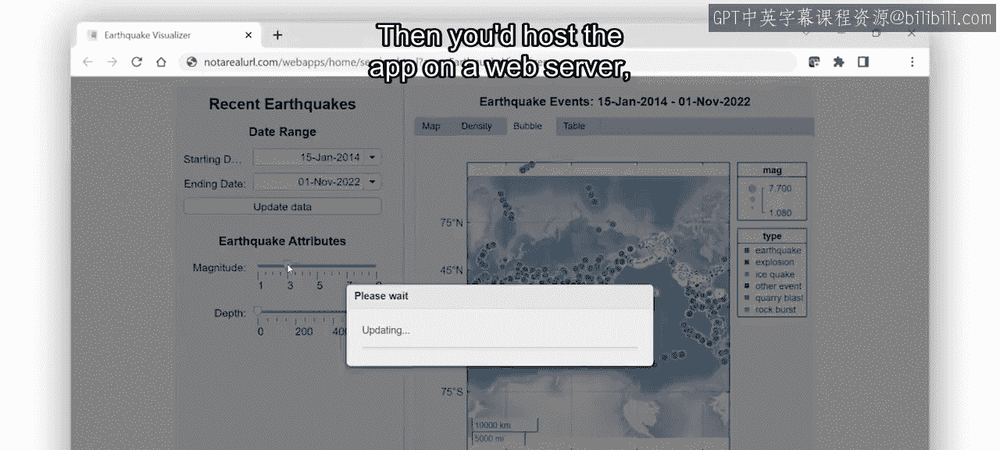

你需要将MATLAB代码部署到嵌入汽车内部的硬件设备上。那么，如何将代码部署到不运行MATLAB的硬件上呢？

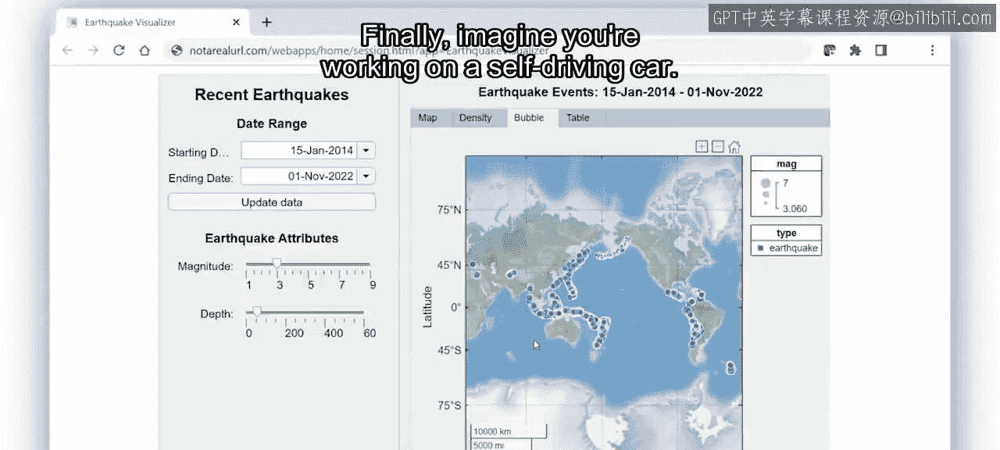

---

## 部署到嵌入式硬件 🚗

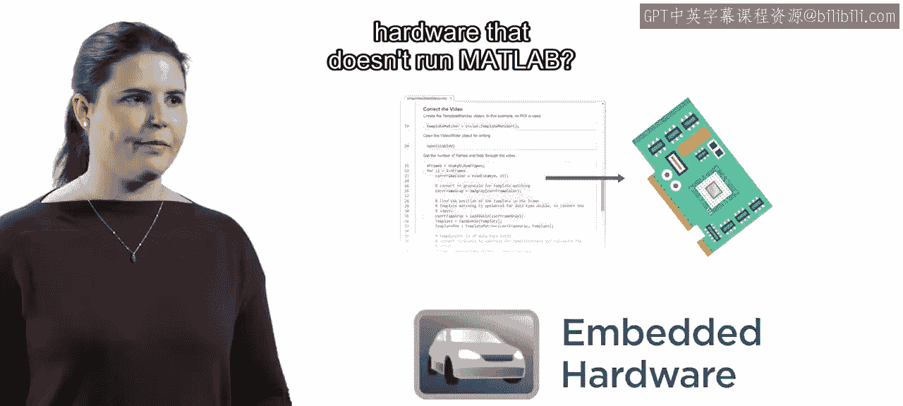

答案是将你的代码转换为可以在目标设备上运行的另一种语言。

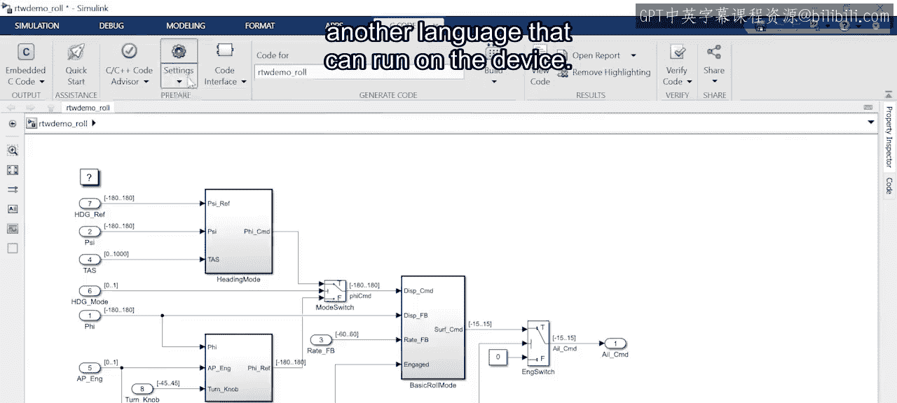

如果手动完成这项工作，听起来既令人生畏又耗时。但借助MATLAB，这项任务会变得简单得多。

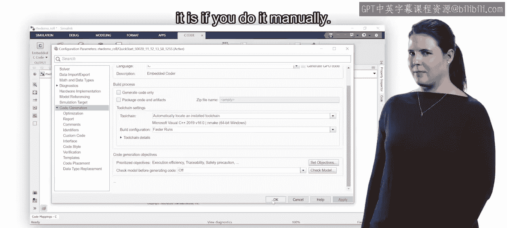

MATLAB可以自动生成多种目标代码，例如：
*   **C** 或 **C++** 代码
*   **HDL**（硬件描述语言）代码
*   在**GPU**上运行的代码

这种**代码生成**功能为工程师节省了大量时间，使他们能够在新硬件系统上快速进行算法原型设计和测试。

---

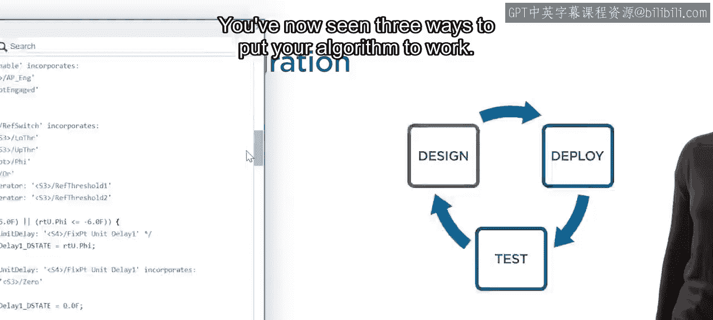

## 总结

本节课我们一起学习了将算法投入实际应用的三种主要方式：
1.  **共享MATLAB代码**，便于协作与版本控制。
2.  **创建Web应用程序**，为他人提供易于使用的交互界面。
3.  **部署到嵌入式硬件**，通过自动代码生成将算法移植到特定设备。

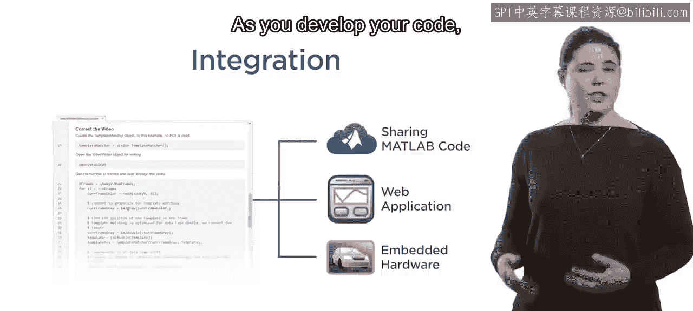

因此，在你开发代码时，请记住MATLAB包含了多种工具，可以帮助你以不同的方式部署代码，使其在现实世界中发挥作用。