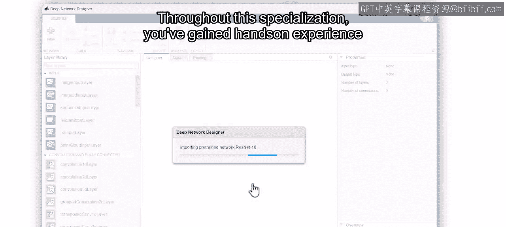
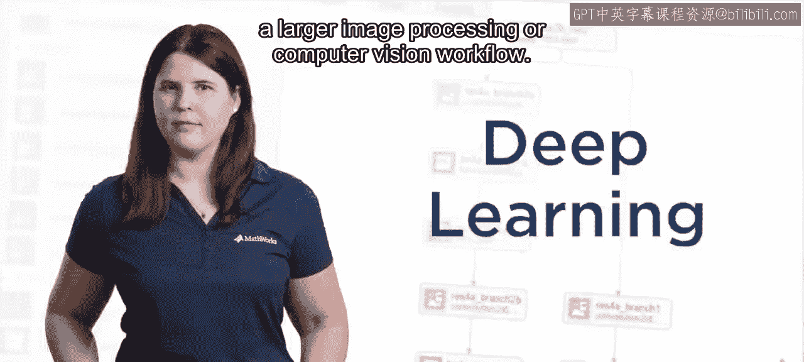
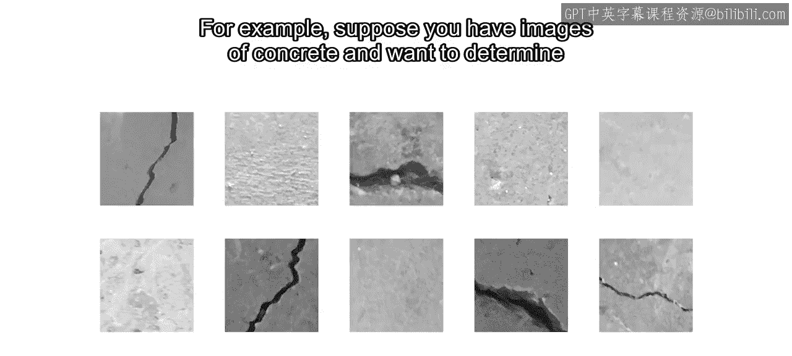
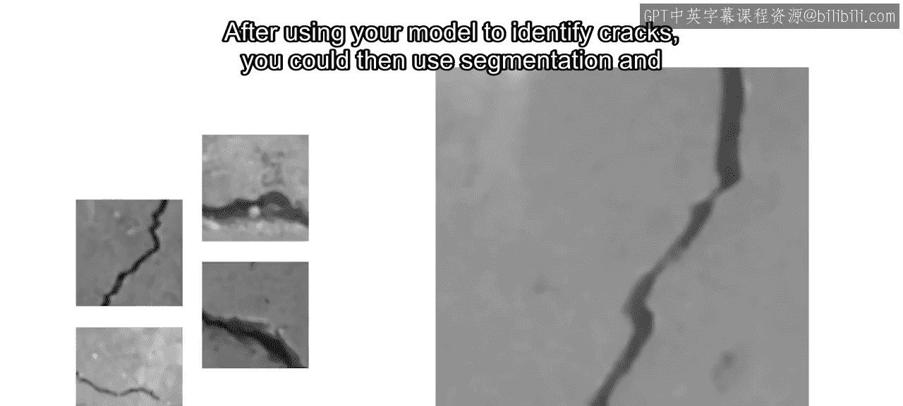
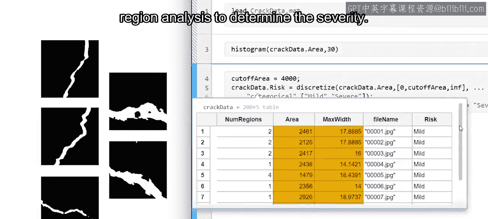
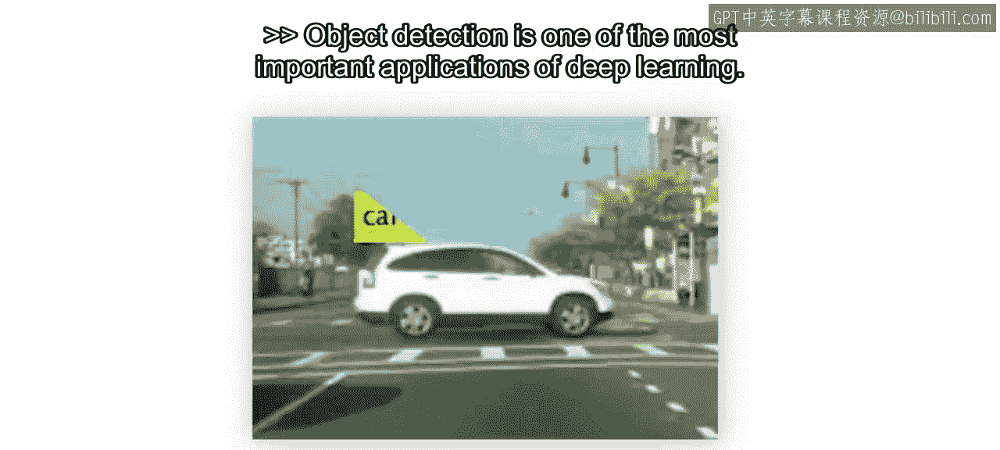
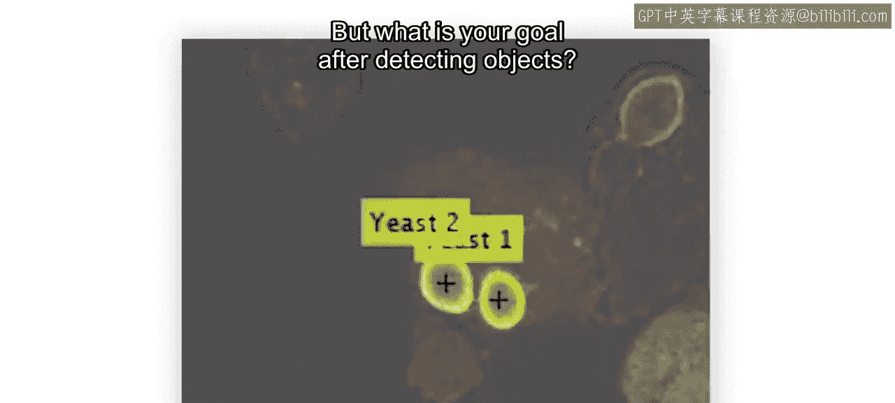
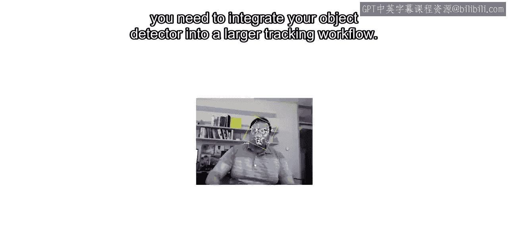
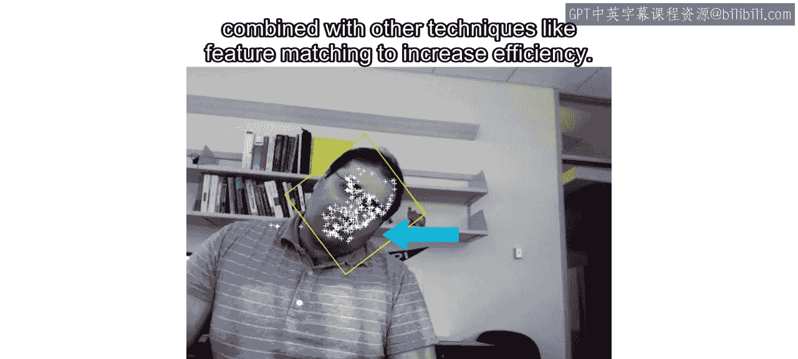
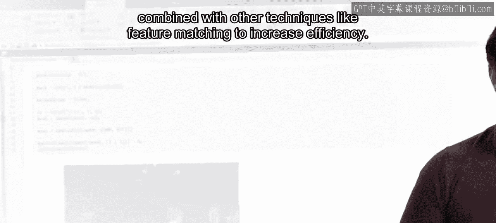

# 深度学习在计算机视觉中的应用：36：课程总结 🎯

在本节课中，我们将对深度学习在计算机视觉领域的应用进行总结，并探讨如何将其融入更广泛的工作流程中。

## 概述

恭喜你完成本专项课程的学习。现在，你已经能够运用深度学习来解决多种计算机视觉问题。自动驾驶系统、制造业和医学研究等领域，都是利用图像和视频数据进行深度学习的典型行业。通过本课程的学习，你已经获得了在这些行业中应用最广泛的模型的实际操作经验。

## 深度学习在完整工作流中的角色

深度学习虽然备受关注，但它通常只是更大的图像处理或计算机视觉工作流程中的一个环节。

为了更清晰地理解这一点，我们来看一个具体例子。假设你有一些混凝土的图像，你的目标是识别出哪些图像存在裂缝，并分析这些裂缝的严重程度。

以下是实现这一目标的典型工作流程：

1.  **预处理**：在训练模型之前，你可能会进行去噪等操作，以提高模型的准确性。
2.  **模型应用**：使用训练好的深度学习模型来识别图像中是否存在裂缝。
3.  **后处理与分析**：在模型识别出裂缝后，你可以进一步使用图像分割和区域分析技术来确定裂缝的严重程度。

这个流程表明，深度学习模型是连接原始数据与高级分析的关键桥梁。若想掌握图像分割、特征提取等更多技能，可以进一步学习我们的“工程与科学图像处理”专项课程。

## 目标检测的延伸应用

目标检测是深度学习最重要的应用之一。然而，检测到物体之后，你的目标是什么？

通常，后续目标包括对物体进行**计数**、**追踪**，并确定其**速度**和**方向**等属性。为了实现这些目标，你需要将目标检测器集成到一个更大的追踪工作流中。

由于目标检测的计算成本较高，它经常与其他技术结合使用以提高效率，例如**特征匹配**技术。若想深入了解这些主题，可以报名参加我们的“工程与科学计算机视觉”专项课程。

## 总结与展望

在本节课中，我们一起回顾了深度学习在计算机视觉中的核心应用。我们了解到，深度学习是强大工具，但常需与图像预处理、后处理分析等技术结合，构成完整的解决方案。特别是在目标检测任务中，检测仅是第一步，将其与追踪、计数等任务集成才能发挥最大价值。

图像和视频数据在众多领域正变得日益重要。无论你是希望诊断疾病，还是为汽车设计安全功能，你现在都已经具备了将深度学习应用于实际工作的能力。祝你未来在计算机视觉的探索与应用中一切顺利。