# 2：使用MATLAB进行探索性数据分析概述 🎯

在本课程中，我们将学习如何使用MATLAB进行探索性数据分析。探索性数据分析是数据科学流程中的关键第一步，它涉及理解数据、发现模式、识别异常并提出初步假设。通过本课程，你将掌握导入、可视化数据以及执行常见统计分析所需的实用技能，为后续的机器学习建模等高级主题打下坚实基础。

---

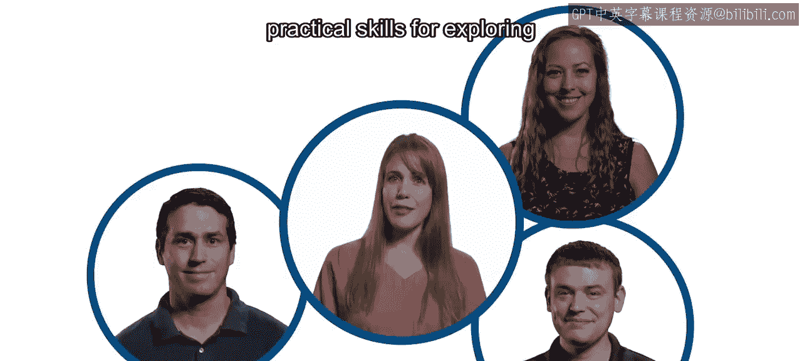

### 课程结构与学习路径 📊

上一段我们概述了课程目标，接下来我们详细了解一下整个课程的结构。本课程包含五个循序渐进的模块，每个模块都旨在帮助你构建特定的数据分析能力。

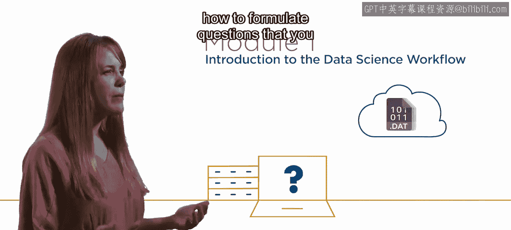

以下是五个核心模块的详细介绍：

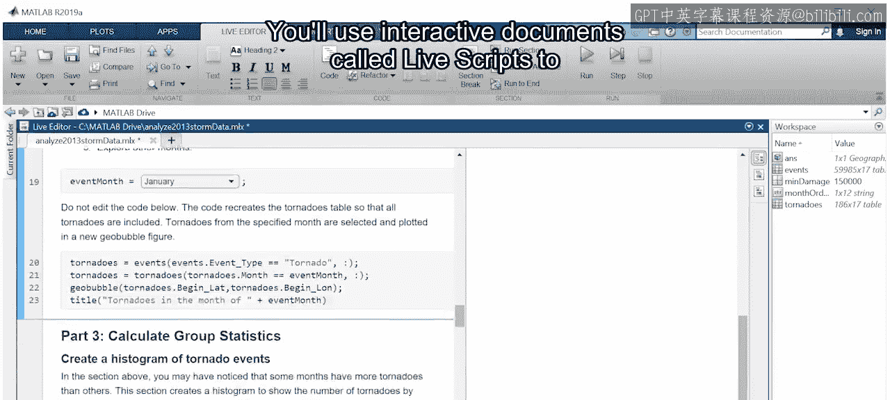

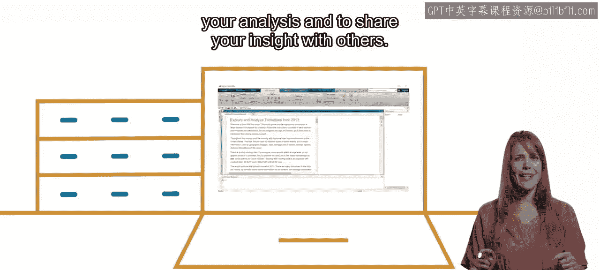

1.  **模块一：数据科学入门**
    你将学习如何着手探索数据，以及如何提出能够通过数据分析来解答的问题。你将使用名为“实时脚本”的交互式文档来探索一个已准备好的分析案例，并从真实数据集中获得洞察。

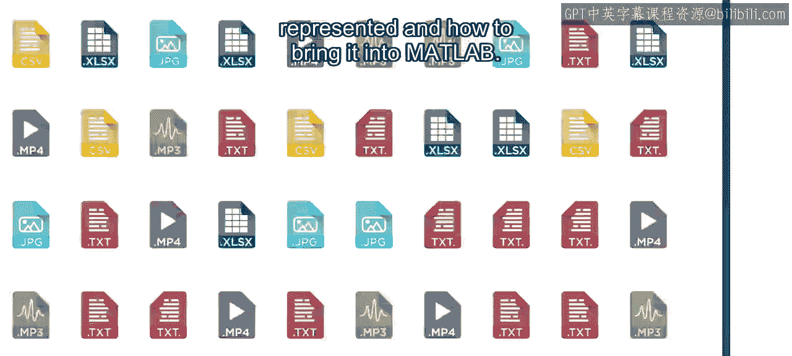

2.  **模块二：数据表示与导入**
    在本模块中，你将学习数据是如何表示的，以及如何将数据导入MATLAB。将大量数据转换为可用于分析的形式是许多应用中的常见挑战。你将使用相关工具快速将文件导入MATLAB，同时生成可用于未来重复此过程的代码。

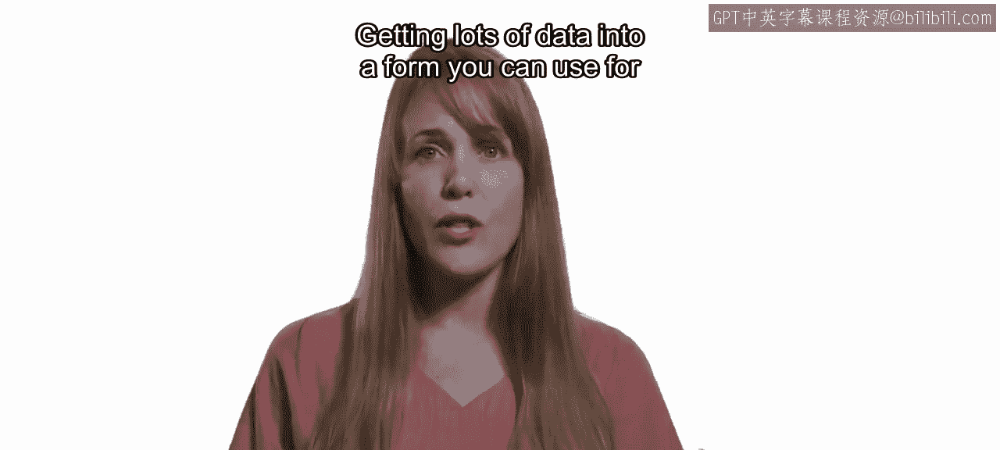

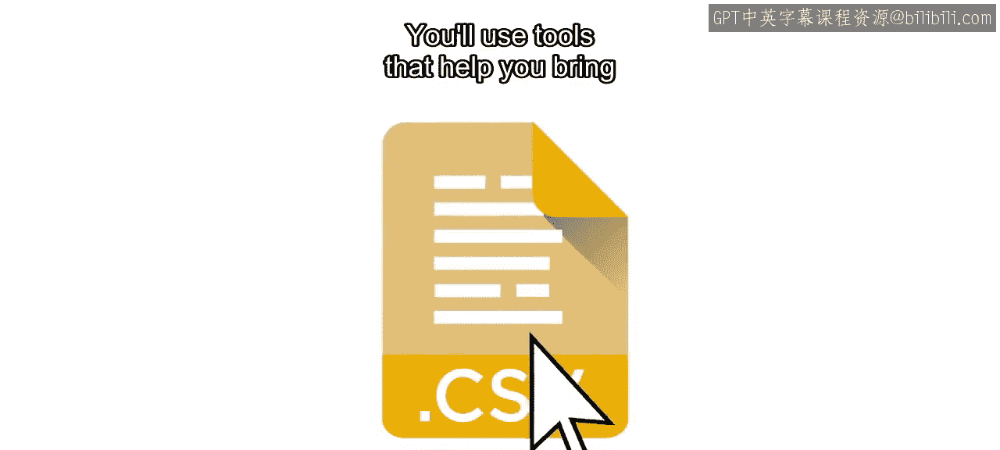

3.  **模块三：数据筛选与可视化**
    进入第三模块后，你将把数据筛选成你想要分析的子集。接着，你将通过可视化来理解如何回答问题，并获得新的理解。本课程的主要数据集包含带有经纬度坐标的地理数据。除了绘制标准图表，你还将生成数据叠加在熟悉地理边界上的地图，以及其他能提供实用洞察的可视化图表。

4.  **模块四：分组统计分析**
    此时，你已经完成了数据的筛选和可视化。现在，在第四模块中，你已准备好进行统计分析。你将超越电子表格的思维，按不同组别分析数据，快速迭代地对不同数据组执行操作。这些任务是探索和试验数据的基础。

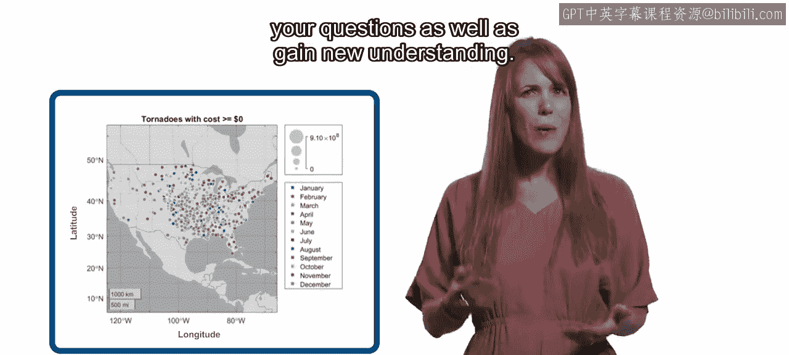

5.  **模块五：整合分析与成果展示**
    最后，在第五模块中，你将整合所有技能，讲述数据背后的故事。当今的数据科学世界远不止代码和数字运算。实时脚本可以帮助你让数据分析变得生动。在整个课程中，它们将支持你的分析，并使你能够将相同的思维过程应用到其他类似的数据集上，以深化你的分析。

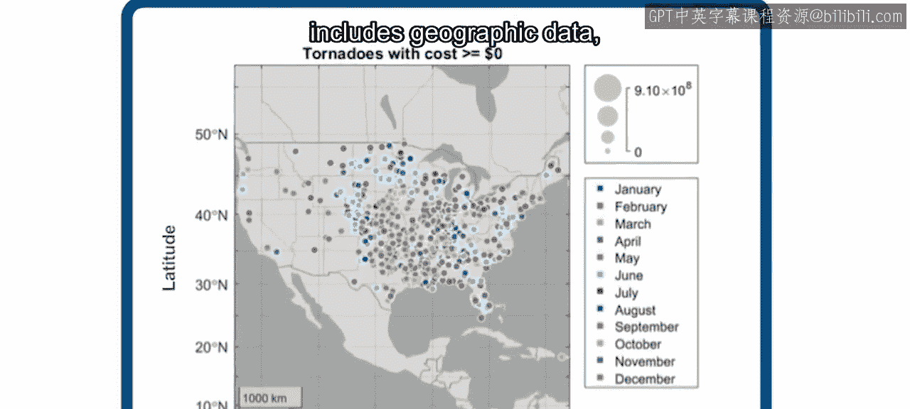

---

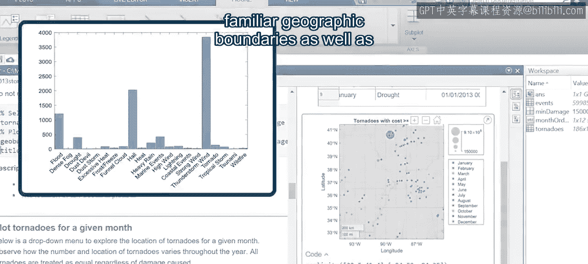

### 学习建议与展望 🚀

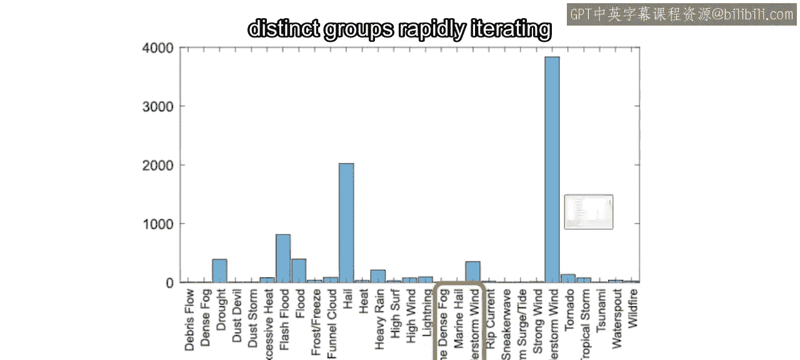

为了从课程中获得最大收益，请思考如何将学到的概念应用到你自己的数据中。你在课程中遇到的数据集旨在代表你实际工作中可能看到的数据类型。

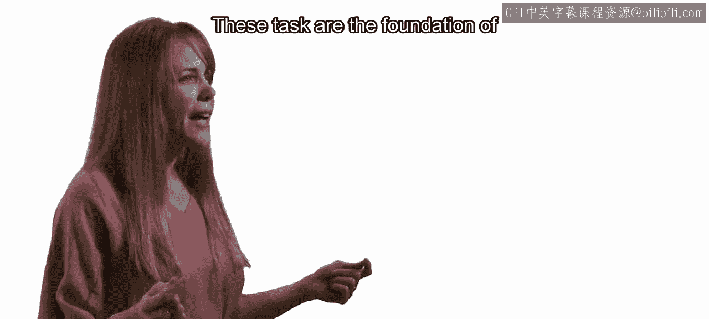

听起来很有趣吗？加入数百万使用MATLAB来探索、筛选、可视化和分析数据的行业专业人士行列吧。

现在就开始学习，如果你有任何问题，请使用讨论区。

---

### 总结

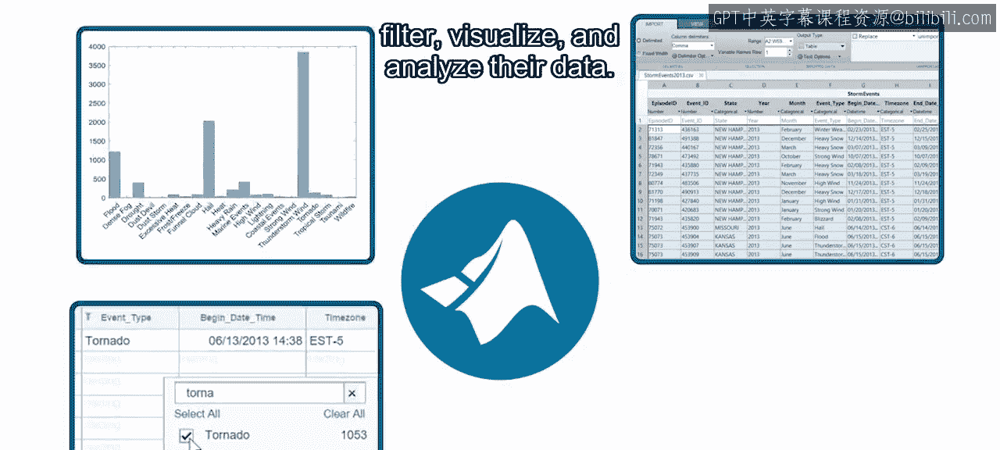

在本节课中，我们一起学习了《实用数据科学与MATLAB》课程中探索性数据分析部分的概述。我们明确了课程目标，即掌握数据导入、可视化与基础统计分析的核心技能。随后，我们详细了解了课程的五个模块：从数据科学入门和问题定义，到数据导入、筛选可视化、分组统计，最后整合分析并讲述数据故事。整个学习路径旨在为你打下坚实的数据探索基础，以便后续进行更高级的预测建模。请记住，将所学应用于你自己的数据集是巩固技能的最佳方式。