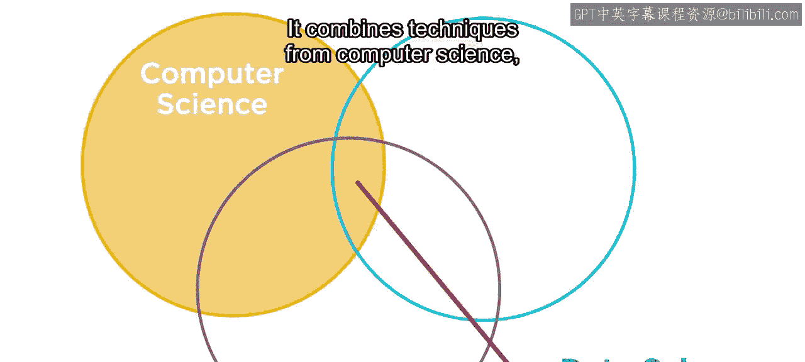

P04：为什么我们需要数据科学

在本节课中，我们将探讨数据科学在现代世界中的重要性，了解其基本定义、核心组成部分以及MATLAB如何帮助不同领域的专家实践数据科学。

我们生活的世界时刻处于连接状态。在社交媒体上互动、请求出租车服务、进行购物、追踪日常身体活动，你所做的一切都会产生数据。一旦开始汇总来自每个人的数据，其数量将变得难以估量。可以说，我们生活在一个数据驱动的世界。

那么，面对如此海量的数据，我们该如何处理？这正是数据科学发挥作用的地方。

数据科学在今天比以往任何时候都更具相关性，因为我们拥有海量的可用数据。但首先，什么是数据科学？正如你所猜测的，数据科学是对数据的研究。它结合了来自计算机科学、统计分析的技术以及你自身的领域知识。

如果你拥有数据并对其感到好奇，数据科学就是一条探索和分析数据、从中获取答案，然后传达你发现的路径。

换句话说，数据科学是关于从你的数据中讲述一个引人入胜的故事的能力。

如今在数据科学领域，问题不在于缺乏可用数据，而恰恰相反——数据以洪流之势从多种来源、以多种形式涌来，包括文本、数字、图像、音频、视频、信号。因此，你的第一步是理解你正在处理的数据类型。你可以通过访问和探索数据来完成这一步。

近期的技术专注于理解我们可用的、不断增长的海量数据，这种现象你可能听说过，即“大数据”。在探索数据之后，下一步可能是对其进行建模。

为了提取数据中蕴含的洞见，很多时候你需要一个精确的预测模型。近年来，像机器学习和深度学习这样的技术成为头条新闻，并且现在对每个人来说都触手可及。

例如，机器学习教会计算机做对人类来说自然而然的事情——从经验中学习。它非常适用于涉及大量数据和众多变量的复杂问题，但这些问题没有描述系统的现成公式或方程。

随着可用于学习的样本数量增加，算法会自适应地提高其性能。

但是，你需要成为一名软件工程师或经验丰富的统计学家才能做这些事情吗？幸运的是，并不需要。许多数据科学技术被其自身领域的科学家和工程师所使用，他们不一定接受过编程训练。而这正是MATLAB可以帮助你的地方。

MATLAB专为科学探索、分析和可视化的工作流程而优化。MATLAB包含现成的、跨多个领域的分析和建模功能。

因此，你可以专注于你的工作，而不是成为软件工程师或统计学专家。MATLAB使领域专家能够进行数据科学工作。使用MATLAB，你可以逐步展示你的工作，并辅以强大的可视化效果，帮助你向他人传达一个故事。

通过使你能够从数据中获得有价值的见解并进行预测，数据科学使得解决最棘手的问题成为可能。

例如，工程师使用机器学习和传感器数据来检测汽车何时开始转向过度。或者，工程师通过处理植入大脑的电极阵列发出的信号，创建了一个系统，为四肢瘫痪者恢复手臂和手部控制能力。

数据科学也使你能够解决日常问题。许多数据科学技术每天都被用于在医疗诊断、股票交易、能源负荷预测、语音识别等领域做出关键决策。

甚至媒体网站也依赖机器学习，从数百万选项中筛选，为你提供歌曲或电影推荐。

数据科学已经成为你生活的重要组成部分。因此，加入我们的旅程，开始使用MATLAB进行数据科学的道路。

在本节课中，我们一起学习了数据科学在当今数据驱动世界中的核心作用。我们了解到数据科学结合了多种技术，旨在从海量、多样的数据中提取洞见并讲述故事。我们还探讨了机器学习等关键技术，并认识到MATLAB如何通过其专业工具和易用性，赋能各领域专家实践数据科学，解决从日常到前沿的各种复杂问题。