# 5：MATLAB作为数据科学工具 🛠️

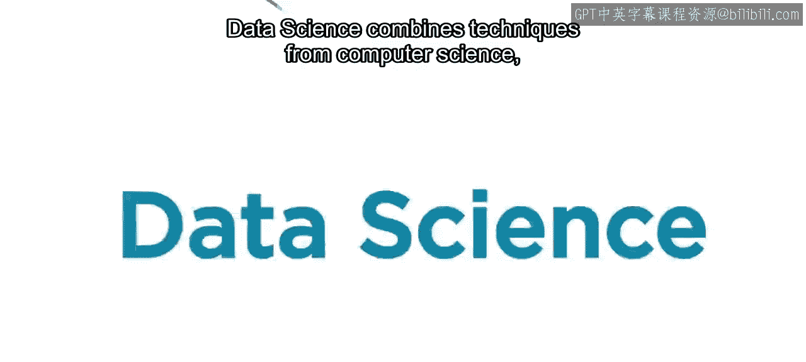

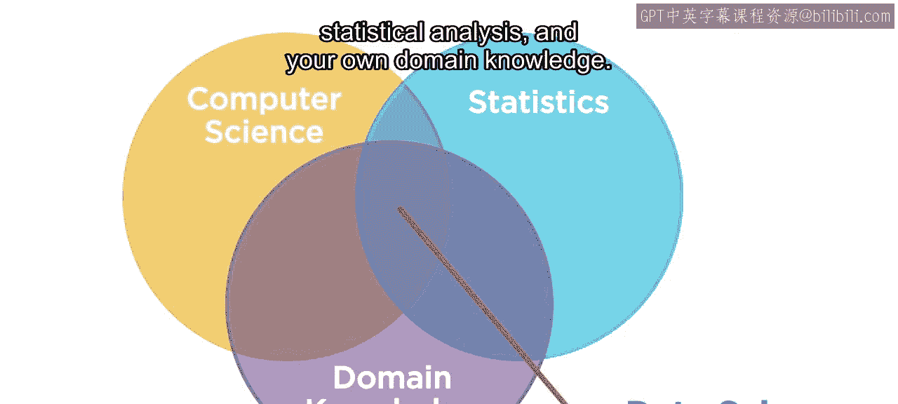

在本节课中，我们将要学习MATLAB如何作为一个强大的工具来支持数据科学的完整工作流程。我们将探讨MATLAB在数据导入、清理、探索、建模以及部署解决方案方面的核心功能。


## 概述

数据科学结合了计算机科学、统计分析以及特定领域的专业知识。对于希望开始实践数据科学的人来说，选择合适的工具至关重要。MATLAB正是为此而设计，它旨在简化数据科学的各项任务，让用户能够专注于从数据中获取洞见。

## MATLAB的起源与设计理念


在20世纪60年代和70年代，使用计算机解决问题需要编写大量代码。Cleve Moler教授希望他的学生能够专注于解决数学和工程问题，因此他创建了MATLAB。其语法设计旨在反映常见的科学与工程符号表示法。

今天，MATLAB仍然是同一种语言，但增加了许多新的、强大且易于使用的功能。MATLAB环境允许您创建**实时脚本**，这是一种将代码、输出和格式化文本结合在一个可执行文档中的形式。

```matlab
% 示例：一个简单的MATLAB实时脚本单元格
data = readtable('mydata.csv');
summary(data)
```

## MATLAB为何是优秀的数据科学工具

MATLAB为数据科学的每个关键步骤都提供了函数和交互式应用程序。这些步骤包括：导入、清理和探索数据；构建和评估模型；以及进行预测。

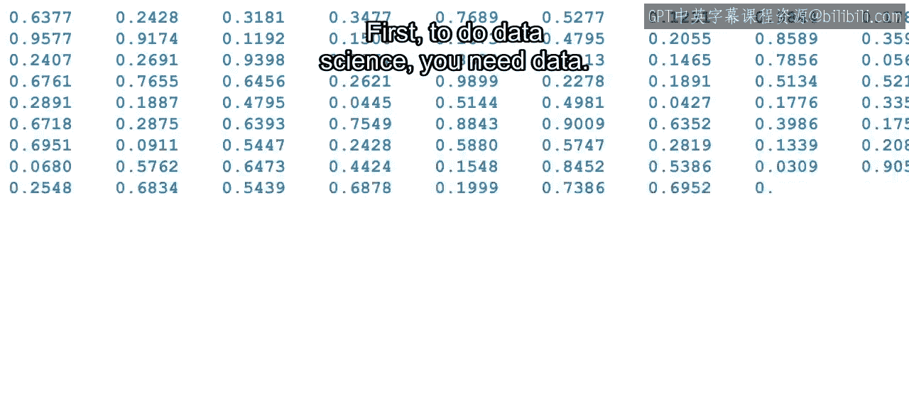

上一节我们介绍了MATLAB的设计初衷，本节中我们来看看它在数据科学工作流中的具体应用。

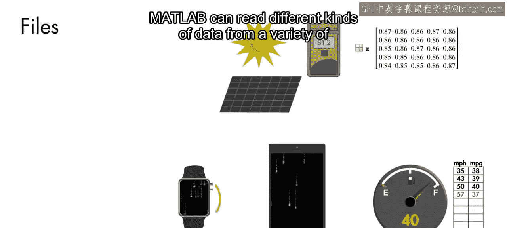

### 数据获取与处理

首先，进行数据科学需要数据。MATLAB可以从多种来源读取不同类型的数据，并帮助您将所有数据整合在一起。

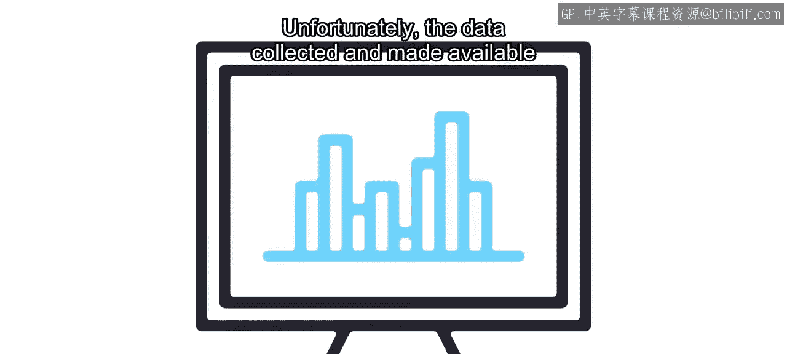

有时，您会遇到数据量过大，以至于计算机无法一次性处理的情况。MATLAB可以为您处理这个问题。您可以在处理整个数据集之前，先用少量数据测试您的想法。

### 数据清理

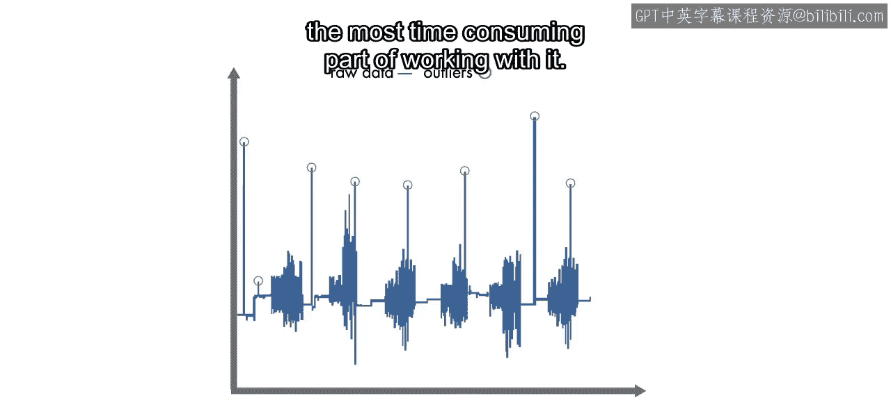

不幸的是，收集并提供给数据科学家的数据通常并不完美。您可能需要处理噪声、缺失数据和异常值。清理数据通常是数据处理中最耗时的部分。

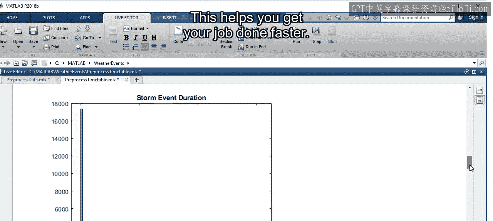

以下是MATLAB中一些有助于快速清理杂乱数据的功能：

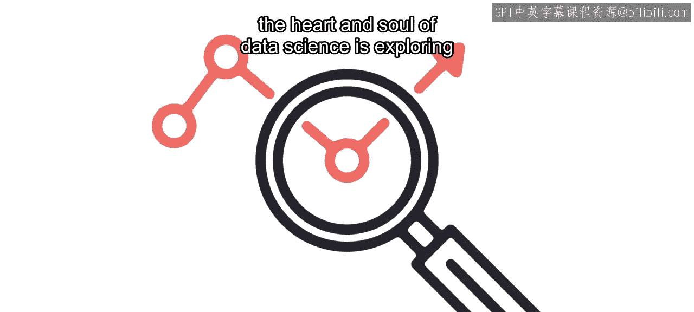

*   **高级函数**：这些函数允许您通过几个快速步骤预处理数据，而无需编写多行代码。这有助于您更快地完成工作。
*   **交互式工具**：MATLAB提供了交互式应用程序，让您能够直观地识别和处理数据问题。

### 数据探索与建模

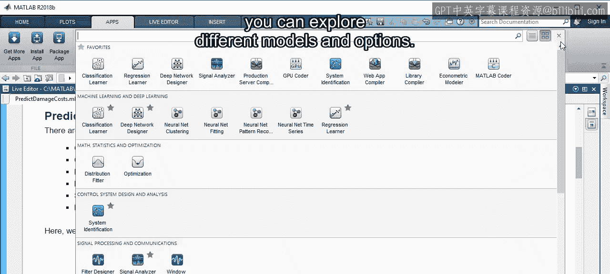

清理数据后，数据科学的核心就是探索数据并构建模型来回答有趣的问题。例如，一场风暴会造成多少损失？

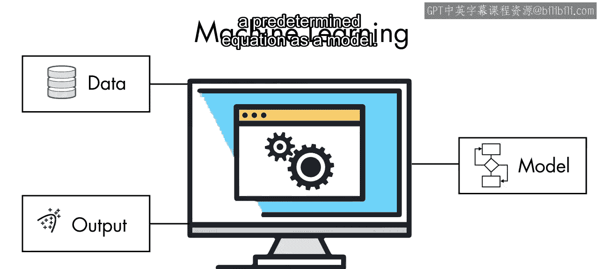

有许多标准的建模技术可以用来回答这个问题。MATLAB提供了实现这些方法的简单函数，同时也提供了交互式应用程序，让您可以探索不同的模型和选项。

例如，机器学习技术使用计算方法直接从数据中学习，而不依赖于预定的方程作为模型。

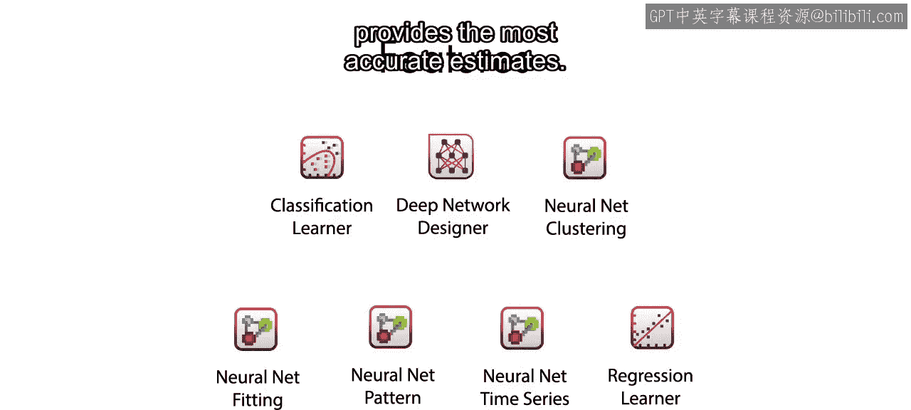

您可以从对可能影响预测结果的特征做出最佳猜测开始。MATLAB使您能够使用多种技术执行**特征提取**步骤。然后，借助MATLAB中的交互式应用程序，您可以快速识别出能提供最准确估计的模型。


通过这些应用程序，您无需成为统计学和其他技术的专家，也能利用强大的机器学习模型。

例如，您可以使用**回归学习器**应用程序尝试多种模型来预测风暴损失的成本。该应用程序允许您交互式地探索各种回归模型。一旦确定了最佳模型，您可以生成MATLAB代码，以便将来自动化该过程。

这些工具引导您完成模型探索阶段，让您对模型的准确性和稳健性更有信心。

### 工作流的交互性与可重复性

能够交互式探索并保存重复和自动化工作所需的步骤非常重要，因为真正的数据科学，就像任何科学一样，是混乱且具有实验性的。在回答一个问题的过程中，您必须尝试不同的事物，并且常常会提出其他需要探索的问题。

### 模型部署与应用

数据科学的目标是回答具有实际影响的问题。如果您构建了一个预测风暴造成损失的模型，您会希望使用它，并让他人也能够使用。您可能希望将此模型放入Web应用程序中。

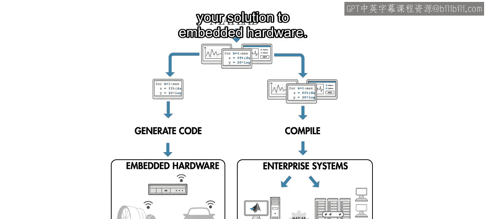

使用MATLAB，您无需将所有内容用另一种语言重新编码，就可以将已完成的工作集成到其他系统中。您可以将MATLAB代码与使用其他语言的应用程序集成，也可以将您的解决方案部署到嵌入式硬件。

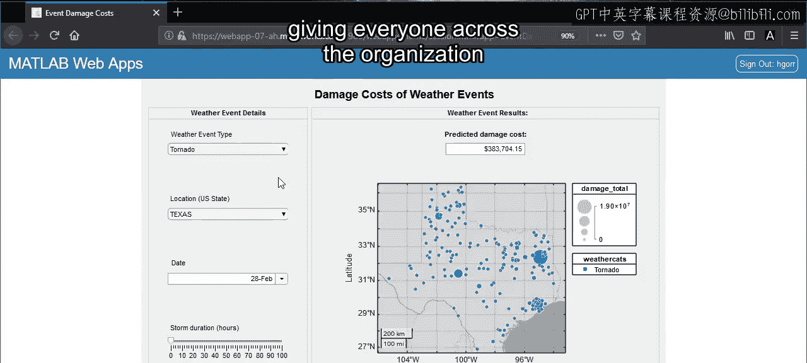

这里您可以看到一个MATLAB Web应用程序的示例。您可以将其部署到您组织的MATLAB Web应用程序服务器上，让组织内的每个人都能通过Web浏览器访问该应用程序。

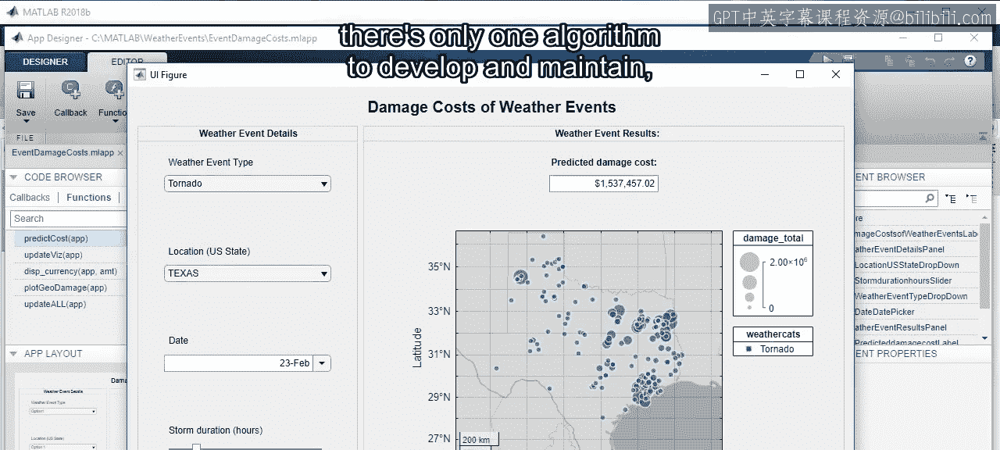

无论您决定以何种方式提供您的解决方案，都只需开发和维护一个算法；在哪里运行它则由您决定。

## 总结

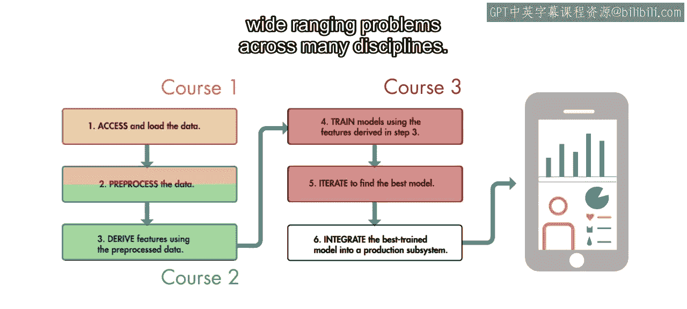

本节课中我们一起学习了MATLAB作为数据科学工具的强大之处。在本专项课程中，您将学习数据科学工作流程中的不同步骤。在数据科学中取得成功需要合适的工具。您将很快熟练掌握MATLAB，这是一个为数据科学家设计的、能够解决跨多个学科广泛问题的强大工具。