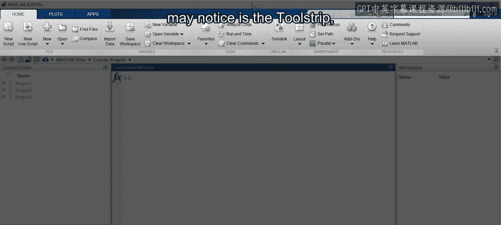
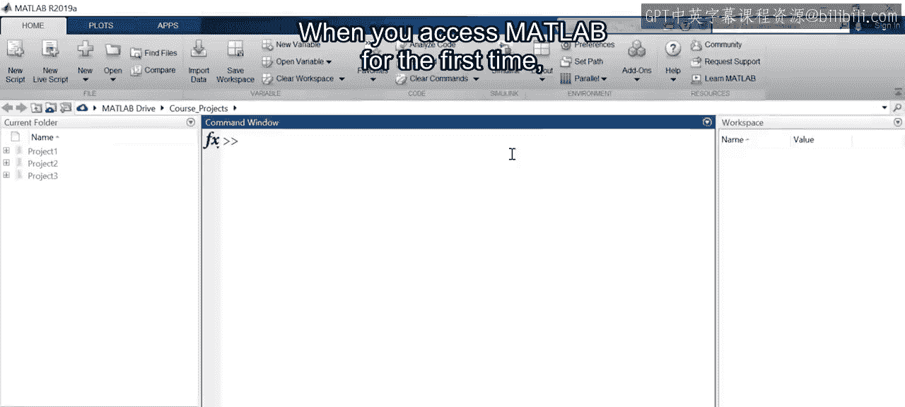
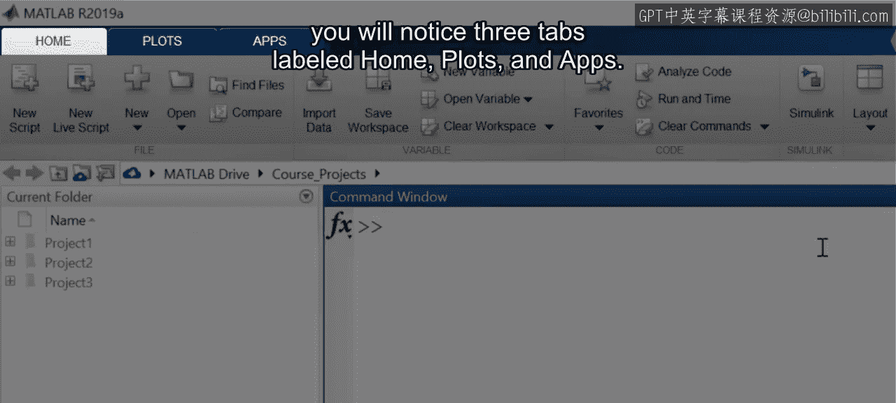
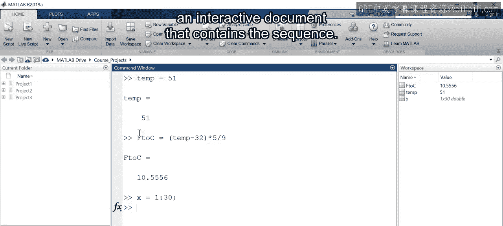
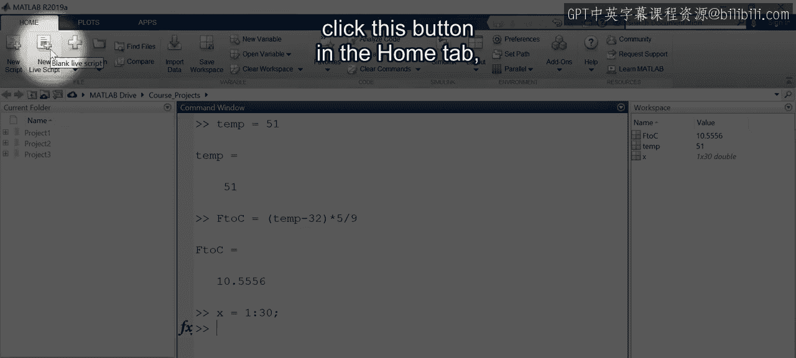

# 6：开始使用MATLAB环境 🚀

在本节课中，我们将学习MATLAB环境的基础知识，包括其界面布局、核心面板的功能以及如何创建和运行脚本。掌握这些是进行数据探索和分析的第一步。


## 认识MATLAB界面



上一节我们了解了MATLAB在数据科学中的应用，本节中我们来看看MATLAB的工作环境，以便快速开始探索数据。


在MATLAB中，首先映入眼帘的是工具条。它将MATLAB的功能组织在一系列选项卡中。






每个选项卡被划分为多个区域，这些区域包含相关的控件，如按钮、下拉菜单和其他元素。工具条便于访问您常用的MATLAB功能，并有助于了解您可能不熟悉的新功能。


首次打开MATLAB时，您会看到三个选项卡，分别标记为“主页”、“绘图”和“APP”。


这些是全局选项卡，无论您在MATLAB中执行什么操作，它们始终存在。

除了全局选项卡，工具条还有上下文选项卡。这些选项卡仅在您执行特定任务时才会出现。

*   **主页**选项卡用于通用操作，如创建新文件和导入数据。
*   **绘图**选项卡包含一个绘图库，用于显示选定的变量。
*   **APP**选项卡提供对MATLAB内置交互式应用程序的访问。在本专项课程后面，您将使用这些应用程序来测试不同的机器学习模型。

## 核心工作面板

工具条下方，默认布局包含三个主要面板：当前文件夹浏览器、命令窗口和工作区。

*   **命令窗口**是您通过在提示符处键入命令来执行计算的地方。
*   一些命令会创建新的变量来保存计算结果。您会看到这些变量出现在**工作区**窗口中。
*   请注意，如果在命令行的末尾添加分号 `;`，结果将不会显示。

```
% 不显示结果
result = 1 + 1;
% 显示结果
result = 1 + 1
```

如果您需要查看变量的内容，可以在工作区中双击该变量以打开变量编辑器。

在命令行中，您可以按**向上箭头键**查看命令历史记录，从而重新调用或重新运行之前执行的命令。然后，您可以选择一个命令进行编辑或再次运行。

## 创建与使用实时脚本



很快您就会希望重用一系列命令或保存工作以供日后使用，这可以通过使用脚本来实现。**脚本**是按顺序执行以实现某个结果的一系列命令。



特别是，**实时脚本**是一种交互式文档，它包含了命令序列、输出以及格式化的文本。


以下是创建和使用实时脚本的步骤：

1.  **创建新脚本**：点击主页选项卡中的“新建实时脚本”按钮，这将打开MATLAB实时编辑器窗口。
    

2.  **编辑脚本**：从命令历史记录中复制命令，并使用编辑器进行修改。请注意工具条中出现了新的上下文选项卡。

3.  **组织内容**：开始使用实时脚本后，您可以通过将命令组拆分为节，并添加文本、注释、标题、图像、方程式等来组织您的分析。在本课程中，您将了解更多关于实时脚本的知识。

您也可以从他人分享的实时脚本开始。在这种情况下，您需要先在当前文件夹浏览器中导航到该文件。

*   导航到文件所在位置，然后双击打开它。
*   实时脚本是扩展名为 `.mlx` 的文件。

## 运行脚本与获取帮助

仔细观察当前文件夹工具栏。它显示了当前文件夹路径，这是MATLAB在运行脚本时用来查找文件的参考位置。

*   **设置路径**：确保将当前文件夹更改为存储实时脚本的项目目录。
*   **运行脚本**：只需点击“运行”按钮即可运行整个实时脚本。如果您的代码被划分为多个节，您也可以逐节运行脚本，并在工作时检查结果。
*   **切换输出显示**：您可以在右侧或内联切换输出的显示方式。

如果您想更改布局以获得更多空间来显示实时脚本及其输出，可以最小化默认显示的面板。您可以使用主页选项卡中的布局菜单快速恢复默认布局。

如果您对实时脚本中的特定函数有疑问，可以通过右键单击它并选择“帮助”来查找更多信息。所有MATLAB函数都有一个文档页面，其中包含调用语法、描述和示例。

除了文档，您还可以使用**自动补全**功能来查看正确的语法或选择要使用的变量。这有助于避免拼写错误和其他错误。

## 总结与展望

这是一个很好的开始。现在您已经学习了MATLAB环境的基础知识，是时候开始探索一些实际数据了。


本节课中我们一起学习了MATLAB界面的主要组成部分，包括工具条、核心工作面板（命令窗口、工作区、当前文件夹）的功能，以及如何创建、编辑和运行实时脚本。我们还了解了如何获取函数帮助和使用自动补全功能。掌握这些基础操作是后续进行数据导入、处理和可视化的前提。