P08：交互式数据探索 🧭

在本节课中，我们将学习如何使用MATLAB的交互式环境进行数据探索。你将了解如何利用实时脚本（Live Script）来可视化数据、调整参数并计算统计量，而无需一开始就成为编程专家。

---

你拥有数据，大量的数据，并且你想利用这些数据来回答问题。你应该使用什么工具进行探索和分析？

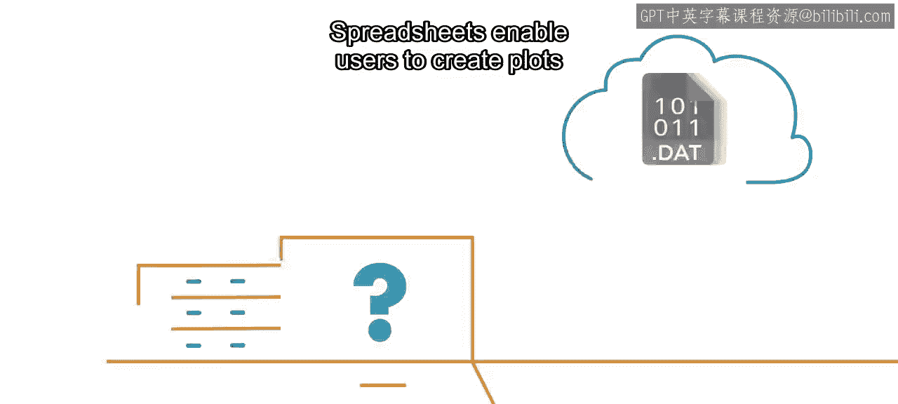

电子表格允许用户在不编写代码的情况下创建图表和计算基本统计量。

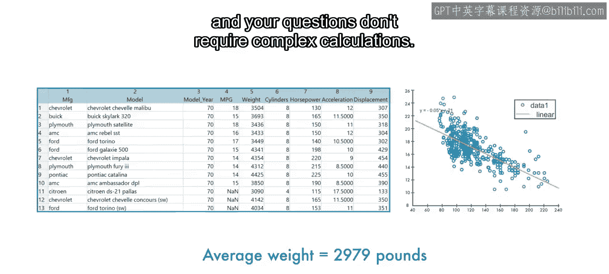

如果你只有少量文件，且你的问题不需要复杂计算，这非常有效。

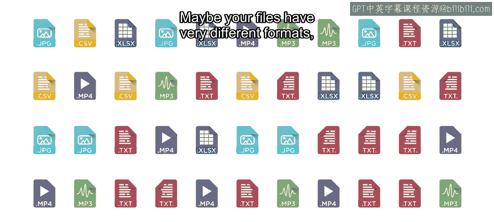

但是，如果你有大量文件，或者你的文件格式差异很大，情况会如何？

又或者数据中存在许多可能的预测变量，你需要确定哪些是最重要的。

使用电子表格分析数据难以扩展。

学习一门编程语言提供了使用复杂模型分析大量数据的灵活性。

那么，在开始数据科学之前，你是否需要成为一名经验丰富的程序员？

这就是MATLAB的用武之地。MATLAB既是一个用于与数据交互的环境，也是一门强大的编程语言。

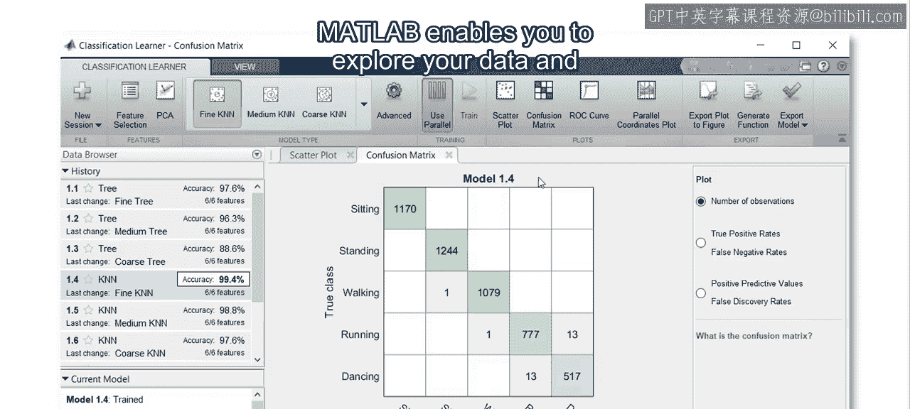

然而，与其他语言不同，MATLAB允许你在自动生成代码的同时探索数据和构建模型。

让我们看一个例子。在本视频中，你将学习如何与实时脚本交互以探索数据。

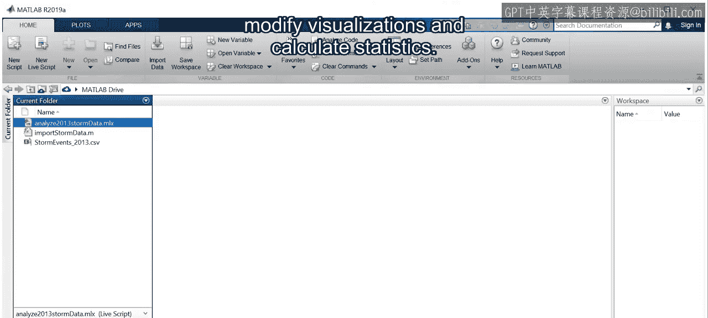

你还将使用交互式控件来修改可视化效果并计算统计量。

在本课程中，你将使用实时脚本来分析数据。到最后，你将能够自己创建它们。

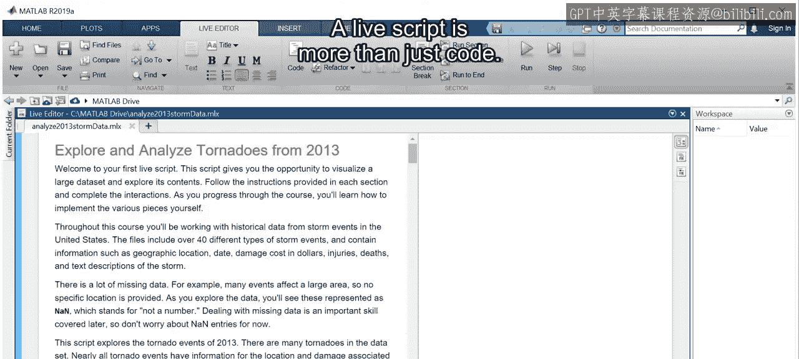

实时脚本不仅仅是代码，它还包含富文本和图形，以帮助记录和交流你的结果。

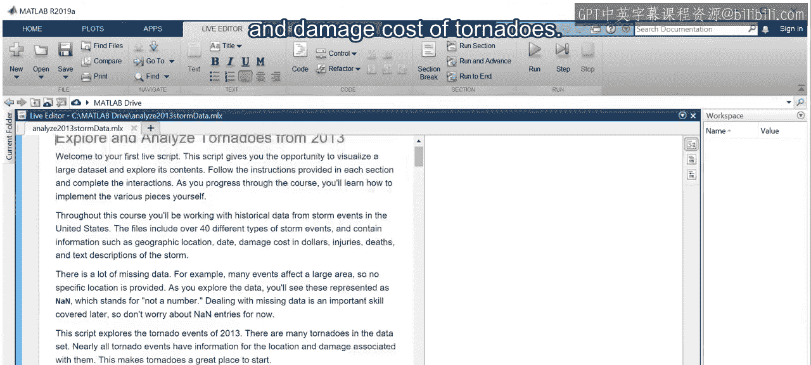

这个脚本使用前面描述的气象事件数据来查看龙卷风的位置和损失成本。

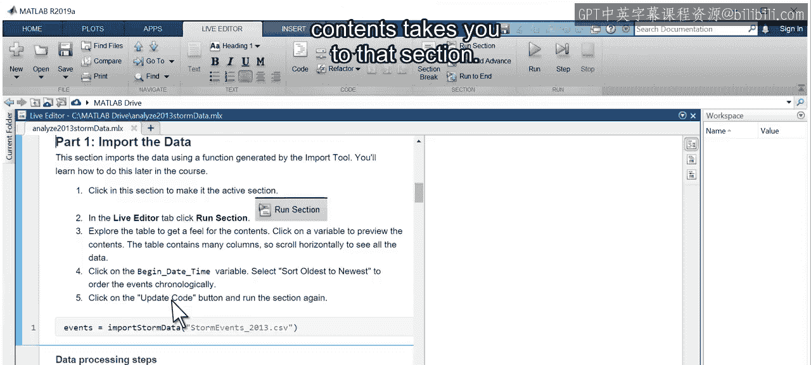

点击目录中的项目可以跳转到相应部分。

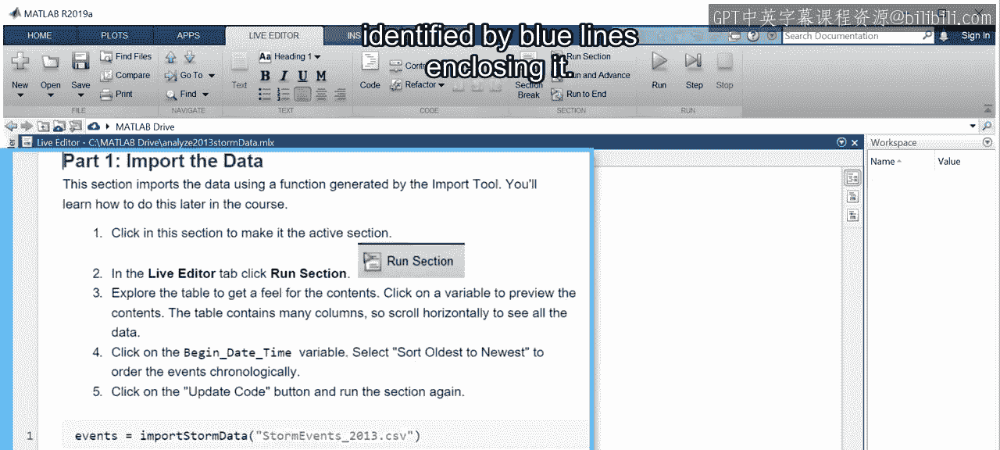

活动部分由包围它的蓝色线条标识。

将代码分成多个部分很有帮助，因为你可以先与一个部分的结果交互，然后再继续。

你可以通过点击实时编辑器选项卡中的“运行节”按钮来运行一个节。

这个部分导入了数据。数据的预览显示在节的旁边，带有滚动条，以便我们可以查看大型表格。

然而，这不是静态预览。点击一个变量可以预览其内容、筛选数据、对表格排序等。

执行这些更改的代码会被捕获并显示给你。这让你可以在实验的同时记录更改并学习语言。

要继续探索，请点击下一个节并运行它。现在看这里，脚本创建了一张所有龙卷风位置的地图。

你已经开始对受龙卷风影响最严重的区域有了初步感觉。

注意这个滑块。滑块使你在探索数据时能够快速更改参数。

这个滑块设置了一个最小阈值，只有造成损失超过此值的龙卷风才会被包含在图中。

图形也是交互式的。点击图形可以调出数据探索按钮。

你可以放大。并拖动地图以更详细地探索不同区域。

所做的更改会被捕获在显示的代码中，以便你将来可以自动化这个过程。

继续浏览脚本，你会发现更多控件，可以按月份可视化龙卷风。

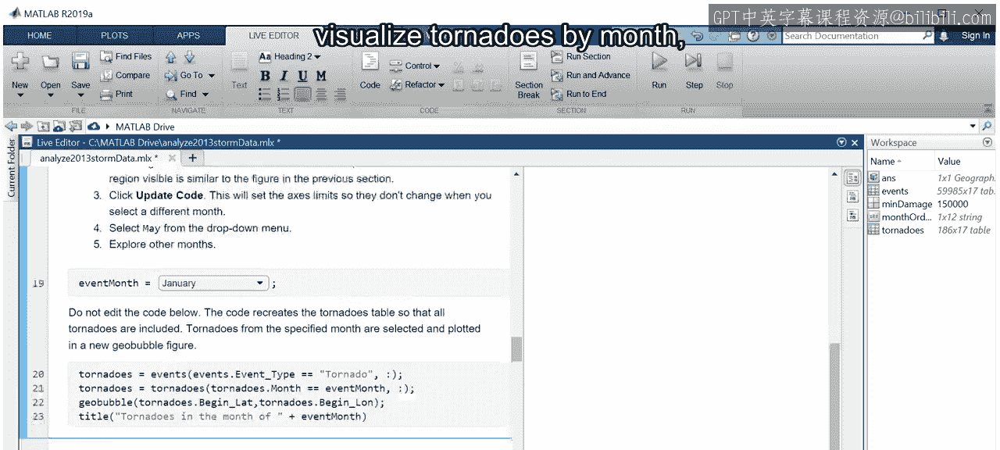

以及计算数据的统计量。现在你知道了如何导航和使用实时脚本，是时候亲自尝试了。

这里展示的实时脚本已为你提供，请按照说明练习探索和可视化数据。

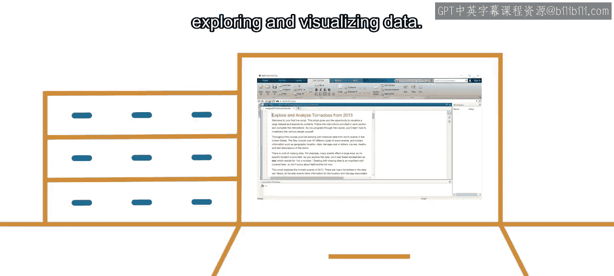

---

本节课中，我们一起学习了MATLAB交互式数据探索的核心方法。我们了解到，实时脚本结合了代码、文本和可视化，是探索数据、调整参数并记录分析过程的强大工具。通过交互式控件和自动代码生成，即使初学者也能高效地进行数据探索。