# 9：数据科学工作流程概述 📊

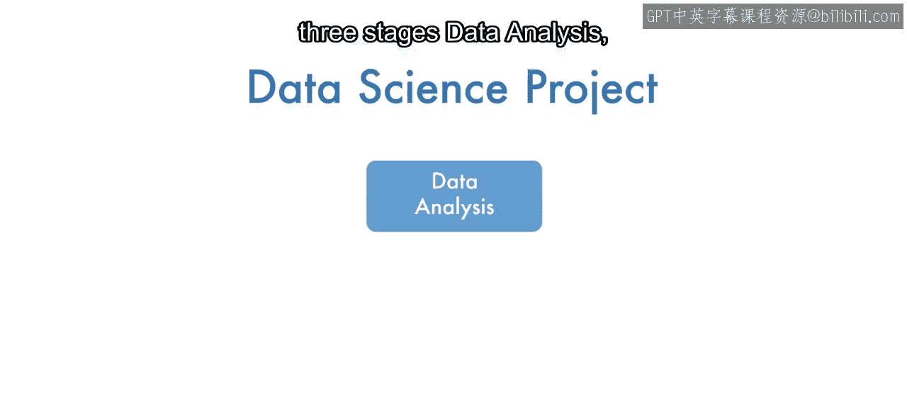

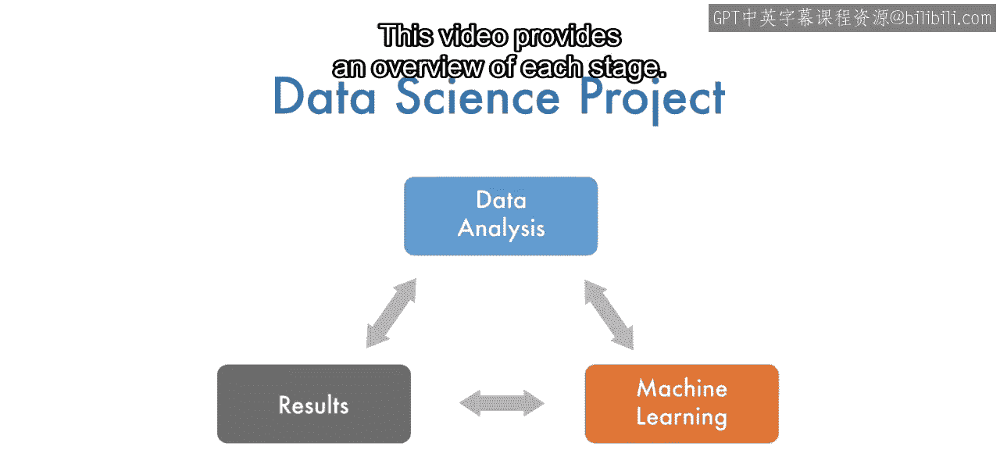

在本节课中，我们将要学习一个典型数据科学项目的完整工作流程。该流程主要包含三个阶段：数据分析、机器学习以及结果处理。本概述将逐一介绍每个阶段的核心任务与目标。

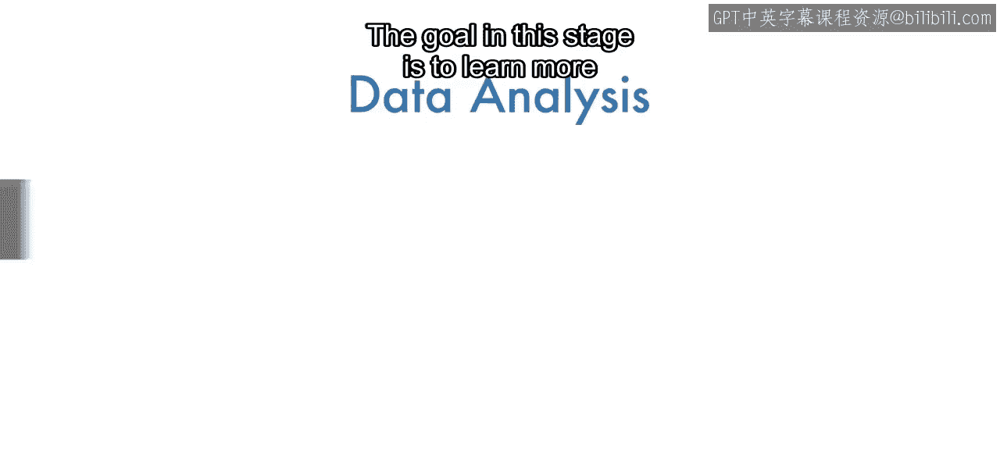

## 数据分析阶段 🔍

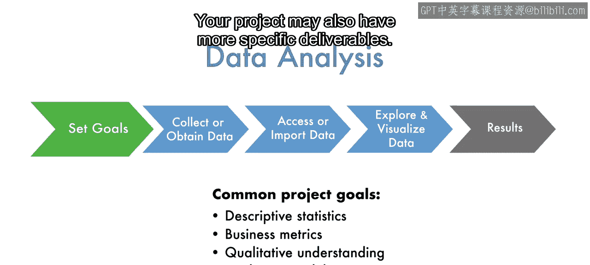

上一节我们介绍了数据科学项目的整体框架，本节中我们来看看第一个阶段——数据分析。此阶段的目标是在尝试从数据中学习之前，先深入了解你的数据。

首先，明确你希望从数据中学到什么，以及打算如何运用这些知识，这对项目启动非常有帮助。你的项目可能还有更具体的交付成果。

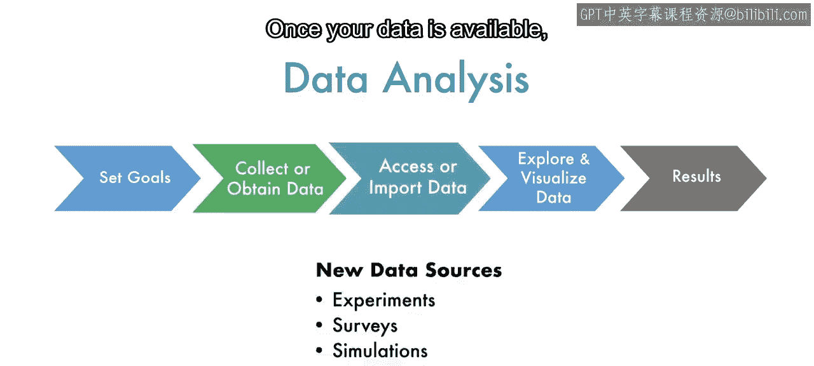

接下来，需要确定项目所需数据的类型、数量和来源。你的数据可能已经存在，也可能需要通过实验、调查或模拟来生成。一旦数据可用，就可以使用MATLAB来访问它。针对不同来源的数据，访问方法取决于数据的位置、类型和大小。

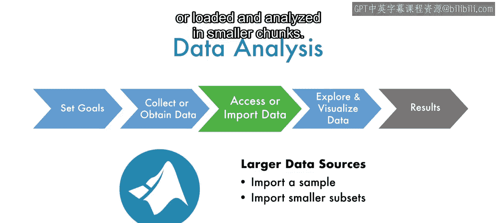

以下是MATLAB处理数据的一些方式：
*   MATLAB可以直接加载较小的文件。
*   它也可以从数据库和流式数据源中提取远程数据。
*   对于较大的数据集，可以进行采样，或者分块加载和分析。

在获取数据之后，就可以通过探索和可视化来了解数据了。首先，检查是否存在缺失、不完整或重复的数据，这些问题会使分析复杂化并导致误导性的结果。

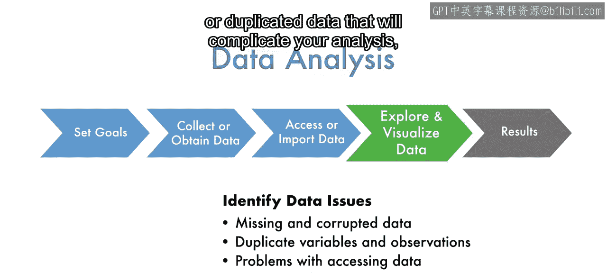

接着，了解数据的组织方式以及每个变量包含的信息类型。关于变量的信息，包括其值、范围、分布和异常值，可以使用MATLAB的统计和汇总函数来获取。

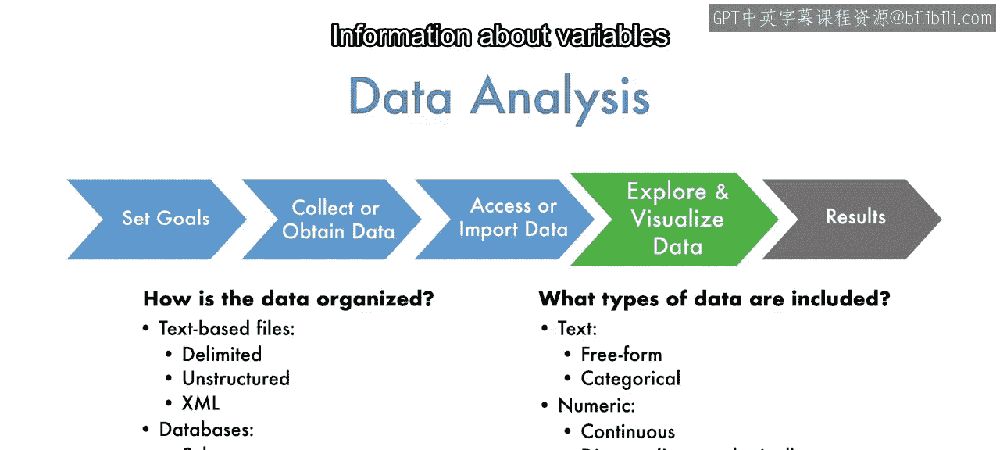

使用MATLAB中的分组函数可以更细致地研究这些属性。像直方图和散点图这样的可视化工具，是了解变量值分布情况和识别潜在关系的另一种快速有效的方法。

最后，通过计算统计量、研究趋势或相关性，或者创建你计划获取的可视化图表，来完成你特定的数据分析目标。在探索和可视化过程中对数据的了解，将为你的结果提供背景信息并增强你对结果的信心。

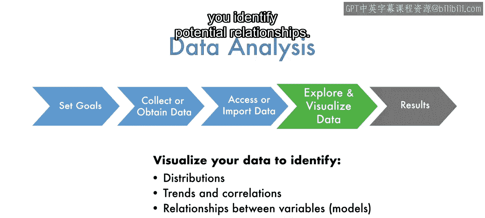

## 机器学习阶段 🤖

在讨论如何处理结果之前，让我们看看许多数据科学项目中经常在数据分析之后进行的另一个组成部分：使用数据来建模变量或观测值之间的关系。

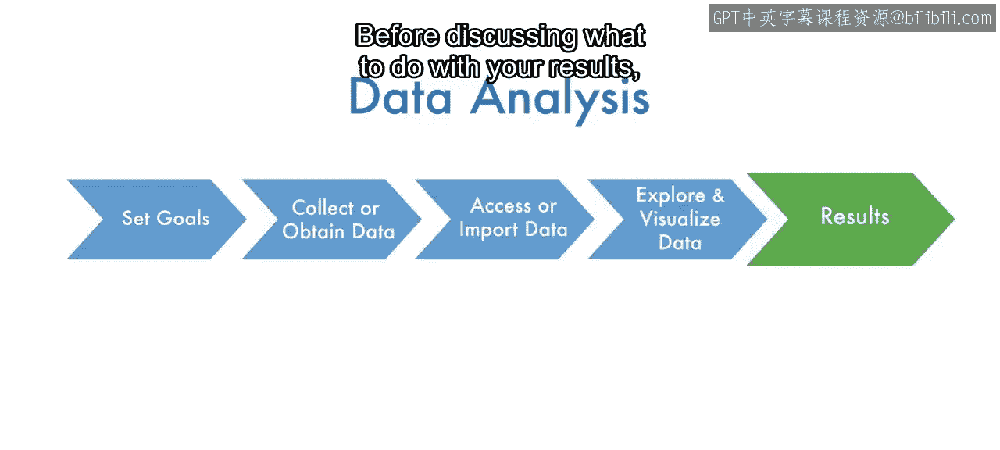

机器学习是使用算法来获取这些关系模型的过程。具体来说，机器学习算法采用一个通用模型，并使用数据来求解一个或多个模型参数，从而使其适应并描述特定的关系。你将在后续课程中了解更多关于机器学习的知识，但目前这个过程可以概括为以下步骤。

以下是机器学习的关键步骤：
1.  **模型和变量选择**：选择合适的算法和输入特征。
2.  **数据预处理**：准备数据以供模型使用，例如处理缺失值、标准化等。
3.  **模型训练**：使用数据来调整模型参数。
4.  **模型验证**：评估训练好的模型在新数据上的性能。

这个过程的结果是一个经过训练和验证的模型，然后你可以将其用于预测和进一步分析。

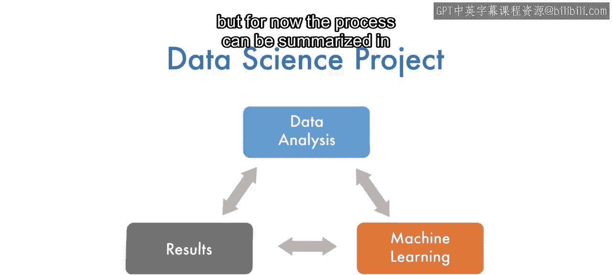

## 结果处理阶段 📈

在完成项目的数据分析或机器学习阶段后，就可以开始处理你的结果了。首先，检查你的工作中是否存在错误，并确保你的结果是可复现的。

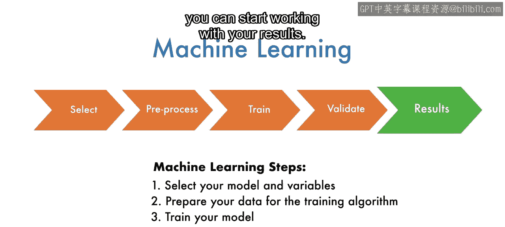

也就是说，它们不依赖于不合理的假设或存在偏差。一旦你对方法感到满意并对定量结果充满信心，就可以利用它们得出结论，并生成你所寻求的定性理解。

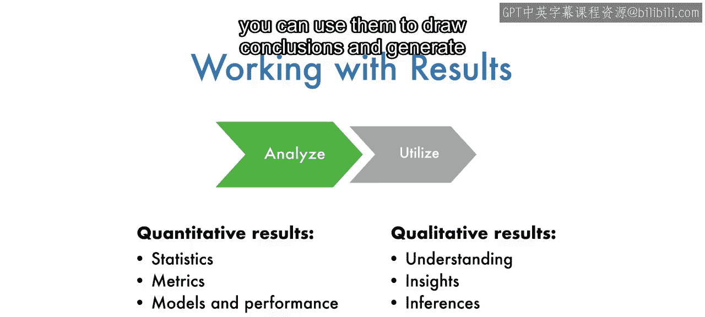

最后，通过可视化、演示和报告来分享你的成果。

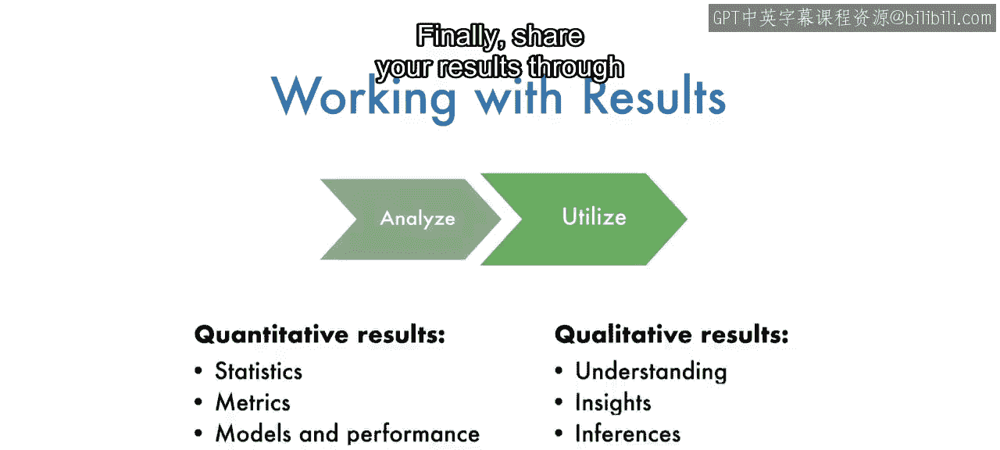

你还可以公开你的数据和代码，以便他人使用和扩展你的工作。最近，使用自动化仪表板发布自定义报告和指标，以及将预测模型部署到自动化系统，已成为分享数据科学成果的流行方式。

## 总结

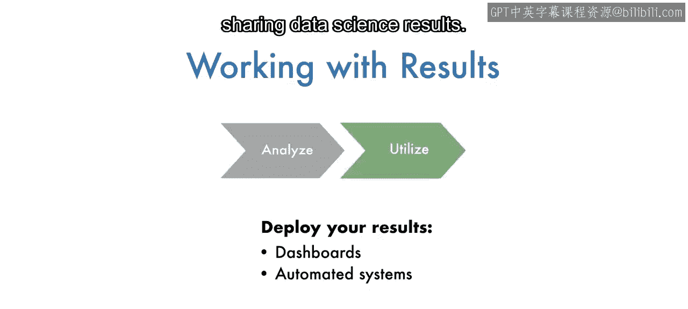

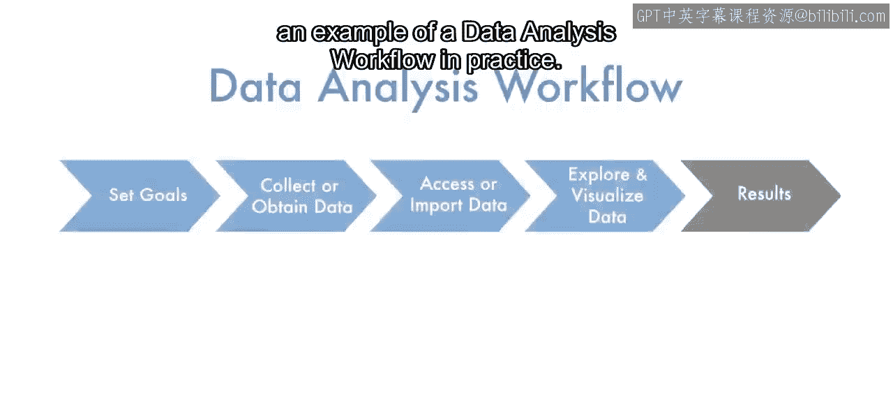

本节课中我们一起学习了数据科学项目的标准工作流程，它包含三个主要阶段：**数据分析**（旨在深入了解数据）、**机器学习**（旨在构建预测模型）以及**结果处理**（旨在验证、解释和分享成果）。每个阶段都有其特定的任务和目标，共同构成了从原始数据到可操作见解的完整路径。在下一个视频中，你将看到一个数据分析工作流程的实例并进行练习。