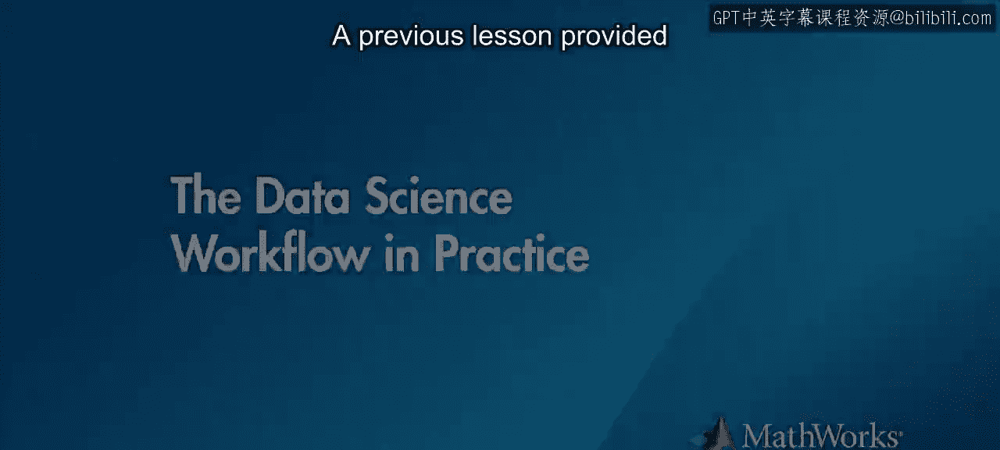
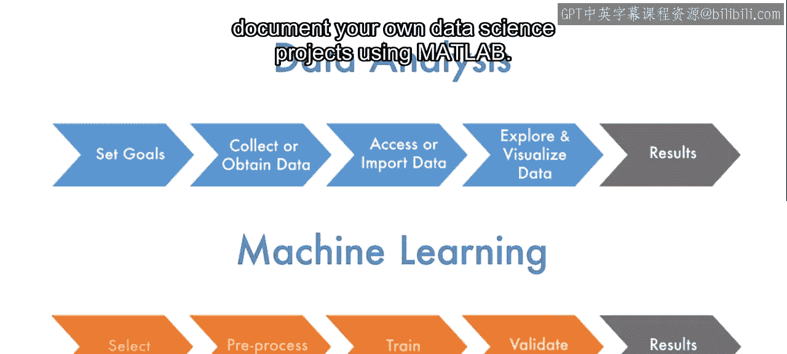

# 10：实践中的工作流程 🚕

在本节课中，我们将通过一个出租车行程数据分析的实际案例，来观察数据科学工作流程的具体实践。你将看到如何从目标设定到结果呈现，完整地执行一个分析项目，并预览MATLAB中用于数据分析和机器学习的一些工具。

上一节我们概述了数据科学的工作流程。本节中，我们来看看这个流程在一个真实项目中的应用。

### 项目目标与数据概览

该分析项目设定了两个主要目标。第一个目标是更好地理解行程日志数据，特别是总费用与每次行程的距离和时间之间的关系。第二个目标是创建一个比现有计费方案更简单的替代方案，仅使用行程距离和时间来计算车费。这个定价模型还需要满足两个实际约束：生成大致相同的总收入，以及最小化车费变动。

数据科学家同时提供了数据摘要，包括数据来源、文件类型以及对每个日志条目中记录变量的描述。

### 数据导入与初步处理

首先，使用导入工具预览文件内容，选择感兴趣的变量，并将数据导入到MATLAB表中。随后，生成对应的代码并将其添加到实时脚本中，以便未来自动导入数据。

接下来，数据科学家使用交互式工具和可视化图表来检查表变量，并应用过滤器以移除可能影响分析的缺失数据和异常值。过滤代码被添加到实时脚本中，以便将分析重点集中在常见的距离和费用金额上。

### 数据探索与关系分析

虽然行程距离已包含在原始数据中，但总费用和行程时间需要从其他变量中生成。在检查后，添加了额外的字段和代码以从这些新变量中移除任何异常值。

随后，使用描述性统计和直方图探索数据集，这提供了变量值范围和分布的信息。最后，数据科学家通过计算相关系数和为每对变量生成散点图，来研究费用、距离和时间之间的关系。结果表明，这些变量之间存在很强的线性关系。

### 应用机器学习建模

在达成第一个目标后，下一步是使用机器学习来捕捉这种关系。正如脚本中所述，数据科学家使用了回归学习器应用程序来创建模型。以下是创建模型的步骤：

1.  **选择模型变量**：由于数据已经过清理，无需额外的预处理步骤，且应用程序默认提供验证功能。
2.  **选择模型类型**：根据分析目标选择合适的回归模型类型。
3.  **训练与验证**：启动训练过程，应用程序会提供性能指标和可视化图表用于模型评估。

训练完成后，模型可以导出为MATLAB变量，或者生成代码并添加到脚本中，以便自动重新创建模型。

### 模型验证与目标达成

完成机器学习建模后，分析的最后一个步骤是检查所得模型是否满足第二个项目目标。

首先，将当前计费模型产生的总费用与新模型生成的总费用进行比较，以确保模型按预期运行。由于数据量很大，数据科学家还使用了散点图来确认简化模型捕捉到了当前系统的行为特征。

最后，分析表明该模型满足了给定的约束条件：总收入保持不变，且大多数车费的变化小于50美分或5%。

### 总结

本节课中，我们一起学习了一个完整的数据科学工作流程实例。通过出租车数据分析项目，我们看到了从设定目标、导入和清理数据、探索性分析、应用机器学习建模，到最终验证结果并满足业务约束的全过程。数据科学家使用实时脚本记录了整个工作流程，从目标到结果，确保了分析的可重复性和透明度。在达成两个主要目标后，数据科学家总结道，还可以做更多工作来验证和完善结果。希望这个实例能激发你使用MATLAB来执行和记录自己数据科学项目的兴趣。