# 11：数据科学工作流程总结 🎉

在本节课中，我们将回顾模块一的核心内容，总结数据科学的基础知识、MATLAB的作用以及初步的数据探索流程。

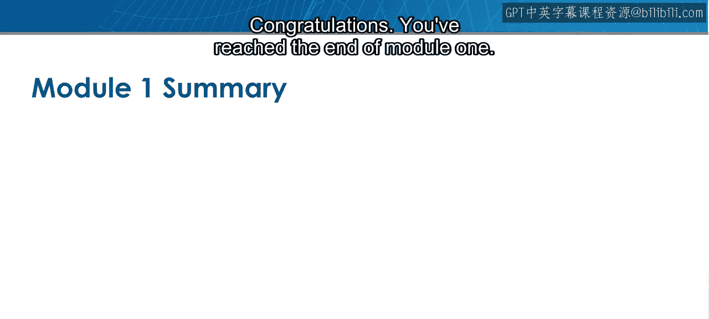

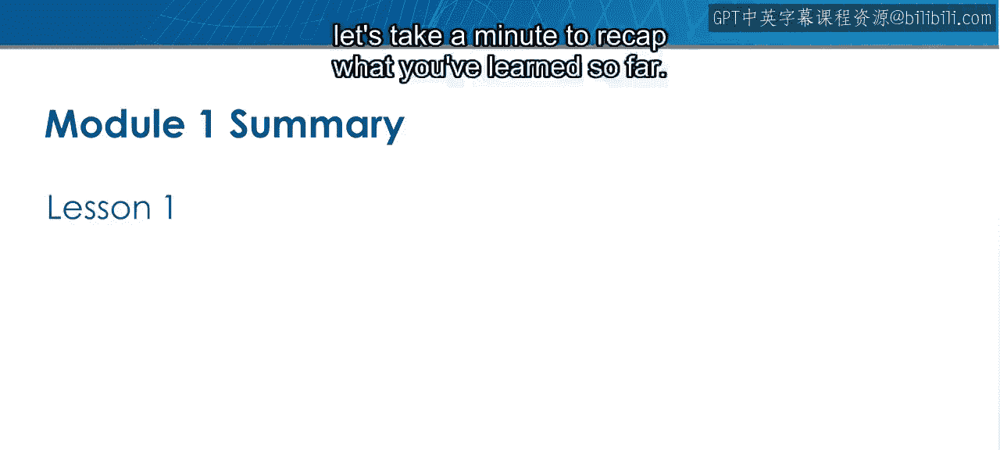

恭喜你完成了模块一的学习。在进入测验之前，让我们花一点时间来回顾到目前为止所学到的内容。

## 模块一内容回顾

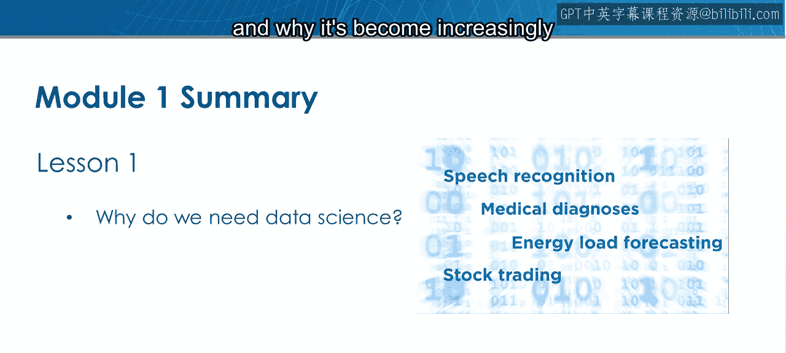

上一节我们介绍了数据科学的基本概念，本节中我们将系统梳理整个模块的知识点。

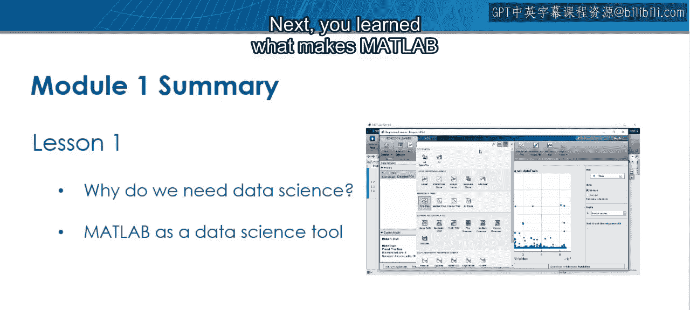

以下是模块一涵盖的核心主题：

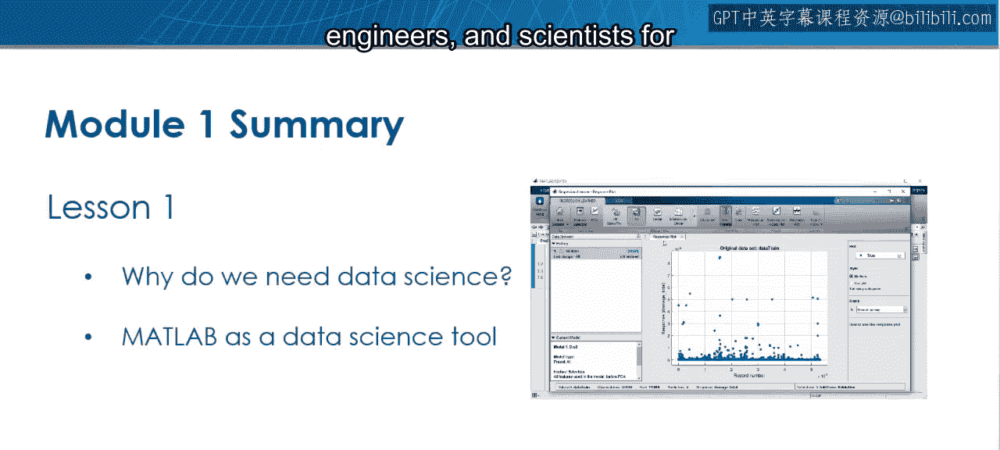

1.  **数据科学概述**
    你首先学习了数据科学的定义，以及它为何在工业界和科研领域变得日益重要。

2.  **MATLAB作为数据科学工具**
    接下来，你了解了MATLAB为何是数据科学的强大工具，以及分析师、工程师和科学家们如何将其广泛应用于各种场景。

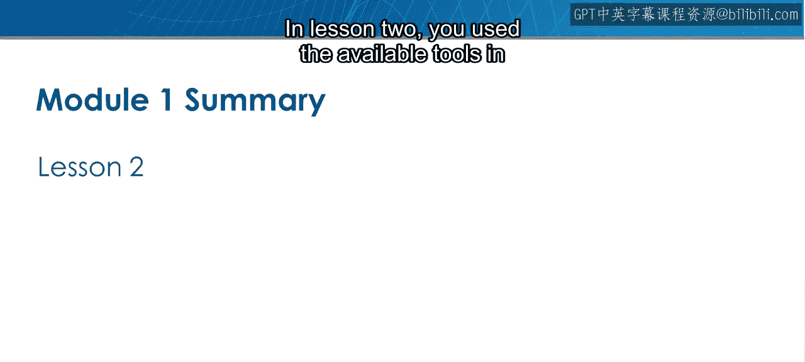

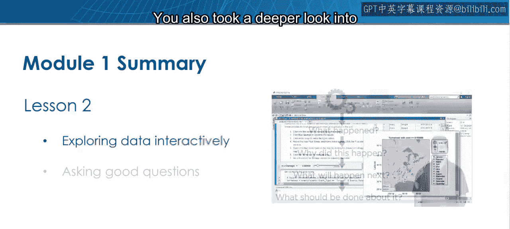

3.  **交互式数据探索**
    在第二课中，你使用了MATLAB中的可用工具进行交互式数据探索。你也更深入地研究了你的数据可以帮助回答哪些类型的问题。

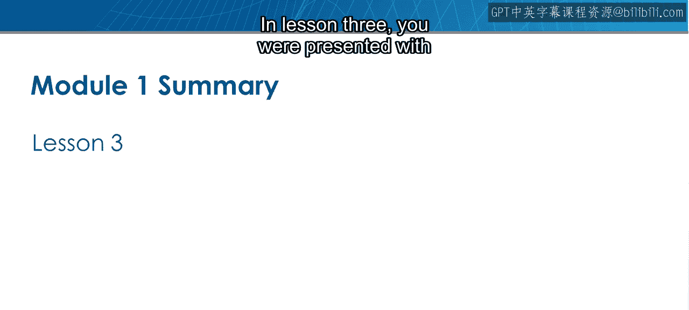

4.  **数据科学工作流程概念**
    在第三课中，你获得了关于数据科学工作流程的概念性概述。

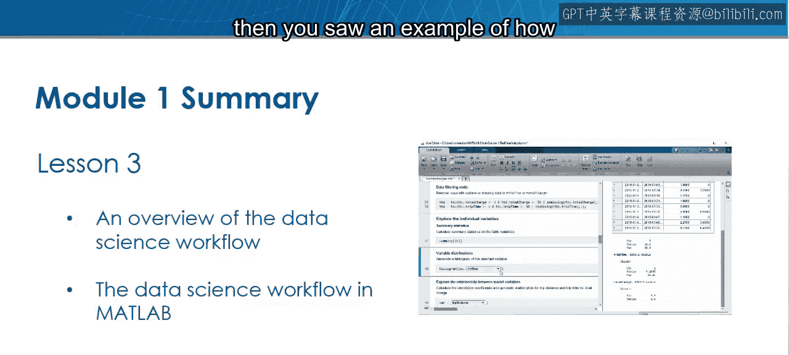

5.  **探索性数据分析示例**
    随后，你看到了一个在MATLAB中执行探索性数据分析的示例。

## 后续学习与测验

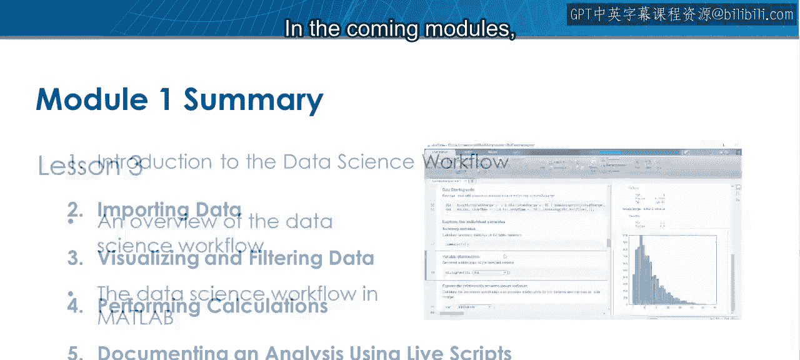

在接下来的模块中，你将学习更多关于处理数据的方法，以及如何在MATLAB中开展你自己的探索性数据分析。

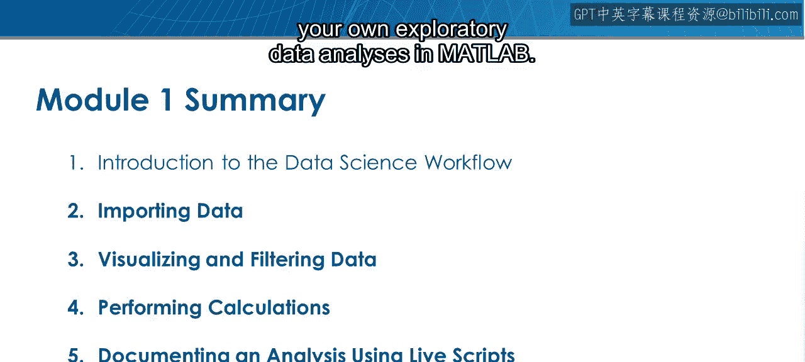

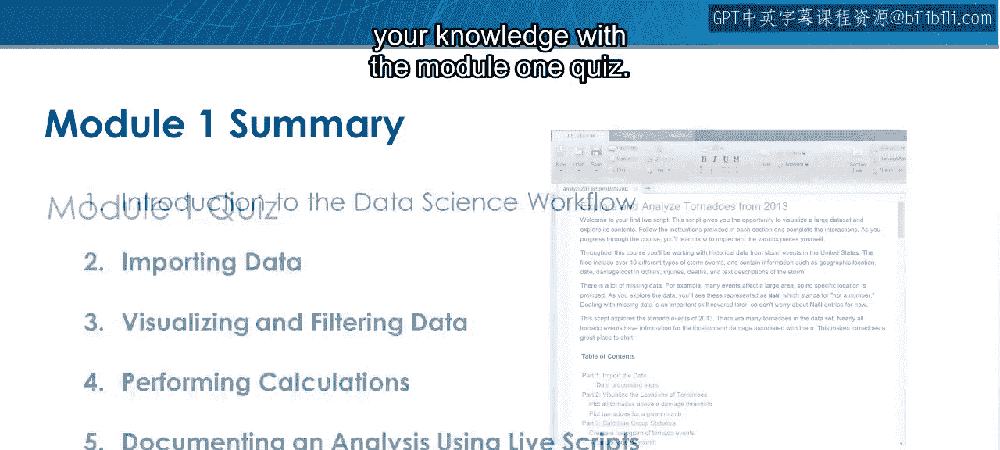

但现在，是时候通过模块一的测验来检验你的知识了。

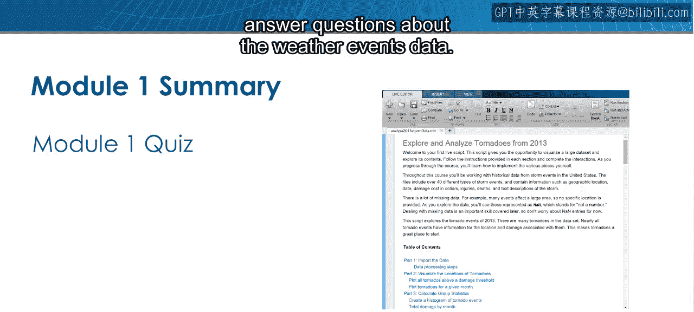

以下是关于测验的具体说明：

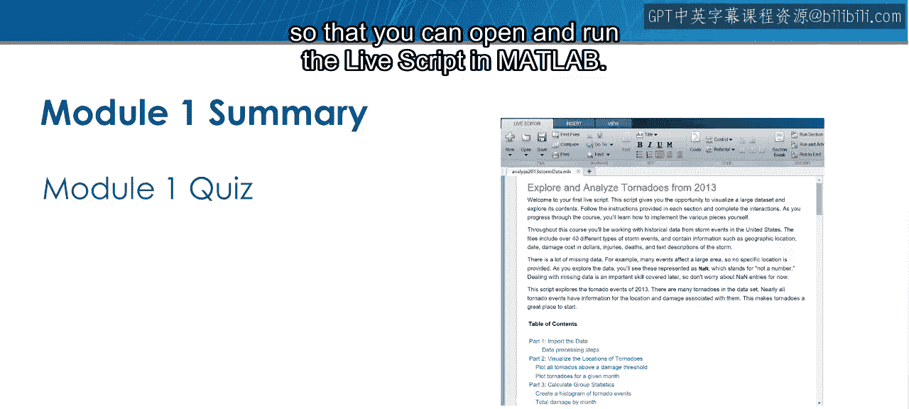

*   你将使用一个现有的实时脚本来回答关于天气事件数据的问题。
*   请仔细遵循设置说明，以便你可以在MATLAB中打开并运行该实时脚本。
*   实时脚本中的说明将引导你完成分析，并帮助你在测验页面上回答问题。

---

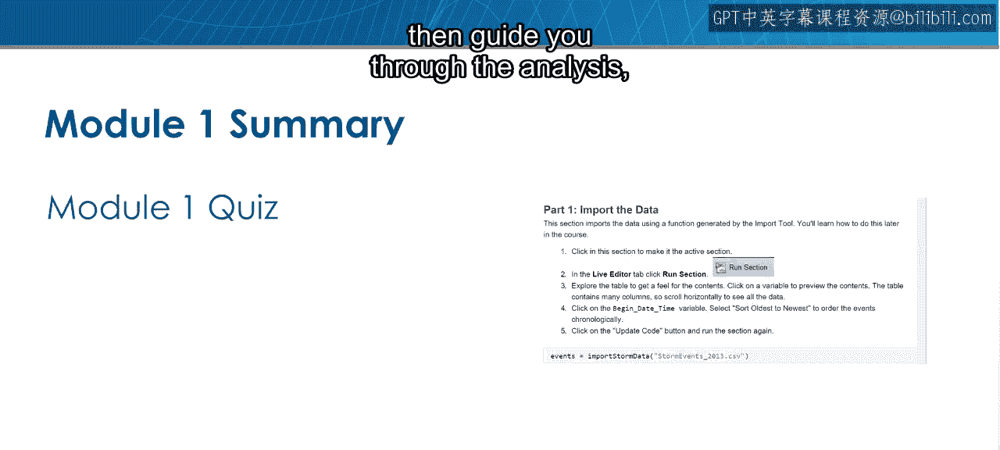

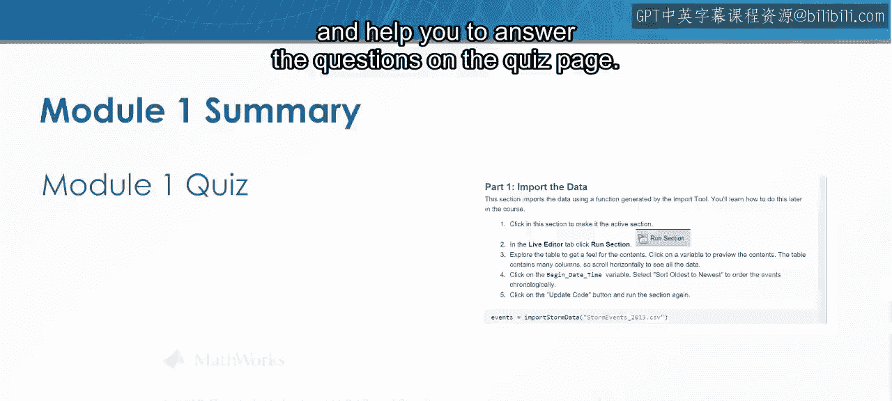

本节课中我们一起学习了数据科学的基本概念、MATLAB的核心优势以及初步的数据探索工作流程。你已经为进行实际的数据分析和完成模块测验做好了准备。