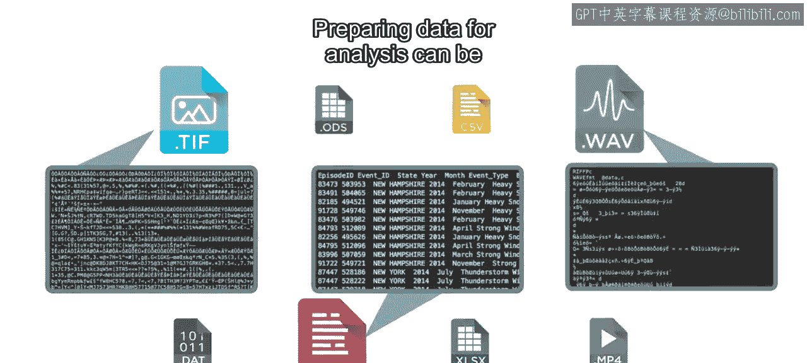
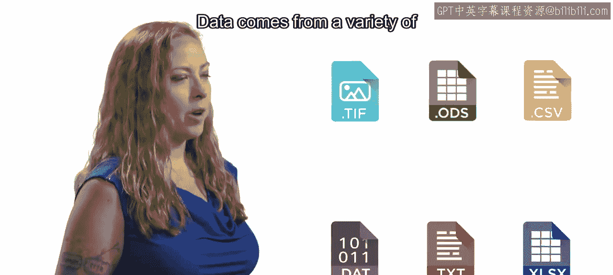

# 12：导入数据介绍 🎼


在本模块中，我们将学习数据科学工作流程中的关键一步：如何将数据导入MATLAB。上一模块我们介绍了如何识别数据源，接下来就需要访问这些数据并将其导入到MATLAB环境中进行分析。


数据来源多种多样，并以多种不同的格式存储。理解这些格式是成功导入数据的第一步。


为分析准备数据是数据科学中的一项主要挑战。这通常涉及理解数据的原始结构和含义。



例如，当数据被获取和存储时，如何确保你正确地解读了数字和文本序列的原始意图？

在本模块中，你将学习数据通常如何存储，以及MATLAB在导入数据后如何表示这些数据。你还将学习如何使用导入工具交互式地导入数据。最后，你将了解如何自动化导入过程，以简化和加速未来的分析。


让我们开始吧。


---

## 课程概述

在本节课中，我们将要学习数据导入的基础知识。我们将探讨常见的数据存储格式、MATLAB的数据表示方法，以及两种主要的导入方式：交互式导入和自动化脚本导入。

---



## 数据来源与格式

上一节我们提到了数据导入是工作流程的下一步。本节中我们来看看数据通常以哪些形式存在。

数据可以来自各种源头，例如传感器、数据库、电子表格或网页。相应地，它们也被存储为不同的文件格式。


以下是几种常见的数据存储格式：
*   **文本文件**：如 `.txt`， `.csv` (逗号分隔值)。
*   **电子表格**：如 `.xls`， `.xlsx` (Microsoft Excel)。
*   **科学数据格式**：如 `.mat` (MATLAB 数据文件)， `.h5` (HDF5)。
*   **数据库**：如通过 ODBC 或 JDBC 连接访问。
*   **其他专有格式**：由特定硬件或软件生成。

---

## 数据导入的挑战

了解了数据格式的多样性后，我们面临的下一个挑战是数据准备。原始数据往往不能直接用于分析。

核心挑战在于准确解读数据。当数据被记录时，数字和文本的序列有其特定含义。例如，一列数字可能代表温度、压力或时间戳。导入数据时，必须确保MATLAB能按照原始意图来理解这些数据。

这涉及到处理缺失值、不一致的格式、错误的单位以及元数据（描述数据的数据）的识别。

---

## 本模块学习目标

面对这些挑战，本模块旨在为你提供解决方案。我们将重点关注以下三个核心部分：

1.  **数据表示**：学习数据在MATLAB中的基本表示形式，如**数组**、**表**和**结构体**。例如，表格数据可以导入为一个 `table` 变量：
    ```matlab
    dataTable = readtable(‘mydata.csv’);
    ```

2.  **交互式导入**：使用MATLAB的**导入工具**，通过图形界面直观地预览、选择和配置导入选项，适用于一次性或探索性任务。

3.  **自动化导入**：学习编写脚本或函数来自动执行导入过程，例如使用 `readtable`， `xlsread` 等函数。这对于需要重复进行的分析至关重要，能提高效率并保证一致性。
    ```matlab
    % 自动化读取多个CSV文件的示例框架
    fileList = dir(‘*.csv’);
    for i = 1:length(fileList)
        currentData = readtable(fileList(i).name);
        % 在此处进行后续处理
    end
    ```

---

## 总结

本节课中我们一起学习了数据导入模块的引言部分。我们明确了在数据科学工作流程中，继识别数据源之后，必须将数据正确导入MATLAB。我们认识到数据格式的多样性以及由此带来的解读挑战。最后，我们概述了本模块将涵盖的核心内容：理解MATLAB的数据表示方法，掌握交互式导入工具的使用，以及学会编写代码实现自动化导入，为后续的数据探索和分析打下坚实的基础。