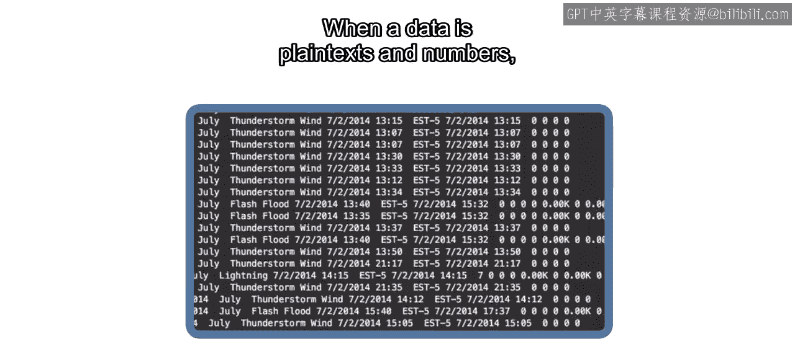
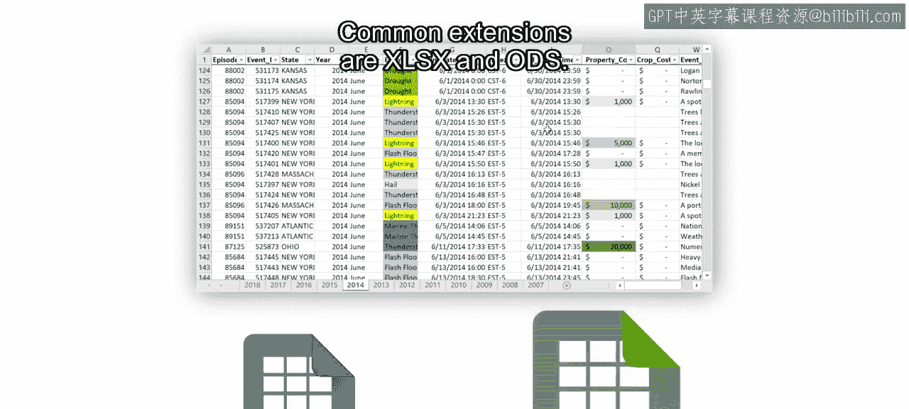

# 13：数据的存储方式 📁

在本节课中，我们将学习数据在计算机中是如何以数字形式存储的，并练习如何将样本数据集导入MATLAB。

数据无处不在，数据科学家通过分析数据来识别和解答问题，以帮助改善世界。为了进行分析，我们首先需要理解数据的存储方式。

## 数据的常见格式

数据通常以文本、数字、图像、视频和音频等形式存储，但也可以是任何需要分析的内容。数据以数字形式存储在文件中。

每个文件都有一个唯一的名称，后跟一个扩展名。这个扩展名表明了存储数据所使用的格式。

## 文本与数字数据的存储

当数据是纯文本或数字时，可以存储在文本文件中，其扩展名为 `.txt`。

如果你打开一个文本文件，会看到每一行包含多个值。在这个文件中，同一行中的值由制表符分隔。以这种方式查看数据时，可能难以分辨每个值属于哪一列，但计算机能准确地读取它。

那么，所有文件类型都遵循这种一致性吗？让我们打开一个CSV文件在文本编辑器中比较一下。你注意到什么不同了吗？

这种文件格式在每个值之间使用逗号而不是制表符。CSV实际上代表“逗号分隔值”。在数据文件中，任何字符都可以用来指示列。用于分隔每列的字符称为**分隔符**。最常见的分隔符是逗号、空格和制表符。

## 电子表格软件

将数据组织成行和列是如此普遍，以至于有专门为此设计的软件程序，这使得电子表格软件成为存储数据的流行选择。

文件扩展名取决于你使用的程序。常见的扩展名有 `.xlsx` 和 `.ods`。

这些文件使用更复杂的格式来存储特定于程序的附加信息。因此，数据只能由能够解释该文件格式的程序访问。

## 其他数据类型的存储

类似地，不同类型的数据也使用自定义的文件格式存储，例如图像或声音文件。

如果你在文本编辑器中打开这些文件，内容将是无法识别的。这些文件将数据存储为一系列有限的数值。

MATLAB可以从常见的文件类型中提取数据，包括图像、视频和音频文件。

## 总结

本节课中，我们一起学习了数据的数字存储方式。所有数据科学家都处理数据，但数据的类型和格式各不相同。无论格式如何，数据本质上仍然是数字和文本。你可以使用MATLAB来加载并分析它。

现在，你已经准备好学习当数据被导入MATLAB后是如何组织的了。