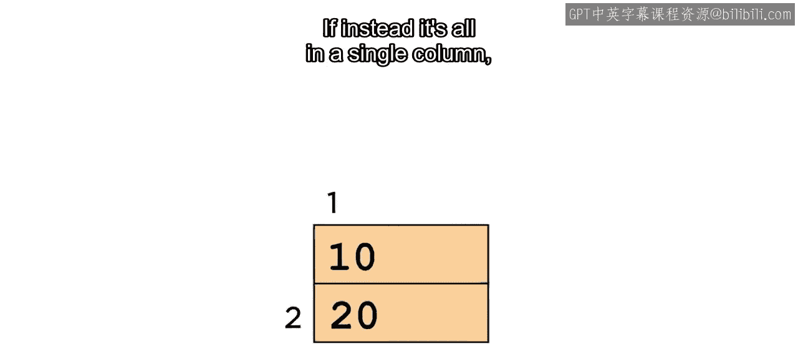
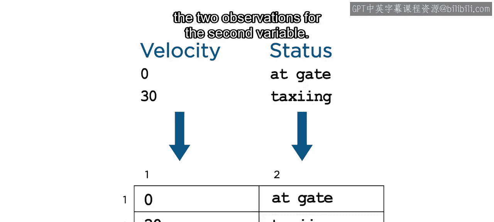
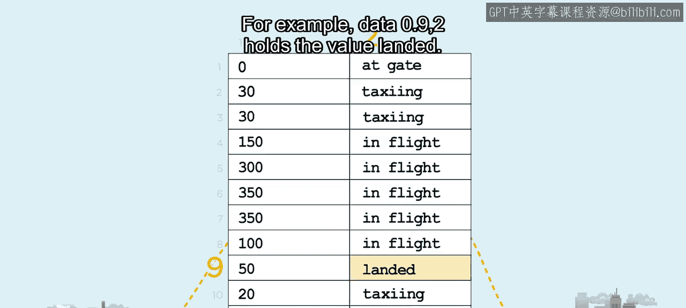
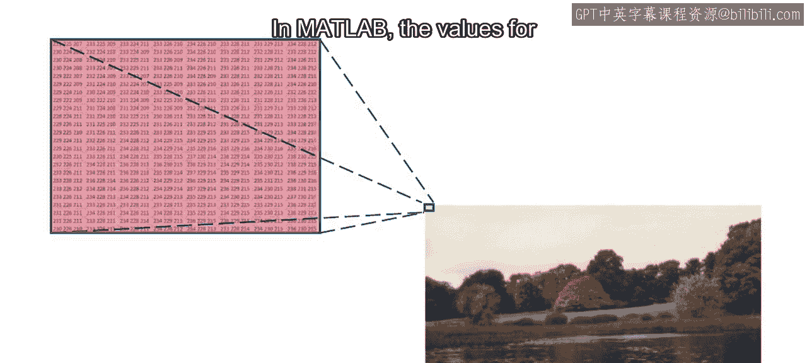
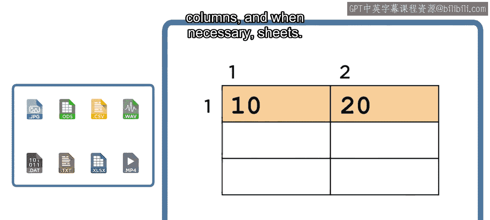
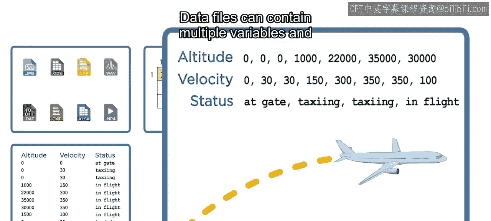

# 14：MATLAB如何表示数据 🎼

在本节课中，我们将要学习MATLAB如何组织和表示数据。理解数据在MATLAB中的基本结构，是进行有效数据分析和处理的第一步。

## 数据文件与加载

正如你所见，计算机使用多种文件格式以数字和文本的形式存储数据。

你可以使用MATLAB从许多常见的文件类型中加载数据。

## 数据的基本组织方式

上一节我们提到了加载数据，本节中我们来看看当数据从其原始文件格式中提取出来后，它是如何组织的。理解这一点将使你能够更好地处理数据。

在MATLAB中，数据被组织成行和列。如果我们的数据是单个值，它将占据单独的一行和一列。其大小为 `1 x 1`，意味着它有一行长和一列宽。

如果第二个值存储在第二列中，大小将增加到 `1 x 2`，因为数据现在是一行长、两列宽。

当所有数据都在单一行中时，它被称为**行向量**。

如果所有数据都在单一列中，它被称为**列向量**。

## 向量与变量

一个向量通常包含单个测量变量的观测值。

数据文件通常包含多个变量的观测值，因此包含多个向量。

这些向量可能包含数字和文本的组合，代表独特的、空间的或时间的信息。例如，如果你在追踪一个航班，你可能会记录飞机的**高度**、**速度**，或许还有**飞行状态**。

## 多变量数据的组织

和之前一样，MATLAB将每个观测值放在其自己的行和列中。默认行为是假设每个变量都是一个列向量，每个观测值在其自己的行中。

以下是数据组织的示例：
*   例如，如果数据由两个变量组成，每个变量有两个观测值，那么第一列将包含第一个变量的两个观测值，第二列将包含第二个变量的两个观测值。

数据被组织成行和列后，你可以使用其行索引和列索引来引用特定的值。例如，数据点 `(9, 2)` 保存着值 “landed”。

在索引时，第一个数字表示行，第二个数字表示列。

## 多维数据

到目前为止我们考虑的数据可以组织成一个二维的行列矩阵。然而，有些变量每个观测值包含多个值。考虑一个图像文件。

在这里，行和列保留了图像中像素的空间分布。数据中的每个行和列对代表一个唯一的像素位置，但每个像素关联着三个颜色值，分别表示相应的红、绿、蓝强度。

在MATLAB中，每种颜色的值被放在其自己的“页”上。

每页具有相同的行数和列数，表示图像的高度和宽度（以像素为单位）。这些页沿着第三维度堆叠在一起，首先是红色页，然后是绿色页，最后是蓝色页。

其大小为 `行数 x 列数 x 3`，其中 `3` 表示页的数量。

## 课程总结

本节课中我们一起学习了MATLAB中数据表示的核心概念。

总结来说，MATLAB可以从许多常见文件类型加载数据，加载的数据被组织成行、列，并在必要时组织成页。

默认情况下，每列中的观测值被认为都属于一个唯一的变量。

数据文件可以包含多个变量，观测值可以是文本或数值。

接下来，你将学习如何将数据导入MATLAB。一旦加载，你将能够利用MATLAB强大的分析能力来找到你所提问题的答案。