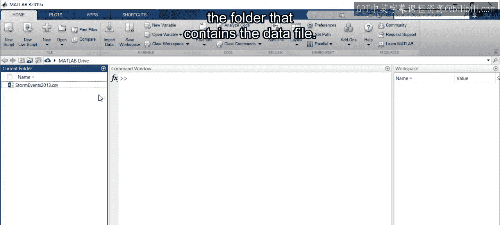
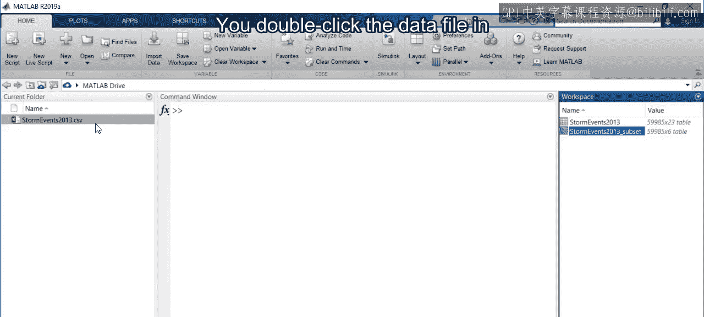
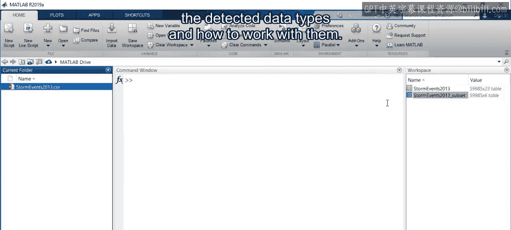

# 15：如何使用导入工具 📂

在本节课中，我们将学习如何将外部数据导入到MATLAB环境中。这是进行数据分析的第一步，掌握它至关重要。

上一节我们介绍了MATLAB如何表示数据，本节中我们来看看如何将数据文件导入到MATLAB中。

## 启动导入工具

首先，导航到包含数据文件的文件夹。双击数据文件，会打开一个名为“导入工具”的新窗口。

## 了解导入选项

在导入工具窗口中，您会看到几个导入选项，以及数据在MATLAB中显示效果的预览。

我们正在导入一个CSV文件，CSV代表“逗号分隔值”。MATLAB会自动检测正确的分隔符（这里是逗号），但您也可以根据需要手动选择其他分隔符。

同时，请注意输出类型。导入后，数据将以**表格**的形式表示。正如您已经学到的，MATLAB处理按行和列组织的数据。

## 检查列名与数据类型

这里的每一列都已经有了名称，例如“state”或“year”，这使数据更容易理解。列名正下方的一行显示了每列的数据类型。

虽然这些数据类型是自动检测的，但您仍应验证检测到的类型是否适合您的用途。在后续视频中，您将了解更多关于此处看到的数据类型，例如文本、数字、分类、日期和时间以及表格。

您的表格还有一个名称。MATLAB会根据您的文件名自动为您提供。

## 导入数据

当您点击“导入所选内容”时，数据将被导入到您的工作区。这非常简单：双击文件名，点击导入所选内容，您就可以开始使用了。

让我们查看导入的表格 `StmEvents2013`。它看起来与导入工具中的预览完全一样。您可以看到变量名，以及按行和列排序的不同数据类型。

您还可以使用滚动条来完整地探索表格。正如您所见，这里有很多数据。

## 导入数据子集

如果您不需要所有列怎么办？让我们回到导入工具，选择部分数据而不是整个数据集。

您是否注意到整个表格都以蓝色高亮显示？蓝色表示将被导入的数据。要选择一个子集，请按住 `Ctrl` 键并单击您希望包含在表格中的列。

选择范围时，请确保排除标题行，因为您只需要数据本身。

让我们更改表格名称，以免覆盖现有表格，然后导入所选内容。

现在，您拥有了一个更小的数据子集，仅包含您感兴趣的表格变量。这使得处理数据更加容易，同时也节省了时间，因为您加载的数据量没有以前那么大。

## 总结

本节课中我们一起学习了数据导入的基本流程。

1.  在MATLAB中双击数据文件以打开导入工具。
2.  在导入工具中，决定是导入全部数据还是仅导入一个子集。
3.  然后，检查为变量自动选择的数据类型。
4.  最后，将您的选择导入到MATLAB工作区。

在接下来的课程中，您将了解更多关于检测到的数据类型以及如何处理它们。

