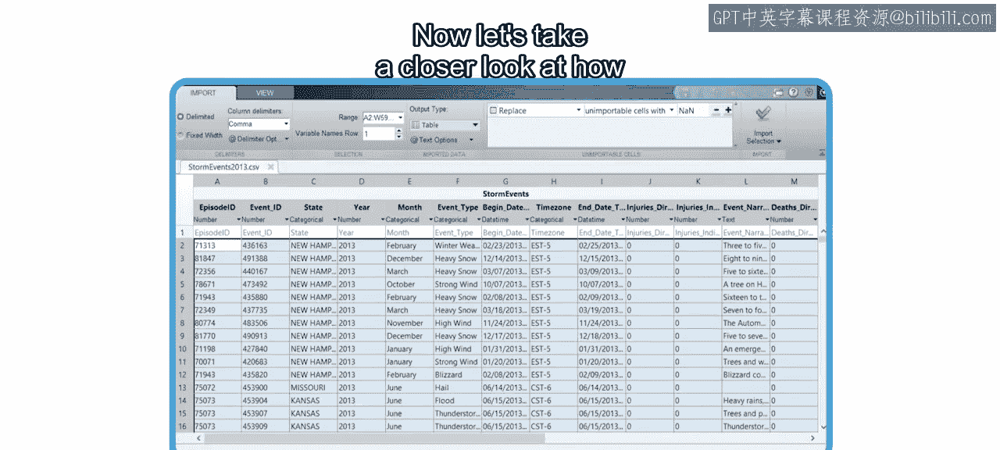
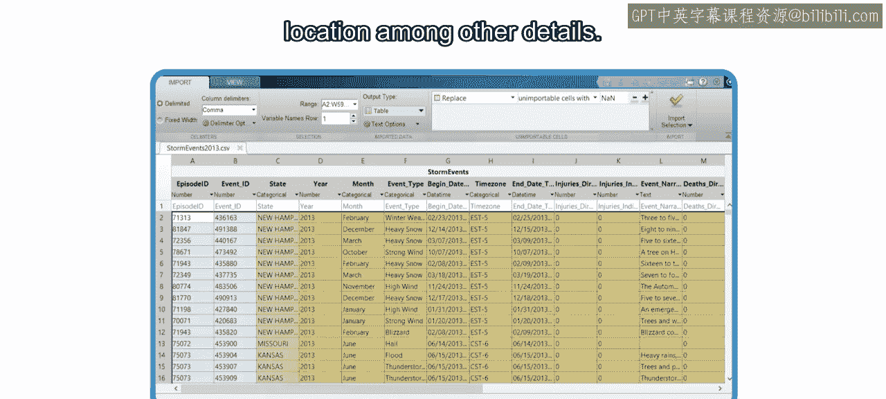
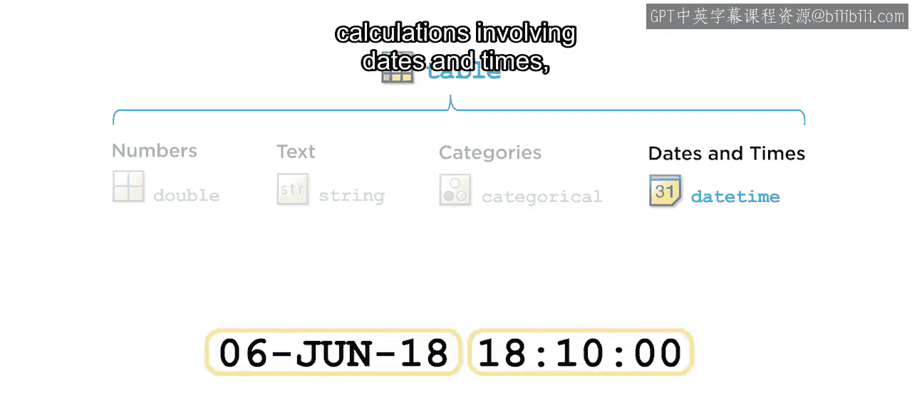
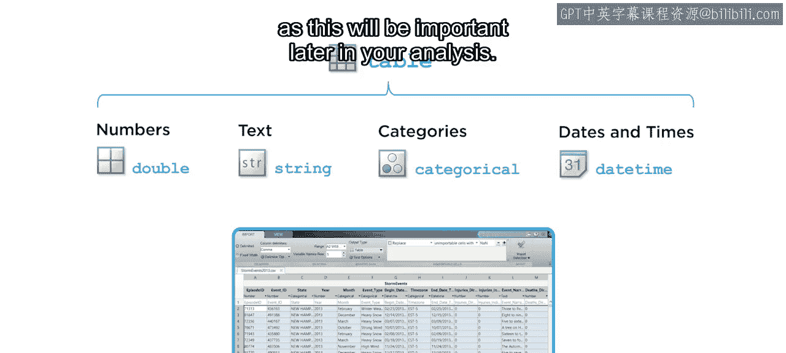

# 16：MATLAB数据类型

在本节课中，我们将要学习MATLAB中用于组织和表示数据的基本数据类型。理解这些类型是进行有效数据分析和处理的关键第一步。

## 数据导入与初步观察

上一节我们介绍了如何使用导入工具将数据加载到MATLAB中。本节中，我们来看看数据在MATLAB内部是如何被表示的。

导入的数据集包含一系列天气观测记录，以及时间、地点等信息。在MATLAB中，组织此类数据的常用方式是使用**表格**。

MATLAB采用这种常见的表示形式，其中每一行代表在特定时间进行的一次观测，每一列则保存数据的不同部分。例如，日期和时间、天气事件的类别或其地理位置。这些列被称为**表变量**。

可以看到，变量名已经包含在数据集中。在每个变量名的正下方，显示的是该变量的**数据类型**，这取决于你打算如何使用这些数据。在导入数据时，需要考虑如何分析它。一旦进入MATLAB，每个变量都有一个类型，该类型根据你的使用计划对数据进行分类。例如，由数字表示的数据可能对可视化或计算有用，而主要由文本组成的数据可能对分类或标记有用。

## 主要数据类型详解

接下来，让我们深入了解不同的数据类型及其所代表的数据种类。

以下是MATLAB表格中常见的几种核心数据类型：

### 数值型数据

第一种你可能会注意到的标签是数字，它通常由数据类型 **`double`** 表示。如果不熟悉这个名称，不用担心，这是计算机表示实数的一种常用方式。你的表格中有几个表变量属于这种数据类型，例如地理坐标。

数值数据可以是单个值、向量或矩阵。你可以将向量想象成排列在一行或一列中的多个值，而矩阵则是向量的数组。

### 文本型数据

你也看到了一些提供额外信息的文本。文本数据的数据类型称为 **`string`**。

字符串用于文本数据，例如天气事件的描述或事件发生的区域。它们可以包含一个或多个单词。

### 分类型数据

数据集中还有一些文本数据没有被识别为文本，而是被识别为 **`categorical`**。对于这种类型的数据，变量可以取的值或类别是一个有限的、已定义的集合。这对于数据分组非常有用。

分类型数据初看可能像文本数据，但略有不同。以变量“state”为例，你会看到有几个条目具有相同的值，并且你可能也知道存在一组有限的可能值。分类型数据可用于获取对天气事件的额外洞察，例如，通过按州分析和可视化事件。

### 日期时间型数据

最后，你看到了天气事件发生的日期和时间，它们由数据类型 **`datetime`** 表示。

`datetime` 数据类型便于处理日期和时间。它表示一个时间点，例如“2018年6月6日，晚上6点10分”。这种数据类型使你能够在可视化数据时轻松更改显示格式，也便于你轻松执行涉及日期和时间的计算。

## 表格数据类型总结

至此，你已经了解了表格中使用的所有数据类型。表格本身也是一种数据类型，称为 **`table`**。

让我们回顾一下所学内容。一个表格由行和面向列的变量组成。每个变量由一个唯一的名称标识，并且可以有不同的数据类型，例如 `double`、`string`、`categorical` 或 `datetime`。在导入数据时，请注意这些数据类型，因为这在后续的分析中非常重要。

本节课中，我们一起学习了MATLAB中用于构建表格的核心数据类型：用于数值计算的 `double`，用于文本信息的 `string`，用于有限类别分组的 `categorical`，以及用于时间序列处理的 `datetime`。理解并正确使用这些类型，是进行高效数据科学工作流的基础。