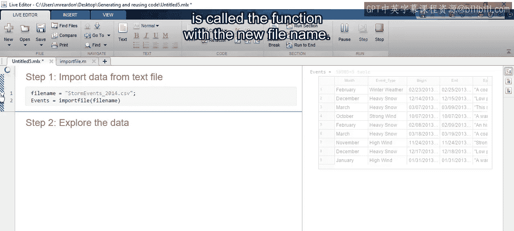

17：生成和重用代码 🧑‍💻

在本节课中，我们将学习如何通过生成可重用的代码来自动化数据导入过程，从而提高数据分析的效率和可重复性。

上一节我们介绍了如何使用导入工具交互式地导入数据。本节中，我们来看看如何将这一过程自动化，生成可以反复使用的代码。

首先，打开导入工具并加载2013年的天气事件数据。导入工具会提供数据的预览，并自动选择将数据导入表格变量的选项。

以下是导入工具提供的主要功能：
*   预览数据。
*   自动选择导入选项。
*   选择感兴趣的变量。
*   修改变量和表格名称。
*   指定变量的数据类型。

完成自定义设置后，最后一步是点击“导入选择”按钮并选择“导入数据”。但请注意，还有其他几个选项可用于生成MATLAB代码。

点击“生成实时脚本”将创建一个包含相应导入代码的实时脚本，其中包含您所做的所有自定义设置。您可以将此代码作为探索性分析的起点。这样，未来无需重复导入工具中的步骤，即可重复和分享您的分析。

如果您需要处理多个格式相同的文件，生成一个导入函数是更好的选择。该函数包含导入当前数据文件及其自定义设置的必要代码，并且当您提供其他文件名作为输入时，它也可以用于导入具有相同结构的其他文件。

以下是使用导入函数的步骤：
1.  将生成的函数保存到与分析代码和数据文件相同的位置。
2.  在数据分析脚本中添加代码，指定文件名。
3.  调用您的函数，并将输出分配给一个变量。

现在，要导入不同的数据文件，您只需使用新的文件名调用该函数即可。

本节课中我们一起学习了如何通过生成实时脚本或导入函数来自动化数据导入流程。这不仅能节省时间，还能确保分析过程的一致性和可重复性，是构建高效数据科学工作流的重要一步。