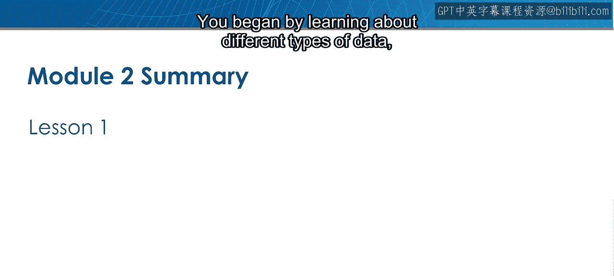
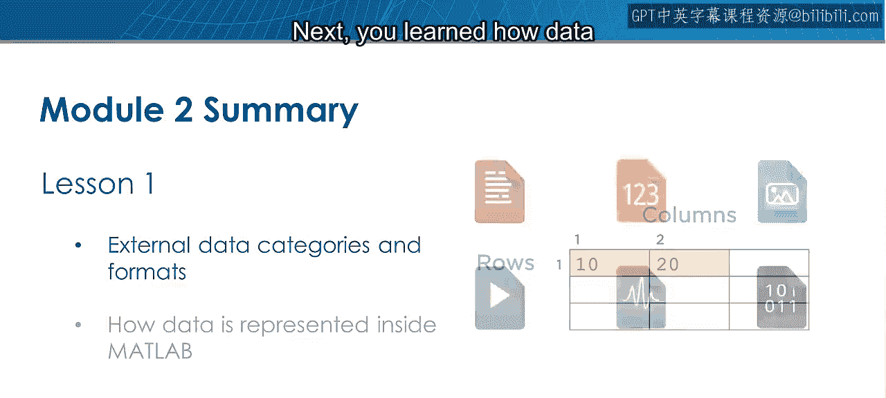
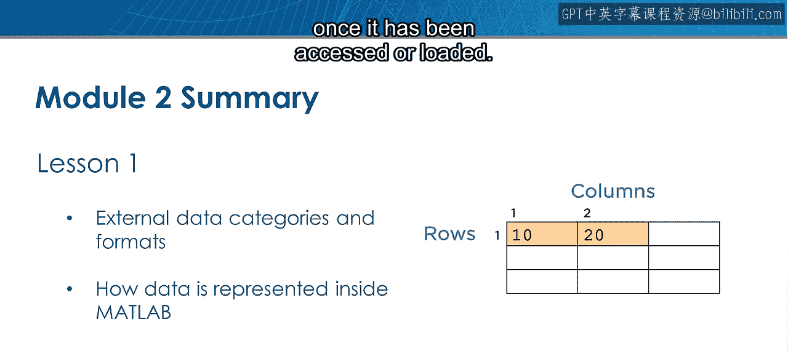
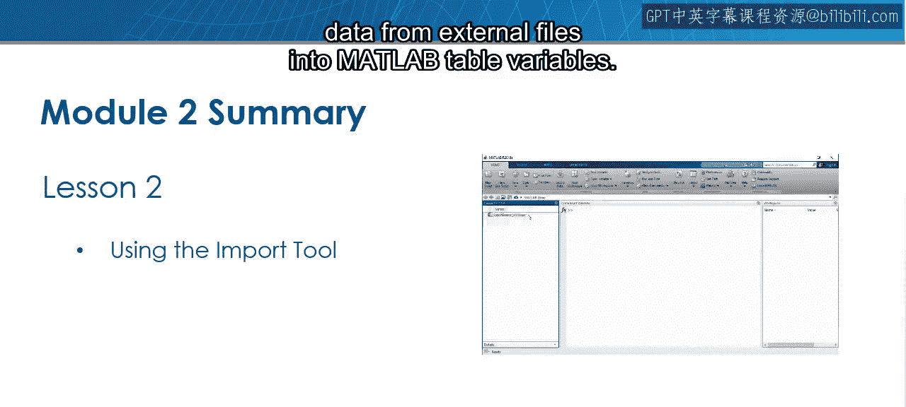
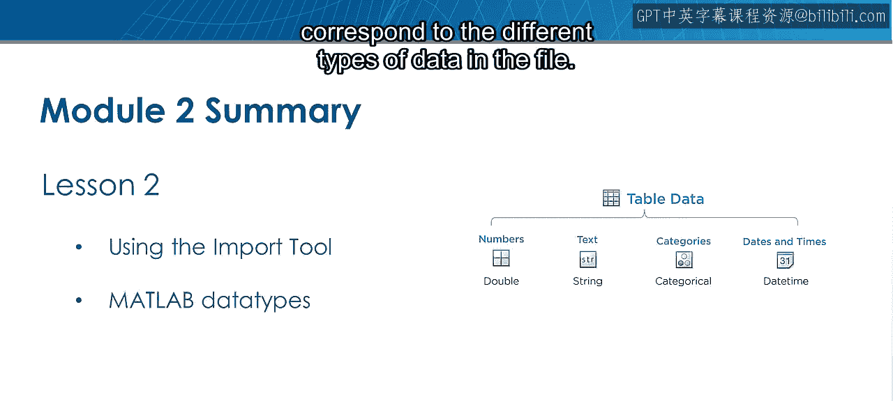
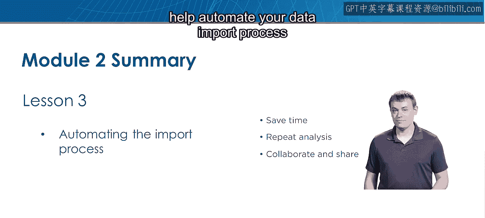
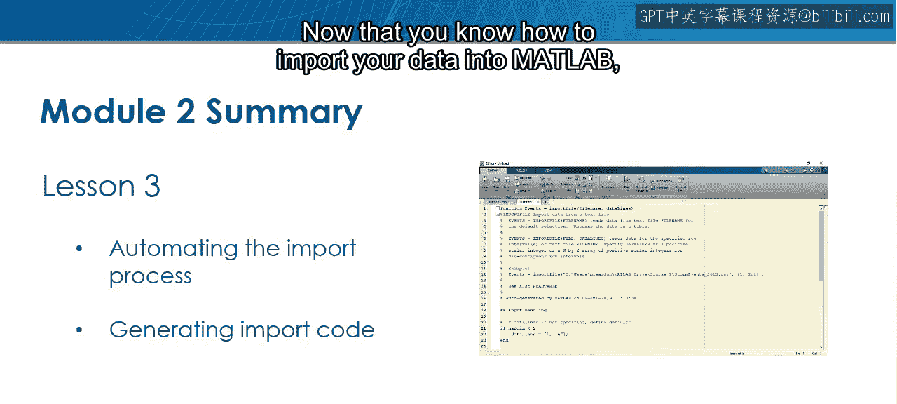
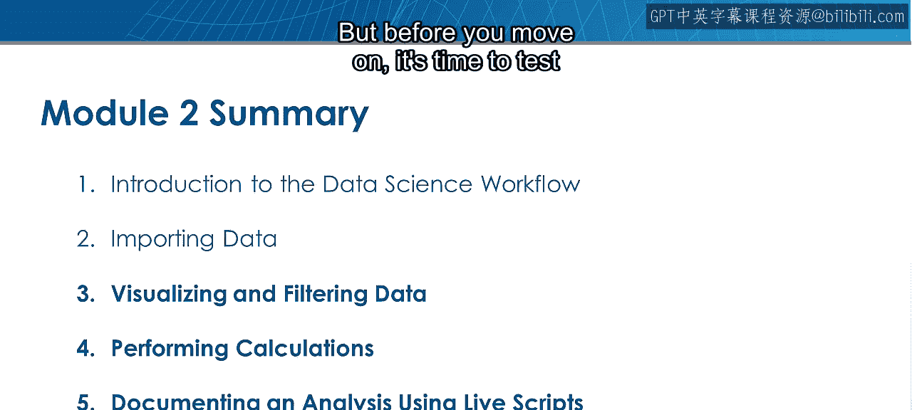
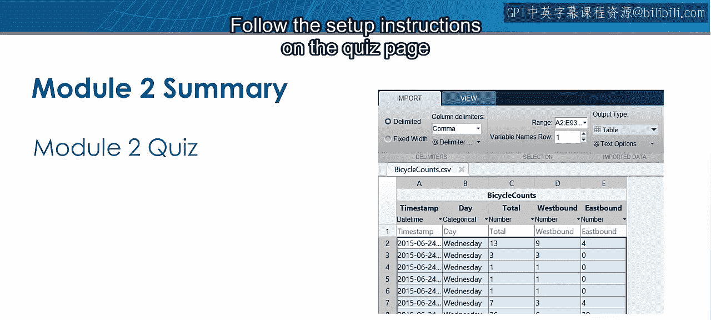
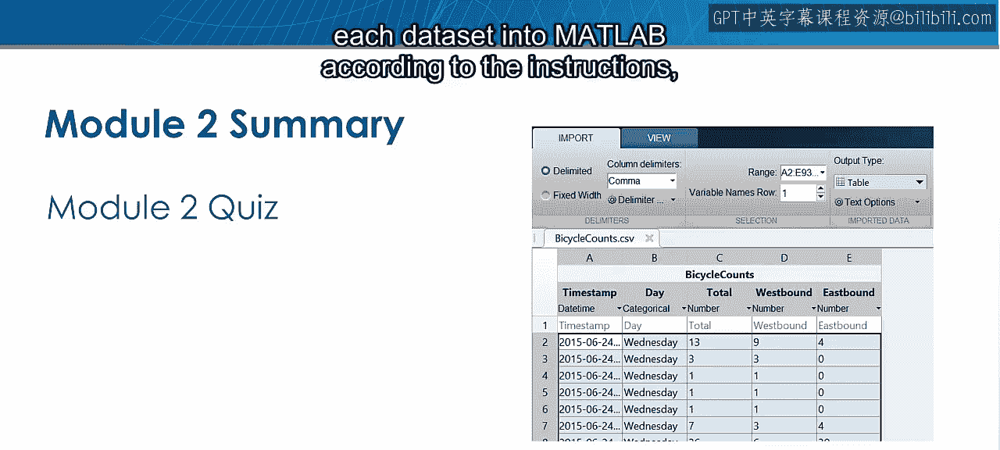

模块2：数据导入总结 🎉

在本节课中，我们将回顾并总结模块二“数据导入”的核心内容。你已经学习了如何将外部数据导入MATLAB环境，这是进行数据科学分析的第一步。

首先，我们介绍了不同类型的数据以及数据在MATLAB之外的存储方式。

接下来，我们学习了数据被访问或加载后，在MATLAB内部是如何表示的。

然后，我们使用导入工具，以交互方式将外部文件中的数据加载到MATLAB的表格变量中。

数据加载完成后，我们看到MATLAB表格中每个变量的数据类型与文件中不同类型的数据相对应。

最后，我们学习了导入工具如何通过生成代码来帮助自动化数据导入过程，这使未来的工作变得更加轻松。

现在你已经掌握了将数据导入MATLAB的方法，接下来就可以开始使用可视化和描述性统计来探索你的数据了，这些内容将在后续两个模块中介绍。

但在继续前进之前，是时候通过模块二测验来检验你的数据导入技能了。

请严格按照测验页面上的设置说明进行操作，以在MATLAB中访问所需的文件。

然后，根据说明使用导入工具将每个数据集加载到MATLAB中，并回答后续问题。

本节课中，我们一起学习了数据导入的完整流程：从理解数据类型和外部存储，到使用MATLAB导入工具交互式加载数据，再到理解内部数据表示，并最终实现导入过程的自动化。掌握这些技能是进行有效数据探索和分析的坚实基础。