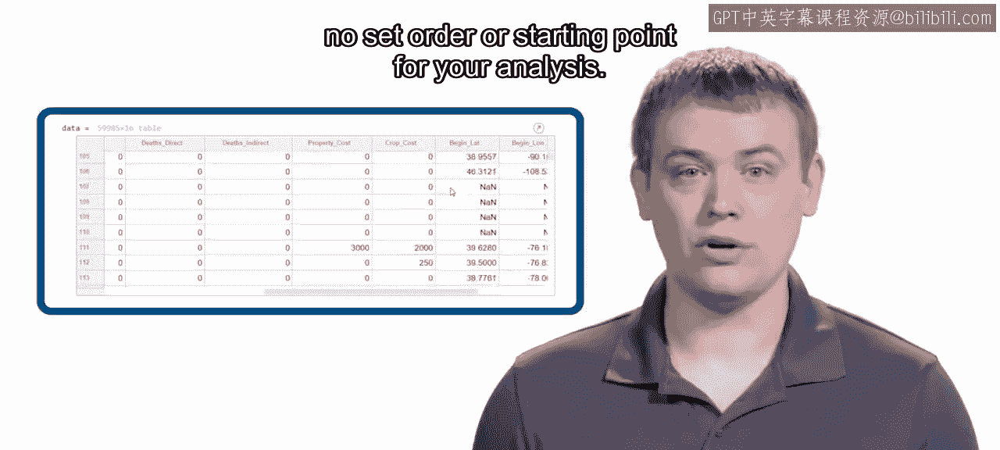
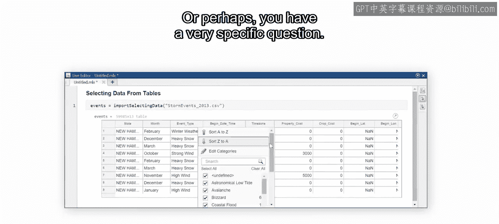
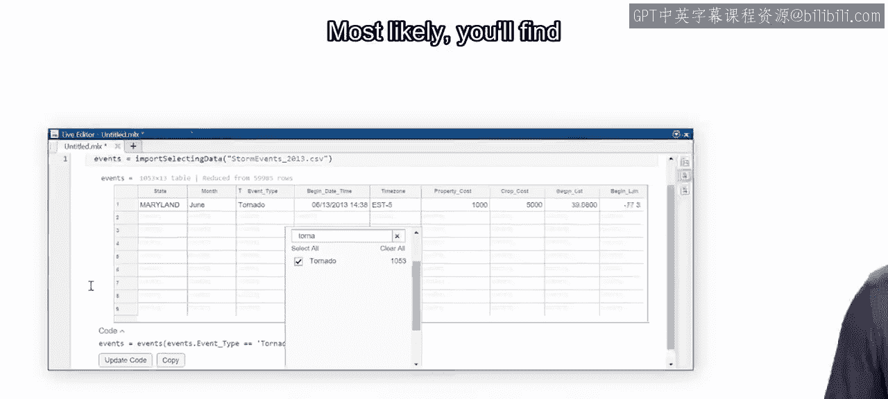
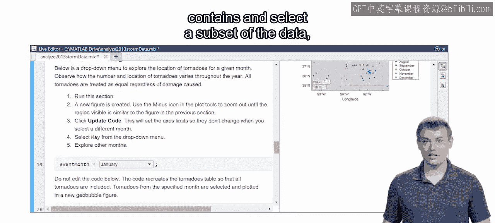
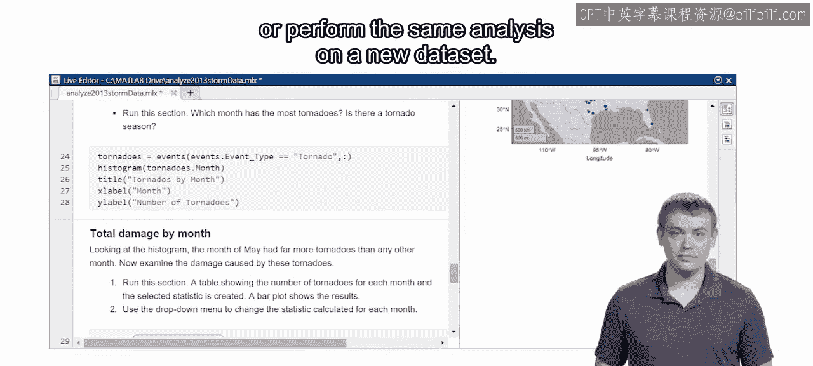

# 20：数据可视化与过滤介绍 🎼

在本节课中，我们将要学习如何对导入MATLAB的数据进行初步探索。数据探索是数据分析的关键第一步，它帮助你理解数据的结构、内容和潜在模式。

上一节我们介绍了如何将数据导入MATLAB。现在，当你面对大量数据时，如何开始分析可能会让人不知所措。请记住，数据分析没有固定的顺序或起点。

## 探索性数据分析的起点

你可能发现，创建可视化图表是理解数据内容最有效的方式。或者，你心中可能有一个具体的问题，那么我们可以从筛选出回答该问题所需的数据开始。

## 迭代式的探索过程

数据探索很可能是一个迭代的过程。在这个过程中，你会创建可视化图表，进行一些简单的计算，从表格中选择数据，然后可视化新的结果，如此循环往复。

幸运的是，MATLAB提供了许多交互式工具，它们能帮助你在探索数据的同时，记录下重现分析所需的步骤。

## 本模块的核心内容

本模块的重点就是学习如何使用这些交互式工具来可视化、选择和修改数据。

例如，考虑之前你使用过的分析龙卷风事件的实时脚本。你将学习如何创建其中包含的可视化图表，以及如何筛选数据子集（例如，筛选出造成财产损失的龙卷风）以进行进一步分析。

## 捕获并复用分析代码

你还将学习如何捕获MATLAB生成的代码，并将其添加到实时脚本中。这样，你就可以在以后重复此分析，或者对新的数据集执行相同的分析。

## 学习目标

在本模块结束时，你将掌握完成许多常见数据探索任务所需的技能。

让我们开始吧。

---

**本节课中我们一起学习了**数据探索的重要性以及本模块的学习目标。我们了解到数据探索是一个灵活的、迭代的过程，可以从可视化或数据筛选开始。本模块将重点介绍MATLAB的交互式工具，帮助我们高效地完成数据可视化、筛选和修改，并学会记录和复用分析步骤，为后续的深入分析打下坚实基础。