# 21：绘制表中的数据 📊

在本节课中，我们将学习如何在MATLAB中创建不同类型的图表，以探索和可视化表格数据。我们将从基础绘图开始，学习如何查阅文档，以及如何为图表添加标签和标题，以便更清晰地传达结果。

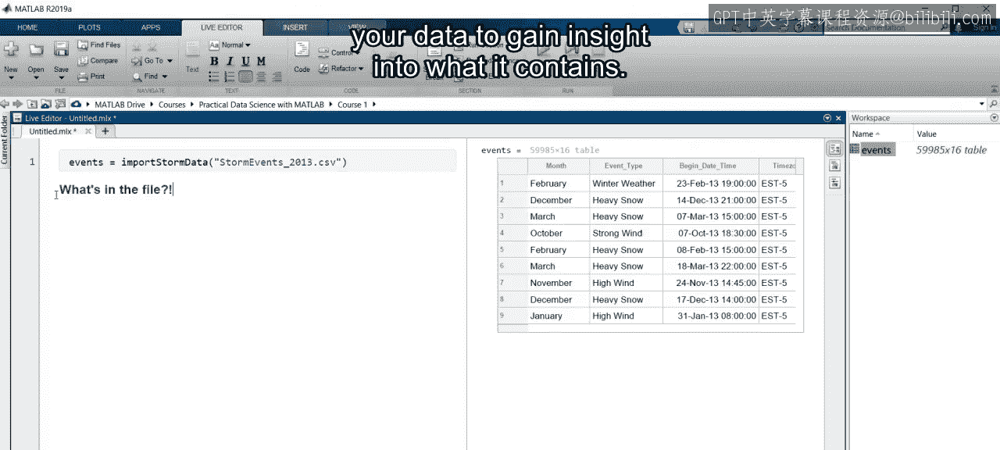

---

上一节我们介绍了如何将数据导入MATLAB。现在，你已经知道如何导入数据，接下来该做什么？

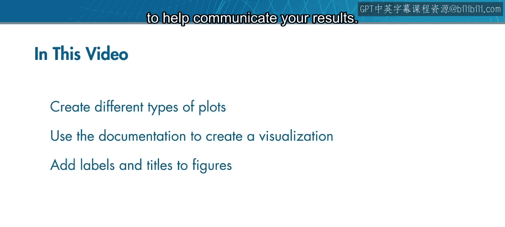

你可能有一个具体问题，准备直接深入分析。但更常见的情况是，你需要先开始探索数据，以了解其中包含的内容。

创建可视化图表是一个很好的开始方式。在本视频中，你将学习如何创建不同类型的图表，使用文档来了解特定图表的更多信息，并添加标签和标题来帮助传达你的结果。

---

让我们重新审视天气事件数据，但这次从导入文件后开始。假设这是你第一次查看这些数据。你会从哪里开始？

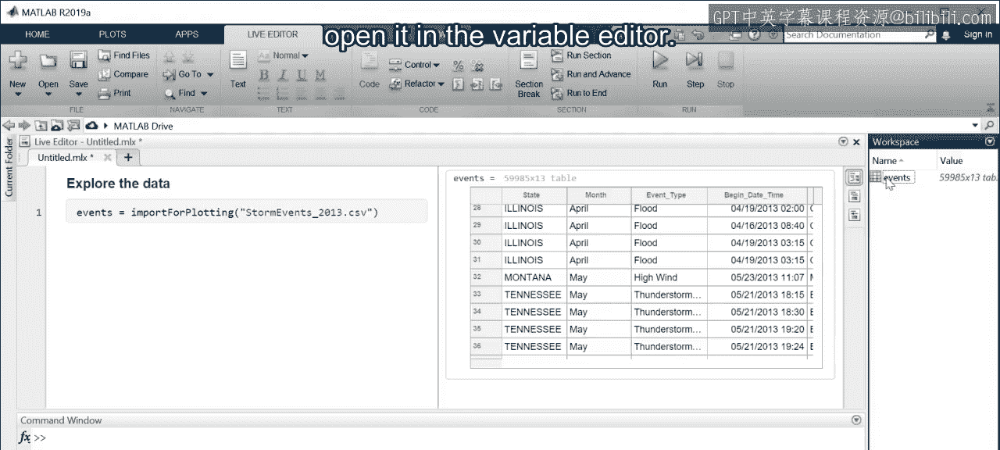

系统会显示近60,000个事件的预览。你可以滚动浏览表格来了解其内容，但这需要滚动很多次。

可视化可以提供更深入的见解。例如，数据中包含多少事件以及哪些类型的事件？事件类型的直方图可能会有所帮助。

以下是创建图表的步骤：

1.  转到MATLAB工作区，双击表格以在变量编辑器中打开它。
2.  在打开的编辑窗口中，选择你想要绘制的变量（本例中是`eventType`）。
3.  然后点击“绘图”选项卡。
4.  系统会显示可用于所选数据的不同类型的图表。如果你不熟悉某种图表类型，图标会提供视觉提示。这里，选择“直方图”。

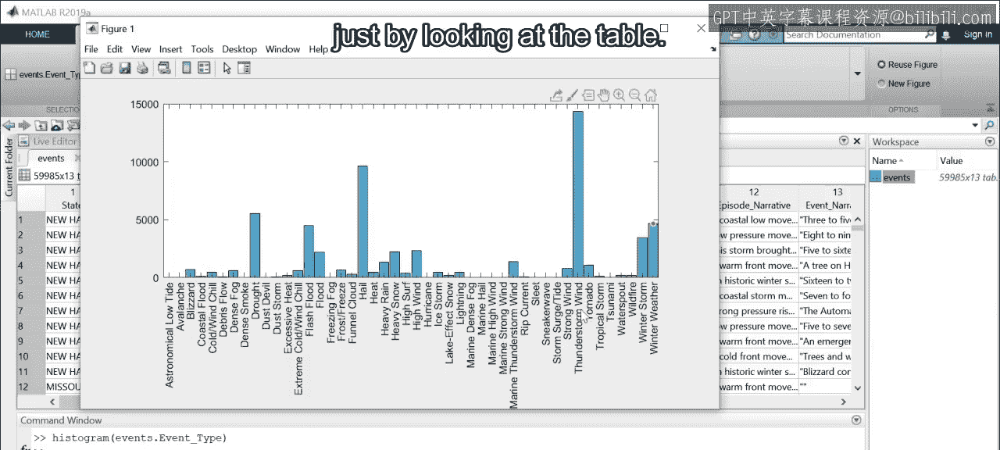

直方图将显示在一个新窗口中。现在，你可以一次性看到所有事件类型及其相对频率。例如，雷暴风事件构成了近60,000个事件中的四分之一。仅通过查看表格，很难发现这一点。

同时请注意，用于创建图形的代码已放置在命令窗口中。这使你可以复制代码，并将其粘贴到实时脚本中供将来使用。

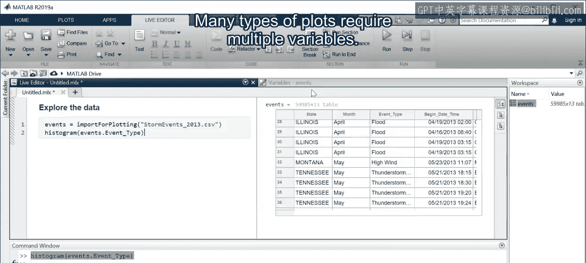

---

许多类型的图表需要多个变量。例如，你可能想使用纬度和经度来可视化事件的地理位置。

以下是使用多个变量创建地理图表的步骤：

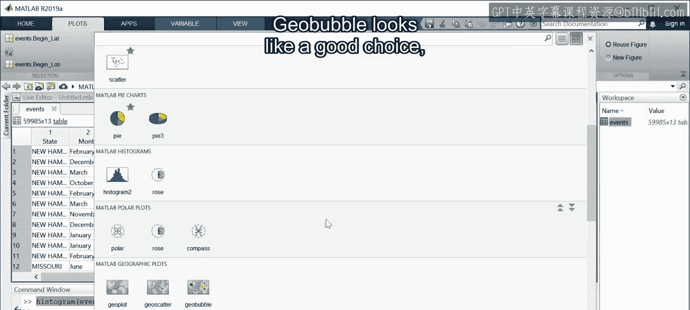

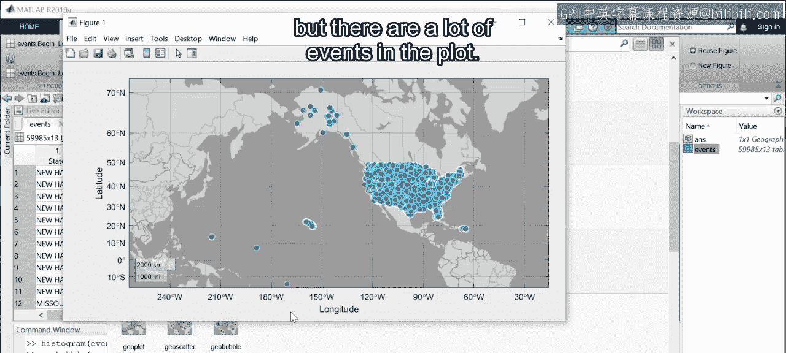

1.  按住`Ctrl`键的同时单击以选择多个变量（例如`latitude`和`longitude`）。
2.  请注意，此处显示的图表类型看起来都不像地理图表。
3.  点击下拉箭头，查看所选变量的所有可用图表类型。
4.  `geobubble`看起来是个不错的选择。

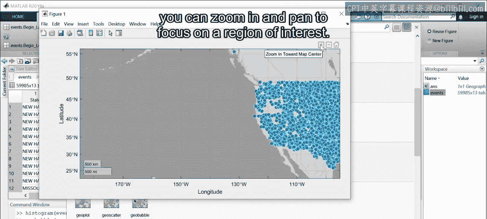

图表中会显示很多事件。就像在实时编辑器中一样，你可以**放大**和**平移**，以聚焦于感兴趣的区域。

---

你可能还记得在龙卷风的例子中，绘图标记的大小基于损失，颜色基于月份。如何重现这一点？

要获取使用`geobubble`函数的帮助，请高亮显示函数名，右键单击并选择“所选内容的帮助”。这将打开该函数的文档。在这里，我们看到该函数可以通过附加输入来调用，以指定大小和颜色。

让我们尝试一下。回到变量编辑器，按住`Ctrl`键并按顺序选择`propertyCost`和`month`变量。请注意，选择了四个变量后，可用绘图的数量大大减少。现在，`geobubble`是仅有的几个选项之一。

新的绘图标记会根据提供的附加输入改变大小和颜色。最后，将命令复制并粘贴到你的实时脚本中并运行它。

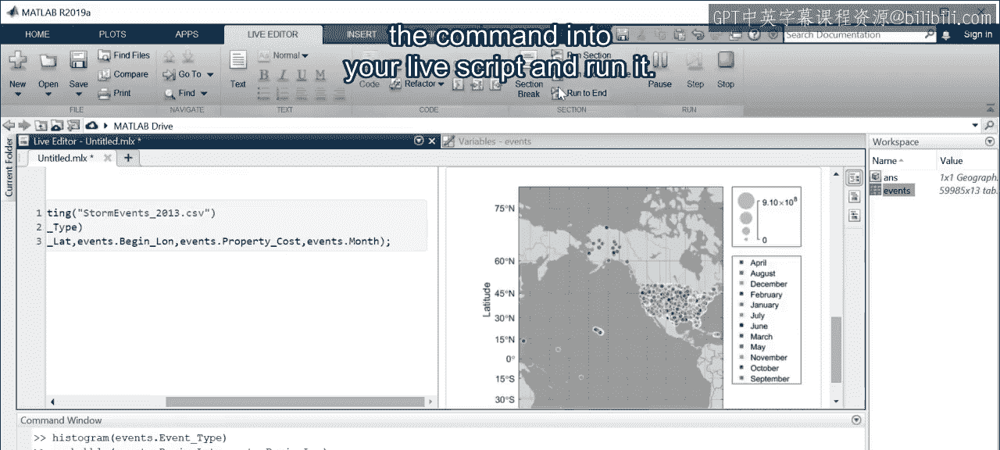

---

现在图表已在实时编辑器中，当你单击图表时，“图形”选项卡变为活动状态。在“图形”选项卡中，你可以找到可以添加到图形中的常见自定义选项。

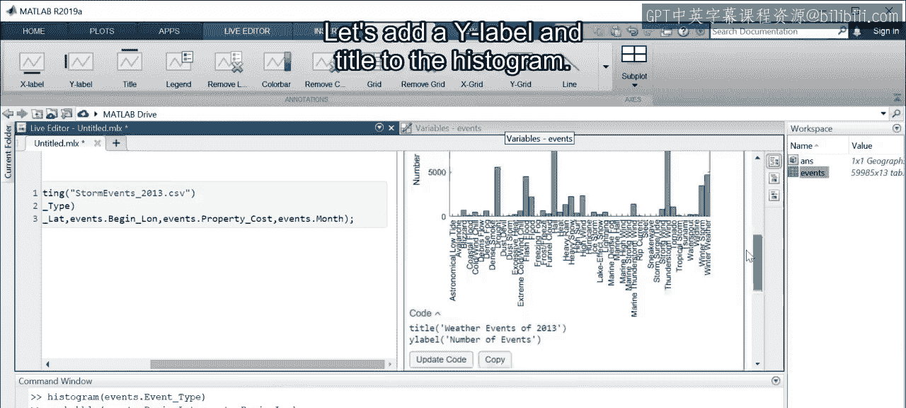

让我们为直方图添加一个Y轴标签和标题。生成标签和标题所需的代码，以便你可以将其添加到文件中并记录你的步骤。

---

可视化是开始探索数据的好方法。本节课中我们一起学习了：

1.  如何绘制表格中包含的变量。
2.  如何使用文档来了解特定类型的图表。
3.  如何添加常见的自定义选项（如标签和标题）。

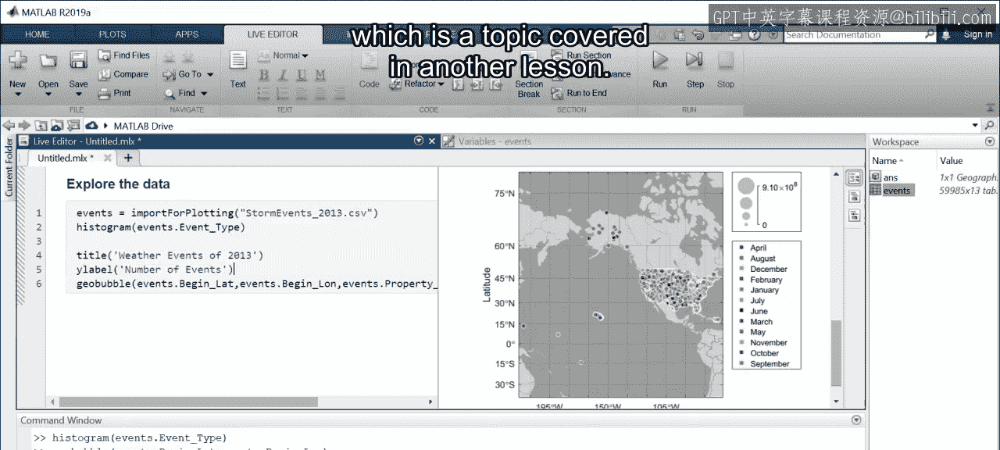

你可能已经注意到，当你有很多观测值时，一些图表会变得拥挤且难以解释。这时就需要对数据进行过滤，这将是另一节课中涵盖的主题。