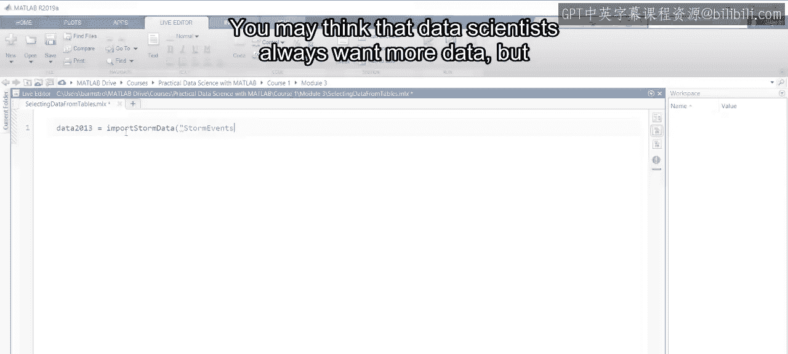
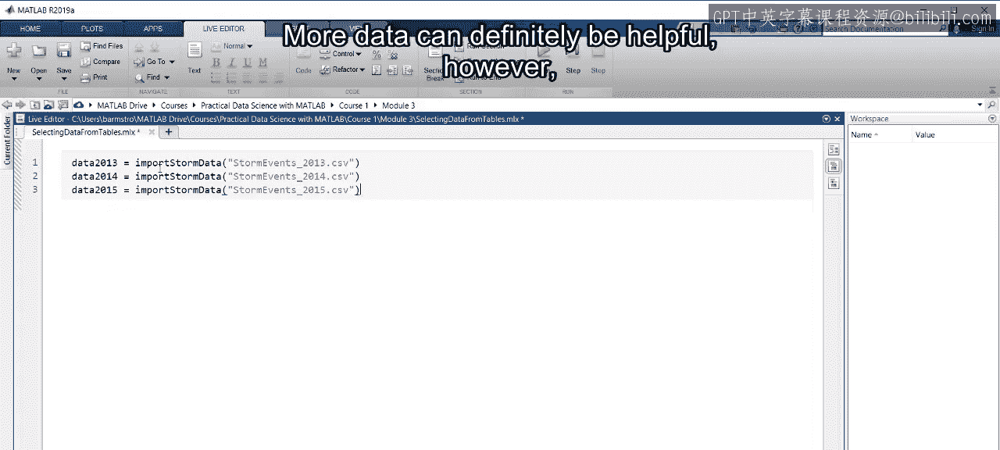
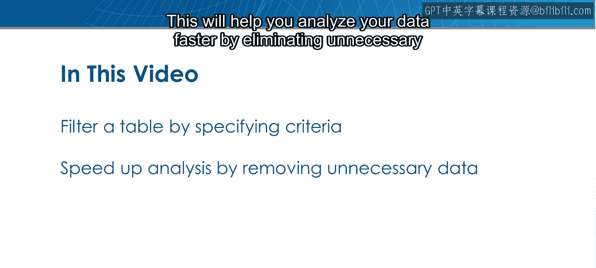
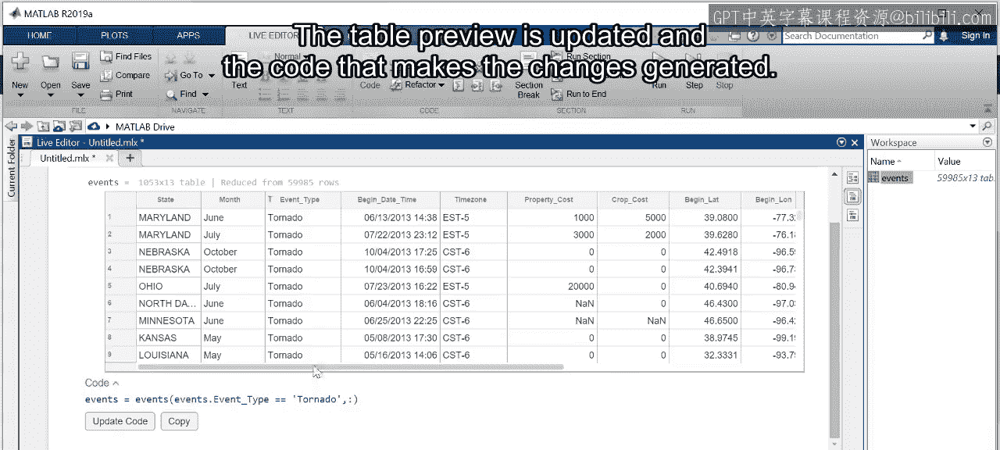
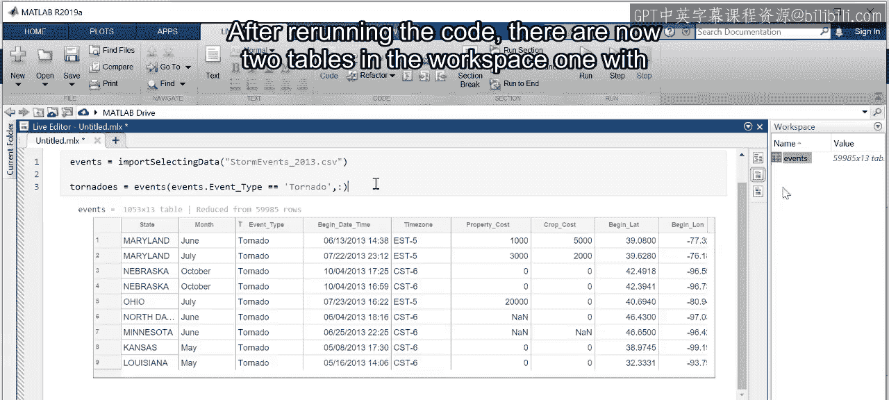
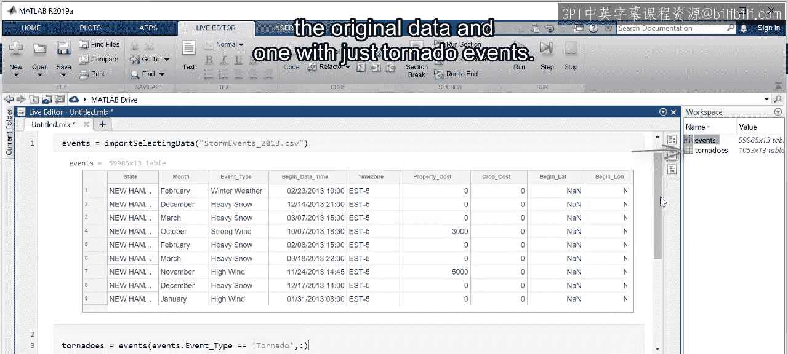
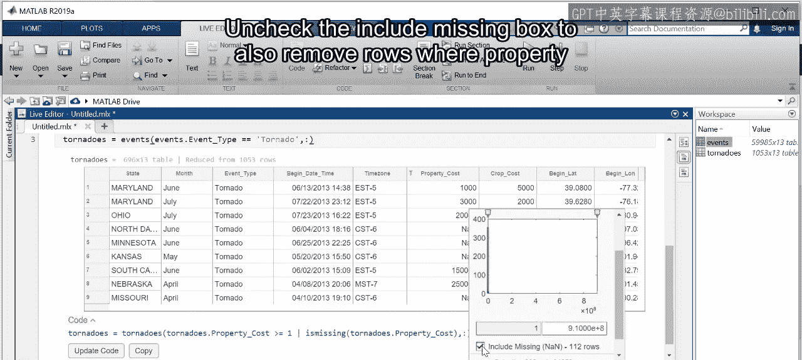
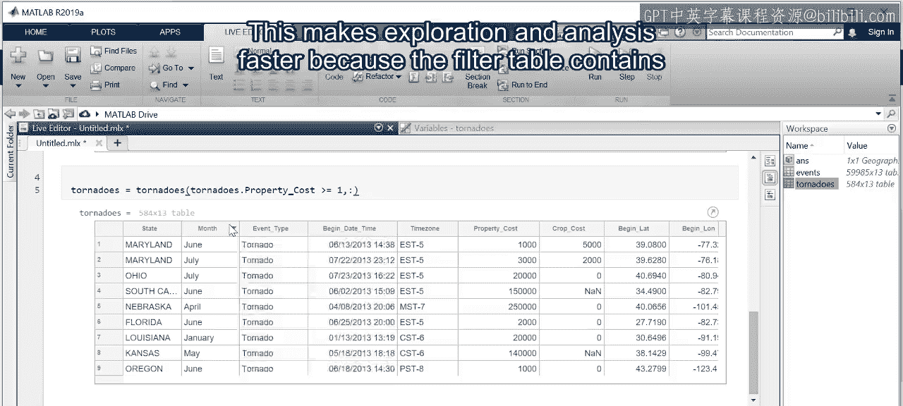
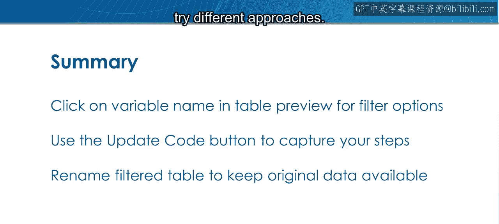

# 22：从表中选择数据 🎯

在本节课中，我们将学习如何从MATLAB的表格（Table）中，根据自定义的条件筛选出我们需要的子集数据。这是数据探索和预处理的关键步骤，能帮助我们聚焦于与分析目标最相关的数据，从而提高分析效率。

## 概述：为什么需要筛选数据？

你可能会认为数据科学家总是希望获得更多数据，但这只对了一部分。更多数据确实有帮助。然而，以2013年的天气数据为例，如果你只对龙卷风感兴趣，那么大约有58000个无关的观测数据。这些额外的数据会让你更难找到问题的答案。

那么，如何过滤数据，只保留与分析相关的部分呢？本节视频将教你如何根据定义的标准从表格中选择数据子集。通过消除不必要的观测数据，这将帮助你更快地分析数据。

## 交互式筛选数据

让我们打开2013年天气事件文件，设想一个场景：你想分析造成财产损失的龙卷风，类似于之前处理过的实时脚本。导入数据后，所有事件类型都包含在内。

以下是使用MATLAB交互式工具进行筛选的步骤：

1.  **访问筛选选项**：在表格中点击变量名称，会显示对该变量进行排序和筛选的选项。
2.  **清除无关类别**：一组复选框显示了表格中包含的事件类别。与其逐个取消勾选非龙卷风类别，不如点击“全清”。
3.  **选择目标类别**：你可以滚动查找所需类别，或使用搜索栏快速定位。表格预览会随之更新，并生成实现此更改的代码。
4.  **应用筛选**：点击“更新代码”将其添加到脚本中。

请注意，生成的代码为筛选后的表格使用了与原始表格相同的名称。这意味着原始数据将被筛选后的表格替换。在探索数据时，保留原始数据可用性很有帮助，这样你可以快速尝试不同类型的分析。因此，这里让我们将筛选后的表格重命名为 `tornadoes`。

重新运行代码后，工作区中现在有两个表格：一个包含原始数据，另一个仅包含龙卷风事件。

> **注意**：创建第二个表格确实会占用更多内存。因此，如果你处理的数据集非常大，可能需要坚持使用单个表格。

## 基于数值条件进一步筛选

接下来，让我们通过点击 `propertyCost` 变量来进一步探索龙卷风表格。这是一个数值变量，因此你有几种不同的选项来使用它筛选和排序表格。

在这个例子中，由于数值范围从0到9.1亿，变化很大，所以很难看清。但数据旁边有一个直方图以及滑块，你可以移动滑块来选择要包含在表格中的数值范围。

除了使用滑块，你还可以通过直接在此处键入来指定要包含在表格中的最小值。使用“1”将移除所有财产损失为零的观测数据。取消勾选“包含缺失值”框，以同时移除 `propertyCost` 值为缺失的行。

更新代码并运行文件，你将得到一个仅包含造成财产损失的龙卷风表格。最终的表格只有584个事件，远少于原始文件中近60,000个的数量。

现在，表格仅包含造成损失的龙卷风，地理图能提供比显示所有事件位置的地图更深入的洞察。

## 总结与回顾

本节课中，我们一起学习了如何使用交互式工具从表格中选择和提取数据。这使得探索和分析速度更快，因为筛选后的表格只包含与你分析相关的数据。

让我们回顾一下关键操作步骤：

1.  **启动筛选**：点击变量名称，调出排序和选择数据的选项。
2.  **生成代码**：使用“更新代码”按钮将相应的步骤添加到你的脚本中。
3.  **保留原始数据**：重命名筛选后的表格，以便你可以返回原始数据并尝试不同的分析方法。

通过掌握这些技能，你将能够更高效地处理数据，为后续的特征工程和机器学习建模打下坚实的基础。