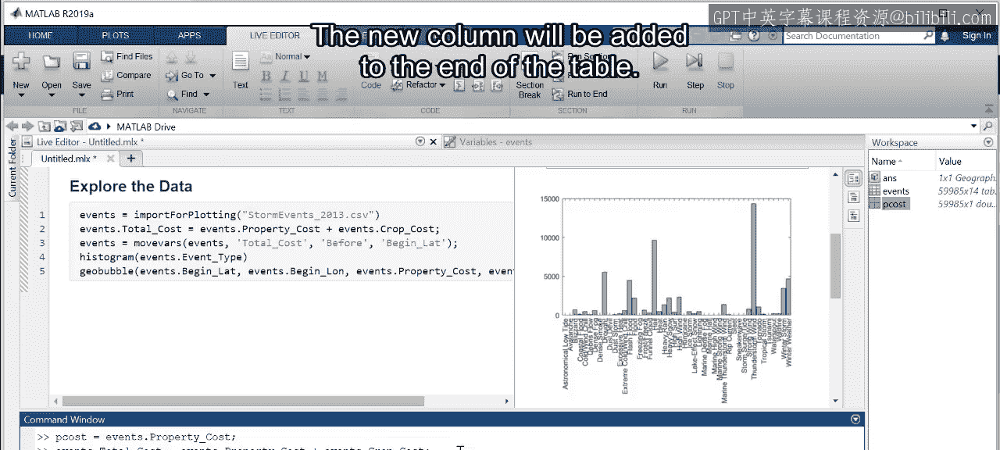

# 23：访问和创建表变量

在本节课中，我们将学习如何访问表格中的单个变量，并使用它们为表格添加新的变量。我们还将学习如何保存分析结果，以便将来使用或与他人分享。


上一节我们介绍了如何使用交互式工具探索天气事件数据，并将生成的代码保存到脚本中。本节中，我们将仔细查看这些代码，学习操作表格变量的具体方法。

### 访问表格变量

以下是访问表格中特定变量数据的方法。在之前生成的绘图代码中，可以看到这样的模式：`tableName.variableName`。这是访问表格变量内容的语法。

例如，以下代码访问了 `events` 表格中的 `event type` 变量来创建直方图：
```matlab
histogram(events.eventtype)
```

接下来，让我们访问财产损失成本的值。首先，输入一个变量名来存储这些值，然后使用等号。接着，输入表格名，后跟一个点 `.` 和表格中变量的名称。
```matlab
propertyCost = events.propertycost
```
执行后，工作区会出现一个新变量。双击这个新变量可以查看其内容，并确认它们与原始表格中的值匹配。

**核心概念**：要访问表格中的数据，需使用点号 `.` 分隔表格名和变量名，格式为 `表名.变量名`。

### 创建新的表格变量

那么，如何向表格中添加一个新变量，例如财产损失与作物损失的总和呢？添加变量的方法与访问变量类似。

首先，输入表格名称，后跟一个点 `.`。然后，输入要添加到表格中的新变量名称（例如 `total_cost`）。在等号后面，输入生成新数据的运算。
```matlab
events.total_cost = events.propertycost + events.cropcost
```
这条命令将 `propertycost` 中的每个值，与 `cropcost` 中对应的值相加，并将结果作为 `total_cost` 放入 `events` 表格中。

查看表格内容，可以看到 `total_cost` 已作为新列添加。向下滚动查看一些观测值，可以确认这一新列确实包含两个原始成本列的总和。

### 调整列顺序并保存表格

进行分析并向表格添加数据后，您可能希望将新表格保存为一种无需MATLAB即可使用的文件格式。但在分享结果之前，将列按逻辑顺序排列会更有帮助。

若要将 `total_cost` 移到其他成本变量旁边，请将光标移至变量名称左侧，直到出现拖动指示器。然后点击并将变量拖到所需位置。请注意，此移动操作的代码已被捕获。我们可以复制此代码并将其放入脚本中，以便记录步骤供将来参考。

最后一步是使用 `writetable` 函数将更新后的表格保存到新文件。
```matlab
writetable(events, ‘updated_events.csv’)
```
第一个输入是表格名称，第二个是用引号括起的新文件名。现在，当前文件夹中就有了一个可以在未来使用或与他人分享的新文件。

### 总结



本节课中我们一起学习了操作表格变量的核心技能。


*   **访问数据**：通过输入表格名和变量名，中间用点 `.` 分隔，来访问存储在表格变量中的数据。
*   **添加新列**：同样使用点表示法，但赋予一个新的变量名，即可向表格添加新列。新列默认会添加到表格末尾。
*   **调整列顺序**：可以在变量编辑器中通过点击和拖拽来重新排列列。
*   **保存结果**：获得更新并排列好的表格后，可以使用 `writetable` 函数将其保存到文件中，以便在MATLAB环境外使用。