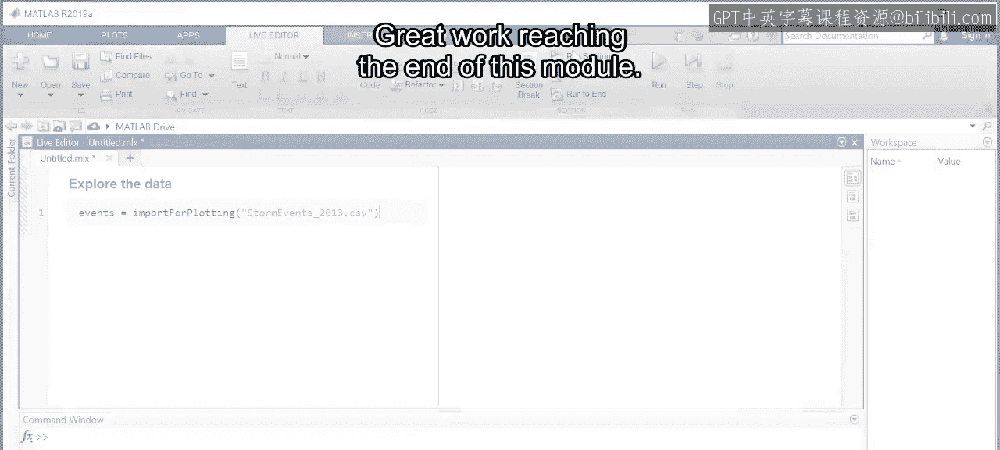
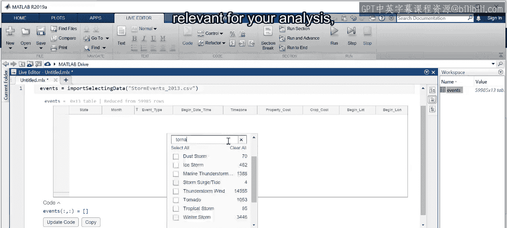
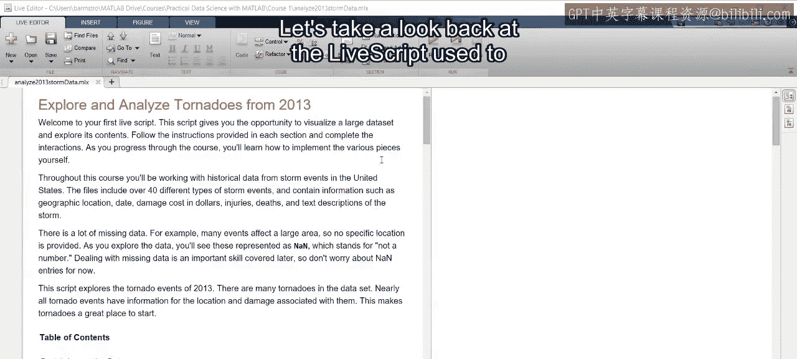
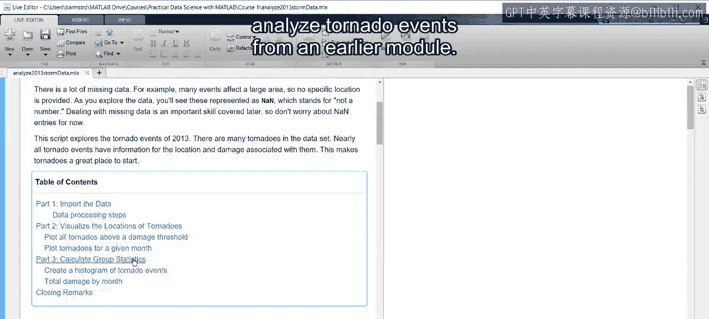
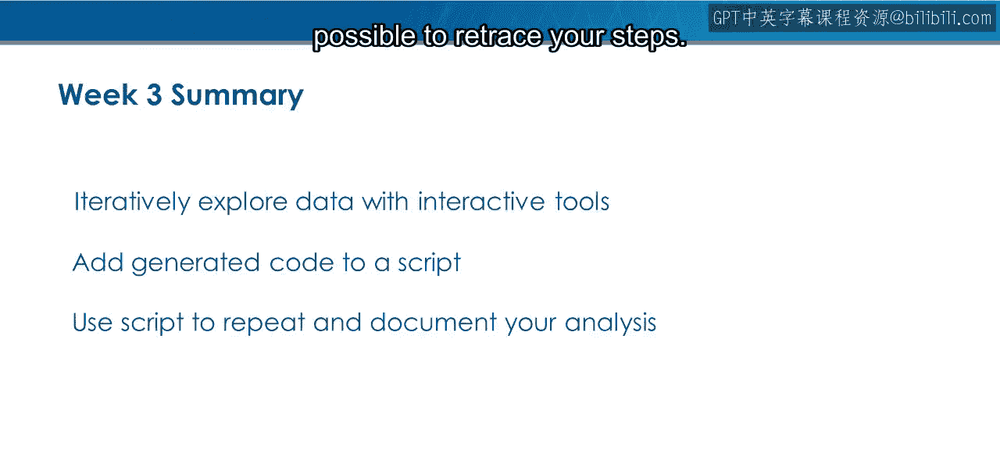
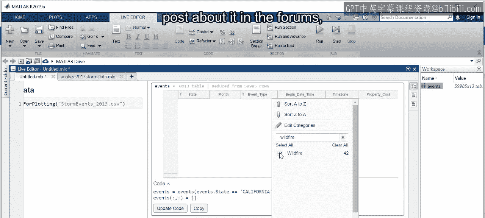

模块3：数据可视化与过滤总结

在本节课中，我们将回顾并总结模块三的核心内容：数据可视化与过滤。你已经掌握了导入数据、创建可视化图表、筛选数据以聚焦分析重点、访问变量与表格以及向表格添加新变量等关键技能。这些技能共同构成了探索性数据分析的基础。

回顾之前的模块，我们曾使用一个实时脚本来分析龙卷风事件数据。

你所看到的大部分代码是通过你刚刚学习的交互操作自动生成并添加到脚本中的。请记住，探索数据是一个迭代的过程。在这个脚本中，可视化图表是在从表格中筛选出数据子集后创建的，但这并非你面对新数据集时的典型工作流程。

在寻找数据洞见时，你通常会尝试多种方法。因此，将生成的代码捕获并添加到你的脚本中至关重要。你可能会走入一个无法解答问题的方向，这时就需要回溯。捕获生成的代码使你能够追溯自己的分析步骤。

现在是练习所学知识的好时机。以下是你可以尝试的步骤：

*   选择一两种你感兴趣的事件类型，或许再选择一个特定的州。
*   练习从原始天气事件文件中创建新的数据表格。
*   创建一些可视化图表。

如果你发现了有趣的现象，可以在论坛中分享。当你准备就绪，请完成本周的测验。

本节课中，我们一起学习了探索性数据分析的核心工作流，包括数据筛选、变量操作与可视化。掌握这些技能使你能够有效地初步探索和理解数据集，为后续更深入的分析奠定基础。