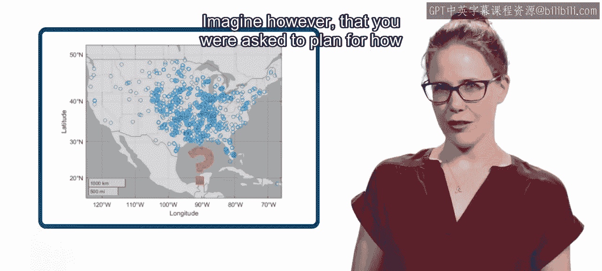
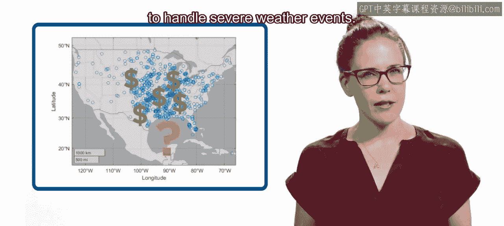
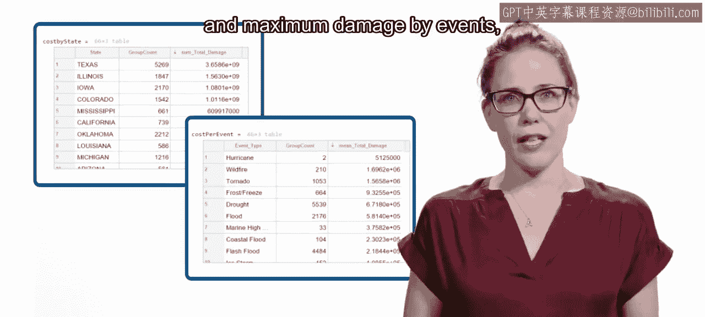
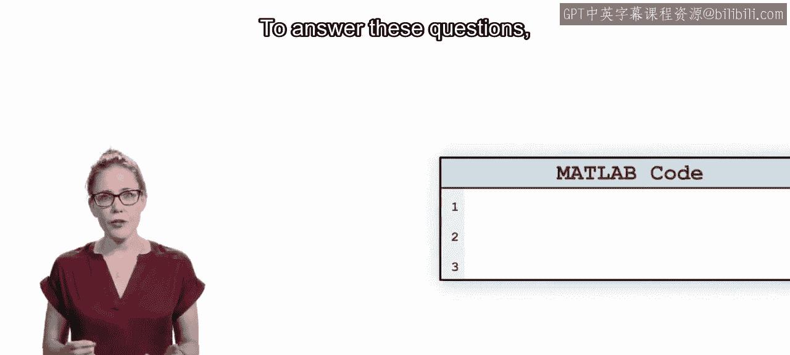
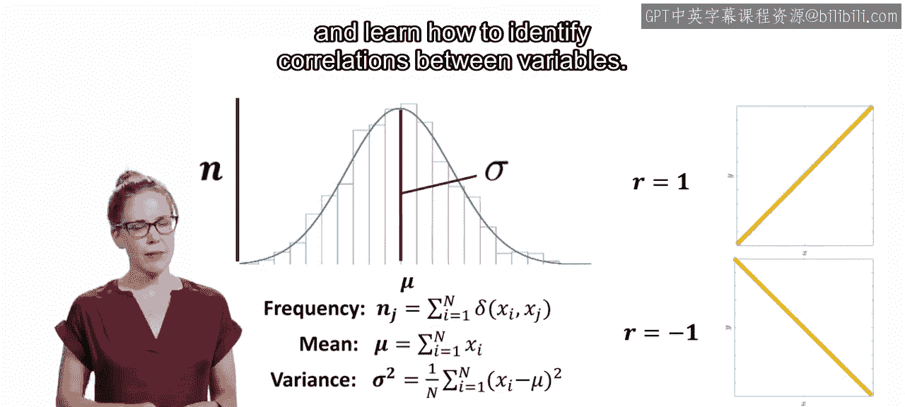
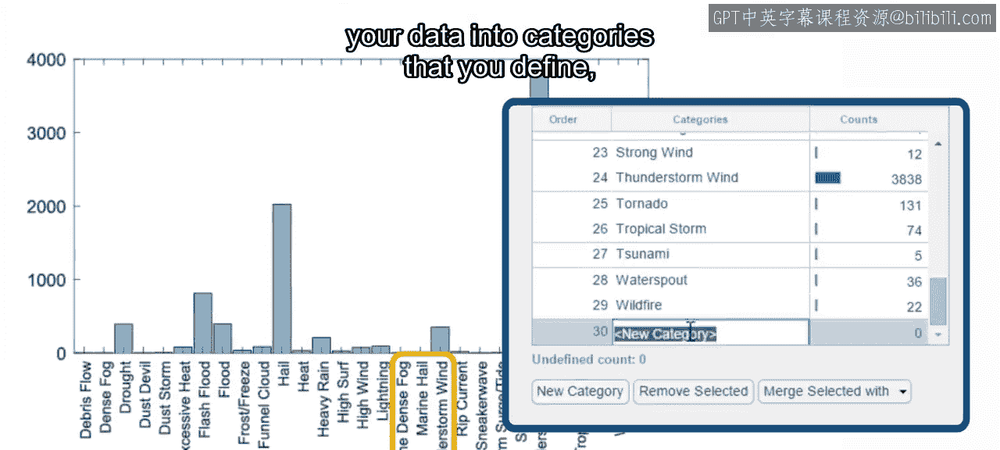

模块4：执行计算介绍 🧮

在本节课中，我们将要学习如何对数据进行计算，以获取关键的统计信息，从而支持更深入的数据分析和决策制定。

上一节我们介绍了如何通过筛选数据和创建可视化来聚焦关键变量。本节中我们来看看如何通过执行计算来获取更深层次的洞察。

例如，你已经知道如何可视化各类天气事件的地理分布。然而，假设你需要为应对恶劣天气事件规划资源分配。

诸如各州总成本、每起事件的平均成本以及事件造成的最大损失等统计数据，将帮助你做出明智的决策。

为了回答这些问题，你需要开始对数据执行一些计算。

我们将从基础开始本模块的学习。你将学习如何使用变量设置计算。你将计算一些基本统计量，并学习如何识别变量之间的相关性。你已经知道如何交互式地筛选数据，在本模块中，你将学习更复杂的选择标准，可用于数据筛选。

在本模块结束时，你将能够将数据重新分组到你定义的类别中，并计算这些类别的统计数据。

内容很多，但不必担心，你将有机会在整个模块中应用所学知识。你将直接在浏览器中执行计算，并收到关于任何错误的反馈。

如果遇到困难，可以访问论坛寻求帮助。到本模块结束时，你将能够对数据进行更详细、更高级的分析。

让我们开始吧。

本节课中我们一起学习了执行计算在数据分析中的重要性，并预览了本模块将涵盖的基础计算、统计量计算、相关性分析、高级筛选以及数据分组等核心内容。