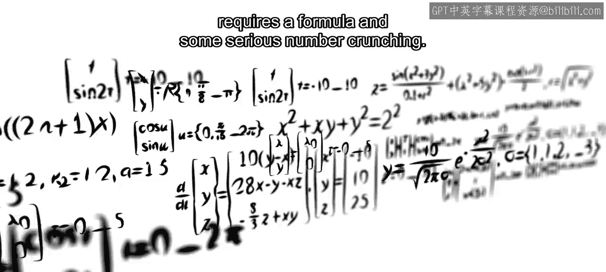
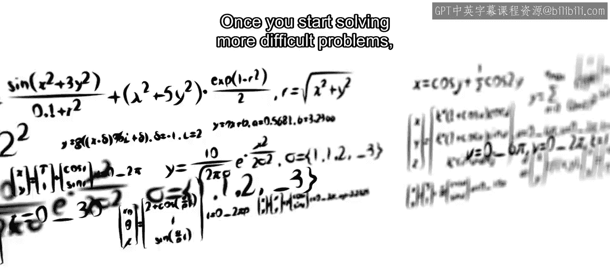
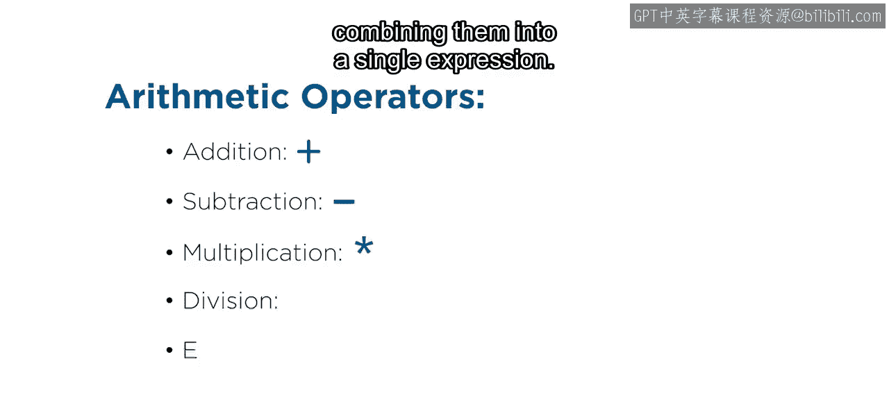
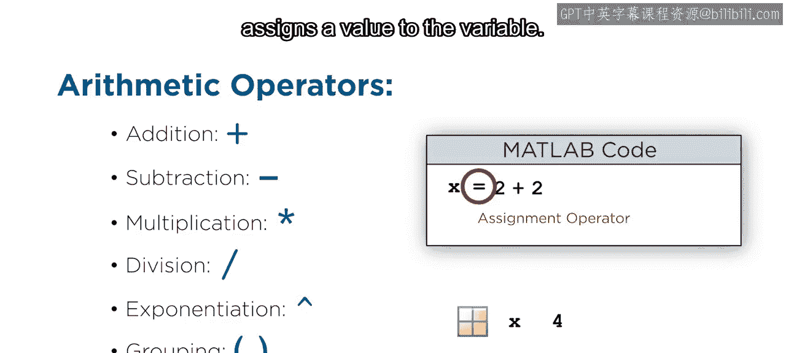
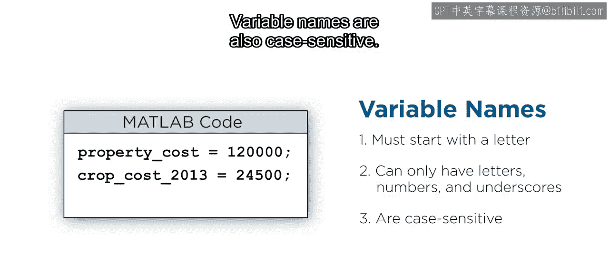
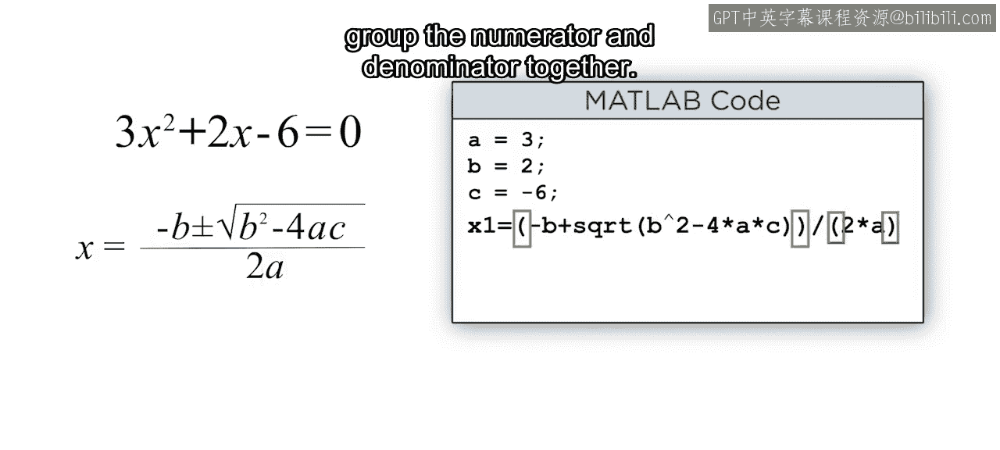
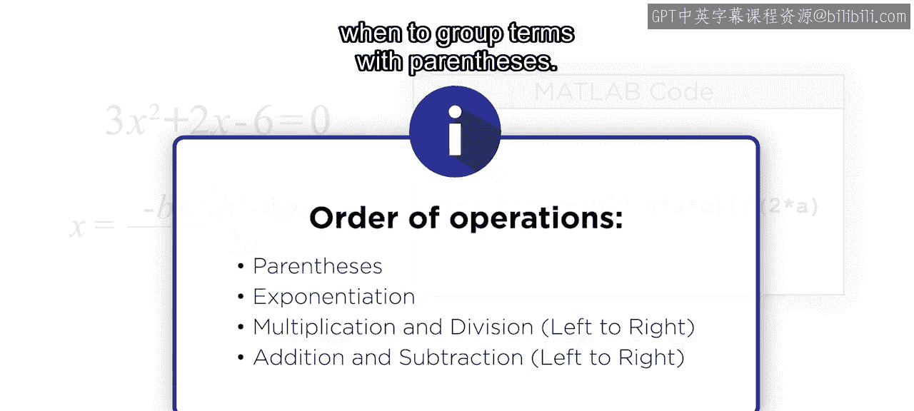
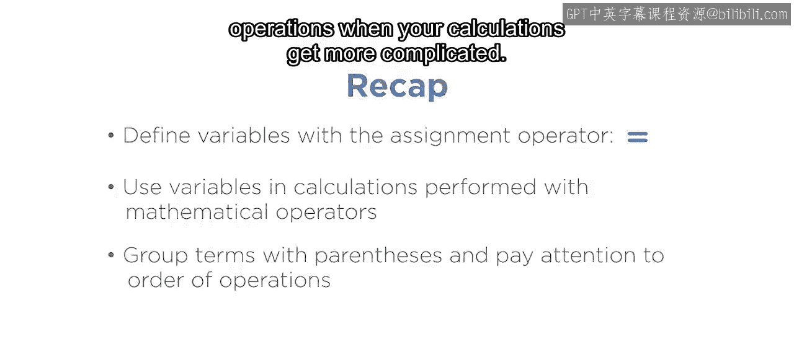

# 26：基本数学运算 🧮

在本节课中，我们将学习如何在MATLAB中进行基本的数学计算，包括使用算术运算符、定义变量以及理解运算顺序。这些是构建更复杂表达式和解决实际问题的基础。

## 概述

迟早，你可能会遇到需要公式和大量数值计算的问题，其中一些无法手动完成。一旦开始解决更困难的问题，就需要以编程方式执行任务。在本视频结束时，你将能够在MATLAB中执行基本的数学计算，并在编写表达式时使用运算顺序。

## 算术运算符：计算的基石

考虑一个熟悉的例子：求解一元二次方程。这个表达式包含几种不同的算术运算符，它们是许多MATLAB计算的基础构件。在将它们组合成单个表达式之前，我们先来看看这些基础构件。

以下是MATLAB中常见的算术运算符：
*   `+`：加法
*   `-`：减法
*   `*`：乘法
*   `/`：除法
*   `^`：幂运算

## 进行计算与变量赋值

你通过使用这些常见运算符输入数学表达式来执行计算。计算结果默认存储在一个名为 `ans` 的变量中。若要将结果存储在特定变量中，需要使用等号 `=`，它被称为赋值运算符，因为它将值赋给变量。

## 变量命名规则

为变量起描述性的名称有助于你记住它们的含义。在选择名称时，请记住需要遵循几条重要规则。

以下是变量命名的关键规则：
*   变量名必须以字母开头，并且只能包含字母、数字和下划线。
*   变量名区分大小写（例如，`myVar` 和 `myvar` 是两个不同的变量）。

## 使用变量进行计算

变量很有用，因为它们存储在内存中，所以你可以在计算中使用它们。例如，要计算一场风暴的持续时间，你只需减去已经存储风暴开始和结束时间的变量。

## 实践：求解一元二次方程

现在你掌握了基础知识，可以准备计算一元二次方程的根了。

首先，定义变量 `A`、`B` 和 `C`。选择这些变量名可以使MATLAB表达式类似于数学公式。

接下来，输入第一个根的公式。你可以使用括号来对复杂表达式中的项进行分组。请务必使用星号 `*` 表示乘法，否则会收到类似这样的错误。

虽然这个表达式乍一看可能正确，但它不会产生预期的结果。因为MATLAB计算遵循运算顺序，所以这个表达式被求值了。因此，`-B` 不再是分数的一部分，而 `A` 也不在分母中。要获得正确的结果，需要添加括号将分子和分母分组在一起。

## 理解运算顺序

对运算顺序有很好的理解是很有帮助的，这样你就知道何时需要用括号对项进行分组。

以下是MATLAB中的运算顺序（优先级从高到低）：
1.  括号 `()`
2.  幂运算 `^`
3.  乘法和除法 `*`， `/`
4.  加法和减法 `+`， `-`

## 计算第二个根

现在第一个根已经计算完成，将加号改为减号以找到第二个根。很好，现在计算完成了。

## 总结

本节课中我们一起学习了在MATLAB中进行基本数学运算的核心技能。总结一下，你使用赋值运算符 `=` 在MATLAB中定义变量，并且可以在使用数学运算符执行的计算中使用变量。请记住，当你的计算变得更加复杂时，要对项进行分组并注意运算顺序。