# 27：使用向量

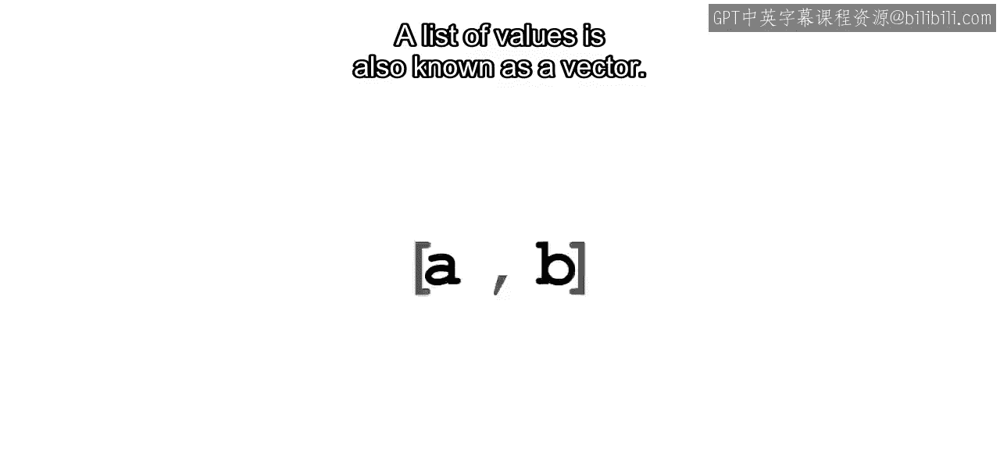

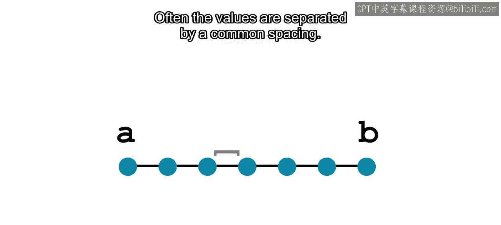

在本节课中，我们将要学习如何在MATLAB中创建和使用向量。向量是数据科学中处理一系列数值的基础工具，特别是在数据可视化和批量计算中至关重要。我们将重点学习如何创建均匀间隔的向量，以及如何对向量进行逐元素运算。

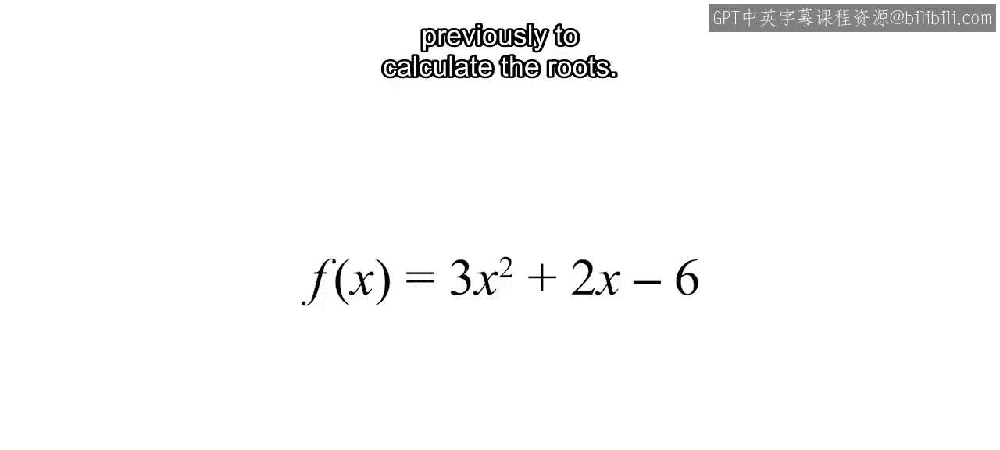

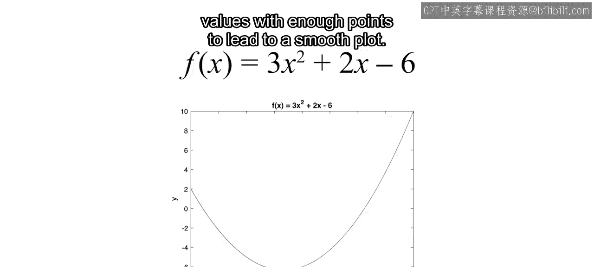

在许多应用中，你需要对介于上限和下限之间的一系列数值进行计算。这一系列数值也被称为向量。

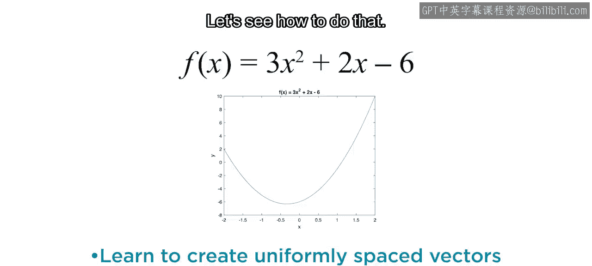

通常，这些数值之间具有相同的间隔。

## 创建均匀间隔向量

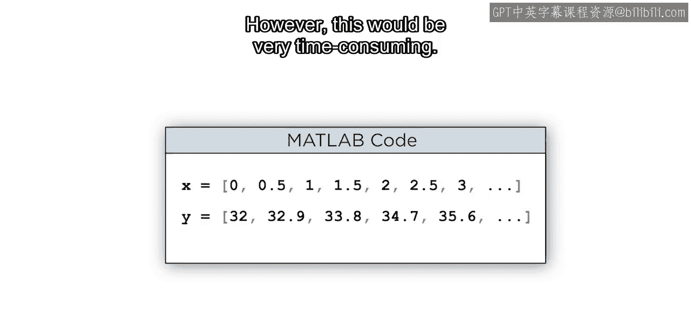

为了绘制图形，你需要一系列X值和Y值。你可以通过手动计算并输入每个值来做到这一点。在MATLAB中，你可以通过将数值序列放在方括号内并用逗号分隔来创建向量。然而，这种方法非常耗时。

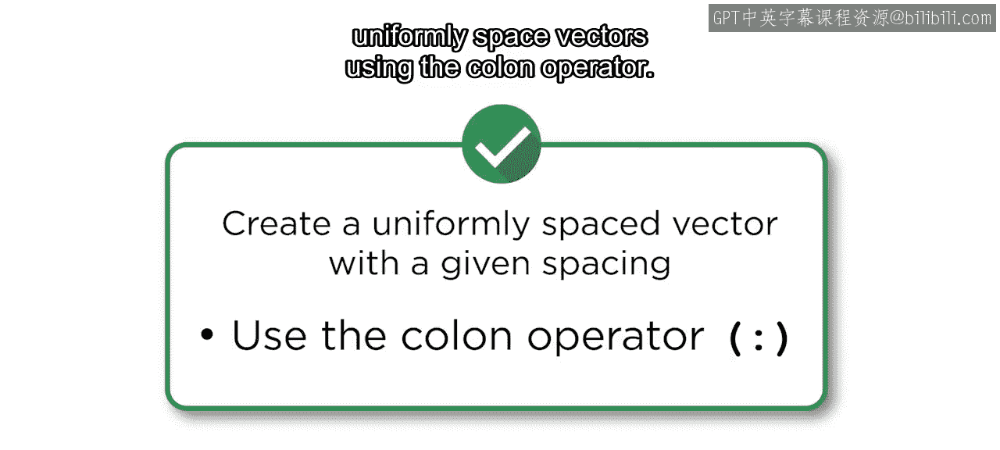

取而代之，你可以使用冒号运算符快速创建均匀间隔的向量。

以下是使用冒号运算符创建向量的方法：

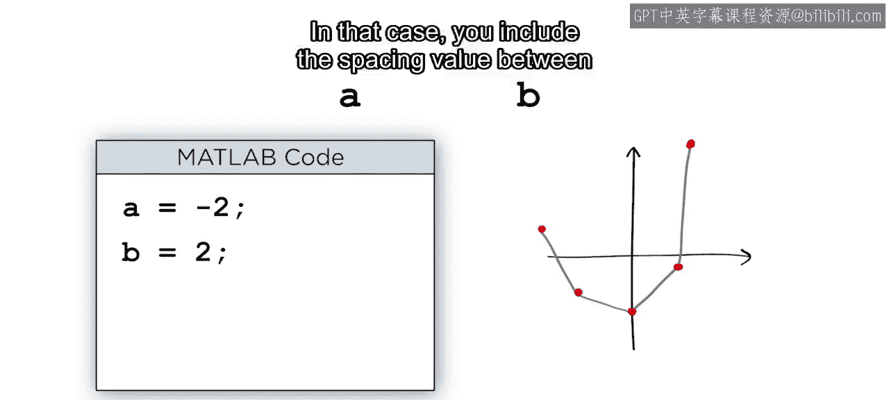

*   **基本语法**：`x = 起始值:结束值`。这会创建一个从起始值开始、以默认步长1递增、直到结束值的行向量。
*   **指定步长**：`x = 起始值:步长:结束值`。这会创建一个从起始值开始、以指定步长递增、直到不超过结束值的行向量。

例如，要创建一个从-2到2的X值向量，如果使用默认步长1，结果将只包含5个点，绘制的图形会不够平滑。因此，我们需要更多的点，这意味着需要使用不同的步长。

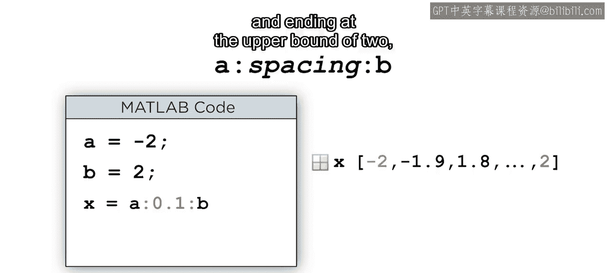

例如，这里你创建了一个步长为0.3的向量。当步长不能将区间均匀划分时，结果向量会从下限开始，在达到上限之前结束，上限值不被包含。如果将步长改为0.1，结果将是一个包含41个元素的向量，从-2开始，到上限2结束，因为这次步长将区间均匀划分了。

## 对向量进行逐元素运算

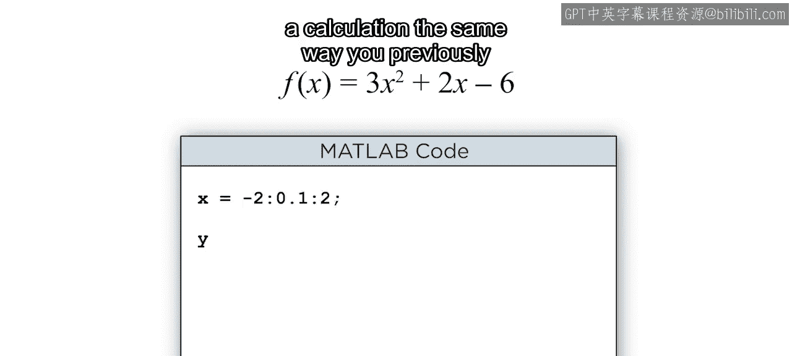

很好，你使用冒号运算符创建了X值向量。但是，你是否仍然需要单独计算每个Y值呢？尝试像之前使用单个数字一样，在计算中使用向量X，看看会发生什么。

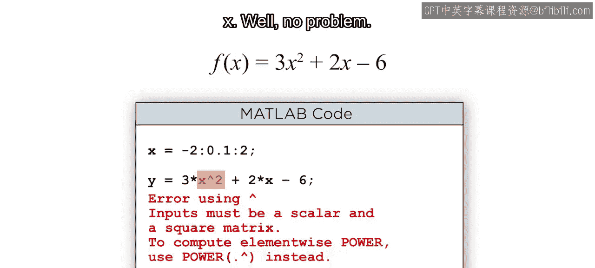

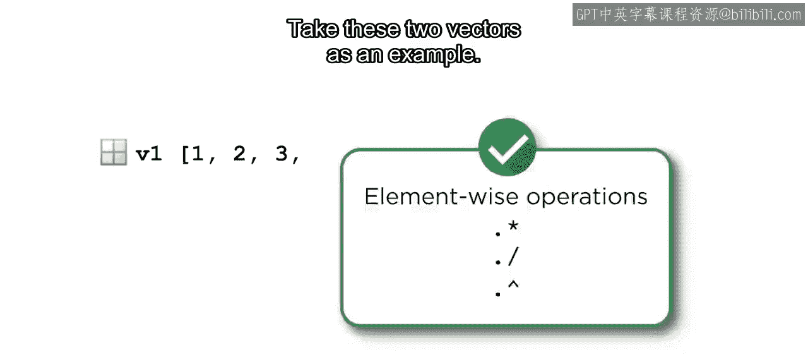

这里你需要对x的每个元素进行平方运算。没问题，只需做一个小小的改动，你就可以执行逐元素运算。

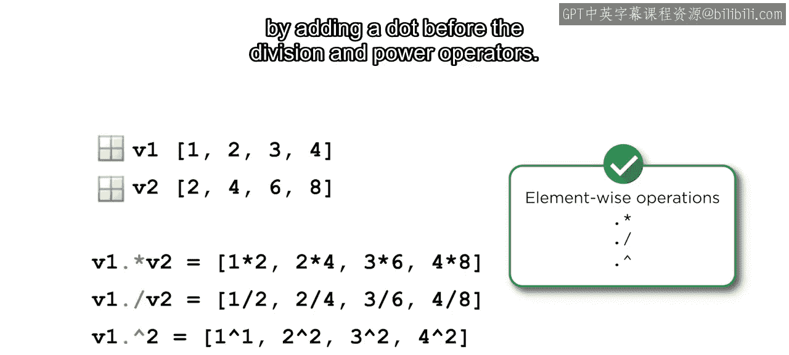

以下是对向量进行逐元素运算的规则：

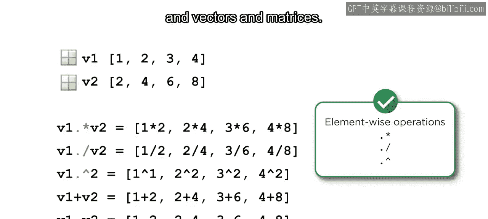

*   **乘法**：使用 `.*` 运算符。例如，`v1 .* v2` 会将 `v1` 和 `v2` 的对应元素相乘。
*   **除法**：使用 `./` 运算符。
*   **幂运算**：使用 `.^` 运算符。
*   **加减法**：对于逐元素的加法和减法，没有特殊的运算符，因为对于标量（数字）与向量、矩阵的运算规则是相同的，直接使用 `+` 和 `-` 即可。

有几个常见的错误需要注意。在执行逐元素运算时，很容易忘记加点号。或者不小心使用了不同大小的向量。当发生这种情况时，你会得到一个关于矩阵维度的错误信息。如果你没有使用矩阵，但在尝试对两个向量的对应元素执行操作时收到矩阵维度错误，请检查你是否使用了逐元素运算符、你的向量是否具有相同数量的元素，以及向量是否都是行向量或都是列向量。

## 应用：绘制二次函数图像

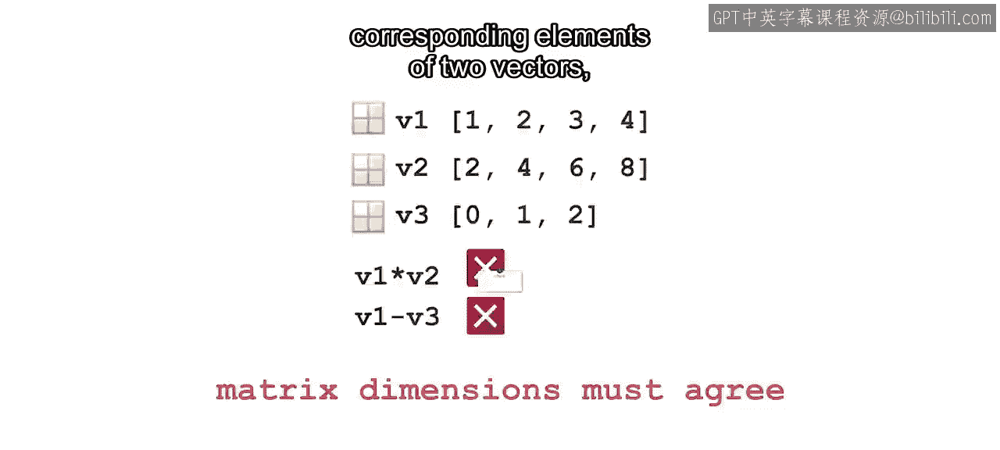

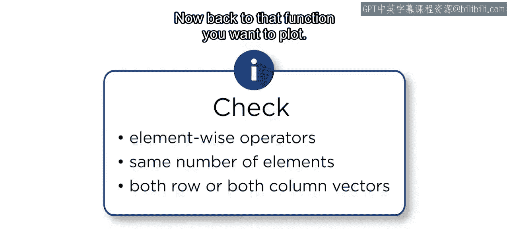

现在回到你想要绘制的那个函数。

由于x是一个向量，你需要使用逐元素的幂运算符 `.^` 来对x的每个元素进行平方。让我们看看这个表达式是如何计算的。首先，x的每个元素被平方。然后，向量的每个元素分别乘以标量3和2。最后，当标量与向量进行加法或减法时，标量会自动扩展以匹配向量的大小，然后再执行加法或减法。

这样，通过使用逐元素运算，你创建了一个y值向量，该向量为x中的每个点进行了计算。现在，这个图形准确地表示了该函数。

## 总结

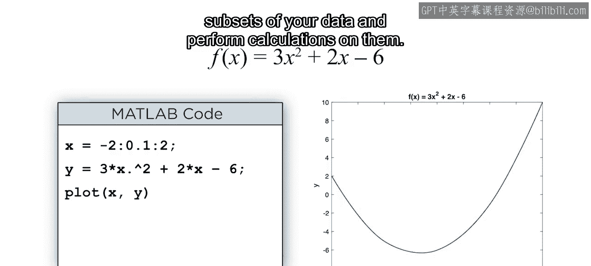

本节课中我们一起学习了向量的核心操作。你可以使用冒号运算符创建均匀间隔的X值向量，并使用逐元素运算符在单个表达式中计算所有Y值。这在后续需要选择数据子集并对其执行计算时将特别有帮助。