# 28：使用函数 🎼

在本节课中，我们将要学习如何使用MATLAB的函数。函数是MATLAB的核心组成部分，能够帮助我们高效地完成计算、数据可视化和分析等任务。掌握函数的使用方法是进行数据科学实践的基础。

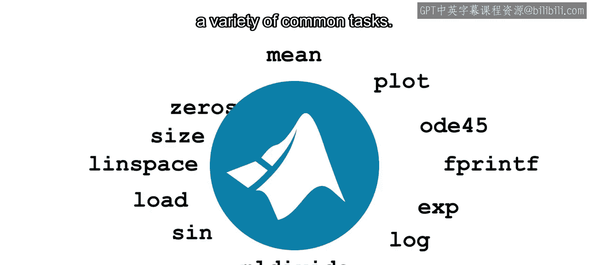

MATLAB包含了数千个现成的函数，可以执行各种常见任务。为了充分利用这些功能，首先需要了解如何使用MATLAB函数。接下来，让我们详细看看函数及其使用方法。

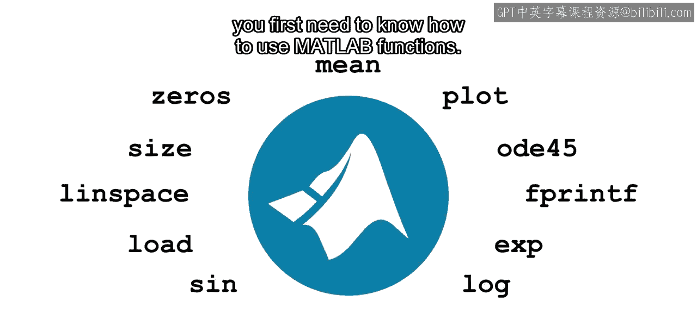

在本视频结束时，你将能够调用MATLAB函数，这对于计算分组统计数据和查找数据之间的相关性等任务至关重要。

### 函数的基本概念

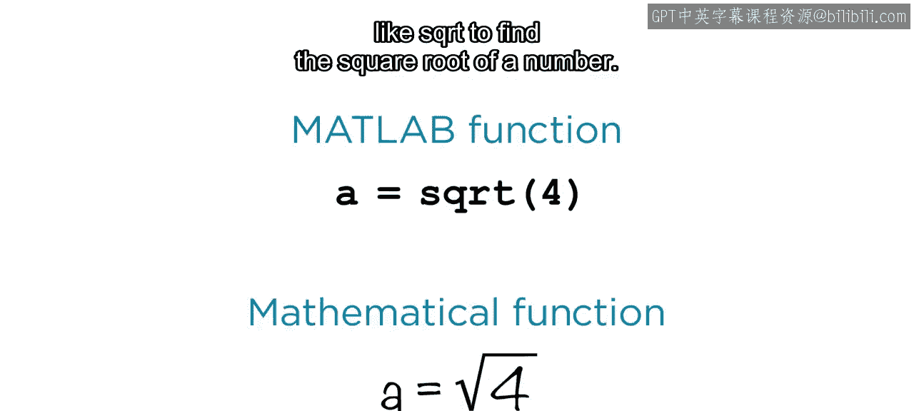

之前你已经使用过MATLAB中可用的函数，例如 `sqrt` 用于求一个数的平方根。此外，还有用于可视化数据、导入图像或快速查找向量中最小或最大元素的函数。

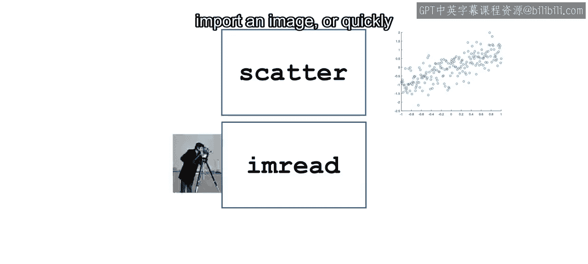

尽管有数千个MATLAB函数，但只需学习几种基本的使用模式。

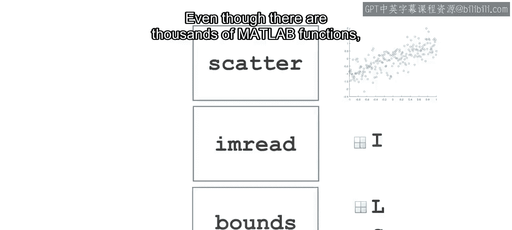

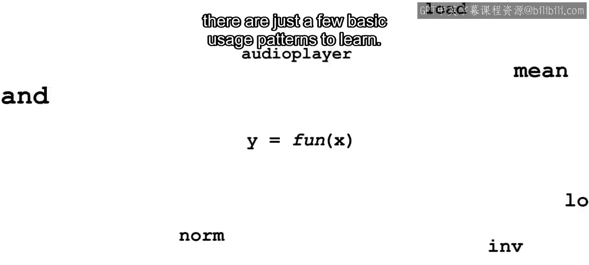

### 函数调用模式

使用MATLAB函数的方式与使用数学函数类似。你需要函数名，以及括在括号内的输入。你可以将结果赋值给一个输出变量。根据函数的不同，甚至可以有多输入和多输出。

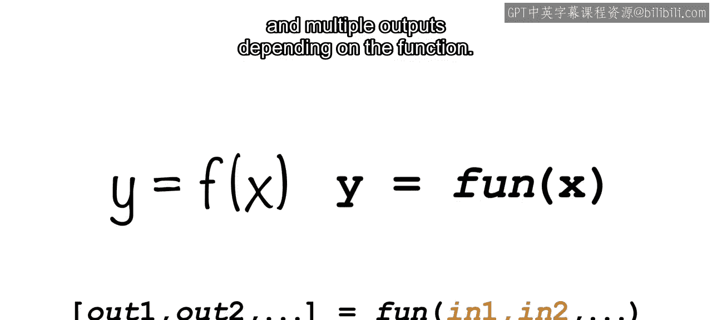

让我们从基础开始。许多熟悉的数学函数，如正弦、对数或指数函数，都遵循相同的模式，并且MATLAB函数的命名也与之相似。

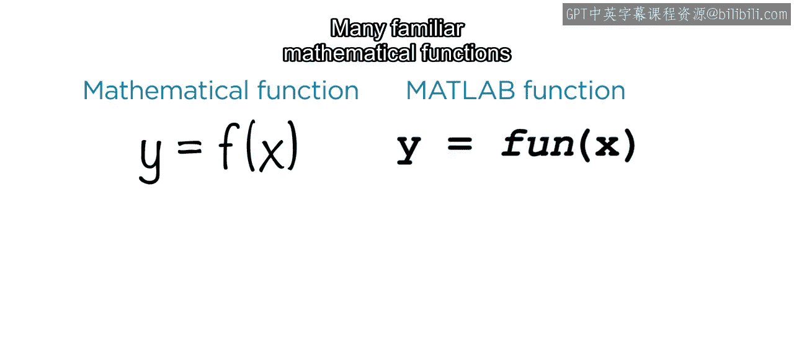

数学函数如正弦函数可以接受向量或矩阵作为输入。输出将与输入大小相同，并且函数会应用于每个元素。

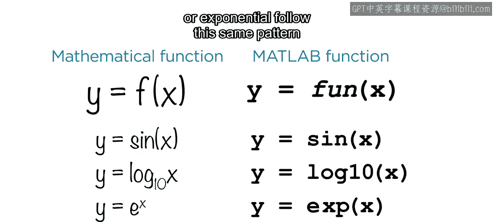

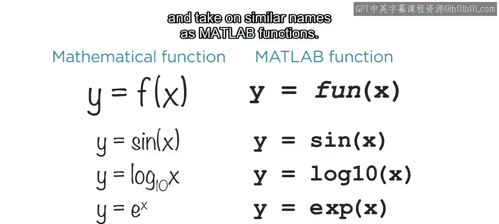

但MATLAB函数更为通用。以这个函数调用为例，你认为它返回什么？如果你回答是 `-1`，那么你是正确的。当你将一个向量传递给 `min` 函数时，它会返回该向量的最小值。

你可能不知道的是，`min` 函数还可以告诉你最小值的位置。在这里，它告诉你位置是 `4`，因为最小值是向量的第四个元素。许多MATLAB函数如果你在一对方括号内单独请求，可以返回多个输出。同样，许多函数也接受多个输入。

### 多输入函数示例

例如，考虑为你的地理气泡图设置地理限制。

`geolimits` 函数接受一个两元素向量作为纬度，一个两元素向量作为经度，并更新现有的绘图。

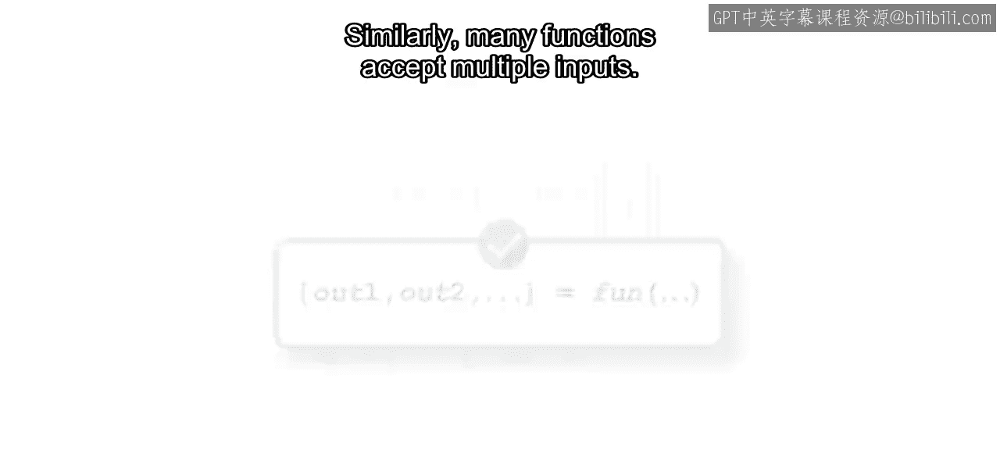

### 查阅函数文档

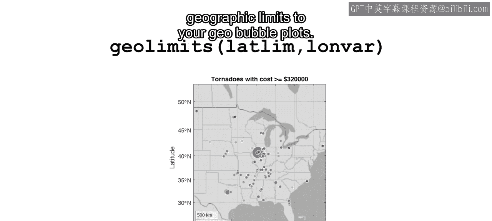

如果你对其他MATLAB函数感到好奇，可以在文档中查找它们。

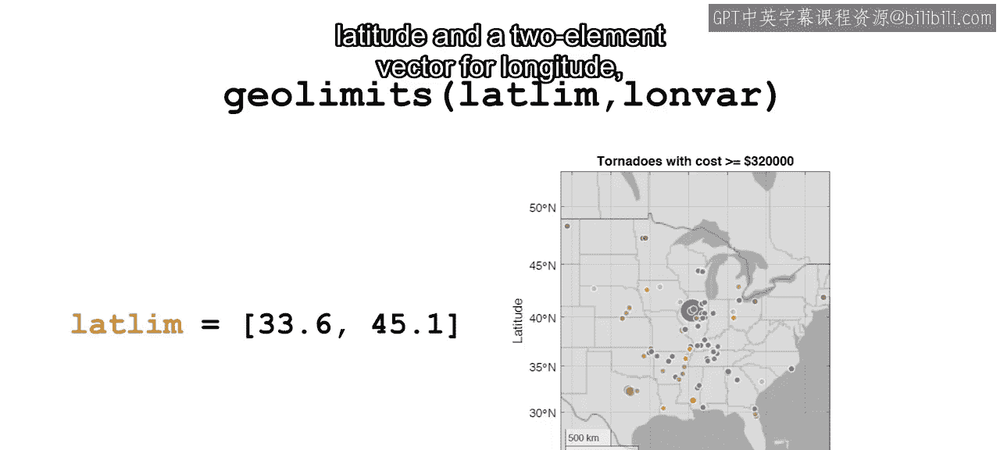

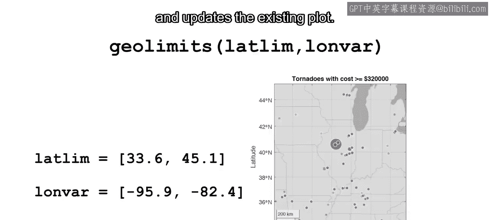

每个函数的文档都提供了在常见场景中如何使用它的示例。

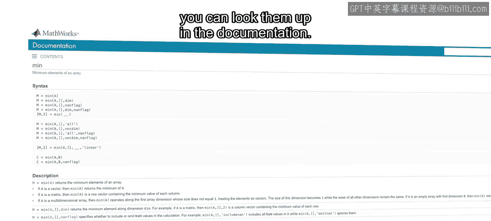

现在你已经了解了调用MATLAB函数的基础知识。稍后，你将学习如何使用函数来快速汇总你的数据。

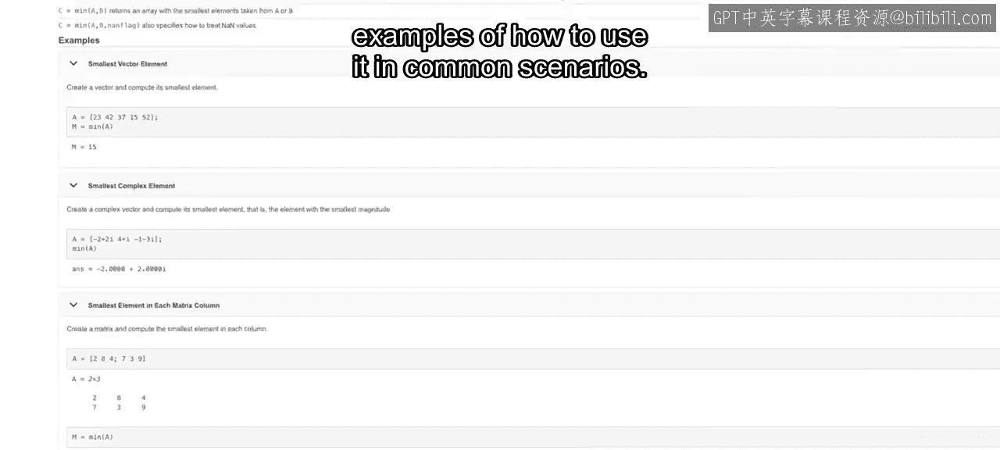

### 总结

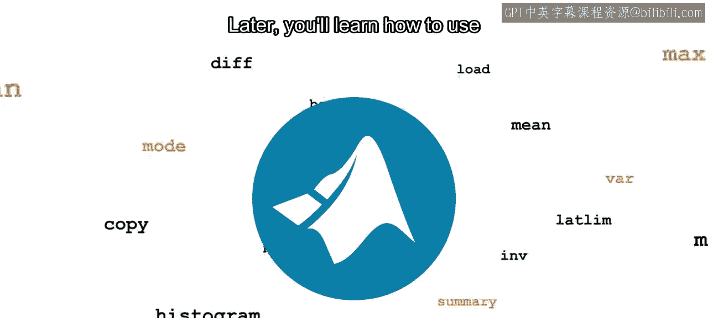

本节课中，我们一起学习了MATLAB函数的基本使用方法。我们了解了函数的调用模式，包括单输入单输出、多输入以及多输出的情况。我们还通过 `min` 和 `geolimits` 等函数的具体例子，加深了对函数灵活性的理解。最后，我们知道了如何通过官方文档来探索和学习更多函数。掌握这些是后续进行数据探索和特征工程的重要一步。